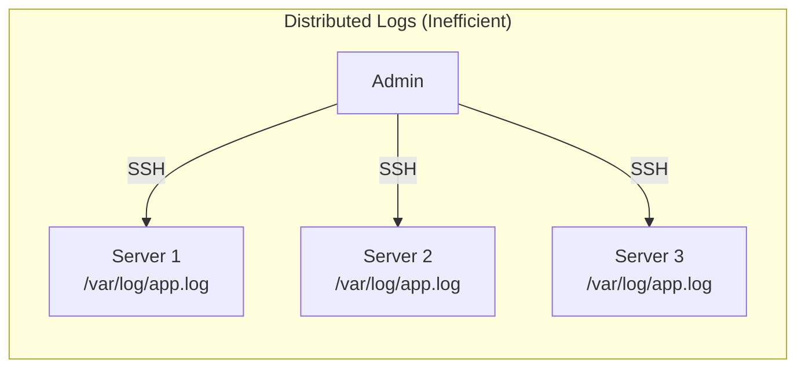
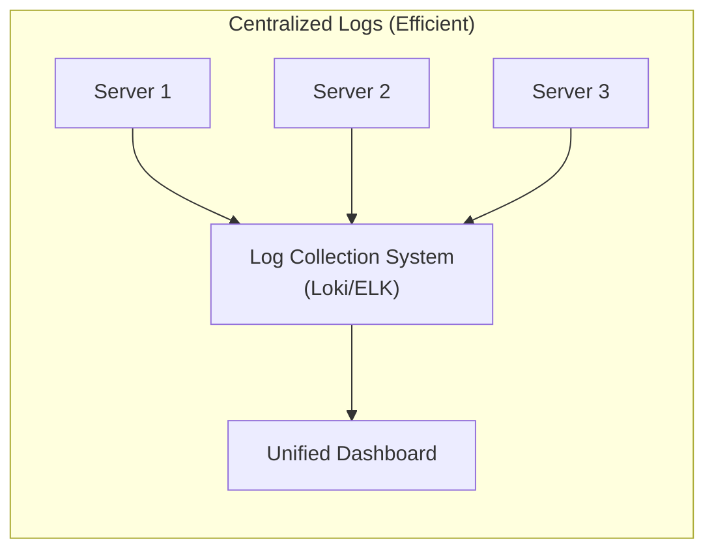
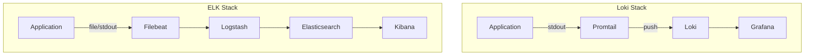
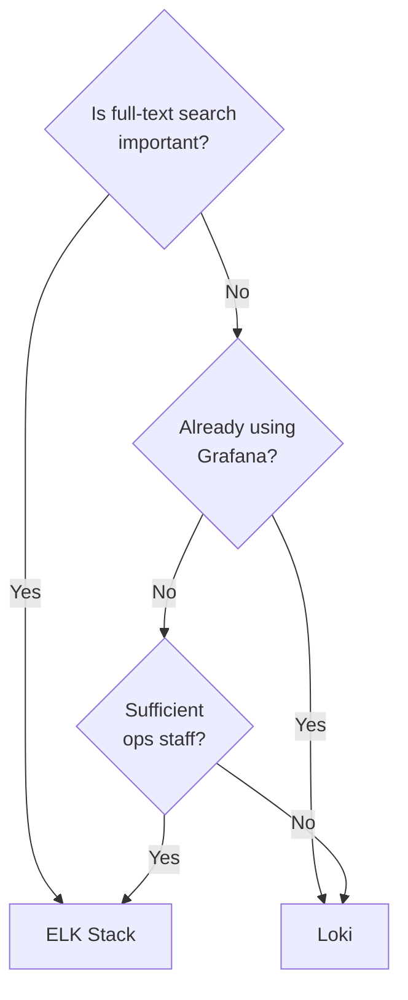
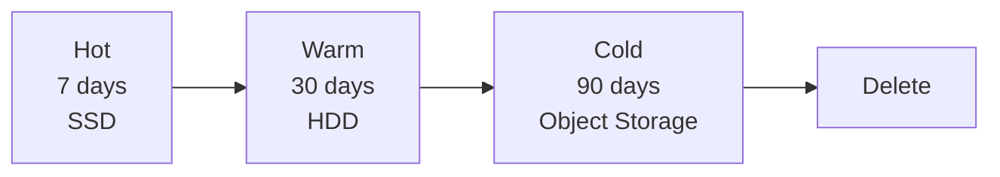

> **Target Audience**: Developers and SREs designing log systems
> **Prerequisites**: [Three Pillars of Observability](three-pillars/)
> **After Reading**: You'll be able to select a log collection system and design effective logs


- **Loki**: Label-based, lightweight, excellent Grafana integration
- **ELK**: Powerful full-text search, suitable for large-scale analysis
- **Structured Logs**: JSON format for easy field-by-field search
- **Log Levels**: Long-term retention only for ERROR and above recommended


## Why Is Log Aggregation Necessary?

In microservices environments, applications run across dozens or hundreds of containers. If each container generates its own log file, which server's log should you look at when an incident occurs?

**Analogy: Book Management in a Large Library**

Imagine a library with millions of books. If each book is randomly placed in different locations, finding the book you want is nearly impossible. But if all book locations are recorded in a **central database**, you can find any book instantly just by searching the title or author.

Log aggregation works the same way. By **gathering logs from distributed servers in one place** and making them searchable, you can find "the payment error that occurred at 3 PM yesterday" in seconds.

### Advantages of Centralized Log Management

| Problem Situation | Distributed Logs | Centralized Logs |
|----------|----------|--------------|
| Incident occurs | SSH into 20 servers one by one | Search from one screen |
| Log retention | Possible loss on server restart | Stored in permanent storage |
| Correlation analysis | Time sync difficult | Connect via trace_id |
| Access control | Per-server permission management | Unified permission management |



*This diagram shows the inefficient structure where administrators must individually access each server to check logs in a distributed environment.*


*This diagram shows a centralized log collection system that aggregates all server logs into a unified dashboard for searching.*

**Core Principle**: Logs should be **searchable from one place**. Incident response time is proportional to "time spent finding logs."


---

## Loki vs ELK Comparison

### Architecture Comparison



*This diagram compares the architectures of the Loki stack (Promtail, Loki, Grafana) and the ELK stack (Filebeat, Logstash, Elasticsearch, Kibana).*
### Detailed Comparison

| Item | Loki | ELK |
|------|------|-----|
| **Indexing** | Labels only | Full-text indexing |
| **Search** | Label filter + grep | Full-text search (Lucene) |
| **Storage Cost** | Low (compressed raw) | High (index size) |
| **Query Language** | LogQL | KQL, Lucene |
| **Installation Complexity** | Low | High |
| **Grafana Integration** | Native | Plugin required |
| **Alert Integration** | Grafana alerts | Kibana alerts |

### Selection Guide



*This diagram shows the decision flow for choosing between Loki and ELK based on full-text search needs, Grafana usage, and operational staffing.*
| Situation | Recommendation |
|------|------|
| Already using Grafana | Loki |
| Full-text search required | Elasticsearch |
| Low cost needed | Loki |
| Large-scale analysis | Elasticsearch |
| Quick setup | Loki |

---

## Structured Log Design

### Unstructured vs Structured

```
# ❌ Unstructured (hard to parse)
2026-01-12 10:30:00 ERROR OrderService - Failed to create order for user 123: insufficient stock

# ✅ Structured JSON
{
  "timestamp": "2026-01-12T10:30:00Z",
  "level": "ERROR",
  "service": "order-service",
  "message": "Failed to create order",
  "user_id": "123",
  "error": "insufficient stock",
  "trace_id": "abc123def456"
}
```

### Required Fields

| Field | Description | Example |
|------|------|------|
| `timestamp` | ISO 8601 format | `2026-01-12T10:30:00Z` |
| `level` | Log level | `INFO`, `ERROR` |
| `service` | Service name | `order-service` |
| `message` | Log message | `Order created` |
| `trace_id` | Distributed trace ID | `abc123def456` |

### Recommended Fields

| Field | Purpose |
|------|------|
| `user_id` | Per-user filtering |
| `request_id` | Per-request tracking |
| `duration_ms` | Performance analysis |
| `error_code` | Error classification |
| `stack_trace` | Debugging |

### Spring Boot Configuration

```yaml
# application.yml
logging:
  pattern:
    console: '{"timestamp":"%d{ISO8601}","level":"%level","service":"${spring.application.name}","message":"%message","logger":"%logger","thread":"%thread"}%n'

# Logback (logback-spring.xml)
```

```xml
<!-- logback-spring.xml -->
<configuration>
  <appender name="STDOUT" class="ch.qos.logback.core.ConsoleAppender">
    <encoder class="net.logstash.logback.encoder.LogstashEncoder">
      <customFields>{"service":"order-service"}</customFields>
    </encoder>
  </appender>
</configuration>
```

---

## Log Level Strategy

### Level Definitions

| Level | Purpose | Retention Period |
|------|------|----------|
| `TRACE` | Detailed debugging | Don't collect |
| `DEBUG` | Development debugging | 1-3 days |
| `INFO` | Normal operation | 7-14 days |
| `WARN` | Potential issues | 30 days |
| `ERROR` | Errors occurred | 90+ days |

### Environment-Specific Settings

```yaml
# application.yml
spring:
  profiles:
    active: production

---
spring:
  config:
    activate:
      on-profile: development
logging:
  level:
    root: DEBUG
    com.example: TRACE

---
spring:
  config:
    activate:
      on-profile: production
logging:
  level:
    root: INFO
    com.example: INFO
```

---

## Loki Configuration

### Promtail Configuration

```yaml
# promtail.yml
server:
  http_listen_port: 9080

positions:
  filename: /tmp/positions.yaml

clients:
  - url: http://loki:3100/loki/api/v1/push

scrape_configs:
  - job_name: containers
    static_configs:
      - targets:
          - localhost
        labels:
          job: containerlogs
          __path__: /var/log/containers/*.log

    pipeline_stages:
      - json:
          expressions:
            output: log
            stream: stream
            timestamp: time
      - labels:
          stream:
      - timestamp:
          source: timestamp
          format: RFC3339Nano
      - output:
          source: output
```

### LogQL Queries

```logql
# Filter by service
{service="order-service"}

# Filter by level
{service="order-service"} |= "ERROR"

# JSON parsing
{service="order-service"} | json | level="ERROR"

# Regex
{service="order-service"} |~ "user_id=123"

# Error count aggregation
sum(count_over_time({service="order-service"} |= "ERROR" [5m]))
```

---

## ELK Configuration

### Filebeat Configuration

```yaml
# filebeat.yml
filebeat.inputs:
  - type: container
    paths:
      - '/var/lib/docker/containers/*/*.log'
    processors:
      - add_kubernetes_metadata:
          host: ${NODE_NAME}
          matchers:
            - logs_path:
                logs_path: "/var/lib/docker/containers/"

output.logstash:
  hosts: ["logstash:5044"]
```

### Logstash Pipeline

```ruby
# logstash.conf
input {
  beats {
    port => 5044
  }
}

filter {
  json {
    source => "message"
  }
  date {
    match => ["timestamp", "ISO8601"]
    target => "@timestamp"
  }
  mutate {
    remove_field => ["message"]
  }
}

output {
  elasticsearch {
    hosts => ["elasticsearch:9200"]
    index => "logs-%{[service]}-%{+YYYY.MM.dd}"
  }
}
```

---

## Log Retention Policy

### Cost Optimization



*This diagram shows the log retention lifecycle: data moving through Hot, Warm, Cold stages before deletion.*
### Loki Retention Settings

```yaml
# loki.yml
schema_config:
  configs:
    - from: 2026-01-01
      store: boltdb-shipper
      object_store: s3
      schema: v11
      index:
        prefix: loki_index_
        period: 24h

limits_config:
  retention_period: 720h  # 30 days

compactor:
  retention_enabled: true
  retention_delete_delay: 2h
```

### Elasticsearch ILM

```json
{
  "policy": {
    "phases": {
      "hot": {
        "actions": {
          "rollover": {
            "max_size": "50GB",
            "max_age": "7d"
          }
        }
      },
      "warm": {
        "min_age": "7d",
        "actions": {
          "shrink": {
            "number_of_shards": 1
          }
        }
      },
      "delete": {
        "min_age": "30d",
        "actions": {
          "delete": {}
        }
      }
    }
  }
}
```

---

## Best Practices

### DO (Recommended)

```java
// ✅ Include structured context
log.info("Order created",
    kv("order_id", orderId),
    kv("user_id", userId),
    kv("amount", amount));

// ✅ Use appropriate levels
log.debug("Processing step completed");
log.error("Failed to process order", exception);
```

### DON'T (Not Recommended)

```java
// ❌ Logging sensitive information
log.info("User login: password={}", password);

// ❌ Excessive logging
for (item : items) {
    log.info("Processing item: {}", item);  // What if 100,000 items?
}

// ❌ Swallowing exceptions in logs
try { ... } catch (Exception e) {
    log.error("Error");  // No stack trace
}
```

---

## Key Summary

| Item | Loki | ELK |
|------|------|-----|
| **Suitable for** | Lightweight, Grafana integration | Full-text search, large-scale |
| **Query** | LogQL | KQL |
| **Cost** | Low | High |

**Log Design Principles:**
1. JSON structured mandatory
2. Include trace_id (distributed tracing connection)
3. Use appropriate levels
4. Exclude sensitive information

---

## Next Steps

| Recommended Order | Document | What You'll Learn |
|----------|------|----------|
| 1 | [Distributed Tracing](distributed-tracing/) | Connecting logs and traces |
| 2 | [Environment Setup](../examples/setup/) | Loki hands-on |
