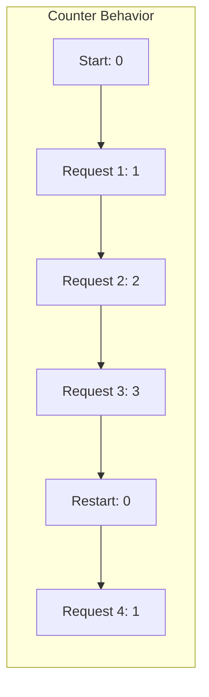
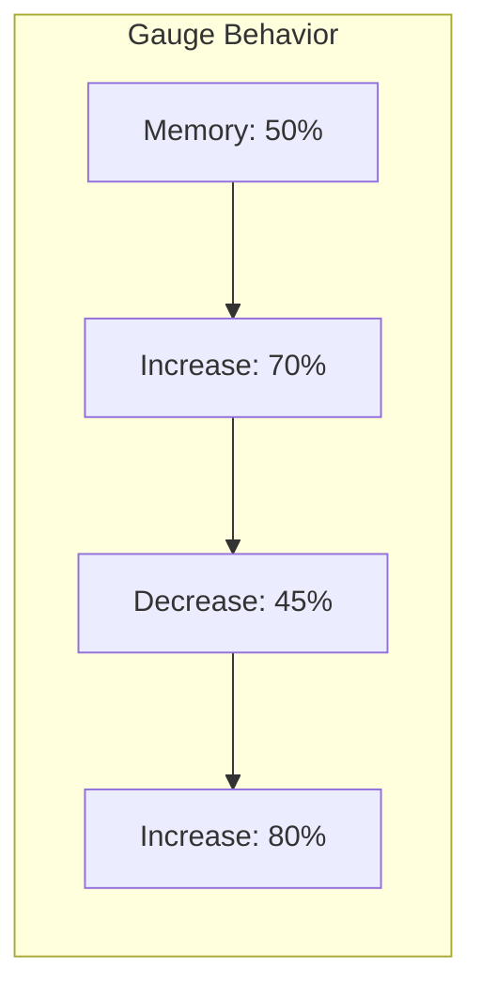
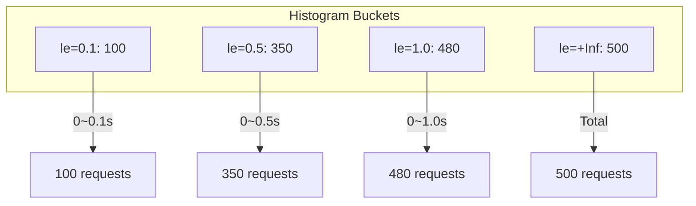
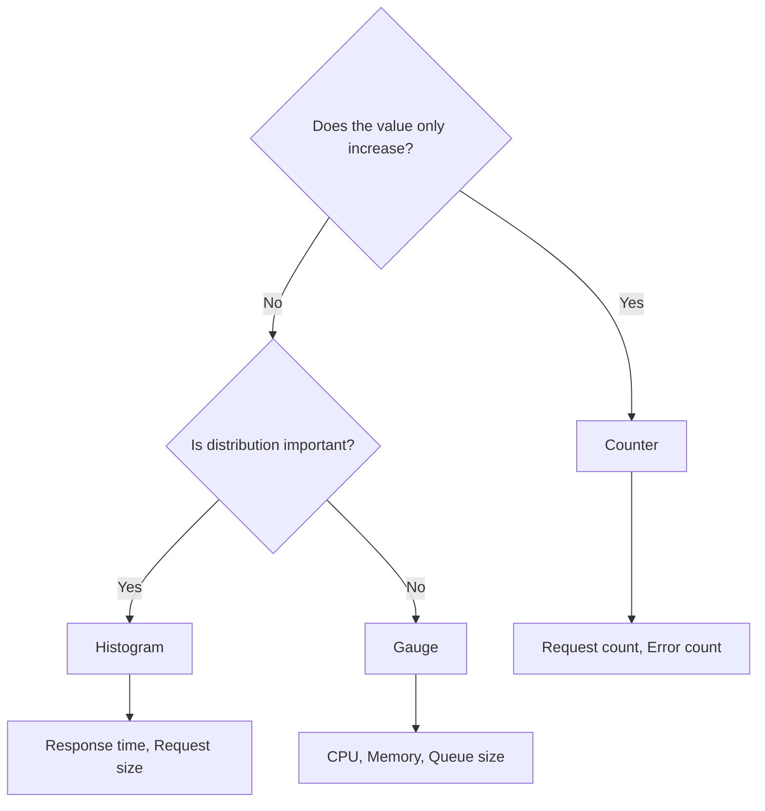

> **Target Audience**: Developers designing Prometheus metrics for the first time
> **Prerequisites**: [Three Pillars of Observability](three-pillars/)
> **After Reading**: You'll be able to select the appropriate metric type and implement it correctly

## TL;DR


**Key Summary:**
- **Counter**: Only cumulative increase (request count, error count) → Calculate rate of change with `rate()`
- **Gauge**: Current value (temperature, memory) → Use as-is or `avg()` for average
- **Histogram**: Distribution measurement (response time) → Calculate percentiles with `histogram_quantile()`
- **Summary**: Percentile calculation on client (rarely used)


## Why Are Metric Types Important?

Metric types are not just a technical choice. They **reflect the nature of the data**.

**Analogy: Thermometer vs Pedometer**

- A **thermometer** shows the current temperature. It can be 25°C yesterday and 30°C today → This is a **Gauge**
- A **pedometer** accumulates steps. Walking 5000 steps yesterday and 3000 today totals 8000 steps → This is a **Counter**

What if you "accumulated" temperature like a pedometer? Morning 20°C, noon 25°C, evening 18°C would give "63°C" - a meaningless number. Conversely, if you viewed step count as a "current value" like a thermometer, you'd only know "I just walked 3 steps" without knowing how many steps you walked today.

### Consequences of Wrong Choices

| Wrong Choice | Result |
|------------|------|
| Request count as Gauge | Resets to 0 on server restart, can't track cumulative |
| CPU usage as Counter | Meaningless value when rate() applied |
| Response time as Counter | Can't calculate average/percentiles |

---

## Counter

### Definition

A **monotonically increasing cumulative value**. Can only increase or reset to 0.

### Why Are Counters Necessary?

To answer questions like "How many orders came in today?" or "How many errors occurred this month?" you need **cumulative data**.

**Analogy: Car Odometer**

A car odometer never decreases. It doesn't go back from 100,000 km to 90,000 km. Instead, if you want to know "how much did I drive this week?" you calculate the **difference** between Monday's mileage and Sunday's mileage.

Counters work the same way. The raw value (1 million requests) has little meaning - you need to calculate **rate of change over time** with `rate()` or `increase()` to make it useful.

### Characteristics



| Property | Description |
|------|------|
| **Monotonically increasing** | Value never decreases |
| **Resettable** | Resets to 0 on process restart |
| **rate() required** | Rate of change is more meaningful than raw value |

### Usage Example

```java
// Spring Boot + Micrometer
@RestController
public class OrderController {
    private final Counter orderCounter;

    public OrderController(MeterRegistry registry) {
        this.orderCounter = Counter.builder("orders_total")
            .description("Total number of orders")
            .tag("status", "created")
            .register(registry);
    }

    @PostMapping("/orders")
    public Order createOrder(@RequestBody OrderRequest request) {
        Order order = orderService.create(request);
        orderCounter.increment();  // Increment by 1
        return order;
    }
}
```

**Metric Output:**
```
orders_total{status="created"} 1523
```

### PromQL Usage

```promql
# Raw value (meaningless - just cumulative)
orders_total

# Requests per second (5 minute average)
rate(orders_total[5m])

# Total requests in 5 minutes
increase(orders_total[5m])

# Requests per hour
increase(orders_total[1h])
```

### Naming Convention

```
# Recommended: _total suffix
http_requests_total
orders_created_total
errors_total

# Not recommended
http_requests_count  # _count is for Histogram/Summary internal use
```

### When to Use?

- Request/event counts
- Error occurrence counts
- Processed bytes
- Completed task counts

---

## Gauge

### Definition

A **current state value**. Can increase or decrease.

### Characteristics



| Property | Description |
|------|------|
| **Bidirectional** | Can increase/decrease |
| **Snapshot** | State at a specific point in time |
| **Direct use** | Meaningful without rate() |

### Usage Example

```java
// Current number of requests being processed
@Component
public class RequestGauge {
    private final AtomicInteger inProgress = new AtomicInteger(0);

    public RequestGauge(MeterRegistry registry) {
        Gauge.builder("http_requests_in_progress", inProgress, AtomicInteger::get)
            .description("Requests currently being processed")
            .register(registry);
    }

    public void requestStarted() {
        inProgress.incrementAndGet();
    }

    public void requestFinished() {
        inProgress.decrementAndGet();
    }
}
```

**Metric Output:**
```
http_requests_in_progress 42
```

### PromQL Usage

```promql
# Current value
http_requests_in_progress

# Average (across multiple instances)
avg(http_requests_in_progress)

# Maximum value
max(http_requests_in_progress)

# Change over time (for debugging)
deriv(http_requests_in_progress[5m])
```

### When to Use?

- CPU/memory usage
- Current connection count
- Queue size
- Physical measurements like temperature, speed
- Configuration values (version info, etc.)

---

## Histogram

### Definition

**Measures value distribution in buckets (ranges)**. Used when distribution matters, like response times or request sizes.

### Why Are Histograms Necessary?

"Average response time 200ms" might look good, but in reality 99% could be 50ms while 1% is 15 seconds. **Averages are easily skewed by outliers**.

**Analogy: Test Score Distribution**

When a class average is 70 points, two situations are possible:
1. Most students between 65-75 points → Even distribution
2. Half at 40 points, half at 100 points → Polarized

Both situations look the same by average, but **the distribution is completely different**. Histograms show distribution like "80% under 100ms," "95% under 500ms," "99% under 1 second."

This is why **percentiles like P50, P95, P99** are important. If P99 is 2 seconds, it means "1 in 100 people waits more than 2 seconds."

### Characteristics



| Component | Description |
|----------|------|
| `_bucket` | Cumulative count per range |
| `_count` | Total observation count |
| `_sum` | Sum of all values |
| `le` (label) | Less than or Equal |

### Usage Example

```java
@Component
public class RequestTimer {
    private final Timer requestTimer;

    public RequestTimer(MeterRegistry registry) {
        this.requestTimer = Timer.builder("http_request_duration_seconds")
            .description("HTTP request duration")
            .publishPercentileHistogram()  // Generate histogram buckets
            .sla(Duration.ofMillis(100), Duration.ofMillis(500), Duration.ofSeconds(1))
            .register(registry);
    }

    public void recordRequest(Runnable action) {
        requestTimer.record(action);
    }
}
```

**Metric Output:**
```
http_request_duration_seconds_bucket{le="0.1"} 100
http_request_duration_seconds_bucket{le="0.5"} 350
http_request_duration_seconds_bucket{le="1.0"} 480
http_request_duration_seconds_bucket{le="+Inf"} 500
http_request_duration_seconds_count 500
http_request_duration_seconds_sum 245.5
```

### PromQL Usage

```promql
# P50 (median)
histogram_quantile(0.50, rate(http_request_duration_seconds_bucket[5m]))

# P95
histogram_quantile(0.95, rate(http_request_duration_seconds_bucket[5m]))

# P99
histogram_quantile(0.99, rate(http_request_duration_seconds_bucket[5m]))

# Average response time
rate(http_request_duration_seconds_sum[5m])
/ rate(http_request_duration_seconds_count[5m])
```

### Bucket Design


**Number of buckets directly affects cardinality**. Too many buckets increase storage costs.


```java
// Recommended: Design based on SLA
.sla(
    Duration.ofMillis(50),   // Fast response
    Duration.ofMillis(100),  // Target SLA
    Duration.ofMillis(250),
    Duration.ofMillis(500),
    Duration.ofSeconds(1),   // Slow response threshold
    Duration.ofSeconds(5)    // Near timeout
)
```

### When to Use?

- Response time/latency
- Request/response sizes
- Batch job processing time
- When percentile calculation (P50, P95, P99) is needed

---

## Summary

### Definition

**Pre-calculates percentiles on the client**. Similar to Histogram but difficult to aggregate on the server side.

### Histogram vs Summary

| Item | Histogram | Summary |
|------|-----------|---------|
| **Percentile calculation** | Server (PromQL) | Client |
| **Aggregatable** | Can aggregate multiple instances | Cannot aggregate |
| **Accuracy** | Depends on bucket boundaries | Accurate |
| **CPU usage** | Server load | Client load |


**Summary is rarely used.** Percentiles from multiple instances cannot be combined, making it unsuitable for distributed environments. **Histogram is recommended**.


---

## Type Selection Guide



### Quick Reference Table

| Measurement Target | Type | Reason |
|----------|------|------|
| HTTP request count | Counter | Cumulative increase |
| HTTP error count | Counter | Cumulative increase |
| Response time | Histogram | Distribution/percentile needed |
| CPU usage | Gauge | Current state |
| Memory usage | Gauge | Current state |
| Active connections | Gauge | Can increase/decrease |
| Request size | Histogram | Distribution needed |
| Queue pending items | Gauge | Current state |
| Processed bytes | Counter | Cumulative increase |

---

## Naming Convention

### Basic Rules

```
# Format
{namespace}_{name}_{unit}_{suffix}

# Examples
http_request_duration_seconds_bucket
process_cpu_seconds_total
node_memory_bytes
```

### Recommendations

| Item | Rule | Example |
|------|------|------|
| **Unit** | Use base units | seconds (not milliseconds) |
| **Suffix** | Counter uses `_total` | `http_requests_total` |
| **Case** | snake_case | `order_created_total` |
| **Clarity** | Specify measurement target | `http_request_duration_seconds` |

---

## Practical Example: Spring Boot Metrics

```java
@RestController
@RequiredArgsConstructor
public class OrderController {
    private final MeterRegistry registry;

    // Counter: Order creation count
    private Counter orderCounter(String status) {
        return Counter.builder("orders_total")
            .tag("status", status)
            .register(registry);
    }

    // Gauge: Currently processing orders
    private final AtomicInteger ordersInProgress = new AtomicInteger(0);

    @PostConstruct
    void registerGauge() {
        Gauge.builder("orders_in_progress", ordersInProgress, AtomicInteger::get)
            .register(registry);
    }

    // Histogram: Order processing time
    private Timer orderTimer() {
        return Timer.builder("order_processing_duration_seconds")
            .publishPercentileHistogram()
            .register(registry);
    }

    @PostMapping("/orders")
    public Order createOrder(@RequestBody OrderRequest request) {
        ordersInProgress.incrementAndGet();
        try {
            return orderTimer().record(() -> {
                Order order = orderService.create(request);
                orderCounter("success").increment();
                return order;
            });
        } catch (Exception e) {
            orderCounter("failed").increment();
            throw e;
        } finally {
            ordersInProgress.decrementAndGet();
        }
    }
}
```

---

## Key Summary

| Type | Purpose | PromQL | Example |
|------|------|--------|------|
| **Counter** | Cumulative count | `rate()`, `increase()` | Request count |
| **Gauge** | Current state | Use as-is | CPU % |
| **Histogram** | Distribution measurement | `histogram_quantile()` | Response time |

---

## Next Steps

| Recommended Order | Document | What You'll Learn |
|----------|------|----------|
| 1 | [Prometheus Architecture](prometheus-architecture/) | Pull model, time series DB |
| 2 | [PromQL Syntax Basics](promql/syntax-basics/) | Selectors, label matching |
| 3 | [rate and increase](promql/rate-and-increase/) | Counter usage |
