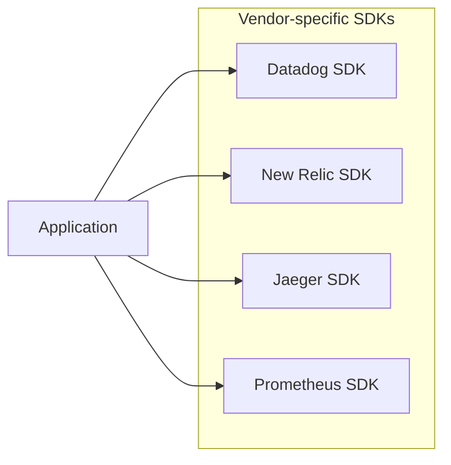
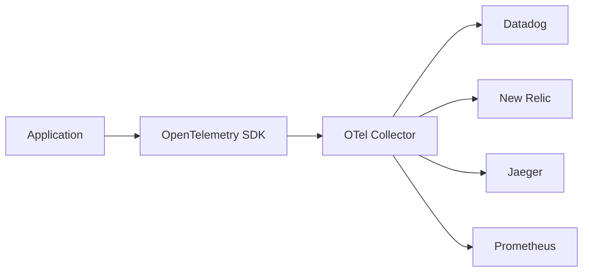
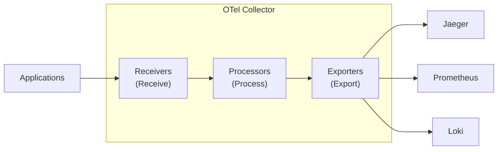
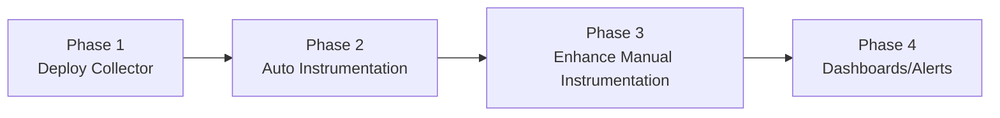

> **Target Audience**: Developers and SREs standardizing observability systems
> **Prerequisites**: [Three Pillars of Observability](), [Distributed Tracing]()
> **After Reading**: You'll understand OpenTelemetry and be able to apply it to your projects

## TL;DR


**Key Summary:**
- **OpenTelemetry (OTel)**: **Vendor-neutral standard** for Metrics, Logs, and Traces
- **Components**: SDK (instrumentation) + Collector (collect/transform/export)
- **Advantages**: No vendor lock-in, instrument once to support multiple backends
- **CNCF Project**: Second most active project after Kubernetes


## What Is OpenTelemetry?

OpenTelemetry is a **standard framework for generating, collecting, and exporting observability data**.

### Before OTel



**Problems:**
- Different SDKs per vendor
- Code changes needed when switching vendors
- Overhead from multiple SDKs

### After OTel



**Advantages:**
- Instrument once, multiple backends
- Only modify Collector config when switching vendors
- Standardized semantics (Semantic Conventions)

---

## Components

### 1. API & SDK

Generates observability data from application code.

```java
// Create Tracer
Tracer tracer = openTelemetry.getTracer("order-service");

// Create Span
Span span = tracer.spanBuilder("processOrder").startSpan();
try (Scope scope = span.makeCurrent()) {
    span.setAttribute("order.id", orderId);
    // Business logic
} finally {
    span.end();
}
```

### 2. Collector

Agent that receives, processes, and exports data.



### 3. Instrumentation

Auto/manual instrumentation libraries.

| Type | Description | Examples |
|------|------|------|
| **Auto instrumentation** | Apply without code changes | Java Agent, Python auto-instrumentation |
| **Manual instrumentation** | Call SDK directly from code | Custom Span creation |

---

## Collector Configuration

### Basic Structure

```yaml
# otel-collector.yaml
receivers:
  otlp:
    protocols:
      grpc:
        endpoint: 0.0.0.0:4317
      http:
        endpoint: 0.0.0.0:4318

processors:
  batch:
    timeout: 1s
    send_batch_size: 1024
  memory_limiter:
    limit_mib: 512

exporters:
  otlp:
    endpoint: "tempo:4317"
    tls:
      insecure: true
  prometheus:
    endpoint: "0.0.0.0:8889"
  loki:
    endpoint: "http://loki:3100/loki/api/v1/push"

service:
  pipelines:
    traces:
      receivers: [otlp]
      processors: [batch, memory_limiter]
      exporters: [otlp]
    metrics:
      receivers: [otlp]
      processors: [batch]
      exporters: [prometheus]
    logs:
      receivers: [otlp]
      processors: [batch]
      exporters: [loki]
```

### Receivers

| Receiver | Purpose |
|----------|------|
| `otlp` | OpenTelemetry Protocol (recommended) |
| `jaeger` | Jaeger format |
| `zipkin` | Zipkin format |
| `prometheus` | Prometheus scrape |

### Processors

| Processor | Purpose |
|-----------|------|
| `batch` | Batch sending for efficiency |
| `memory_limiter` | Memory limit |
| `filter` | Remove unnecessary data |
| `attributes` | Add/modify/delete attributes |
| `tail_sampling` | Conditional sampling |

### Exporters

| Exporter | Target |
|----------|------|
| `otlp` | OTLP-supporting backends (Tempo, Jaeger) |
| `prometheus` | Prometheus |
| `loki` | Grafana Loki |
| `datadog` | Datadog |

---

## Spring Boot Integration

### Dependencies

```kotlin
// build.gradle.kts
dependencies {
    // Tracing
    implementation("io.micrometer:micrometer-tracing-bridge-otel")
    implementation("io.opentelemetry:opentelemetry-exporter-otlp")

    // Metrics
    implementation("io.micrometer:micrometer-registry-otlp")

    // Auto instrumentation (optional)
    runtimeOnly("io.opentelemetry.instrumentation:opentelemetry-spring-boot-starter")
}
```

### application.yml

```yaml
spring:
  application:
    name: order-service

management:
  otlp:
    tracing:
      endpoint: http://otel-collector:4318/v1/traces
    metrics:
      export:
        endpoint: http://otel-collector:4318/v1/metrics
        step: 30s
  tracing:
    sampling:
      probability: 0.1  # 10% sampling

logging:
  pattern:
    level: "%5p [${spring.application.name},%X{traceId:-},%X{spanId:-}]"
```

### Manual Instrumentation Example

```java
@Service
@RequiredArgsConstructor
public class OrderService {
    private final Tracer tracer;
    private final MeterRegistry meterRegistry;

    public Order createOrder(OrderRequest request) {
        // Create Span
        Span span = tracer.nextSpan()
            .name("createOrder")
            .tag("order.type", request.getType())
            .start();

        try (Tracer.SpanInScope ws = tracer.withSpan(span)) {
            // Record metric
            Timer.Sample sample = Timer.start(meterRegistry);

            Order order = processOrder(request);

            sample.stop(Timer.builder("order.creation.time")
                .tag("type", request.getType())
                .register(meterRegistry));

            span.event("Order created successfully");
            return order;

        } catch (Exception e) {
            span.error(e);
            throw e;
        } finally {
            span.end();
        }
    }
}
```

---

## Java Agent (Auto Instrumentation)

Automatically instrument without code changes.

### Execution

```bash
java -javaagent:opentelemetry-javaagent.jar \
     -Dotel.service.name=order-service \
     -Dotel.exporter.otlp.endpoint=http://otel-collector:4317 \
     -Dotel.traces.sampler=parentbased_traceidratio \
     -Dotel.traces.sampler.arg=0.1 \
     -jar app.jar
```

### Docker Configuration

```dockerfile
FROM eclipse-temurin:17-jre

ADD https://github.com/open-telemetry/opentelemetry-java-instrumentation/releases/latest/download/opentelemetry-javaagent.jar /app/opentelemetry-javaagent.jar

ENV JAVA_TOOL_OPTIONS="-javaagent:/app/opentelemetry-javaagent.jar"
ENV OTEL_SERVICE_NAME="order-service"
ENV OTEL_EXPORTER_OTLP_ENDPOINT="http://otel-collector:4317"

COPY app.jar /app/app.jar
CMD ["java", "-jar", "/app/app.jar"]
```

### Auto Instrumentation Scope

| Category | Libraries |
|----------|----------|
| HTTP | Spring MVC, JAX-RS, Servlet |
| Database | JDBC, Hibernate, MyBatis |
| Messaging | Kafka, RabbitMQ |
| Cache | Redis, Memcached |
| HTTP Clients | RestTemplate, WebClient, OkHttp |

---

## Semantic Conventions

Standardized attribute names ensure consistency.

### HTTP

| Attribute | Description |
|------|------|
| `http.method` | GET, POST, etc. |
| `http.status_code` | 200, 500, etc. |
| `http.url` | Request URL |
| `http.route` | `/users/{id}` |

### Database

| Attribute | Description |
|------|------|
| `db.system` | postgresql, mysql |
| `db.name` | Database name |
| `db.operation` | SELECT, INSERT |
| `db.statement` | SQL query |

### Messaging

| Attribute | Description |
|------|------|
| `messaging.system` | kafka, rabbitmq |
| `messaging.destination` | Topic/queue name |
| `messaging.operation` | send, receive |

---

## Adoption Strategy

### Phased Approach



1. **Deploy Collector**: Build data collection infrastructure
2. **Auto Instrumentation**: Quick start with Java Agent
3. **Enhance Manual Instrumentation**: Custom Spans for business logic
4. **Dashboards/Alerts**: Grafana integration

### Migration Paths

| Current State | Migration |
|----------|-------------|
| Jaeger SDK | OTel SDK + Jaeger Exporter |
| Prometheus direct exposure | OTel + Prometheus Exporter |
| Vendor SDK | OTel SDK + Vendor Exporter |

---

## Key Summary

| Component | Role |
|----------|------|
| **SDK** | Application instrumentation |
| **Collector** | Collect/transform/export |
| **OTLP** | Standard protocol |
| **Auto-instrumentation** | Instrumentation without code changes |

**Adoption Benefits:**
- Remove vendor lock-in
- Standardized semantics
- Flexible backend choice
- Active community

---

## Next Steps

| Recommended Order | Document | What You'll Learn |
|----------|------|----------|
| 1 | [Dashboard Design]() | Visualization |
| 2 | [Full-Stack Example]() | Integration hands-on |
