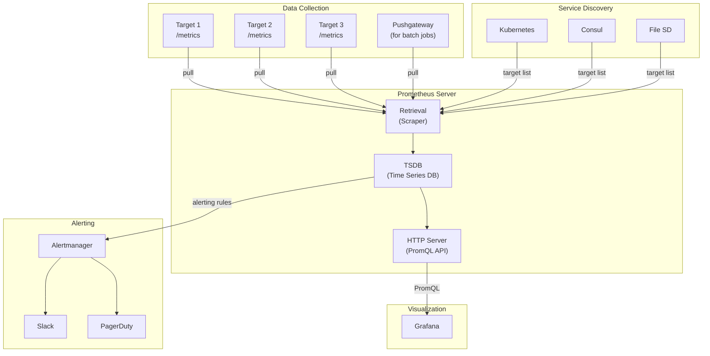
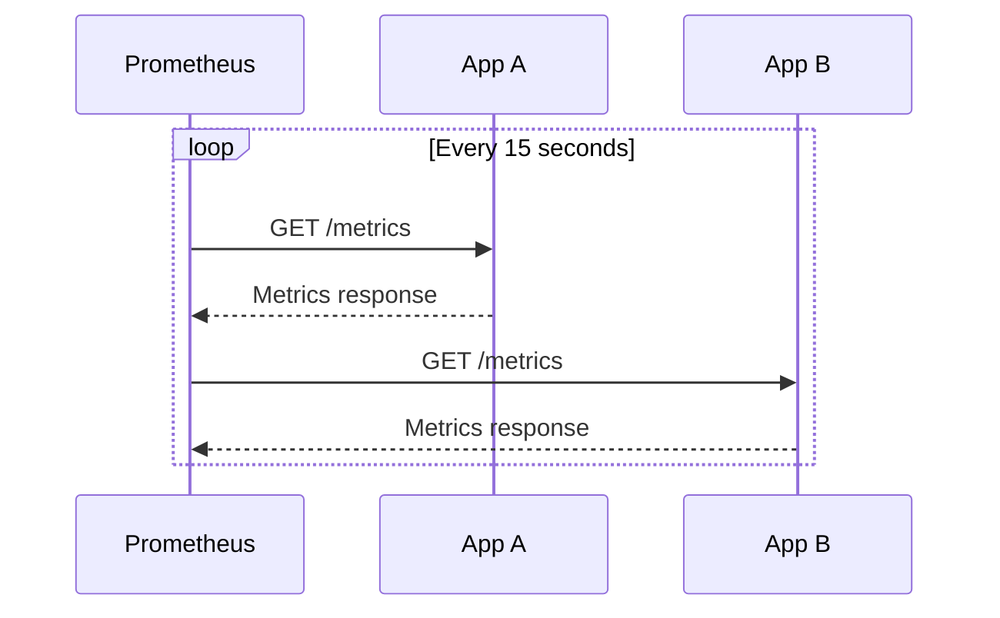
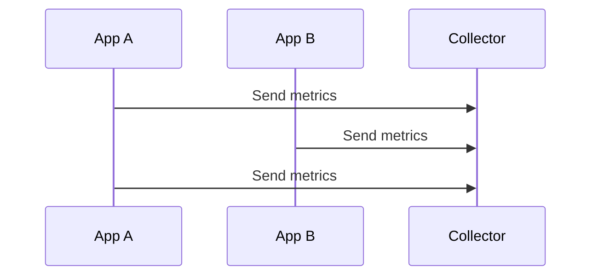
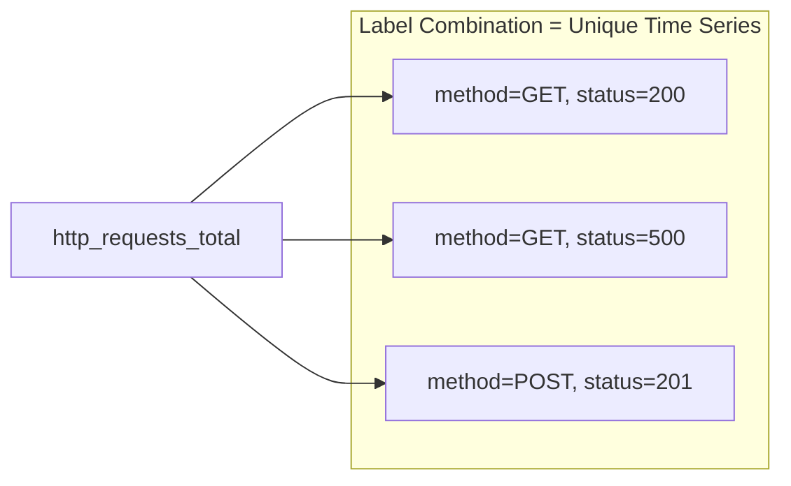
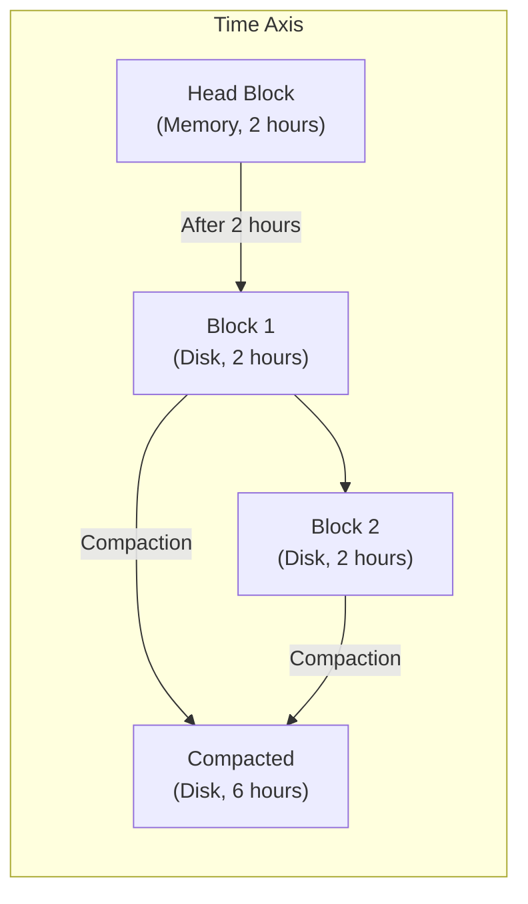
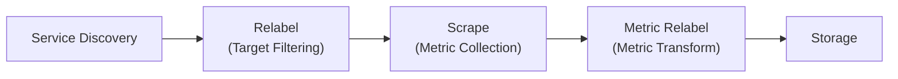
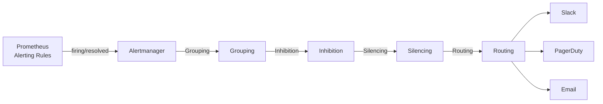
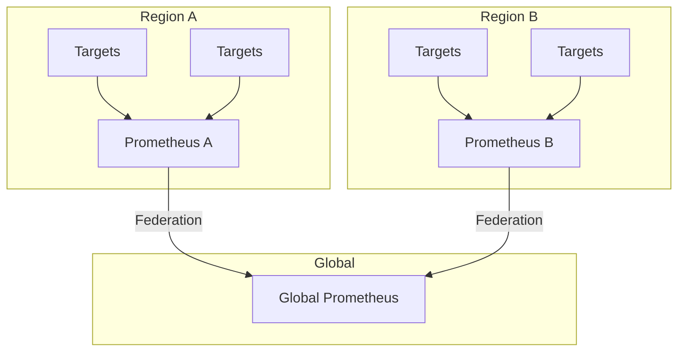

> **Target Audience**: Developers who want to operate or deeply understand Prometheus
> **Prerequisites**: [Metrics Fundamentals]()
> **After Reading**: You'll understand Prometheus design philosophy and components, and be able to plan operational strategies

## TL;DR


**Key Summary:**
- **Pull Model**: Prometheus fetches metrics from targets (not Push)
- **Time Series DB**: Label-based multidimensional data model
- **Service Discovery**: Auto-discover targets with Kubernetes, Consul, etc.
- **Single Server Design**: Optimized for single server rather than horizontal scaling (extend with Federation)


## Prometheus Overall Structure



---

## Why Pull Model?

### Two Philosophies of Monitoring

There are broadly two philosophies for collecting metrics.

1. **Push Model**: "The application sends metrics" (Datadog, StatsD, CloudWatch)
2. **Pull Model**: "The monitoring system fetches metrics" (Prometheus)

Prometheus chose the **Pull Model**. This choice contains deep design philosophy.

### Analogy: Health Checkup vs Self-Diagnosis

**Push Model** is like **self-diagnosis**. Patients contact the hospital themselves when sick. But what if they're unconscious? They can't call. Also, if 100 patients call simultaneously, the hospital phone lines are overwhelmed.

**Pull Model** is like **regular health checkups**. Doctors visit patients at scheduled times to check their condition. Problems can be discovered even if the patient is unconscious, and the hospital doesn't get overloaded because doctors control the visit schedule.

Prometheus periodically visits (scrapes) all targets like "regular health checkups" to check their status. If a target doesn't respond, that itself is **a signal that "a problem has occurred"**.

### Problems Pull Model Solves

#### 1. Automated Health Checks

In Push model, it's hard to distinguish "application isn't sending metrics" from "application is dead." It could be a network issue, a bug, or an actual failure.

In Pull model, **scraping failure = target down**. If Prometheus can't access `/metrics`, that's the failure signal. No separate health check system needed.

#### 2. Centralized Control

In Push model, changing the collection interval requires **modifying settings in all applications**. If you have 100 services, you need to modify 100 of them.

In Pull model, you only need to modify **one Prometheus configuration file**. Which targets, how often, with which labels - all managed centrally.

#### 3. Easy Debugging

The `/metrics` endpoint is accessible via HTTP GET request. Open `http://your-app:8080/metrics` in a browser and you can **immediately check** the current metric state.

In Push model, to verify what metrics an application is sending, you need to capture network packets or check collector server logs.

---

## Pull vs Push Trade-offs

### Pull Model (Prometheus Way)



**Prometheus visits targets to collect metrics.**

### Push Model (Datadog, StatsD Way)



**Applications send metrics to the collection server.**

### Detailed Comparison

| Perspective | Pull Model | Push Model |
|------|-----------|-----------|
| **Health check** | Built-in (scraping failure = down) | Needs separate implementation |
| **Config changes** | Bulk change centrally | Each application needs modification |
| **Debugging** | Check `/metrics` in browser | Needs network capture |
| **Firewall** | Target must allow inbound | Collector must allow inbound |
| **Short-lived jobs** | Needs Pushgateway | Naturally supported |
| **Dynamic environments** | Needs service discovery | Auto-registration possible |
| **Bandwidth control** | Prometheus controls | Each application needs control |

### Pull Model Limitations and Solutions

| Situation | Problem | Solution |
|------|--------|--------|
| **Short-lived jobs** (batch, cronjobs) | Can't scrape after job ends | Pushgateway for temporary metric storage |
| **Targets behind firewall** | Prometheus can't access | Reverse Proxy or VPN |
| **NAT/private networks** | Target IP inaccessible | Service mesh (Istio), Agent mode |
| **Large-scale environments** | Single Prometheus limits | Federation, Remote Write |


**Cases Where Push Is More Suitable:**
- Environments with mostly batch jobs
- Applications behind firewalls that are hard to change
- Event-based metrics (need immediate transmission)

In these cases, consider using Pushgateway or Push-based solutions (Datadog, CloudWatch).


---

## Time Series Data Model

### Why a Time Series Database?

Can you store metrics in a regular relational database (MySQL, PostgreSQL)? Possible, but **very inefficient**.

**Analogy: Diary vs Spreadsheet**

Metric data is like a **diary**. You record in the same format every day, it's sorted chronologically, and past data is rarely modified. If you stored a diary in a database table? It can be searched, but it's not optimized for analyzing "mood trends over the past week."

A Time Series Database (TSDB) is storage **optimized for time-axis data**:

| Property | Relational DB | Time Series DB |
|------|----------|-----------|
| **Write pattern** | Random location | Always append latest data |
| **Read pattern** | Individual records | Time range queries |
| **Compression** | General | Time-axis specialized (Delta, Gorilla) |
| **Index** | B-Tree | Time + label reverse index |

Prometheus TSDB processes hundreds of thousands of samples per second while minimizing disk usage. This is why a separate time series DB is used.

### What Is a Time Series?

```
metric_name{label1="value1", label2="value2"} value @timestamp
```

**Example:**
```
http_requests_total{method="GET", status="200", path="/api/orders"} 1523 @1704700800
http_requests_total{method="POST", status="201", path="/api/orders"} 342 @1704700800
http_requests_total{method="GET", status="500", path="/api/orders"} 12 @1704700800
```

### Multidimensional Data Model



Each **label combination** creates a separate time series.

### Cardinality Warning


**Cardinality** is the number of unique time series. The more varied the label values, the more explosively the number of time series grows.

```
# Dangerous labels
http_requests_total{user_id="..."}  # Time series for each user
http_requests_total{request_id="..."} # New time series per request

# Safe labels
http_requests_total{method="GET", status="200"} # Limited combinations
```


---

## TSDB (Time Series Database)

### Why Block Structure?

Prometheus TSDB stores data in **2-hour blocks**. Why this structure?

**Analogy: Library Archive Management**

Think about managing books in a library.

- **Method 1**: Store all books in one place, sort every time a new book arrives (= single file)
  - Problem: Sorting time increases exponentially as books increase
- **Method 2**: Separate archives by year, lock old archives (= block structure)
  - Advantage: New books only added to "this year's archive," old archives untouched

Prometheus works the same way:

| Structural Choice | Reason |
|------------|------|
| **2-hour blocks** | Balance point between memory and disk efficiency |
| **Immutable blocks** | Once created, blocks aren't modified - no concurrency issues |
| **WAL** | Prevents memory data loss (for failure recovery) |
| **Compaction** | Merges old blocks to manage file count |

### Storage Structure

```
data/
├── 01BKGV7JBM69T2G1BGBGM6KB12/  # Block (2-hour unit)
│   ├── meta.json
│   ├── index                      # Label index
│   ├── chunks/                    # Actual data
│   └── tombstones                 # Deletion markers
├── 01BKGTZQ1SYQJTR4PB43C8PD98/
├── chunks_head/                    # WAL (Write-Ahead Log)
└── wal/
```

### Block Structure



| Component | Role |
|----------|------|
| **Head Block** | Recent 2 hours data, memory resident |
| **WAL** | Log for failure recovery |
| **Block** | 2-hour immutable data unit |
| **Compaction** | Merges old blocks, optimizes capacity |

### Retention Settings

```yaml
# prometheus.yml
storage:
  tsdb:
    retention.time: 15d      # Time-based retention
    retention.size: 50GB     # Size-based retention (deletes when first reached)
```

---

## Service Discovery

### Why Is Service Discovery Necessary?

In traditional infrastructure, server IPs were fixed. Install web server on `192.168.1.100`, database on `192.168.1.101`, write those addresses in config files, and done.

But in **cloud and container environments**, things are different:

- Kubernetes Pods get **new IPs** when they restart
- Auto Scaling **dynamically increases and decreases** servers
- Container IPs **change** with every deployment

**Analogy: Company Phone Directory**

In the past, employee phone numbers were written in paper phone books. With 100 employees who rarely changed, it worked. But with 1000 employees and weekly hires/departures? The paper phone book is always outdated.

In this case, you need a **company intranet phone directory**. Connected to the HR system, automatically registered on hire, automatically removed on departure. Search always returns the latest information.

Service discovery is Prometheus's **intranet phone directory**. By connecting with Kubernetes API, Consul, AWS EC2 API, etc., it automatically maintains the **list of currently running targets**.

### Static Configuration

For small environments or testing, static configuration is also possible.

```yaml
scrape_configs:
  - job_name: 'static-targets'
    static_configs:
      - targets:
        - 'server1:9090'
        - 'server2:9090'
        - 'server3:9090'
```

### Kubernetes Integration

```yaml
scrape_configs:
  - job_name: 'kubernetes-pods'
    kubernetes_sd_configs:
      - role: pod
    relabel_configs:
      # Only Pods with prometheus.io/scrape: "true" annotation
      - source_labels: [__meta_kubernetes_pod_annotation_prometheus_io_scrape]
        action: keep
        regex: true
      # Specify path with prometheus.io/path annotation
      - source_labels: [__meta_kubernetes_pod_annotation_prometheus_io_path]
        action: replace
        target_label: __metrics_path__
        regex: (.+)
      # Specify port with prometheus.io/port annotation
      - source_labels: [__address__, __meta_kubernetes_pod_annotation_prometheus_io_port]
        action: replace
        regex: ([^:]+)(?::\d+)?;(\d+)
        replacement: $1:$2
        target_label: __address__
```

**Pod Annotation Example:**
```yaml
apiVersion: v1
kind: Pod
metadata:
  annotations:
    prometheus.io/scrape: "true"
    prometheus.io/port: "8080"
    prometheus.io/path: "/actuator/prometheus"
```

### Supported Service Discoveries

| SD Type | Use Case |
|---------|------|
| `kubernetes_sd` | Kubernetes Pod, Service, Node |
| `consul_sd` | Consul service catalog |
| `ec2_sd` | AWS EC2 instances |
| `azure_sd` | Azure virtual machines |
| `file_sd` | JSON/YAML file based |
| `dns_sd` | DNS SRV records |

---

## Relabeling

### Why Is Relabeling Necessary?

Service discovery discovers **all targets**. Using Kubernetes SD includes all Pods in the cluster. But should you monitor all Pods?

- System Pods in `kube-system` namespace need separate monitoring
- Pods not exposing metrics don't need scraping
- Need to distinguish development from production environments

**Analogy: Mail Sorting Center**

A mail sorting center receives all mail, but does **filtering and labeling** before delivery:
- Mail with incomplete addresses is **returned** (= `drop` action)
- Only specific regions are **delivered** (= `keep` action)
- Old addresses are **converted** to new addresses (= `replace` action)

Relabeling is Prometheus's **mail sorting system**. Filters targets before scraping and transforms labels to store **only the data you want, cleanly**.

### When It Runs



### Main Actions

| Action | Description | Example |
|------|------|------|
| `keep` | Keep only matching targets | Specific namespaces only |
| `drop` | Exclude matching targets | Exclude system Pods |
| `replace` | Transform label values | Extract paths |
| `labelmap` | Transform label names | `__meta_*` → regular labels |
| `labeldrop` | Delete labels | Remove unnecessary labels |

### Example: Filtering by Namespace

```yaml
relabel_configs:
  # Collect only production namespace
  - source_labels: [__meta_kubernetes_namespace]
    action: keep
    regex: production

  # Store as namespace label
  - source_labels: [__meta_kubernetes_namespace]
    target_label: namespace
```

---

## Alertmanager Integration

### Why Is Alertmanager Necessary?

Prometheus itself has alerting rules. So why is a separate Alertmanager needed?

Prometheus alerting rules only decide **"when to fire an alert."** But in real operations, there are more complex requirements:

- What if 100 alerts of the same type fire simultaneously? **Grouping** is needed
- If the DB server is down and related application alerts keep coming? **Inhibition** is needed
- Want to ignore temporary error alerts during deployment? **Silencing** is needed
- Want to route Slack/PagerDuty by severity? **Routing** is needed

**Analogy: 911 Dispatch Center**

When a fire report comes in, the 911 dispatch center doesn't simply forward the report:

1. **Grouping**: 10 reports from the same building → 1 dispatch order
2. **Inhibition**: If fire truck already dispatched to that area → Hold additional dispatch
3. **Silencing**: During training periods, ignore reports from specific areas
4. **Routing**: Fire → fire truck, Medical → ambulance, Rescue → special team → Forward to appropriate department

Alertmanager is like the **911 dispatch center**. It receives raw alerts, **processes them wisely**, then forwards to appropriate channels.

### Alert Flow



### Prometheus Alerting Rules

```yaml
# prometheus/rules/alerts.yml
groups:
  - name: availability
    rules:
      - alert: ServiceDown
        expr: up == 0
        for: 5m
        labels:
          severity: critical
        annotations:
          summary: "{{ $labels.instance }} is down"
          description: "{{ $labels.job }} has been down for more than 5 minutes"
```

### Alertmanager Configuration

```yaml
# alertmanager.yml
global:
  resolve_timeout: 5m

route:
  receiver: 'default'
  group_by: ['alertname', 'job']
  group_wait: 30s
  group_interval: 5m
  repeat_interval: 4h
  routes:
    - match:
        severity: critical
      receiver: 'pagerduty'
    - match:
        severity: warning
      receiver: 'slack'

receivers:
  - name: 'default'
    webhook_configs:
      - url: 'http://alertmanager-webhook:5001/'

  - name: 'slack'
    slack_configs:
      - api_url: 'https://hooks.slack.com/services/...'
        channel: '#alerts'

  - name: 'pagerduty'
    pagerduty_configs:
      - service_key: '<key>'
```

---

## Scaling Strategies

### Why Are Scaling Strategies Necessary?

Prometheus intentionally chose a **single server design**. The goal is to avoid distributed system complexity and extract maximum performance from a single server.

But in reality, there are limits:

| Situation | Single Prometheus Limit |
|------|---------------------|
| Millions of time series | Memory/CPU shortage |
| Global multi-region | Network latency, single point of failure |
| Long-term retention (1+ years) | Disk cost spike |
| Team-independent operations | Config conflicts, permission management difficulty |

**Analogy: City Fire Station Placement**

A small town needs just one fire station. But what about a big city?

- **Regional fire stations**: Place fire stations in each district, headquarters monitors overall situation (= Federation)
- **Specialized fire stations**: Separate roles like wildfire team, chemical team (= Sharding)
- **Record archive**: Store past dispatch records in separate archive (= Remote Storage)

Prometheus also combines **layering, sharding, external storage** strategies to scale based on size.

### Federation (Hierarchical Structure)



```yaml
# Global Prometheus configuration
scrape_configs:
  - job_name: 'federation'
    honor_labels: true
    metrics_path: '/federate'
    params:
      'match[]':
        - '{job=~".+"}'
    static_configs:
      - targets:
        - 'prometheus-a:9090'
        - 'prometheus-b:9090'
```

### Remote Storage

Use remote storage when long-term retention is needed.

```yaml
remote_write:
  - url: "http://victoriametrics:8428/api/v1/write"

remote_read:
  - url: "http://victoriametrics:8428/api/v1/read"
```

| Remote Storage | Characteristics |
|------------|------|
| Thanos | Object storage based, global view |
| Cortex | Multi-tenant, horizontal scaling |
| VictoriaMetrics | High performance, simple operations |
| Mimir | Grafana Labs, Cortex successor |

---

## Operational Recommendations

### Resource Guidelines

| Time Series Count | RAM | CPU | Disk |
|----------|-----|-----|--------|
| 100K | 2GB | 1 core | 10GB |
| 1M | 8GB | 2 cores | 100GB |
| 10M | 32GB | 8 cores | 1TB |

### Performance Optimization

```yaml
# prometheus.yml
global:
  scrape_interval: 30s     # Default 15s → 30s (reduce load)
  evaluation_interval: 30s

scrape_configs:
  - job_name: 'high-priority'
    scrape_interval: 15s   # Important targets more frequently

  - job_name: 'low-priority'
    scrape_interval: 60s   # Less important targets
```

### Metrics to Monitor

```promql
# Scraping performance
rate(prometheus_target_scrape_pool_sync_total[5m])

# TSDB status
prometheus_tsdb_head_series  # Active time series count
prometheus_tsdb_head_chunks  # Chunk count

# Memory usage
process_resident_memory_bytes

# Query performance
prometheus_engine_query_duration_seconds
```

---

## Key Summary

| Component | Role |
|----------|------|
| **Pull Model** | Prometheus visits targets to collect |
| **TSDB** | Time series data storage, 2-hour block units |
| **Service Discovery** | Auto-discover targets (K8s, Consul, etc.) |
| **Relabeling** | Label transformation and filtering |
| **Alertmanager** | Alert grouping, routing, sending |
| **Federation** | Hierarchical scaling |

---

## Next Steps

| Recommended Order | Document | What You'll Learn |
|----------|------|----------|
| 1 | [PromQL Syntax Basics](promql/syntax-basics/) | Selectors, label matching |
| 2 | [Environment Setup](../examples/setup/) | Docker Compose practice |
| 3 | [Alerting Strategy](promql/alerting-rules/) | Writing Alerting Rules |
