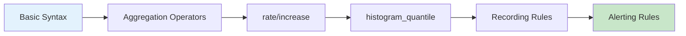

PromQL (Prometheus Query Language) is a query language for querying and analyzing time series data in Prometheus.

## Why Learn PromQL?

| Use Case | Description |
|----------|-------------|
| **Dashboards** | Visualize data in Grafana panels |
| **Alerting** | Write condition-based automatic alert rules |
| **Analysis** | Analyze root causes with ad-hoc queries |
| **Recording Rules** | Optimize performance by pre-computing complex queries |

## Learning Path

### Fundamentals (1 hour)

1. [Basic Syntax](syntax-basics/) - Selectors, label matching, time ranges
2. [Aggregation Operators](aggregation-operators/) - sum, avg, count, topk, by/without

### Practical Application (2 hours)

3. [rate and increase](rate-and-increase/) - Core concepts for Counter metrics
4. [histogram_quantile](histogram-quantile/) - Calculate P50/P95/P99 percentiles

### Advanced (1 hour)

5. [Recording Rules](recording-rules/) - Pre-compute complex queries
6. [Alerting Rules](alerting-rules/) - Write alert rules

## Quick Reference

### Commonly Used Functions

| Function | Purpose | Example |
|----------|---------|---------|
| `rate()` | Per-second rate of Counter | `rate(http_requests_total[5m])` |
| `increase()` | Total increase of Counter | `increase(http_requests_total[1h])` |
| `sum()` | Sum | `sum(rate(http_requests_total[5m]))` |
| `avg()` | Average | `avg(node_cpu_seconds_total)` |
| `histogram_quantile()` | Percentile | `histogram_quantile(0.99, rate(...[5m]))` |

### Common Patterns

```promql
# Error rate
sum(rate(http_requests_total{status=~"5.."}[5m]))
/ sum(rate(http_requests_total[5m]))

# P99 response time
histogram_quantile(0.99,
  sum(rate(http_request_duration_seconds_bucket[5m])) by (le)
)

# CPU usage
100 - (avg(rate(node_cpu_seconds_total{mode="idle"}[5m])) * 100)
```

## Learning Path



*This diagram shows the PromQL learning path progressing from basic syntax to Alerting Rules.*
