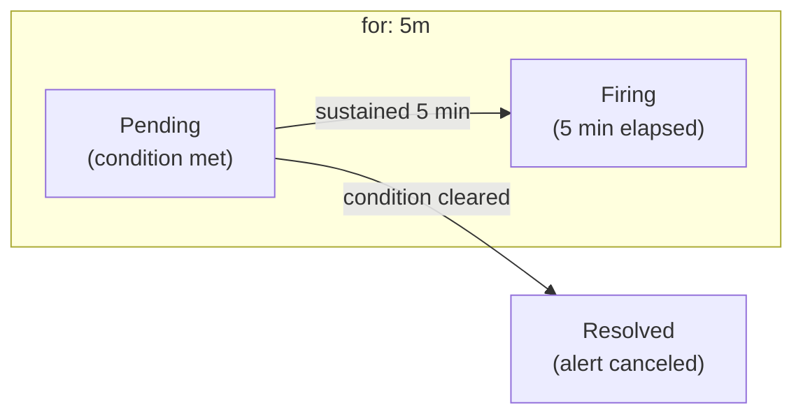
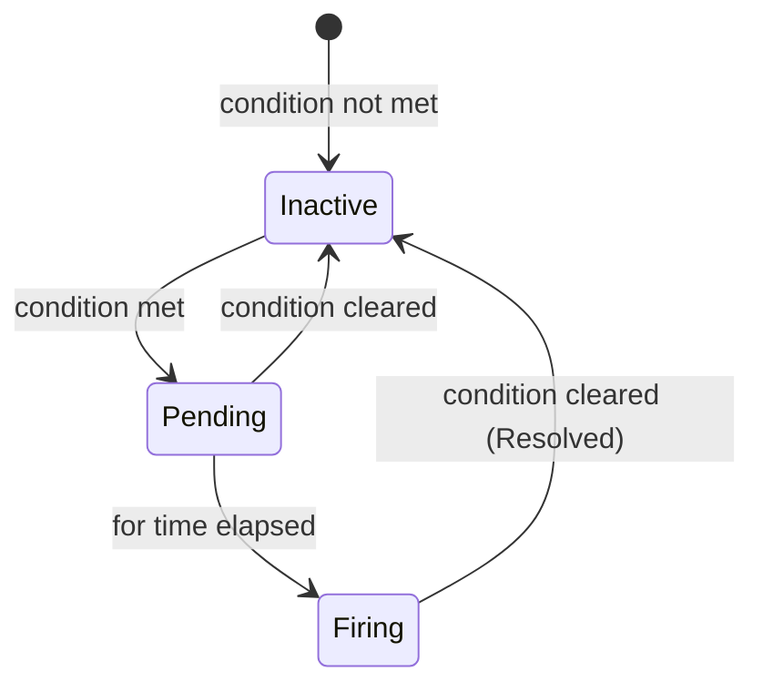

> **Target Audience**: Developers and SREs setting up monitoring alerts
> **Prerequisites**: [Recording Rules](recording-rules/)
> **What You'll Learn**: Write rules that reduce false positives and alert only on real issues


- `for`: Fires when condition is met for specified duration (prevents false positives)
- `labels`: Add metadata like severity, team
- `annotations`: Include alert message, runbook URL
- Use Recording Rules results for concise writing


## Basic Syntax

### Alerting Rule Structure

```yaml
groups:
  - name: <group_name>
    rules:
      - alert: <alert_name>
        expr: <PromQL_condition>
        for: <duration>
        labels:
          <label_name>: <value>
        annotations:
          <annotation_name>: <value>
```

### Basic Example

```yaml
groups:
  - name: availability
    rules:
      - alert: ServiceDown
        expr: up == 0
        for: 5m
        labels:
          severity: critical
        annotations:
          summary: "{{ $labels.instance }} is down"
          description: "{{ $labels.job }} has been down for more than 5 minutes."
          runbook_url: "https://wiki.example.com/runbook/service-down"
```

---

## Core Components

### expr (Condition)

The condition that triggers the alert.

```yaml
# Target down
expr: up == 0

# Error rate exceeds 5%
expr: |
  sum by (service) (rate(http_requests_total{status=~"5.."}[5m]))
  / sum by (service) (rate(http_requests_total[5m]))
  > 0.05

# P99 response time exceeds 500ms
expr: |
  histogram_quantile(0.99,
    sum by (service, le) (rate(http_request_duration_seconds_bucket[5m]))
  ) > 0.5

# Using Recording Rule result (recommended)
expr: service:http_requests_errors:ratio_rate5m > 0.05
```

### for (Duration)

Alert fires when condition is **sustained**. Prevents false positives from temporary spikes.

```yaml
# Fire after 5 minutes of sustained condition
for: 5m

# Fire immediately (no for)
# Caution: Risk of false positives
```



*This diagram shows the flow where a condition triggers Pending status, fires after 5 minutes of sustained condition, or cancels if the condition clears in between.*
**Recommended Values:**

| Situation | for Value | Reason |
|-----------|-----------|--------|
| Service down | 1-5m | Need quick detection |
| Error rate increase | 5-10m | Filter temporary spikes |
| Resource shortage | 10-15m | Wait for auto-recovery |
| Disk shortage | 30m-1h | Increases slowly |

### labels (Labels)

Add metadata to alerts.

```yaml
labels:
  severity: critical          # Severity
  team: platform              # Responsible team
  service: "{{ $labels.service }}"  # Dynamic label
```

**Severity Levels:**

| Level | Description | Response |
|-------|-------------|----------|
| `critical` | Service outage | Immediate response (call) |
| `warning` | Performance degradation | Response during business hours |
| `info` | Reference info | Record only |

### annotations (Annotations)

Provide detailed alert description.

```yaml
annotations:
  summary: "High error rate on {{ $labels.service }}"
  description: |
    Error rate is {{ $value | humanizePercentage }}.
    Current threshold: 5%
  runbook_url: "https://wiki.example.com/runbook/high-error-rate"
  dashboard_url: "https://grafana.example.com/d/abc/errors?var-service={{ $labels.service }}"
```

**Template Variables:**

| Variable | Description |
|----------|-------------|
| `{{ $labels }}` | All alert labels |
| `{{ $labels.name }}` | Specific label value |
| `{{ $value }}` | Expression result value |
| `{{ $value | humanize }}` | Human-readable format |
| `{{ $value | humanizePercentage }}` | Percentage format |
| `{{ $value | humanizeDuration }}` | Time format |

---

## Practical Alert Rules

### Availability Alerts

```yaml
groups:
  - name: availability
    rules:
      # Target down
      - alert: TargetDown
        expr: up == 0
        for: 5m
        labels:
          severity: critical
        annotations:
          summary: "Target {{ $labels.instance }} is down"
          description: "{{ $labels.job }} target {{ $labels.instance }} has been down for more than 5 minutes."

      # Service availability degradation
      - alert: ServiceAvailabilityLow
        expr: |
          sum by (service) (rate(http_requests_total{status!~"5.."}[5m]))
          / sum by (service) (rate(http_requests_total[5m]))
          < 0.99
        for: 5m
        labels:
          severity: warning
        annotations:
          summary: "{{ $labels.service }} availability below 99%"
          description: "Current availability: {{ $value | humanizePercentage }}"
```

### Error Rate Alerts

```yaml
groups:
  - name: errors
    rules:
      # High error rate
      - alert: HighErrorRate
        expr: |
          sum by (service) (rate(http_requests_total{status=~"5.."}[5m]))
          / sum by (service) (rate(http_requests_total[5m]))
          > 0.05
        for: 5m
        labels:
          severity: warning
        annotations:
          summary: "High error rate on {{ $labels.service }}"
          description: "Error rate is {{ $value | humanizePercentage }}"

      # Critical error rate
      - alert: CriticalErrorRate
        expr: |
          sum by (service) (rate(http_requests_total{status=~"5.."}[5m]))
          / sum by (service) (rate(http_requests_total[5m]))
          > 0.10
        for: 2m
        labels:
          severity: critical
        annotations:
          summary: "Critical error rate on {{ $labels.service }}"
          description: "Error rate is {{ $value | humanizePercentage }}. Immediate action required."
```

### Latency Alerts

```yaml
groups:
  - name: latency
    rules:
      # High P99 latency
      - alert: HighP99Latency
        expr: |
          histogram_quantile(0.99,
            sum by (service, le) (rate(http_request_duration_seconds_bucket[5m]))
          ) > 0.5
        for: 5m
        labels:
          severity: warning
        annotations:
          summary: "High P99 latency on {{ $labels.service }}"
          description: "P99 latency is {{ $value | humanizeDuration }}"

      # Using Recording Rule
      - alert: HighP99LatencyFromRule
        expr: service:http_request_duration_seconds:p99 > 0.5
        for: 5m
        labels:
          severity: warning
        annotations:
          summary: "High P99 latency on {{ $labels.service }}"
```

### Resource Alerts

```yaml
groups:
  - name: resources
    rules:
      # High CPU
      - alert: HighCPUUsage
        expr: |
          100 - (avg by (instance) (rate(node_cpu_seconds_total{mode="idle"}[5m])) * 100) > 80
        for: 10m
        labels:
          severity: warning
        annotations:
          summary: "High CPU usage on {{ $labels.instance }}"
          description: "CPU usage is {{ $value | humanize }}%"

      # Low memory
      - alert: LowMemory
        expr: |
          (node_memory_MemAvailable_bytes / node_memory_MemTotal_bytes) < 0.1
        for: 5m
        labels:
          severity: warning
        annotations:
          summary: "Low memory on {{ $labels.instance }}"
          description: "Available memory is {{ $value | humanizePercentage }}"

      # Low disk space
      - alert: DiskSpaceLow
        expr: |
          (node_filesystem_avail_bytes{mountpoint="/"} / node_filesystem_size_bytes{mountpoint="/"}) < 0.1
        for: 30m
        labels:
          severity: warning
        annotations:
          summary: "Low disk space on {{ $labels.instance }}"
          description: "Available disk space is {{ $value | humanizePercentage }}"
```

### Kafka Alerts

```yaml
groups:
  - name: kafka
    rules:
      # High Consumer Lag
      - alert: KafkaConsumerLagHigh
        expr: |
          sum by (consumer_group, topic) (kafka_consumer_group_lag) > 10000
        for: 10m
        labels:
          severity: warning
        annotations:
          summary: "High consumer lag for {{ $labels.consumer_group }}"
          description: "Lag is {{ $value | humanize }} messages on topic {{ $labels.topic }}"

      # Under-replicated partitions
      - alert: KafkaUnderReplicatedPartitions
        expr: kafka_server_replicamanager_underreplicatedpartitions > 0
        for: 5m
        labels:
          severity: critical
        annotations:
          summary: "Kafka under-replicated partitions detected"
```

---

## Preventing Alert Fatigue

### 1. Appropriate Thresholds

```yaml
# ❌ Too sensitive
expr: error_rate > 0.001  # 0.1%

# ✅ Meaningful threshold
expr: error_rate > 0.01   # 1%
```

### 2. Sufficient for Time

```yaml
# ❌ Fires on temporary spikes
for: 30s

# ✅ Detects sustained issues only
for: 5m
```

### 3. Tiered Alerts

```yaml
# Warning: 5% error, 5 min sustained
- alert: HighErrorRate
  expr: error_rate > 0.05
  for: 5m
  labels:
    severity: warning

# Critical: 10% error, 2 min sustained (faster)
- alert: CriticalErrorRate
  expr: error_rate > 0.10
  for: 2m
  labels:
    severity: critical
```

### 4. Grouping in Alertmanager

```yaml
# alertmanager.yml
route:
  group_by: ['alertname', 'service']
  group_wait: 30s
  group_interval: 5m
  repeat_interval: 4h
```

---

## Rule Validation

### Syntax Check

```bash
promtool check rules alerts/*.yml
```

### Unit Tests

```yaml
# tests/alert_tests.yml
rule_files:
  - ../alerts/errors.yml

evaluation_interval: 1m

tests:
  - interval: 1m
    input_series:
      - series: 'http_requests_total{service="api", status="500"}'
        values: '0+10x10'
      - series: 'http_requests_total{service="api", status="200"}'
        values: '0+100x10'

    alert_rule_test:
      - eval_time: 10m
        alertname: HighErrorRate
        exp_alerts:
          - exp_labels:
              service: api
              severity: warning
            exp_annotations:
              summary: "High error rate on api"
```

```bash
promtool test rules tests/alert_tests.yml
```

---

## Alert States



*This diagram shows the alert state machine: transitions between Inactive, Pending, and Firing states with their conditions.*
| State | Description |
|-------|-------------|
| **Inactive** | Condition not met |
| **Pending** | Condition met, waiting for duration |
| **Firing** | Alert fired |

---

## Key Takeaways

| Component | Role | Example |
|-----------|------|---------|
| `expr` | Trigger condition | `error_rate > 0.05` |
| `for` | Prevent false positives | `5m` |
| `labels` | Metadata | `severity: critical` |
| `annotations` | Alert content | `summary`, `runbook_url` |

**Good Alert Criteria:**
1. Only situations requiring immediate action
2. Clear severity classification
3. Detailed context (runbook, dashboard)
4. Appropriate for time to prevent false positives

---

## Next Steps

| Recommended Order | Document | What You'll Learn |
|-------------------|----------|-------------------|
| 1 | [SRE Golden Signals](../golden-signals/) | Selecting metrics to alert on |
| 2 | [Alert Action Guide](../../appendix/alerting-actions/) | Response after receiving alerts |
