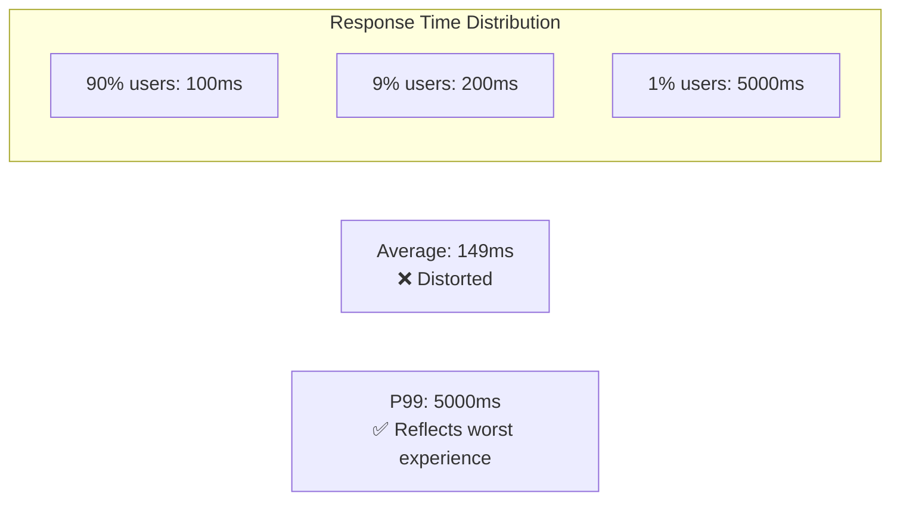
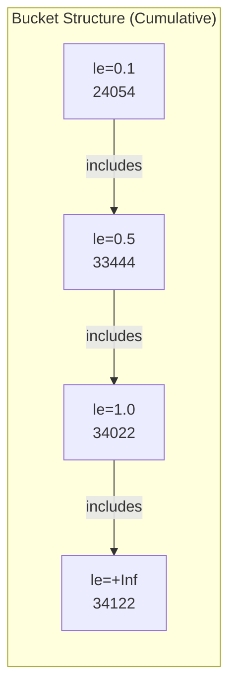
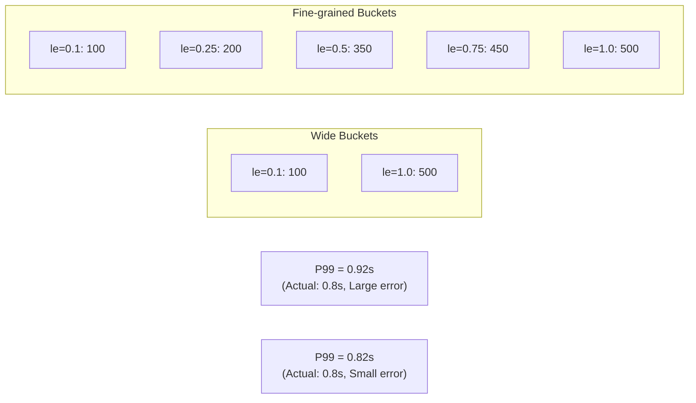

> **Target Audience**: Developers and SREs who need response time analysis
> **Prerequisites**: [Metrics Fundamentals](../metrics-fundamentals/), [rate and increase](rate-and-increase/)
> **What You'll Learn**: Calculate accurate percentiles from Histograms and monitor SLAs


- `histogram_quantile(φ, bucket)`: Calculate φ percentile (0 ≤ φ ≤ 1)
- **P50**: `histogram_quantile(0.5, ...)` - Median
- **P95**: `histogram_quantile(0.95, ...)` - 95% are at or below this value
- **P99**: `histogram_quantile(0.99, ...)` - 99% are at or below this value
- Must always use with `rate()` or `increase()`


## Why Percentiles Matter

Averages are **distorted by extreme values**. Percentiles better reflect actual user experience.



*This diagram shows that while most users experience fast responses, 1% of slow requests skew the average, and P99 accurately reflects the worst-case experience.*
| Metric | Value | Meaning |
|--------|-------|---------|
| Average | 149ms | Distorted by extremes |
| P50 | 100ms | Half of requests are at or below |
| P95 | 200ms | 95% are at or below |
| P99 | 5000ms | 99% are at or below (1% wait 5 seconds) |

---

## Histogram Structure Review

A Histogram generates 3 types of time series.

```
# _bucket: Cumulative count per bucket (le = less than or equal)
http_request_duration_seconds_bucket{le="0.1"} 24054   # ≤ 0.1 seconds
http_request_duration_seconds_bucket{le="0.5"} 33444   # ≤ 0.5 seconds
http_request_duration_seconds_bucket{le="1"}   34022   # ≤ 1 second
http_request_duration_seconds_bucket{le="+Inf"} 34122  # All

# _count: Total observation count
http_request_duration_seconds_count 34122

# _sum: Sum of all values
http_request_duration_seconds_sum 2042.53
```



*This diagram shows how Histogram buckets store data in a cumulative structure (le=0.1 is a subset of le=0.5 is a subset of le=1.0 is a subset of +Inf).*
---

## histogram_quantile() Usage

### Basic Syntax

```promql
histogram_quantile(
  φ,           # Percentile (value between 0-1)
  bucket       # _bucket time series (with rate applied)
)
```

### Basic Examples

```promql
# P50 (median)
histogram_quantile(0.5,
  rate(http_request_duration_seconds_bucket[5m])
)

# P90
histogram_quantile(0.9,
  rate(http_request_duration_seconds_bucket[5m])
)

# P95
histogram_quantile(0.95,
  rate(http_request_duration_seconds_bucket[5m])
)

# P99
histogram_quantile(0.99,
  rate(http_request_duration_seconds_bucket[5m])
)
```

### Why rate() is Needed

```promql
# ❌ Buckets are cumulative, doesn't consider time range
histogram_quantile(0.99, http_request_duration_seconds_bucket)

# ✅ rate() calculates distribution during that time
histogram_quantile(0.99, rate(http_request_duration_seconds_bucket[5m]))
```

---

## Percentiles by Group

### Must Keep le Label

```promql
# P99 by service
histogram_quantile(0.99,
  sum by (service, le) (
    rate(http_request_duration_seconds_bucket[5m])
  )
)
```


**The `le` label must be preserved.** Without `le`, the bucket structure breaks and calculation becomes impossible.

```promql
# ❌ Aggregating without le causes error
sum by (service) (rate(..._bucket[5m]))

# ✅ Aggregate including le
sum by (service, le) (rate(..._bucket[5m]))
```


### Various Grouping Examples

```promql
# P99 by endpoint
histogram_quantile(0.99,
  sum by (path, le) (
    rate(http_request_duration_seconds_bucket[5m])
  )
)

# P95 by service + endpoint
histogram_quantile(0.95,
  sum by (service, path, le) (
    rate(http_request_duration_seconds_bucket[5m])
  )
)

# Overall system P99 (remove all labels except le)
histogram_quantile(0.99,
  sum by (le) (
    rate(http_request_duration_seconds_bucket[5m])
  )
)
```

---

## Practical Patterns

### SLA Monitoring

```promql
# Check if P99 is below 500ms
histogram_quantile(0.99,
  sum by (le) (rate(http_request_duration_seconds_bucket[5m]))
) < 0.5

# Find services violating SLA
histogram_quantile(0.99,
  sum by (service, le) (rate(http_request_duration_seconds_bucket[5m]))
) > 0.5
```

### Alert Rules

```yaml
# prometheus/rules/latency.yml
groups:
  - name: latency
    rules:
      - alert: HighP99Latency
        expr: |
          histogram_quantile(0.99,
            sum by (service, le) (rate(http_request_duration_seconds_bucket[5m]))
          ) > 0.5
        for: 5m
        labels:
          severity: warning
        annotations:
          summary: "{{ $labels.service }} P99 latency is {{ $value | humanizeDuration }}"
```

### Compare with Average Response Time

```promql
# Average response time
rate(http_request_duration_seconds_sum[5m])
/ rate(http_request_duration_seconds_count[5m])

# P99 response time
histogram_quantile(0.99,
  sum by (le) (rate(http_request_duration_seconds_bucket[5m]))
)

# P99 / Average ratio (degree of imbalance)
histogram_quantile(0.99, sum by (le) (rate(http_request_duration_seconds_bucket[5m])))
/ (rate(http_request_duration_seconds_sum[5m]) / rate(http_request_duration_seconds_count[5m]))
```

### Percentile Trend Comparison

```promql
# P50 vs P99 difference (degree of long tail)
histogram_quantile(0.99, sum by (le) (rate(http_request_duration_seconds_bucket[5m])))
- histogram_quantile(0.5, sum by (le) (rate(http_request_duration_seconds_bucket[5m])))
```

---

## Accuracy and Bucket Design

### Linear Interpolation

histogram_quantile uses **linear interpolation** between bucket boundaries. Bucket design directly affects accuracy.



*This diagram compares how wider bucket intervals cause larger linear interpolation errors, while finer intervals calculate percentiles closer to actual values.*
### Bucket Design Recommendations

```java
// Spring Boot + Micrometer
Timer.builder("http_request_duration_seconds")
    .publishPercentileHistogram()
    .sla(
        Duration.ofMillis(10),    // Very fast response
        Duration.ofMillis(50),    // Fast response
        Duration.ofMillis(100),   // Normal target
        Duration.ofMillis(250),   // Slow response starts
        Duration.ofMillis(500),   // SLA threshold
        Duration.ofSeconds(1),    // Slow response
        Duration.ofSeconds(5)     // Near timeout
    )
    .register(registry);
```


**Bucket Design Principles:**
1. Concentrate buckets near SLA thresholds
2. Cover 90%+ of expected distribution
3. Consider cardinality (bucket count × label combinations)


---

## Common Mistakes

### 1. Missing le Label

```promql
# ❌ Aggregate without le
histogram_quantile(0.99,
  sum by (service) (rate(http_request_duration_seconds_bucket[5m]))
)
# Result: NaN

# ✅ Include le
histogram_quantile(0.99,
  sum by (service, le) (rate(http_request_duration_seconds_bucket[5m]))
)
```

### 2. Missing rate()

```promql
# ❌ Used without rate
histogram_quantile(0.99, http_request_duration_seconds_bucket)
# Result: Based on all data since server start

# ✅ Apply rate
histogram_quantile(0.99, rate(http_request_duration_seconds_bucket[5m]))
# Result: Based on last 5 minutes
```

### 3. Exceeding Bucket Range

```promql
# When buckets only go up to le=1
# If actual P99 is 2 seconds...
histogram_quantile(0.99, ...)
# Result: 1 (max bucket value) - inaccurate

# Solution: Need to add larger buckets
```

### 4. +Inf Display in Grafana

If you see `+Inf` values in Grafana graphs, most requests exceed the maximum bucket.

```promql
# Check bucket coverage
http_request_duration_seconds_bucket{le="1"}
/ http_request_duration_seconds_bucket{le="+Inf"}
# Above 0.95 indicates good bucket design
```

---

## Native Histogram (Prometheus 2.40+)


**Native Histogram** automatically manages buckets. Still experimental, but solves bucket design issues.

```promql
# With Native Histogram, use directly
histogram_quantile(0.99, rate(http_request_duration_seconds[5m]))
# _bucket suffix not needed
```


---

## Key Takeaways

| Percentile | Query | Meaning |
|------------|-------|---------|
| P50 | `histogram_quantile(0.5, ...)` | Median |
| P90 | `histogram_quantile(0.9, ...)` | 90% at or below |
| P95 | `histogram_quantile(0.95, ...)` | 95% at or below |
| P99 | `histogram_quantile(0.99, ...)` | 99% at or below |

**Complete Query Template:**
```promql
histogram_quantile(
  0.99,
  sum by (service, le) (
    rate(http_request_duration_seconds_bucket[5m])
  )
)
```

---

## Next Steps

| Recommended Order | Document | What You'll Learn |
|-------------------|----------|-------------------|
| 1 | [Recording Rules](recording-rules/) | Pre-compute complex queries |
| 2 | [SRE Golden Signals - Latency](../golden-signals/latency/) | Latency monitoring strategy |
