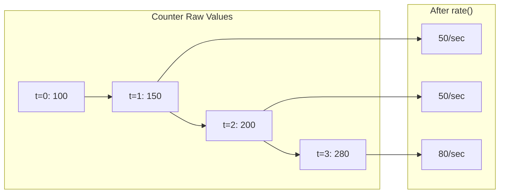
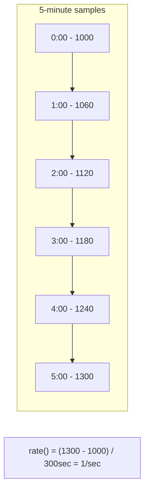
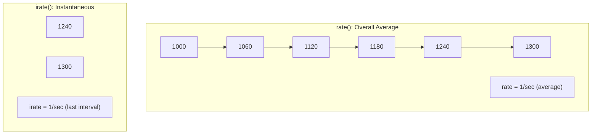
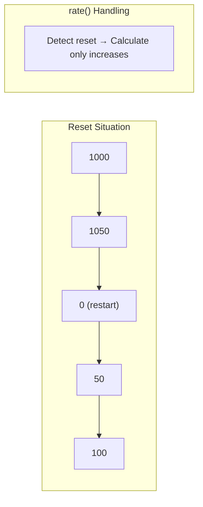

> **Target Audience**: Developers working with Counter metrics
> **Prerequisites**: [Metrics Fundamentals](../metrics-fundamentals/), [Aggregation Operators](aggregation-operators/)
> **What You'll Learn**: Calculate per-second rate and total increase from Counter metrics accurately

## TL;DR


**Key Summary:**
- **rate()**: Average per-second increase rate → Used in dashboards and alerts
- **increase()**: Total increase within time range → Used for period totals
- **irate()**: Instantaneous rate of last two samples → Used for volatile metrics
- Always apply these functions to Counters (raw values are meaningless)


## Why rate/increase are Needed

Counters are **cumulative values**. They record how many requests have come since the server started. But the number "150,000 requests" alone doesn't tell us if the system is working well. If the server started 1 hour ago, it's 40 requests/second, but if it started 1 year ago, it's 0.005 requests/second.

What we really want to know is **"How busy is it right now?"** or **"How many were processed in the last hour?"**. This is exactly what rate() and increase() solve.

**Analogy: Car Odometer and Speedometer**

Think about a car. The odometer shows you've driven a total of 150,000 km since buying the car. But this number alone doesn't tell you how fast you're going now. That's why you need the speedometer, which tells you "currently 80 km/h".

- **Odometer** = Counter raw value (cumulative)
- **Speedometer** = rate() (per-second rate of change)
- **Distance traveled today** = increase() (increase over specific period)

With Counter alone, it's like only looking at the odometer. Applying rate() and increase() gives you "current situation" and "period performance".

### Visual Example



```promql
# ❌ Meaningless: cumulative requests since server start
http_requests_total
# → 150000 (varies depending on when server started)

# ✅ Meaningful: requests per second
rate(http_requests_total[5m])
# → 42.5 (42.5 requests per second)
```

---

## rate() Details

### Why Use rate()?

To show "current system load" on a dashboard or detect "abnormally high errors" in alert rules, you need **per-second rate of change**.

**Analogy: Water Meter and Faucet**

A water meter shows how much water this house has used in total. But to check if a pipe has burst, you need to know "how much water is flowing per minute right now". If the meter reading is rising rapidly, there's a problem.

rate() calculates this "current flow". If a Counter increased by 300 over 5 minutes, `rate() = 300 / 300 seconds = 1/second`. Looking at this value, you can understand "processing 1 per second".

### Definition

Calculates the **average per-second increase rate** within a time range.

```
rate(v[time]) = (last value - first value) / time(seconds)
```

### How It Works



### Basic Usage

```promql
# Requests per second (5-minute average)
rate(http_requests_total[5m])

# Errors per second
rate(http_requests_total{status=~"5.."}[5m])

# Bytes processed per second
rate(node_network_receive_bytes_total[5m])
```

### Time Range Selection

| Range | Purpose | Characteristics |
|-------|---------|----------------|
| `[1m]` | Quick change detection | High noise |
| `[5m]` | General use | Recommended default |
| `[15m]` | Long-term trends | Smooth graph |
| `[1h]` | Daily pattern analysis | Detail loss |


**Time range should be at least 4x scrape_interval**.
- scrape_interval: 15s → Use `[1m]` or more
- scrape_interval: 30s → Use `[2m]` or more


### Aggregation by Group

```promql
# Requests per second by service
sum by (service) (rate(http_requests_total[5m]))

# Requests per second by status
sum by (status) (rate(http_requests_total[5m]))

# Total requests per second
sum(rate(http_requests_total[5m]))
```

---

## increase() Details

### Why Use increase()?

When you need **period totals** like "How many orders were there today?" or "How many errors occurred this week?", use increase(). It's commonly used in business reports and SLA calculations.

**Analogy: Daily Sales Total**

Imagine you run a cafe. The cash register shows total sales until today (Counter). But what the owner wants to know is "How many coffees did we sell today?". You need to calculate the difference between yesterday evening's closing number and today's closing number.

increase() does exactly this. `increase(orders_total[24h])` calculates "how many orders increased over 24 hours". While rate() is "per second", increase() is "total over that period".

### Definition

Calculates the **total increase** within a time range.

```
increase(v[time]) = rate(v[time]) × time(seconds)
```

### How It Works

```promql
# These two queries produce identical results
increase(http_requests_total[1h])
rate(http_requests_total[1h]) * 3600
```

### Basic Usage

```promql
# Total requests in 1 hour
increase(http_requests_total[1h])

# Total errors in 1 day
increase(http_requests_total{status=~"5.."}[24h])

# Total bytes processed in 1 week
increase(node_network_receive_bytes_total[7d])
```

### When to Use

| Situation | Function |
|-----------|----------|
| Dashboard graphs | `rate()` |
| Alert rules | `rate()` |
| Period totals (daily request count) | `increase()` |
| Cost calculation (throughput-based) | `increase()` |

---

## irate() Details

### Why Use irate()?

rate() shows a 5-minute average, so momentary spikes get "averaged out" and might not be visible. If there's a sudden 1-second burst that returns to normal, rate()[5m] only shows a gradual increase.

**Analogy: Average Speed vs. Instantaneous Speed**

If the trip from Seoul to Busan took 4 hours, average speed is 100 km/h. But this number alone doesn't tell you if you exceeded 180 km/h at some point. Police speed cameras measure "instantaneous speed", not "average speed".

irate() shows this instantaneous speed. Since it compares only the last two samples, it reacts sensitively to "what just happened". When debugging, irate() is useful to check "exactly when did the spike occur?".

### Definition

Calculates instantaneous increase rate using **only the last two samples**.

```
irate(v[time]) = (last value - previous value) / sample interval
```

### rate vs irate



| Function | Characteristics | Purpose |
|----------|----------------|----------|
| `rate()` | Smooth graph | General monitoring, alerts |
| `irate()` | Sharp spike detection | Instantaneous change analysis |

### Basic Usage

```promql
# Instantaneous CPU usage (spike detection)
irate(node_cpu_seconds_total{mode="idle"}[5m])

# Instantaneous network traffic
irate(node_network_receive_bytes_total[1m])
```

### Caution


**Do not use irate() for alerts.** It can trigger alerts on single spikes.

```promql
# ❌ False positive risk
irate(http_requests_total[5m]) > 100

# ✅ Stable
rate(http_requests_total[5m]) > 100
```


---

## Reset Handling

Counters reset to 0 when processes restart. rate/increase automatically handle this.



```promql
# Calculates correctly even with reset
rate(http_requests_total[5m])
# 1000→1050: +50
# 1050→0: Reset detected, ignored
# 0→50: +50
# 50→100: +50
# Total 150 / 300sec = 0.5/sec
```

---

## Practical Patterns

### Error Rate Calculation

```promql
# 5-minute error rate (%)
sum(rate(http_requests_total{status=~"5.."}[5m]))
/ sum(rate(http_requests_total[5m]))
* 100

# Error rate by service
sum by (service) (rate(http_requests_total{status=~"5.."}[5m]))
/ sum by (service) (rate(http_requests_total[5m]))
* 100
```

### Throughput

```promql
# Requests per second (RPS)
sum(rate(http_requests_total[5m]))

# Messages processed per second (Kafka)
sum(rate(kafka_consumer_records_consumed_total[5m]))

# Bytes processed per second
sum(rate(http_request_size_bytes_sum[5m]))
```

### Average Response Time

```promql
# Apply rate() to both sum and count
rate(http_request_duration_seconds_sum[5m])
/ rate(http_request_duration_seconds_count[5m])
```

### Daily Total

```promql
# Daily request count
sum(increase(http_requests_total[24h]))

# Daily error count
sum(increase(http_requests_total{status=~"5.."}[24h]))

# Daily data transfer (GB)
sum(increase(node_network_transmit_bytes_total[24h])) / 1024 / 1024 / 1024
```

### Previous Day Comparison

```promql
# Current RPS vs 24 hours ago RPS
sum(rate(http_requests_total[5m]))
- sum(rate(http_requests_total[5m] offset 24h))

# Change rate (%)
(sum(rate(http_requests_total[5m]))
 - sum(rate(http_requests_total[5m] offset 24h)))
/ sum(rate(http_requests_total[5m] offset 24h))
* 100
```

---

## Common Mistakes

### 1. Using Counter Without rate

```promql
# ❌ Cumulative value is meaningless
http_requests_total > 10000

# ✅ Convert to per-second value
rate(http_requests_total[5m]) > 100
```

### 2. Using Short Range with rate()

```promql
# ❌ Inaccurate due to insufficient samples
rate(http_requests_total[10s])

# ✅ At least 4x scrape_interval
rate(http_requests_total[1m])  # scrape: 15s
```

### 3. sum and rate Order

```promql
# ❌ Summing first prevents reset handling
rate(sum(http_requests_total)[5m])

# ✅ Apply rate to each time series, then sum
sum(rate(http_requests_total[5m]))
```

### 4. Applying rate to Gauge

```promql
# ❌ Gauge doesn't only increase
rate(node_memory_MemAvailable_bytes[5m])

# ✅ Use deriv() for Gauge (if needed)
deriv(node_memory_MemAvailable_bytes[5m])
```

---

## Key Takeaways

| Function | Returns | Purpose |
|----------|---------|---------|
| `rate()` | Per-second rate | Dashboards, alerts |
| `increase()` | Total increase | Period totals |
| `irate()` | Instantaneous rate | Spike detection |

| Situation | Recommendation |
|-----------|----------------|
| Dashboard graphs | `rate(metric[5m])` |
| Alert rules | `rate(metric[5m])` |
| Daily totals | `increase(metric[24h])` |
| Spike analysis | `irate(metric[5m])` |

---

## Next Steps

| Recommended Order | Document | What You'll Learn |
|-------------------|----------|-------------------|
| 1 | [histogram_quantile](histogram-quantile/) | Calculate P99 response time |
| 2 | [Recording Rules](recording-rules/) | Optimize complex queries |
