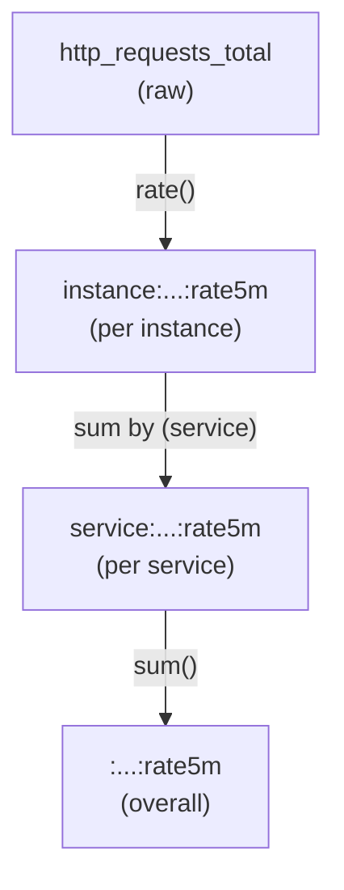

> **Target Audience**: Operators and SREs experiencing dashboard performance issues
> **Prerequisites**: [histogram_quantile]()
> **What You'll Learn**: Improve query performance with Recording Rules and manage complex metrics

## TL;DR


**Key Summary:**
- Recording Rules **save query results as new metrics**
- Pre-compute complex queries to improve dashboard/alert performance
- Naming: `level:metric:operations` pattern recommended
- Define frequently used aggregations as Rules


## Why Recording Rules are Needed

### Problem: Repeatedly Executing Complex Queries

```promql
# Executed every 15 seconds on dashboard
histogram_quantile(0.99,
  sum by (service, le) (
    rate(http_request_duration_seconds_bucket[5m])
  )
)
```

**Issues:**
- Slow dashboard loading (calculated every time)
- Duplicate queries across multiple panels
- Increased Prometheus load

### Solution: Recording Rules

```yaml
# Pre-calculate and store
groups:
  - name: latency
    rules:
      - record: service:http_request_duration_seconds:p99
        expr: |
          histogram_quantile(0.99,
            sum by (service, le) (
              rate(http_request_duration_seconds_bucket[5m])
            )
          )
```

```promql
# Simply query on dashboard
service:http_request_duration_seconds:p99
```

---

## Basic Syntax

### Rules File Structure

```yaml
groups:
  - name: <group_name>
    interval: <evaluation_period>  # Optional, defaults to global.evaluation_interval
    rules:
      - record: <new_metric_name>
        expr: <PromQL_expression>
        labels:
          <additional_label>: <value>
```

### Prometheus Configuration

```yaml
# prometheus.yml
rule_files:
  - "rules/*.yml"
  - "alerts/*.yml"
```

### Basic Example

```yaml
# rules/latency.yml
groups:
  - name: latency_rules
    interval: 30s
    rules:
      # P99 response time
      - record: service:http_request_duration_seconds:p99
        expr: |
          histogram_quantile(0.99,
            sum by (service, le) (
              rate(http_request_duration_seconds_bucket[5m])
            )
          )

      # P50 response time
      - record: service:http_request_duration_seconds:p50
        expr: |
          histogram_quantile(0.5,
            sum by (service, le) (
              rate(http_request_duration_seconds_bucket[5m])
            )
          )
```

---

## Naming Convention

### Recommended Pattern

```
level:metric:operations
```

| Component | Description | Example |
|-----------|-------------|---------|
| `level` | Aggregation level (label) | `job`, `service`, `instance` |
| `metric` | Original metric name | `http_requests_total` |
| `operations` | Applied operations | `rate5m`, `p99`, `sum` |

### Examples

```yaml
# Requests per second by service
job:http_requests_total:rate5m

# P99 response time by service
service:http_request_duration_seconds:p99

# Error rate by instance
instance:http_requests_errors:ratio_rate5m

# Overall system CPU usage
:node_cpu_utilization:avg
```


**If no level, start with colon:** Overall system aggregations use `:metric:operation` format.


---

## Practical Patterns

### 1. Pre-compute Error Rates

```yaml
groups:
  - name: error_rates
    rules:
      # Error rate by service
      - record: service:http_requests_errors:ratio_rate5m
        expr: |
          sum by (service) (rate(http_requests_total{status=~"5.."}[5m]))
          / sum by (service) (rate(http_requests_total[5m]))

      # Overall error rate
      - record: :http_requests_errors:ratio_rate5m
        expr: |
          sum(rate(http_requests_total{status=~"5.."}[5m]))
          / sum(rate(http_requests_total[5m]))
```

### 2. Response Time Percentiles

```yaml
groups:
  - name: latency_percentiles
    rules:
      - record: service:http_request_duration_seconds:p50
        expr: |
          histogram_quantile(0.5,
            sum by (service, le) (rate(http_request_duration_seconds_bucket[5m]))
          )

      - record: service:http_request_duration_seconds:p90
        expr: |
          histogram_quantile(0.9,
            sum by (service, le) (rate(http_request_duration_seconds_bucket[5m]))
          )

      - record: service:http_request_duration_seconds:p99
        expr: |
          histogram_quantile(0.99,
            sum by (service, le) (rate(http_request_duration_seconds_bucket[5m]))
          )
```

### 3. Resource Utilization

```yaml
groups:
  - name: resource_utilization
    rules:
      # CPU usage
      - record: instance:node_cpu_utilization:ratio
        expr: |
          1 - avg by (instance) (
            rate(node_cpu_seconds_total{mode="idle"}[5m])
          )

      # Memory usage
      - record: instance:node_memory_utilization:ratio
        expr: |
          1 - (
            node_memory_MemAvailable_bytes
            / node_memory_MemTotal_bytes
          )

      # Disk usage
      - record: instance:node_filesystem_utilization:ratio
        expr: |
          1 - (
            node_filesystem_avail_bytes{mountpoint="/"}
            / node_filesystem_size_bytes{mountpoint="/"}
          )
```

### 4. SLI Calculation

```yaml
groups:
  - name: sli
    rules:
      # Availability (successful request ratio)
      - record: service:http_requests_availability:ratio_rate5m
        expr: |
          sum by (service) (rate(http_requests_total{status!~"5.."}[5m]))
          / sum by (service) (rate(http_requests_total[5m]))

      # Latency SLI (ratio below 500ms)
      - record: service:http_requests_latency_sli:ratio_rate5m
        expr: |
          sum by (service) (rate(http_request_duration_seconds_bucket{le="0.5"}[5m]))
          / sum by (service) (rate(http_request_duration_seconds_count[5m]))
```

---

## Hierarchical Aggregation

### Optimize Performance with Multi-level Aggregation

```yaml
groups:
  - name: hierarchical_aggregation
    rules:
      # Level 1: rate per instance
      - record: instance:http_requests_total:rate5m
        expr: rate(http_requests_total[5m])

      # Level 2: sum by service (using level 1 result)
      - record: service:http_requests_total:rate5m
        expr: sum by (service) (instance:http_requests_total:rate5m)

      # Level 3: overall sum (using level 2 result)
      - record: :http_requests_total:rate5m
        expr: sum(service:http_requests_total:rate5m)
```



---

## Configuration and Management

### File Structure Example

```
prometheus/
├── prometheus.yml
└── rules/
    ├── latency.yml
    ├── errors.yml
    ├── resources.yml
    └── sli.yml
```

### Rule Validation

```bash
# Syntax check
promtool check rules rules/*.yml

# Check expected results
promtool test rules tests.yml
```

### Test File Example

```yaml
# tests.yml
rule_files:
  - rules/latency.yml

evaluation_interval: 1m

tests:
  - interval: 1m
    input_series:
      - series: 'http_request_duration_seconds_bucket{service="api", le="0.1"}'
        values: '0+10x10'
      - series: 'http_request_duration_seconds_bucket{service="api", le="0.5"}'
        values: '0+50x10'
      - series: 'http_request_duration_seconds_bucket{service="api", le="+Inf"}'
        values: '0+100x10'
    promql_expr_test:
      - expr: service:http_request_duration_seconds:p99{service="api"}
        eval_time: 10m
        exp_samples:
          - labels: 'service:http_request_duration_seconds:p99{service="api"}'
            value: 0.495
```

---

## Best Practices

### DO (Recommended)

```yaml
# ✅ Frequently used complex queries
- record: service:http_request_duration_seconds:p99
  expr: histogram_quantile(0.99, sum by (service, le) (...))

# ✅ Hierarchical aggregation
- record: job:http_requests_total:rate5m
  expr: sum by (job) (rate(http_requests_total[5m]))

# ✅ Clear naming
- record: service:http_requests_errors:ratio_rate5m
  expr: ...
```

### DON'T (Not Recommended)

```yaml
# ❌ Simple queries (Rules unnecessary)
- record: job:up:sum
  expr: sum by (job) (up)

# ❌ Too many labels (increases cardinality)
- record: instance_path_method_status:http_requests_total:rate5m
  expr: rate(http_requests_total[5m])

# ❌ Unclear naming
- record: my_custom_metric
  expr: ...
```

---

## Recording Rules vs Alerting Rules

| Aspect | Recording Rules | Alerting Rules |
|--------|-----------------|----------------|
| Purpose | Pre-compute queries | Condition-based alerts |
| Keyword | `record` | `alert` |
| Result | Store new metric | Send to Alertmanager |
| Usage | Dashboard performance | Incident detection |

```yaml
# Recording Rule
- record: service:errors:ratio_rate5m
  expr: sum by (service) (rate(errors_total[5m])) / sum by (service) (rate(requests_total[5m]))

# Alerting Rule (using Recording Rule result)
- alert: HighErrorRate
  expr: service:errors:ratio_rate5m > 0.05
  for: 5m
```

---

## Key Takeaways

| Item | Content |
|------|---------|
| **Purpose** | Pre-compute complex queries |
| **Naming** | `level:metric:operations` |
| **Location** | `rule_files` directory |
| **Validation** | `promtool check rules` |
| **Apply to** | histogram_quantile, complex aggregations, multi-step calculations |

---

## Next Steps

| Recommended Order | Document | What You'll Learn |
|-------------------|----------|-------------------|
| 1 | [Alerting Rules]() | How to write alert rules |
| 2 | [SRE Golden Signals]() | Using Recording Rules |
