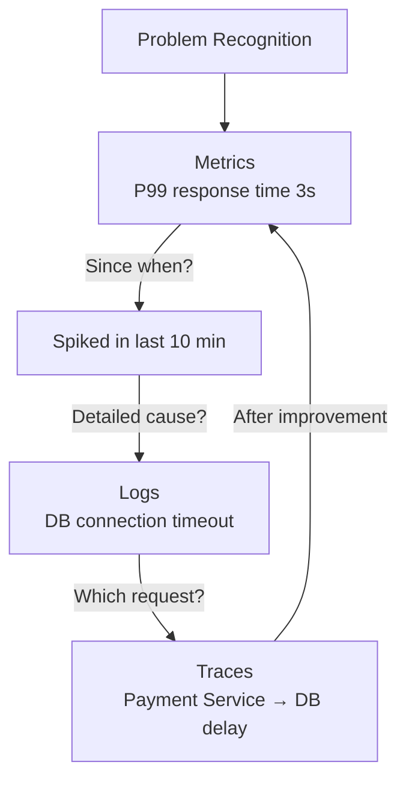
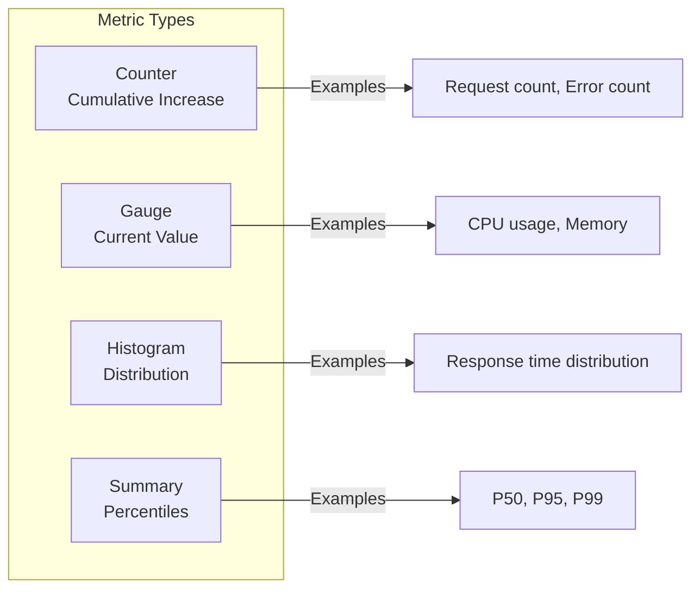
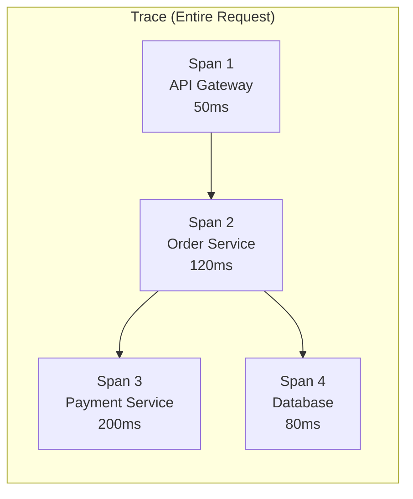
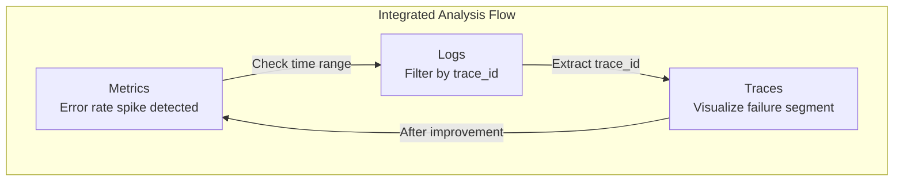

> **Target Audience**: Developers new to Observability concepts
> **Prerequisites**: Basic understanding of web application architecture
> **After Reading**: You'll understand the role of each pillar and know when to use which

## TL;DR


**Key Summary:**
- **Metrics**: "How much?" - Numerically measurable states (CPU 80%, response time 200ms)
- **Logs**: "What happened?" - Detailed records of individual events
- **Traces**: "From where to where?" - Tracking the entire path of a request
- The 3 pillars are **complementary**, most effective when used together


## Why Are All Three Pillars Necessary?

**Analogy: A Doctor's Diagnostic Process**

When a patient complains "My stomach hurts," how does the doctor diagnose?

1. **Temperature, blood pressure, pulse measurement** (= Metrics): "Fever 38.5°C, blood pressure normal" → Understanding state through numbers
2. **Interview and symptom recording** (= Logs): "Started 3 days ago, worsens after meals" → Collecting detailed context
3. **CT/X-ray imaging** (= Traces): "Inflammation confirmed in appendix area" → Visualizing problem location

**Diagnosis is impossible with just one.** You can't know it's appendicitis from temperature alone, and you can't pinpoint the exact location from symptom records alone. System observation is the same.

---

### Understanding Through an Actual Incident

Let's analyze a single incident with all 3 pillars.

**Situation**: "Order API response has become slow"



| Step | Used Pillar | Information Gained |
|------|------------|----------|
| 1. Anomaly detection | Metrics | "P99 response time spiked to 3s" |
| 2. Time identification | Metrics | "Started 10 minutes ago" |
| 3. Root cause tracking | Logs | "DB connection pool exhausted, timeout occurred" |
| 4. Path analysis | Traces | "Delay in Payment Service → DB segment" |
| 5. Improvement verification | Metrics | "Response time normalized after connection pool expansion" |


**Each pillar alone has limitations:**
- Metrics only: Know "it's slow" but not "why"
- Logs only: Can see individual events but hard to grasp overall trends
- Traces only: Can see request flow but hard to grasp overall system state


---

## Metrics

### Definition

Metrics are **numerical data measured over time**. They express the system's state in numbers.

### Why Are Metrics Necessary?

If logs record "what happened," metrics tell you **"how healthy is the system right now."**

**Analogy: Car Dashboard**

When the engine warning light comes on while driving, you immediately know "there's a problem." You don't need to read the engine logs one by one. Metrics let you grasp the system's health status **at a glance**.

The core value of metrics is **aggregation and trend analysis**. Questions like "How has the average response time changed over the last hour?" or "What's the traffic difference between 10 AM today and yesterday?" can be answered immediately.

### Characteristics

| Property | Description |
|------|------|
| **Aggregatable** | Statistical operations like sum, avg, percentile possible |
| **Storage efficient** | Small footprint as only numbers are stored |
| **Time series** | Can identify trends based on time axis |
| **Alert-suitable** | Can set automatic alerts based on thresholds |

### Metric Types



### Examples

```promql
# CPU usage (Gauge)
node_cpu_seconds_total

# Requests per second (Counter → converted with rate)
rate(http_requests_total[5m])

# P99 response time (Histogram)
histogram_quantile(0.99, rate(http_request_duration_seconds_bucket[5m]))
```

### When to Use?

- System state monitoring (CPU, memory, disk)
- SLA/SLO measurement (response time, availability)
- Trend analysis (traffic patterns, growth rate)
- Alert condition settings

---

## Logs

### Definition

Logs are **text records of individual events**. They record in detail what happened at a specific point in time.

### Why Are Logs Necessary?

If metrics tell you "CPU is at 90%," logs tell you **"why it's at 90%."**

**Analogy: Dashcam Recording**

When a car accident happens, knowing just the fact "a collision occurred" (= metrics) doesn't reveal the cause. Watching the dashcam footage (= logs) reveals **context** like "the car ahead suddenly braked" or "ran a red light."

The core value of logs is **detailed context and debugging information**. When an error occurs, you can trace "which user," "with what request," "sending what data" caused the problem.

### Characteristics

| Property | Description |
|------|------|
| **Detailed** | Contains context and details of events |
| **Searchable** | Can filter by keywords, patterns |
| **Unstructured** | Free-form text (structured logs recommended) |
| **Storage cost** | Large footprint due to text volume |

### Log Levels

```
DEBUG   → Detailed info during development
INFO    → Normal operation records
WARN    → Potential problem warnings
ERROR   → Error occurred
FATAL   → System-stopping level errors
```

### Structured Log Example

```json
{
  "timestamp": "2026-01-12T10:30:00Z",
  "level": "ERROR",
  "service": "order-service",
  "trace_id": "abc123",
  "message": "Order creation failed",
  "error": "Out of stock",
  "order_id": "ORD-456",
  "user_id": "USR-789"
}
```


**Advantages of Structured Logs:**
- Easy field-by-field search/filtering
- Connect with distributed tracing via Trace ID
- Automatic parsing and dashboard creation possible


### When to Use?

- Detailed error cause analysis
- Debugging and problem reproduction
- Audit records
- Abnormal pattern detection

---

## Traces

### Definition

Traces record **the entire path a request takes through a distributed system**. They track a single request as it passes through multiple services.

### Why Are Traces Necessary?

In a microservices environment, a single request can pass through 5, 10, or even 20 services. When you see a metric showing "response is slow," **how do you know which service caused the delay?**

**Analogy: Package Tracking System**

When you order something online, you can see the path "distribution center → regional hub → delivery driver → delivered" through "delivery tracking." If delivery is delayed, you can immediately see **which segment it's stuck in**.

Traces are the "delivery tracking" for requests. They measure the time taken in each segment of the path from API Gateway → Order Service → Payment Service → Database. If Payment Service took 2 seconds, you can focus your analysis on that cause.

### Core Concepts



| Term | Description |
|------|------|
| **Trace** | Entire path of one request (composed of multiple Spans) |
| **Span** | Single unit of work (includes start/end time, metadata) |
| **Trace ID** | Unique ID identifying the entire request |
| **Span ID** | ID identifying individual operations |
| **Parent Span** | Upper Span that called the current Span |

### Context Propagation

The method of passing Trace ID between services.

```
HTTP Header example:
traceparent: 00-abc123-def456-01

W3C Trace Context format:
version-trace_id-span_id-flags
```

### When to Use?

- Identifying delay segments between microservices
- Visualizing the entire flow of specific requests
- Analyzing dependencies between services
- Identifying bottleneck points

---

## Connecting the Three Pillars

### Connection via Trace ID



### Practical Example: Order Failure Analysis

**1. Detect Anomaly in Metrics**

```promql
# Error rate exceeds 5%
sum(rate(http_requests_total{status="500"}[5m]))
/ sum(rate(http_requests_total[5m])) > 0.05
```

**2. Search Logs for That Time Period**

```
level:ERROR AND service:order-service AND timestamp:[2026-01-12T10:00 TO 2026-01-12T10:30]
```

Found `trace_id: abc123` in results

**3. Check Entire Path with Trace**

```
Trace ID: abc123
├─ API Gateway (10ms) ✓
├─ Order Service (50ms) ✓
├─ Payment Service (2000ms) ✗ ← bottleneck
└─ Inventory Service (30ms) ✓
```

**4. Conclusion**: Payment Service external API call delay

---

## Tool Selection Guide

| Pillar | Open Source Tools | Cloud Services |
|------|-------------|---------------|
| **Metrics** | Prometheus, VictoriaMetrics | CloudWatch, Datadog |
| **Logs** | Loki, Elasticsearch | CloudWatch Logs, Splunk |
| **Traces** | Jaeger, Tempo | X-Ray, Datadog APM |
| **Integration** | OpenTelemetry | Datadog, New Relic |


**OpenTelemetry** unifies all three pillars into a single standard. For new projects, adopting OpenTelemetry is recommended.


---

## Trade-offs

| Pillar | Advantages | Disadvantages |
|------|------|------|
| **Metrics** | Storage efficient, alert-suitable | Lacks detailed context |
| **Logs** | Provides detailed context | High storage cost, analysis difficult |
| **Traces** | Understand distributed system flow | Complex implementation, sampling needed |

### Cost Optimization Strategies

1. **Metrics**: Measure everything (inexpensive)
2. **Logs**: Long-term retention only for ERROR and above, short-term for DEBUG
3. **Traces**: Apply sampling (1~10% of total)

---

## Key Summary

| Question | Metrics | Logs | Traces |
|------|---------|------|--------|
| **What?** | Numerical data | Event records | Request paths |
| **When?** | State monitoring | Cause analysis | Flow tracking |
| **Strength?** | Trends, alerts | Detailed context | Distributed systems |

---

## Next Steps

| Recommended Order | Document | What You'll Learn |
|----------|------|----------|
| 1 | [Metrics Fundamentals](metrics-fundamentals/) | Counter, Gauge, Histogram types |
| 2 | [Log Aggregation](log-aggregation/) | Loki vs ELK comparison |
| 3 | [Distributed Tracing](distributed-tracing/) | Span, Context Propagation |
