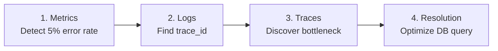
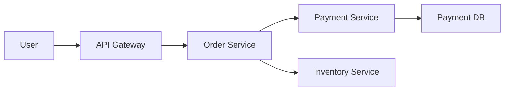

> **Time Required**: 30 minutes
> **Prerequisites**: [Spring Boot Metrics]()
> **What You'll Learn**: Track issues by connecting the three pillars (Metrics, Logs, Traces)

## Goal

"Error rate spike" → "Find trace_id in logs" → "Identify root cause with traces"



## Scenario: Order Service Failure Analysis

### System Architecture



## Step 1: Failure Detection (Metrics)

### Grafana Alert Triggered

```
Alert: HighErrorRate
Service: order-service
Error Rate: 5.2%
Threshold: 1%
```

### Check Dashboard

```promql
# Confirm error rate spike
sum(rate(http_server_requests_seconds_count{application="order-service",status=~"5.."}[5m]))
/ sum(rate(http_server_requests_seconds_count{application="order-service"}[5m]))

# Which endpoint?
sum by (uri) (rate(http_server_requests_seconds_count{application="order-service",status=~"5.."}[5m]))
```

**Result**: Errors occurring on `/orders` POST endpoint

## Step 2: Log Analysis (Logs)

### Search Error Logs in Loki

```logql
{app="order-service"} |= "ERROR" | json

# Errors in the last 10 minutes
{app="order-service"} | json | level="ERROR"

# Specific endpoint
{app="order-service"} |= "/orders" |= "ERROR"
```

### Log Results

```json
{
  "timestamp": "2026-01-12T10:30:00Z",
  "level": "ERROR",
  "service": "order-service",
  "message": "Payment processing failed",
  "traceId": "abc123def456",
  "spanId": "span001",
  "error": "Connection timeout",
  "user_id": "user-789"
}
```

**Key Information**: `traceId: abc123def456`

## Step 3: Trace Analysis (Traces)

### Search by Trace ID in Tempo

1. Grafana → Explore → Tempo
2. Search TraceID: `abc123def456`

### Trace Results

```
Trace: abc123def456 (Total: 3500ms)
├─ order-service: POST /orders (3500ms)
│   ├─ validateOrder (10ms) ✓
│   ├─ checkInventory (50ms) ✓
│   └─ processPayment (3400ms) ✗
│       ├─ payment-service: /process (3400ms)
│       │   └─ DB Query (3300ms) ← Bottleneck!
```

**Discovery**: Payment DB query taking 3.3 seconds

## Step 4: Root Cause Analysis

### Check DB Metrics

```promql
# DB connection utilization
hikaricp_connections_active{application="payment-service"}
/ hikaricp_connections_max{application="payment-service"}

# Slow queries
rate(pg_stat_statements_total_time_seconds_sum[5m])
/ rate(pg_stat_statements_calls_total[5m])
```

**Result**: Connection pool saturated + specific query slow

### Resolution

1. Add DB index
2. Increase connection pool size
3. Optimize query

## Integrated Configuration

### Link Grafana Datasources

```yaml
# grafana/provisioning/datasources/datasources.yml
apiVersion: 1
datasources:
  - name: Prometheus
    type: prometheus
    url: http://prometheus:9090
    isDefault: true

  - name: Loki
    type: loki
    url: http://loki:3100
    jsonData:
      derivedFields:
        - name: traceId
          matcherRegex: '"traceId":"([^"]+)"'
          url: '$${__value.raw}'
          datasourceUid: tempo

  - name: Tempo
    type: tempo
    url: http://tempo:3200
    jsonData:
      tracesToLogsV2:
        datasourceUid: loki
        filterByTraceID: true
        filterBySpanID: true
      tracesToMetrics:
        datasourceUid: prometheus
```

### Logs → Traces Connection

Click `traceId` field in Loki to navigate to Tempo

### Traces → Logs Connection

Click Span in Tempo to display Loki logs for that time range

### Traces → Metrics Connection

Click service in Tempo to display Prometheus metrics

## Dashboard Template

### Unified Dashboard

```
┌─────────────────────────────────────────────────────────────┐
│ Row 1: Core Metrics (Prometheus)                             │
│ [P99 Latency] [RPS] [Error Rate] [Active Traces]            │
├─────────────────────────────────────────────────────────────┤
│ Row 2: Error Logs (Loki)                                     │
│ Live tail: {app=~".*"} | json | level="ERROR"               │
├─────────────────────────────────────────────────────────────┤
│ Row 3: Recent Traces (Tempo)                                 │
│ Table: Recent traces with errors                            │
├─────────────────────────────────────────────────────────────┤
│ Row 4: Service Map (Tempo)                                   │
│ Service dependency graph                                     │
└─────────────────────────────────────────────────────────────┘
```

## Alert → Analysis Workflow

### 1. Receive Alert

```yaml
# Alertmanager → Slack
Alert: HighErrorRate
Service: order-service
Dashboard: https://grafana/d/order-service
Runbook: https://wiki/runbook/high-error-rate
```

### 2. Check Dashboard

- Verify error rate, P99
- Identify affected endpoints

### 3. Search Logs

```logql
{app="order-service"} | json | level="ERROR" | line_format "{{.traceId}}: {{.message}}"
```

### 4. Analyze Traces

- Verify entire path with Trace ID
- Identify slow Spans

### 5. Take Action

- Resolve root cause
- Verify improvement with metrics

---

## Verification Checklist

- [ ] All three pillars being collected
- [ ] Loki → Tempo connection working
- [ ] Tempo → Loki connection working
- [ ] Tempo → Prometheus connection working
- [ ] Unified dashboard configured

---

## Next Steps

| Recommended Order | Document | What You'll Learn |
|----------|------|----------|
| 1 | [Debugging High Latency]() | Problem resolution |
| 2 | [Post-Alert Action Guide]() | Response methods |
