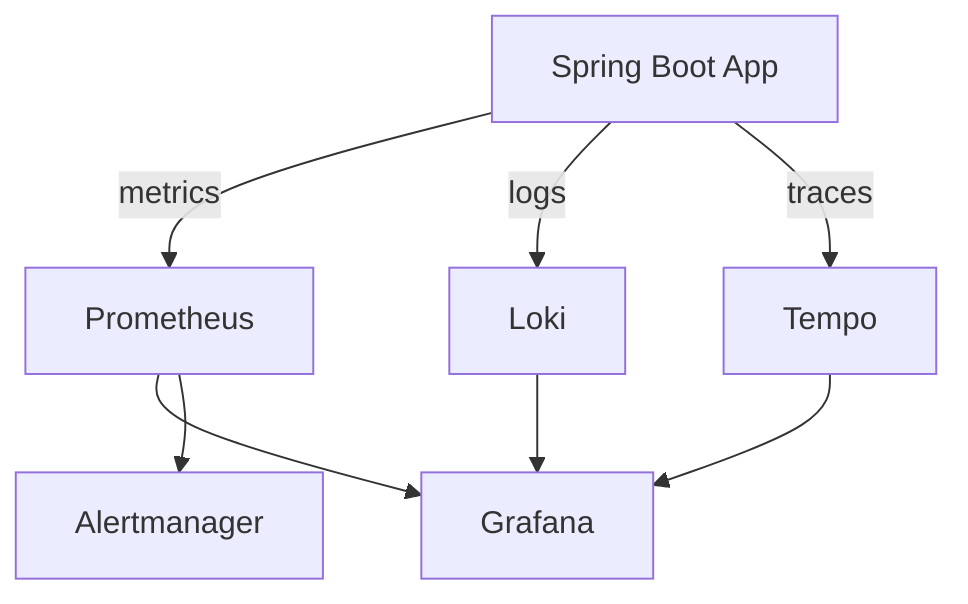

> **Time Required**: 15 minutes
> **Prerequisites**: Docker, Docker Compose basics
> **What You'll Learn**: Build a complete observability stack locally

## Overall Architecture



*This diagram shows the overall architecture where a Spring Boot app sends data to Prometheus (metrics), Loki (logs), and Tempo (traces), with Grafana providing unified visualization.*
## Step 1: Create Directory Structure

```bash
mkdir -p observability-stack/{prometheus/rules,grafana/{provisioning/datasources,provisioning/dashboards,dashboards},loki,promtail}
cd observability-stack
```

## Step 2: Write Docker Compose

```yaml
# docker-compose.yml
services:
  # Metrics collection
  prometheus:
    image: prom/prometheus:v2.50.0
    container_name: prometheus
    ports:
      - "9090:9090"
    volumes:
      - ./prometheus/prometheus.yml:/etc/prometheus/prometheus.yml
      - ./prometheus/rules:/etc/prometheus/rules
      - prometheus-data:/prometheus
    command:
      - '--config.file=/etc/prometheus/prometheus.yml'
      - '--storage.tsdb.path=/prometheus'
      - '--web.enable-lifecycle'
      - '--web.enable-remote-write-receiver'

  # Alert management
  alertmanager:
    image: prom/alertmanager:v0.26.0
    container_name: alertmanager
    ports:
      - "9093:9093"
    volumes:
      - ./alertmanager/alertmanager.yml:/etc/alertmanager/alertmanager.yml

  # Visualization
  grafana:
    image: grafana/grafana:10.3.0
    container_name: grafana
    ports:
      - "3000:3000"
    environment:
      - GF_SECURITY_ADMIN_PASSWORD=admin
      - GF_AUTH_ANONYMOUS_ENABLED=true
      - GF_AUTH_ANONYMOUS_ORG_ROLE=Viewer
    volumes:
      - ./grafana/provisioning:/etc/grafana/provisioning
      - ./grafana/dashboards:/var/lib/grafana/dashboards
      - grafana-data:/var/lib/grafana

  # Log collection
  loki:
    image: grafana/loki:2.9.0
    container_name: loki
    ports:
      - "3100:3100"
    volumes:
      - ./loki/loki.yml:/etc/loki/local-config.yaml
      - loki-data:/loki
    command: -config.file=/etc/loki/local-config.yaml

  # Log agent
  promtail:
    image: grafana/promtail:2.9.0
    container_name: promtail
    volumes:
      - ./promtail/promtail.yml:/etc/promtail/config.yml
      - /var/log:/var/log:ro
      - /var/lib/docker/containers:/var/lib/docker/containers:ro
    command: -config.file=/etc/promtail/config.yml

  # Distributed tracing
  tempo:
    image: grafana/tempo:2.3.0
    container_name: tempo
    ports:
      - "4317:4317"   # OTLP gRPC
      - "4318:4318"   # OTLP HTTP
      - "3200:3200"   # Tempo API
    volumes:
      - ./tempo/tempo.yml:/etc/tempo/config.yaml
      - tempo-data:/var/tempo
    command: -config.file=/etc/tempo/config.yaml

volumes:
  prometheus-data:
  grafana-data:
  loki-data:
  tempo-data:
```

## Step 3: Prometheus Configuration

```yaml
# prometheus/prometheus.yml
global:
  scrape_interval: 15s
  evaluation_interval: 15s

alerting:
  alertmanagers:
    - static_configs:
        - targets:
          - alertmanager:9093

rule_files:
  - /etc/prometheus/rules/*.yml

scrape_configs:
  - job_name: 'prometheus'
    static_configs:
      - targets: ['localhost:9090']

  - job_name: 'spring-app'
    metrics_path: '/actuator/prometheus'
    static_configs:
      - targets: ['host.docker.internal:8080']
```

## Step 4: Loki Configuration

```yaml
# loki/loki.yml
auth_enabled: false

server:
  http_listen_port: 3100

common:
  path_prefix: /loki
  storage:
    filesystem:
      chunks_directory: /loki/chunks
      rules_directory: /loki/rules
  replication_factor: 1
  ring:
    instance_addr: 127.0.0.1
    kvstore:
      store: inmemory

schema_config:
  configs:
    - from: 2020-10-24
      store: boltdb-shipper
      object_store: filesystem
      schema: v11
      index:
        prefix: index_
        period: 24h

limits_config:
  retention_period: 168h
```

## Step 5: Promtail Configuration

```yaml
# promtail/promtail.yml
server:
  http_listen_port: 9080

positions:
  filename: /tmp/positions.yaml

clients:
  - url: http://loki:3100/loki/api/v1/push

scrape_configs:
  - job_name: containers
    static_configs:
      - targets:
          - localhost
        labels:
          job: containerlogs
          __path__: /var/lib/docker/containers/*/*log

    pipeline_stages:
      - json:
          expressions:
            output: log
            stream: stream
            attrs:
      - json:
          expressions:
            tag:
          source: attrs
      - regex:
          expression: (?P<container_name>(?:[^|]*[^|]))
          source: tag
      - labels:
          container_name:
          stream:
```

## Step 6: Tempo Configuration

```yaml
# tempo/tempo.yml
server:
  http_listen_port: 3200

distributor:
  receivers:
    otlp:
      protocols:
        grpc:
          endpoint: 0.0.0.0:4317
        http:
          endpoint: 0.0.0.0:4318

storage:
  trace:
    backend: local
    local:
      path: /var/tempo/traces
    wal:
      path: /var/tempo/wal

metrics_generator:
  registry:
    external_labels:
      source: tempo
  storage:
    path: /var/tempo/generator/wal
    remote_write:
      - url: http://prometheus:9090/api/v1/write
        send_exemplars: true
```

## Step 7: Grafana Datasource Configuration

```yaml
# grafana/provisioning/datasources/datasources.yml
apiVersion: 1
datasources:
  - name: Prometheus
    type: prometheus
    access: proxy
    url: http://prometheus:9090
    isDefault: true

  - name: Loki
    type: loki
    access: proxy
    url: http://loki:3100

  - name: Tempo
    type: tempo
    access: proxy
    url: http://tempo:3200
    jsonData:
      tracesToLogsV2:
        datasourceUid: loki
        filterByTraceID: true
      tracesToMetrics:
        datasourceUid: prometheus
      serviceMap:
        datasourceUid: prometheus
```

## Step 8: Alertmanager Configuration

```bash
mkdir -p alertmanager
```

```yaml
# alertmanager/alertmanager.yml
global:
  resolve_timeout: 5m

route:
  receiver: 'default'
  group_by: ['alertname', 'job']
  group_wait: 30s
  group_interval: 5m
  repeat_interval: 4h

receivers:
  - name: 'default'
    webhook_configs:
      - url: 'http://localhost:5001/'
        send_resolved: true
```

## Step 9: Start the Stack

```bash
docker compose up -d
```

**Expected Output:**
```
[+] Running 7/7
 ✔ Container prometheus    Started
 ✔ Container alertmanager  Started
 ✔ Container grafana       Started
 ✔ Container loki          Started
 ✔ Container promtail      Started
 ✔ Container tempo         Started
```

## Step 10: Verify Status

```bash
docker compose ps
```

**Access URLs:**

| Service | URL | Purpose |
|--------|-----|------|
| Grafana | http://localhost:3000 | Dashboard (admin/admin) |
| Prometheus | http://localhost:9090 | Metrics query |
| Alertmanager | http://localhost:9093 | Alert status |
| Loki | http://localhost:3100 | Log API |
| Tempo | http://localhost:3200 | Trace API |

## Verification Checklist

- [ ] All containers in `Up` state
- [ ] Grafana login successful
- [ ] `up` query returns results in Prometheus
- [ ] Loki datasource selectable in Grafana → Explore
- [ ] Tempo datasource selectable in Grafana → Explore

## Cleanup

```bash
# Stop
docker compose stop

# Remove (keep volumes)
docker compose down

# Complete removal (including volumes)
docker compose down -v
```

---

## Next Steps

| Recommended Order | Document | What You'll Learn |
|----------|------|----------|
| 1 | [Spring Boot Metrics](spring-boot-metrics/) | Application integration |
| 2 | [Kafka Monitoring](kafka-monitoring/) | Kafka observability |
