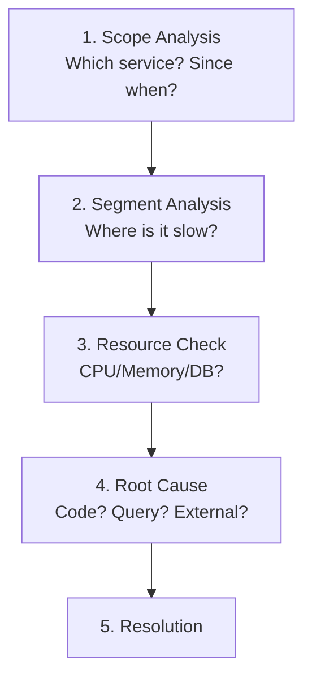

> **Target Scenario**: P99 response time exceeds SLA (500ms)
> **Goal**: Identify and resolve bottlenecks
> **Duration**: 15~30 minutes (depending on problem complexity)
> **Success Criteria**: P99 response time recovers below SLA threshold (500ms)

## Problem Scenario

```
Alert: HighP99Latency
Service: order-service
P99: 2.5s (Threshold: 500ms)
Duration: 10 minutes
```

## Diagnostic Workflow



## Step 1: Scope Analysis

### Check Impact Scope

```promql
# Which service is slow?
topk(5,
  histogram_quantile(0.99,
    sum by (service, le) (rate(http_request_duration_seconds_bucket[5m]))
  )
)

# Since when did it become slow?
histogram_quantile(0.99,
  sum by (le) (rate(http_request_duration_seconds_bucket{service="order-service"}[5m]))
)
# → Time range: Last 1 hour
```

### Check Specific Endpoints

```promql
# P99 by endpoint
histogram_quantile(0.99,
  sum by (uri, le) (rate(http_request_duration_seconds_bucket{service="order-service"}[5m]))
)
```

**Result**: `/orders` POST endpoint is slow

## Step 2: Segment Analysis (Tracing)

### Find Slow Traces

1. Grafana → Explore → Tempo
2. Filter by Duration > 2s
3. Analyze traces

### Trace Analysis Results

```
Trace: abc123 (Total: 2500ms)
├─ order-service: POST /orders (2500ms)
│   ├─ validateRequest (5ms) ✓
│   ├─ checkInventory (30ms) ✓
│   ├─ calculatePrice (10ms) ✓
│   └─ saveOrder (2400ms) ← Bottleneck!
│       └─ DB INSERT (2350ms) ← Root Cause
```

## Step 3: Resource Check

### Service Resources

```promql
# CPU usage
100 - avg by (instance) (rate(node_cpu_seconds_total{mode="idle"}[5m])) * 100

# Memory usage
(1 - node_memory_MemAvailable_bytes / node_memory_MemTotal_bytes) * 100

# GC time
rate(jvm_gc_pause_seconds_sum[5m])
```

### DB Resources

```promql
# DB connection pool usage
hikaricp_connections_active / hikaricp_connections_max * 100

# Pending connections
hikaricp_connections_pending
```

**Result**: DB connection pool at 90% usage, pending connections occurring

## Step 4: Root Cause Analysis

### Check DB Queries

```sql
-- PostgreSQL slow queries
SELECT query, calls, mean_time, total_time
FROM pg_stat_statements
ORDER BY mean_time DESC
LIMIT 10;
```

**Result**: `INSERT INTO orders` query is slow

### Causes

1. Large data volume in table without indexes
2. DB connection pool saturation
3. Transaction lock contention

## Step 5: Resolution

### Immediate Actions

```yaml
# Increase connection pool
spring:
  datasource:
    hikari:
      maximum-pool-size: 20  # Previously 10
```

### Root Solution

```sql
-- Add indexes
CREATE INDEX idx_orders_user_id ON orders(user_id);
CREATE INDEX idx_orders_created_at ON orders(created_at);
```

### Verify Improvements

```promql
# Check P99 changes
histogram_quantile(0.99,
  sum by (le) (rate(http_request_duration_seconds_bucket{service="order-service"}[5m]))
)
```

## Preventive Measures

### Add Alert Rules

```yaml
- alert: DBConnectionPoolHigh
  expr: hikaricp_connections_active / hikaricp_connections_max > 0.8
  for: 5m
  labels:
    severity: warning

- alert: SlowDBQueries
  expr: |
    rate(spring_data_repository_invocations_seconds_sum[5m])
    / rate(spring_data_repository_invocations_seconds_count[5m])
    > 0.5
  for: 5m
  labels:
    severity: warning
```

### Recording Rules

```yaml
- record: service:db_query_duration:avg
  expr: |
    rate(spring_data_repository_invocations_seconds_sum[5m])
    / rate(spring_data_repository_invocations_seconds_count[5m])
```

---

## Common Causes and Solutions

| Cause | Symptoms | Solution |
|------|------|--------|
| Slow DB queries | Specific endpoints only | Indexes, query optimization |
| Connection pool shortage | General slowness | Increase pool size |
| GC | Periodic spikes | Heap tuning |
| External API | Specific calls only | Circuit breaker, timeout |
| CPU saturation | General slowness | Scale out |

---

## Checklist

- [ ] Identify impact scope (service, endpoint)
- [ ] Confirm bottleneck segment via traces
- [ ] Check resource usage
- [ ] Identify root cause
- [ ] Verify metrics normalize after resolution
- [ ] Add preventive alerts
