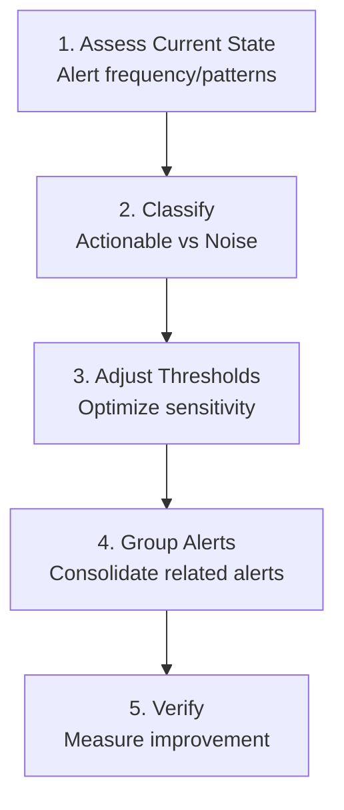

> **Situation**: Receiving dozens to hundreds of alerts daily, missing critical ones
> **Goal**: Only receive alerts that require actual action
> **Time Required**: 1-2 hours (analyzing and modifying alert rules)
> **Success Criteria**: Daily alert count reduced to a manageable level (e.g., 10 or fewer)

## Before You Begin

### Required Environment

| Component | Version | Verification |
|-----------|---------|--------------|
| Prometheus | 2.40+ | `prometheus --version` |
| Alertmanager | 0.25+ | `alertmanager --version` |
| amtool | 0.25+ | `amtool --version` |

### Required Permissions

- Write access to Prometheus configuration file (`prometheus.yml`)
- Write access to Alertmanager configuration file (`alertmanager.yml`)
- Permission to restart Prometheus/Alertmanager

### Environment Check

```bash
# Check Prometheus status
curl -s http://localhost:9090/-/healthy && echo "Prometheus OK"

# Check Alertmanager status
curl -s http://localhost:9093/-/healthy && echo "Alertmanager OK"

# Check amtool configuration
amtool config show --alertmanager.url=http://localhost:9093
```

## Problem Scenario

```
# Yesterday's alert summary
Critical: 15 (HighCPU 8, HighMemory 7)
Warning: 87 (SlowResponse 45, HighLatency 32, PodRestart 10)
Total: 102

# Actual incidents: 1
# Missed alerts: 1 (buried in HighCPU alerts)
```

When alert fatigue occurs:
- Critical alerts get ignored
- Incident response time increases
- Operations team burnout

## Diagnostic Workflow



*This diagram shows the five-step workflow for resolving alert fatigue: from assessing the current state to validation.*
## Step 1: Assess Current State

### Analyze Alert Frequency

```promql
# Alert count over last 7 days
sum(increase(ALERTS{alertstate="firing"}[7d])) by (alertname)

# Top 10 most frequent alerts
topk(10, sum(increase(ALERTS{alertstate="firing"}[7d])) by (alertname))

# Alert patterns by time
sum(rate(ALERTS{alertstate="firing"}[1h])) by (alertname)
```

### Analyze Alert Duration

```promql
# Average duration by alert
avg(
  avg_over_time(ALERTS{alertstate="firing"}[7d])
) by (alertname)
```

### Interpret Results

| Pattern | Meaning | Action |
|---------|---------|--------|
| Same alert 10+ times/day | Threshold issue | Adjust threshold or increase `for` duration |
| Only at night | Batch job related | Time-based threshold or silence |
| Auto-resolves within 5 min | Transient spike | Increase `for` duration |
| Multiple alerts simultaneously | Cascading alerts | Grouping or correlation rules |

## Step 2: Classify Alerts

### Actionability Criteria

Classify all alerts using these criteria:

| Category | Definition | Example | Action |
|----------|------------|---------|--------|
| **Immediate** | Requires human intervention now | Service down, data loss | Keep |
| **Deferred** | Review during business hours | Disk at 70% | Change to Warning |
| **Auto-heal** | System recovers automatically | Temporary CPU spike | Increase `for` duration |
| **Informational** | No action needed, FYI only | Deployment complete | Remove alert, use dashboard |

### Alert Rule Audit

Ask these questions for each alert:

1. What should I do when I receive this alert?
2. Is it acceptable to be woken at 3 AM for this alert?
3. Can this problem be detected without this alert?

## Step 3: Adjust Thresholds

### Increase `for` Duration

```yaml
# Before: Alerts on transient spikes
- alert: HighCPU
  expr: avg(rate(node_cpu_seconds_total{mode="idle"}[1m])) < 0.1
  for: 1m  # Alerts after just 1 minute

# After: Only sustained issues
- alert: HighCPU
  expr: avg(rate(node_cpu_seconds_total{mode="idle"}[5m])) < 0.1
  for: 10m  # Only alerts if persists for 10+ minutes
```


**`for` Duration Guidelines**
- Metrics with frequent spikes: 10-15 minutes
- Stable metrics: 5 minutes
- Requires immediate action: 1-2 minutes


### Use Dynamic Thresholds

```yaml
# Before: Fixed threshold
- alert: HighLatency
  expr: http_request_duration_seconds > 1

# After: Relative threshold based on history
- alert: HighLatency
  expr: |
    http_request_duration_seconds
    >
    avg_over_time(http_request_duration_seconds[7d]) * 1.5
  for: 10m
  annotations:
    description: "Current response time exceeds 1.5x the 7-day average"
```

### Percentile-Based Thresholds

```yaml
# Before: Average-based (sensitive to outliers)
- alert: SlowResponse
  expr: avg(http_request_duration_seconds) > 0.5

# After: P95-based (more stable)
- alert: SlowResponse
  expr: |
    histogram_quantile(0.95,
      sum by (le) (rate(http_request_duration_seconds_bucket[5m]))
    ) > 1
  for: 5m
```

## Step 4: Group Alerts

### Alertmanager Grouping Configuration

```yaml
# alertmanager.yml
route:
  receiver: 'default'
  group_by: ['alertname', 'service']  # Group by service
  group_wait: 30s      # Wait before sending first alert
  group_interval: 5m   # Interval for adding new alerts to group
  repeat_interval: 4h  # Interval for resending same alert

  routes:
    # Critical alerts sent immediately
    - match:
        severity: critical
      receiver: 'pagerduty'
      group_wait: 10s
      repeat_interval: 1h

    # Warning alerts grouped and batched
    - match:
        severity: warning
      receiver: 'slack-warning'
      group_wait: 5m
      group_interval: 10m
      repeat_interval: 12h
```


**Always verify after configuration changes**

```bash
# Validate configuration syntax
amtool check-config alertmanager.yml

# Apply configuration (no restart required)
curl -X POST http://localhost:9093/-/reload
```


### Inhibit Cascading Alerts

```yaml
# alertmanager.yml
inhibit_rules:
  # Suppress related alerts when service is down
  - source_match:
      alertname: 'ServiceDown'
    target_match_re:
      alertname: 'HighLatency|HighErrorRate|SlowResponse'
    equal: ['service']

  # Suppress Warnings when Critical exists for same service
  - source_match:
      severity: 'critical'
    target_match:
      severity: 'warning'
    equal: ['service']
```

### Time-Based Silences

```bash
# Silence alerts during deployment (2 hours)
amtool silence add alertname=~"High.*" \
  --alertmanager.url=http://localhost:9093 \
  --comment="Deployment in progress" \
  --duration=2h

# Silence during scheduled maintenance
amtool silence add service="batch-service" \
  --alertmanager.url=http://localhost:9093 \
  --comment="Scheduled maintenance" \
  --start="2026-01-16T02:00:00Z" \
  --end="2026-01-16T04:00:00Z"
```

## Step 5: Verify

### Measure Improvement

```promql
# Daily alert count (compare before and after)
sum(increase(ALERTS{alertstate="firing"}[24h]))

# Alert quality metric: percentage requiring actual action
# (requires separate labeling)
sum(ALERTS{alertstate="firing", actioned="true"})
/
sum(ALERTS{alertstate="firing"})
```

### Success Criteria Checklist

- [ ] Daily alert count reduced by 50% or more
- [ ] Critical alert action rate at 90% or higher
- [ ] Same alert repeating 5 times or fewer
- [ ] Unnecessary overnight alerts eliminated

## Best Practices

### Alert Design Principles

```yaml
# Good alert example
- alert: OrderProcessingFailed
  expr: |
    rate(order_processing_failures_total[5m])
    > 0.1 * rate(order_processing_total[5m])
  for: 5m
  labels:
    severity: critical
    runbook: "https://wiki.example.com/runbook/order-failures"
  annotations:
    summary: "Order processing failure rate exceeds 10%"
    description: "{{ $labels.service }} order processing failure rate is {{ $value | humanizePercentage }}."
    action: "1. Check logs 2. Verify DB connection 3. Check external API status"
```

**Characteristics of good alerts:**
1. **Actionable**: Clear what needs to be done
2. **Runbook link**: Reference to detailed response procedures
3. **Context provided**: Includes current value and impact scope
4. **Appropriate threshold**: Detects real issues without noise

### Alert Severity Guide

| Severity | Criteria | Response Time | Channel |
|----------|----------|---------------|---------|
| **Critical** | Service outage, data loss risk | Immediate (24/7) | PagerDuty, Phone |
| **Warning** | Performance degradation, capacity approaching limit | Within 4 hours | Slack |
| **Info** | For reference only | Next business day | Email, Dashboard |

## Common Errors

### "No alert rules found"

```
level=warn msg="No alert rules found"
```

**Cause**: Missing rule_files configuration in `prometheus.yml`

**Solution**:
```yaml
# prometheus.yml
rule_files:
  - /etc/prometheus/rules/*.yml
```

### "YAML parsing error"

```
level=error msg="Loading configuration file failed" err="yaml: line 15: did not find expected key"
```

**Cause**: YAML indentation error

**Solution**: Validate YAML syntax before applying
```bash
promtool check rules /etc/prometheus/rules/alerts.yml
```

### "Inhibition rule not working"

**Cause**: The `equal` label doesn't exist on both source and target alerts

**Solution**: Verify the `equal` labels exist on both alerts
```bash
# Check alert labels
amtool alert query --alertmanager.url=http://localhost:9093
```

## Additional Resources

- [Prometheus Alerting Documentation](https://prometheus.io/docs/alerting/latest/overview/)
- [Alertmanager Configuration](https://prometheus.io/docs/alerting/latest/configuration/)
- [Google SRE Book - Alerting](https://sre.google/sre-book/monitoring-distributed-systems/)
- [Rob Ewaschuk - My Philosophy on Alerting](https://docs.google.com/document/d/199PqyG3UsyXlwieHaqbGiWVa8eMWi8zzAn0YfcApr8Q/edit)

---

## Checklist

- [ ] Analyzed alert frequency for last 7 days
- [ ] Classified each alert by actionability
- [ ] Adjusted thresholds or removed noise alerts
- [ ] Configured Alertmanager grouping
- [ ] Added inhibition rules for cascading alerts
- [ ] Validated configuration syntax after changes
- [ ] Verified 50% reduction in alert count
