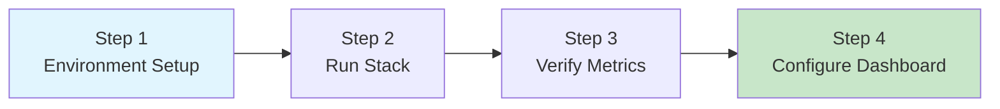

> **Target Audience**: Developers new to Observability
> **Prerequisites**: Basic Docker and Docker Compose usage
> **Time Required**: About 10 minutes
> **After Reading**: You'll be able to collect metrics with Prometheus and visualize them in Grafana

## TL;DR


**Quick Summary:**
1. Run Prometheus + Grafana with Docker Compose
2. Expose metrics from sample application
3. View real-time data in Grafana dashboard
4. Set up simple alerting rules


## Overall Flow



---

## Step 1/4: Environment Setup (2 min)

### Check Required Tools



```bash
docker --version
docker compose version
```


```powershell
docker --version
docker compose version
```



**Expected Output:**
```
Docker version 24.0.0 or higher
Docker Compose version v2.20.0 or higher
```


Make sure Docker Desktop is **running**. If the commands fail, start Docker Desktop and try again.


### Create Project Directory

```bash
mkdir -p observability-quickstart && cd observability-quickstart
```

### Verification Checklist

- [ ] Docker version 24.0.0 or higher displayed
- [ ] Docker Compose version 2.20.0 or higher displayed
- [ ] Navigated to `observability-quickstart` directory

---

## Step 2/4: Run Observability Stack (3 min)

### Create docker-compose.yml

Save the following content as `docker-compose.yml`.

```yaml
services:
  prometheus:
    image: prom/prometheus:v2.50.0
    container_name: prometheus
    ports:
      - "9090:9090"
    volumes:
      - ./prometheus.yml:/etc/prometheus/prometheus.yml
    command:
      - '--config.file=/etc/prometheus/prometheus.yml'
      - '--web.enable-lifecycle'

  grafana:
    image: grafana/grafana:10.3.0
    container_name: grafana
    ports:
      - "3000:3000"
    environment:
      - GF_SECURITY_ADMIN_PASSWORD=admin
      - GF_AUTH_ANONYMOUS_ENABLED=true
      - GF_AUTH_ANONYMOUS_ORG_ROLE=Viewer
    volumes:
      - grafana-data:/var/lib/grafana

  # Node Exporter: Exposes system metrics
  node-exporter:
    image: prom/node-exporter:v1.7.0
    container_name: node-exporter
    ports:
      - "9100:9100"
    restart: unless-stopped

volumes:
  grafana-data:
```

### Create prometheus.yml

```yaml
global:
  scrape_interval: 15s
  evaluation_interval: 15s

scrape_configs:
  - job_name: 'prometheus'
    static_configs:
      - targets: ['localhost:9090']

  - job_name: 'node-exporter'
    static_configs:
      - targets: ['node-exporter:9100']
```

### Run the Stack

```bash
docker compose up -d
```

**Expected Output:**
```
[+] Running 4/4
 ✔ Network observability-quickstart_default  Created
 ✔ Container prometheus                      Started
 ✔ Container grafana                         Started
 ✔ Container node-exporter                   Started
```

### Check Status

```bash
docker compose ps
```

**Expected Output:**
```
NAME            STATUS    PORTS
grafana         Up        0.0.0.0:3000->3000/tcp
prometheus      Up        0.0.0.0:9090->9090/tcp
node-exporter   Up        0.0.0.0:9100->9100/tcp
```


**Port Conflict**: If ports 3000, 9090, or 9100 are already in use, change the port numbers in docker-compose.yml.


### Verification Checklist

- [ ] All 3 containers show `Up` status
- [ ] Prometheus UI displays at http://localhost:9090
- [ ] Grafana login screen displays at http://localhost:3000

---

## Step 3/4: Verify Metrics (3 min)

### Query Metrics in Prometheus UI

1. Open http://localhost:9090 in your browser
2. Enter the following query in the search bar:

```promql
up
```

3. Click the **Execute** button

**Expected Result:**
```
up{instance="localhost:9090", job="prometheus"} 1
up{instance="node-exporter:9100", job="node-exporter"} 1
```


**What is the `up` metric?**
Returns `1` if the target is successfully scraped, `0` if it fails. This is the most basic health check metric.


### Check More Metrics

```promql
node_memory_MemTotal_bytes
```

This query shows the total system memory collected by Node Exporter.

### Visualize in Graph Tab

1. Click the **Graph** tab
2. Enter the following query:

```promql
100 - (node_memory_MemAvailable_bytes / node_memory_MemTotal_bytes * 100)
```

3. Set the time range to **Last 15 minutes**

**Expected Result:** A graph showing memory usage (%) over time is displayed.

### Verification Checklist

- [ ] `up` query returns `1` for 2 targets
- [ ] `node_memory_MemTotal_bytes` query result confirmed
- [ ] Memory usage graph visualized in Graph tab

---

## Step 4/4: Configure Grafana Dashboard (2 min)

### Login to Grafana

1. Open http://localhost:3000
2. Enter login credentials:
   - **Username**: `admin`
   - **Password**: `admin`
3. Click **Skip** on the password change screen (for test environment)

### Add Prometheus Data Source

1. Click **Connections** → **Data sources** from the left menu
2. Click **Add data source** button
3. Select **Prometheus**
4. Enter URL: `http://prometheus:9090`
5. Click **Save & test**

**Expected Result:** "Successfully queried the Prometheus API" message

### Create First Dashboard

1. Click **Dashboards** → **New** → **New Dashboard** from the left menu
2. Click **Add visualization**
3. Select **Prometheus** as the data source
4. Enter query:

```promql
100 - (node_memory_MemAvailable_bytes / node_memory_MemTotal_bytes * 100)
```

5. Click **Run queries**
6. Enter **Memory Usage (%)** for the Title in Panel options
7. Click **Apply** in the top right

### Verification Checklist

- [ ] Grafana login successful
- [ ] Prometheus data source connection successful
- [ ] Graph displayed in first panel

---

## Complete


**Congratulations!** You've successfully built a Prometheus + Grafana based Observability environment.

**What you built:**
- **Prometheus**: Metrics collection and storage
- **Grafana**: Visualization and dashboards
- **Node Exporter**: Host system metrics exposure (CPU, memory, disk, etc.)


## Cleanup

Clean up resources when you're done with the exercise.

```bash
docker compose down -v
```

## Troubleshooting

### Containers Won't Start

```bash
docker compose logs prometheus
```

Check logs to see if there are configuration file errors.

### Grafana Can't Connect to Prometheus

- Verify URL is `http://prometheus:9090` (not localhost)
- Check that Prometheus container is running

### Port Conflict

If a port is already in use:

```bash
lsof -i :9090  # Prometheus
lsof -i :3000  # Grafana
lsof -i :9100  # Node Exporter
```

Terminate the process or change the port in docker-compose.yml.

---

## Next Steps

After completing Quick Start, deepen your understanding with these documents.

| Recommended Order | Document | What You'll Learn |
|----------|------|----------|
| 1 | [Three Pillars of Observability](../concepts/three-pillars/) | Roles of Metrics, Logs, Traces |
| 2 | [Metrics Fundamentals](../concepts/metrics-fundamentals/) | Counter, Gauge, Histogram types |
| 3 | [Prometheus Architecture](../concepts/prometheus-architecture/) | Pull model, time series DB principles |
| 4 | [Spring Boot Example](../examples/spring-boot-metrics/) | Real application integration |
