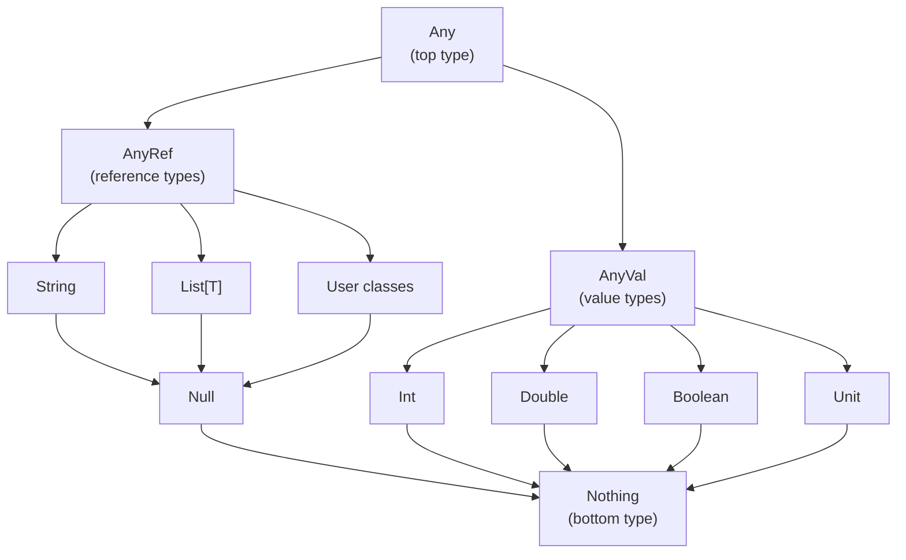

Learn Scala's basic syntax including variable declaration, basic types, and type inference.

## Variables and Constants

In Scala, values are declared using `val` (immutable) or `var` (mutable).

### val - Immutable (Recommended)

Values declared with `val` cannot be reassigned. This is the recommended approach in functional programming.

```scala
val name = "Scala"
val year = 2024
val pi = 3.14159

// Cannot reassign
// name = "Java"  // Compile error!
```

> **Why is immutability good?**
> - Code is easier to predict (values don't change)
> - Safe in concurrent programming
> - Reduces bug potential

### var - Mutable

Values declared with `var` can be reassigned. Use only when necessary.

```scala
var count = 0
count = count + 1  // OK
count += 1         // OK (shorthand)

var message = "Hello"
message = "World"  // OK
```

### Lazy Initialization (lazy val)

`lazy val` delays initialization until first access.

```scala
lazy val expensiveValue = {
  println("Computing...")
  Thread.sleep(1000)
  42
}

println("Declared")
println(expensiveValue)  // "Computing..." prints here
println(expensiveValue)  // Uses cached value, no recomputation
```

## Type System

### Basic Types

Every value in Scala is an object. Java's primitive types are also treated as objects in Scala.

| Type | Description | Example |
|------|-------------|---------|
| `Byte` | 8-bit integer | `val b: Byte = 127` |
| `Short` | 16-bit integer | `val s: Short = 32767` |
| `Int` | 32-bit integer | `val i: Int = 42` |
| `Long` | 64-bit integer | `val l: Long = 1234567890L` |
| `Float` | 32-bit floating point | `val f: Float = 3.14f` |
| `Double` | 64-bit floating point | `val d: Double = 3.14159` |
| `Char` | 16-bit Unicode character | `val c: Char = 'A'` |
| `Boolean` | true/false | `val flag: Boolean = true` |
| `String` | String | `val s: String = "Hello"` |
| `Unit` | No value (similar to void) | `val u: Unit = ()` |

### Type Hierarchy



- **Any**: Top type of all types
- **AnyVal**: Parent of value types (Int, Double, etc.)
- **AnyRef**: Parent of reference types (String, List, user classes, etc.)
- **Null**: Subtype of all reference types (type of `null`)
- **Nothing**: Subtype of all types

#### When is Nothing Used?

`Nothing` is used when a function doesn't return normally:

```scala
// 1. Functions that throw exceptions
def fail(message: String): Nothing =
  throw new RuntimeException(message)

// Nothing is a subtype of all types, so it can be used anywhere
val result: Int = if (true) 42 else fail("error")

// 2. Type of empty collections
val empty: List[Nothing] = Nil  // Can be assigned to List[Int], List[String], etc.

// 3. Type of Option.None
val none: Option[Nothing] = None  // Can be assigned to Option[Int], Option[String], etc.
```

> **Why is this useful?** Because `Nothing` is a subtype of all types, `Nil` or `None` can be used with any type of List or Option.

## Type Inference

The Scala compiler automatically infers types in most cases.

### When Inferred

```scala
val name = "Scala"     // Inferred as String
val count = 42         // Inferred as Int
val pi = 3.14          // Inferred as Double
val flag = true        // Inferred as Boolean
val numbers = List(1, 2, 3)  // Inferred as List[Int]
```

### When Explicit Type Declaration is Needed

```scala
// 1. When you want a specific type
val longNum: Long = 42        // Long instead of Int
val floatNum: Float = 3.14f   // Float instead of Double

// 2. Empty collections
val emptyList: List[Int] = List()
val emptyMap: Map[String, Int] = Map()

// 3. Function parameters (always required)
def greet(name: String): String = s"Hello, $name"

// 4. Return type of recursive functions
def factorial(n: Int): Int =
  if (n <= 1) 1 else n * factorial(n - 1)

// 5. Complex expressions
val result: Either[String, Int] = Right(42)
```

## Strings

### String Interpolation

Scala provides powerful string interpolation features.

**s-interpolation (basic):**

```scala
val name = "Scala"
val version = 3

println(s"$name $version")           // Scala 3
println(s"${name.toUpperCase}")      // SCALA
println(s"1 + 1 = ${1 + 1}")         // 1 + 1 = 2
```

**f-interpolation (formatting):**

```scala
val pi = 3.14159
val count = 42

println(f"pi = $pi%.2f")          // pi = 3.14
println(f"count = $count%05d")    // count = 00042
println(f"hex = $count%x")        // hex = 2a
```

**raw-interpolation (ignore escapes):**

```scala
println(raw"Hello\nWorld")  // Hello\nWorld (no newline)
println(s"Hello\nWorld")    // Hello
                            // World
```

### Multi-line Strings

```scala
val sql = """
  SELECT *
  FROM users
  WHERE age > 18
"""

// Remove leading whitespace with stripMargin
val formatted = """
  |SELECT *
  |FROM users
  |WHERE age > 18
  """.stripMargin
```

## Scala 2 vs Scala 3 Differences

### Basic Syntax

Most basic syntax is the same. Key differences:


{}
```scala
// Indentation-based syntax (optional)
@main def hello() =
  val name = "World"
  println(s"Hello, $name!")

// Braces still work
@main def hello2(): Unit = {
  val name = "World"
  println(s"Hello, $name!")
}
```
{}
{}
```scala
// Braces required
object Main {
  def main(args: Array[String]): Unit = {
    val name = "World"
    println(s"Hello, $name!")
  }
}
```
{}


### Wildcard Import


{}
```scala
import scala.collection.mutable.*
```
{}
{}
```scala
import scala.collection.mutable._
```
{}


## Common Mistakes and Anti-patterns

### What to Avoid

```scala
// 1. Excessive var usage
var list = List(1, 2, 3)
list = list :+ 4  // Creates new list each time - inefficient!

// 2. Using null
val name: String = null  // NullPointerException risk!

// 3. Over-reliance on type inference
val x = if (condition) 1 else "error"  // Inferred as Any

// 4. Ignoring Unit-returning expressions
val result = list.foreach(println)  // result is Unit
```

### The Right Way

```scala
// 1. Use val and immutable operations
val list = List(1, 2, 3)
val newList = list :+ 4  // Assign new list to new val

// 2. Use Option
val name: Option[String] = None

// 3. Specify types for complex expressions
val x: Int | String = if (condition) 1 else "error"  // Scala 3
val x: Either[String, Int] = if (condition) Right(1) else Left("error")

// 4. Clearly mark Unit-returning functions
def printAll(list: List[Int]): Unit = list.foreach(println)
```

## Exercises

### 1. Variable Declaration

Predict the output of this code:

```scala
val x = 10
var y = 20
y = y + x
println(s"x = $x, y = $y")
```

<details>
<summary>Show Answer</summary>

```
x = 10, y = 30
```

`x` is `val` so it stays at 10, `y` is `var` so it changes to 20 + 10 = 30.

</details>

### 2. Type Inference

Infer the types of these variables:

```scala
val a = 42
val b = 3.14
val c = "Hello"
val d = List(1, 2, 3)
val e = Map("a" -> 1, "b" -> 2)
```

<details>
<summary>Show Answer</summary>

- `a`: `Int`
- `b`: `Double`
- `c`: `String`
- `d`: `List[Int]`
- `e`: `Map[String, Int]`

</details>

### 3. String Interpolation

Write code that prints "John is 25 years old." using name and age variables.

<details>
<summary>Show Answer</summary>

```scala
val name = "John"
val age = 25
println(s"$name is $age years old.")
```

</details>

## Next Steps

- [Control Structures](../control-structures/) — if, for, while, match expressions
- [Functions and Methods](../functions-methods/) — Function definition and advanced features
