> **Target Audience**: Developers with experience in Java or other statically typed languages
> **Prerequisites**: Basic concepts of variables, functions, and classes
> **What you'll learn**: Understand the difference between val/var, leverage the type system, and write clean code with string interpolation


- Use **val** (immutable) by default, **var** (mutable) only when necessary
- Scala has powerful **type inference** so you can omit type declarations most of the time
- **String interpolation** (`s"Hello, $name"`) makes string composition simple
- Every value is an object — you can call methods like `1.toString`


#### Why Learn Scala's Basic Syntax?

Scala is 100% compatible with Java while enabling you to write more concise and expressive code. You can write the same logic with less code than Java, and catch more errors at compile time.

```java
// Java: 15 lines
public class Person {
    private final String name;
    private final int age;

    public Person(String name, int age) {
        this.name = name;
        this.age = age;
    }

    public String getName() { return name; }
    public int getAge() { return age; }
    // equals, hashCode, toString omitted...
}
```

```scala
// Scala: 1 line
case class Person(name: String, age: Int)
```

This conciseness is based on Scala's fundamental syntax.

---

#### Variables and Constants

Scala has two ways to declare values: `val` (immutable) and `var` (mutable).

**Understanding with analogy**: `val` is like **a name tag written in permanent marker**. Once attached, it can't be changed. `var` is like **a note on a whiteboard**. You can erase and rewrite it anytime, but it's hard to track who changed it when.

**val - Immutable (Recommended)**

Values declared with `val` cannot be reassigned. This is a core principle of functional programming.

```scala
val name = "Scala"
val year = 2024
val pi = 3.14159

// Cannot reassign
// name = "Java"  // Compilation error!
```

**Why is immutability good?**

| Benefit | Description |
|---------|-------------|
| **Predictability** | Since values don't change, code flow is easier to trace |
| **Thread safety** | Multiple threads can read simultaneously without issues |
| **Easier debugging** | No need to wonder "when did this value change?" |
| **Compiler optimization** | Knowing values are immutable allows the compiler to generate more efficient code |

**var - Mutable**

Values declared with `var` can be reassigned. Use **only when absolutely necessary**.

```scala
var count = 0
count = count + 1  // OK
count += 1         // OK (shorthand)

var message = "Hello"
message = "World"  // OK
```

**When to use var?**

- When accumulating calculations inside performance-critical loops
- When external libraries require mutable state
- When gradually collecting values (Builder pattern)

> ⚠️ **Warning**: Prefer `val` with functional operations (`map`, `fold`, etc.) over `var` when possible.

**Lazy initialization (lazy val)**

`lazy val` is initialized **on first access**. You can defer expensive computations or resource loading until needed.

**Understanding with analogy**: `lazy val` is like **food prepared after ordering**. It's not prepared in advance; cooking starts when a customer orders. Once prepared, the cached food is served for the same order.

```scala
lazy val expensiveValue = {
  println("Computing...")
  Thread.sleep(1000)
  42
}

println("Declared")          // Immediately printed
println(expensiveValue)      // "Computing..." printed here, 1 second wait
println(expensiveValue)      // Cached 42 returned immediately, no recomputation
```


- **val**: Immutable, use by default → `val name = "Scala"`
- **var**: Mutable, use only when necessary → `var count = 0`
- **lazy val**: Lazy initialization, for expensive computations → `lazy val config = loadConfig()`


---

#### Type System

Scala is a statically typed language, but thanks to powerful **type inference**, you don't have to specify types explicitly like in Java.

**Why static typing?**

| Dynamic Types (Python, JS) | Static Types (Scala, Java) |
|----------------------------|----------------------------|
| Type errors found at runtime | Type errors found at compile time |
| Fast prototyping | Safe for large-scale refactoring |
| Limited IDE autocomplete | Powerful IDE support |

Scala provides both the safety of static types and the conciseness of dynamic types.

**Basic Types**

All values in Scala are objects. Even Java's primitive types are treated as objects in Scala.

```scala
val n = 42
n.toString      // "42" - Int is also an object, so methods can be called
n.to(50)        // Range(42, 43, 44, ..., 50)
1.+(2)          // 3 - operators are methods too!
```

| Type | Description | Example |
|------|-------------|---------|
| `Int` | 32-bit integer | `val i = 42` |
| `Long` | 64-bit integer | `val l = 1234567890L` |
| `Double` | 64-bit floating point | `val d = 3.14159` |
| `Boolean` | True/false | `val flag = true` |
| `String` | String | `val s = "Hello"` |
| `Unit` | No value (Java's void) | `val u = ()` |

This table summarizes the most commonly used basic types in Scala. Unlike Java, all types are objects, so you can call methods on them.

**Type Hierarchy**

Scala types have a clear hierarchy.

```mermaid
graph TB
    Any["Any<br>(Top)"]
    AnyVal["AnyVal<br>(Value types)"]
    AnyRef["AnyRef<br>(Reference types)"]

    Any --> AnyVal
    Any --> AnyRef

    Int["Int"]
    Double["Double"]
    Boolean["Boolean"]
    Unit["Unit"]

    AnyVal --> Int
    AnyVal --> Double
    AnyVal --> Boolean
    AnyVal --> Unit

    String["String"]
    List["List&#91;T&#93;"]
    UserClass["User classes"]

    AnyRef --> String
    AnyRef --> List
    AnyRef --> UserClass

    Null["Null"]
    Nothing["Nothing<br>(Bottom)"]

    String --> Null
    List --> Null
    UserClass --> Null

    Null --> Nothing
    Int --> Nothing
    Double --> Nothing
    Boolean --> Nothing
    Unit --> Nothing
```



*This diagram shows Scala's type hierarchy. Any is the top of all types, and Nothing is the bottom of all types. AnyVal is the parent of value types (Int, Double, etc.), and AnyRef is the parent of reference types (String, List, user classes).*

**Understanding with analogy**: The type hierarchy is like **a family tree**. `Any` is the ancestor of all types, and `Nothing` is the descendant of all types. You can put descendants in ancestor positions (polymorphism).

| Type | Role | When do you encounter it? |
|------|------|---------------------------|
| `Any` | Ancestor of all types | When treating multiple types as one |
| `AnyVal` | Parent of value types | Common ancestor of Int, Double, etc. |
| `AnyRef` | Parent of reference types | Same as Java's Object |
| `Null` | Type of null | (Avoid using if possible) |
| `Nothing` | Descendant of all types | Exceptions, empty collections, Option.None |

**When is Nothing used?**

`Nothing` is used for cases that **don't return a value normally**.

```scala
// 1. Function that throws an exception
def fail(message: String): Nothing =
  throw new RuntimeException(message)

// Nothing is a subtype of all types, so it can be used anywhere
val result: Int = if (true) 42 else fail("error")

// 2. Type of empty collection
val empty: List[Nothing] = Nil  // Can be assigned to List[Int], List[String], etc.

// 3. Type of Option.None
val none: Option[Nothing] = None  // Can be assigned to Option[Int], Option[String], etc.
```

**Why is it useful?** Since `Nothing` is a subtype of all types, `Nil` or `None` can be used for any type of list or Option.


- All values are objects — `1.toString`, `true.&&(false)` are possible
- `Any` → `AnyVal`(values) / `AnyRef`(references) → concrete types → `Nothing`
- `Nothing` provides type compatibility for empty collections, None, exceptions, etc.


---

#### Type Inference

The Scala compiler automatically infers types in most cases.

**Java vs Scala Comparison**

```java
// Java: Type specification required
Map<String, List<Integer>> map = new HashMap<String, List<Integer>>();
List<String> names = Arrays.asList("Alice", "Bob");
```

```scala
// Scala: Type inference
val map = Map("a" -> List(1, 2), "b" -> List(3, 4))  // Map[String, List[Int]]
val names = List("Alice", "Bob")                      // List[String]
```

**When types are inferred**

```scala
val name = "Scala"     // Inferred as String
val count = 42         // Inferred as Int
val pi = 3.14          // Inferred as Double
val flag = true        // Inferred as Boolean
val numbers = List(1, 2, 3)  // Inferred as List[Int]
```

**When explicit type declaration is needed**

| Situation | Example | Reason |
|-----------|---------|--------|
| When you want a specific type | `val n: Long = 42` | Need Long instead of Int |
| Empty collections | `val list: List[Int] = List()` | Can't infer without elements |
| Function parameters | `def greet(name: String)` | Always required |
| Recursive function return | `def fact(n: Int): Int = ...` | Can't infer due to self-reference |
| API documentation | `def process(data: Data): Result` | Improves readability |

```scala
// 1. When you want a specific type
val longNum: Long = 42        // Long instead of Int
val floatNum: Float = 3.14f   // Float instead of Double

// 2. Empty collections
val emptyList: List[Int] = List()
val emptyMap: Map[String, Int] = Map()

// 3. Function parameters (always required)
def greet(name: String): String = s"Hello, $name"

// 4. Return type of recursive functions
def factorial(n: Int): Int =
  if (n <= 1) 1 else n * factorial(n - 1)
```


- Types can be omitted in most cases — the compiler infers them
- Explicit specification is needed for empty collections, function parameters, recursive functions
- For public APIs, explicit specification is good for readability


---

#### Strings

Scala provides powerful **String Interpolation** features.

**Java vs Scala Comparison**

```java
// Java: String concatenation
String msg = "Hello, " + name + "! You are " + age + " years old.";
String formatted = String.format("Pi is %.2f", pi);
```

```scala
// Scala: String interpolation
val msg = s"Hello, $name! You are $age years old."
val formatted = f"Pi is $pi%.2f"
```

**s-interpolator: Variable insertion**

The most basic form, inserting variables with the `$` symbol.

```scala
val name = "Scala"
val version = 3

println(s"$name $version")           // Scala 3
println(s"${name.toUpperCase}")      // SCALA (use ${} for expressions)
println(s"1 + 1 = ${1 + 1}")         // 1 + 1 = 2
```

**f-interpolator: Formatting**

Supports printf-style formatting.

```scala
val pi = 3.14159
val count = 42

println(f"pi = $pi%.2f")          // pi = 3.14 (2 decimal places)
println(f"count = $count%05d")    // count = 00042 (5 digits, zero-padded)
println(f"hex = $count%x")        // hex = 2a (hexadecimal)
```

**raw-interpolator: Ignore escapes**

Useful for regular expressions or file paths.

```scala
println(raw"Hello\nWorld")  // Hello\nWorld (no newline)
println(s"Hello\nWorld")    // Hello
                            // World (newline applied)

val regex = raw"\d+\.\d+"   // Write regex without escapes
```

**Multiline Strings**

Use triple quotes (`"""`) for multiline strings.

```scala
val sql = """
  SELECT *
  FROM users
  WHERE age > 18
"""

// stripMargin removes leading whitespace
val formatted = """
  |SELECT *
  |FROM users
  |WHERE age > 18
  """.stripMargin
```

The `stripMargin` method removes everything up to and including the `|` character at the start of each line. This allows you to maintain code indentation while creating clean strings.


- **s-interpolator**: Variable insertion → `s"Hello, $name"`
- **f-interpolator**: Formatting → `f"$price%.2f dollars"`
- **raw-interpolator**: Ignore escapes → `raw"\d+"`
- **Triple quotes**: Multiline → `"""...""".stripMargin`


---

#### Scala 2 vs Scala 3 Differences

Most basic syntax is the same. The biggest differences are indentation-based syntax and entry point definition.

| Feature | Scala 2 | Scala 3 |
|---------|---------|---------|
| Entry point | `object Main { def main(...) }` | `@main def hello()` |
| Block delimiters | Braces required | Indentation-based (optional) |
| Wildcard import | `import pkg._` | `import pkg.*` |
| Type intersection | `with` | `&` |
| Type union | None | `A | B` |

**Basic Syntax**


{}
```scala
// Indentation-based syntax (optional)
@main def hello() =
  val name = "World"
  println(s"Hello, $name!")

// Braces still work
@main def hello2(): Unit = {
  val name = "World"
  println(s"Hello, $name!")
}
```
{}
{}
```scala
// Braces required
object Main {
  def main(args: Array[String]): Unit = {
    val name = "World"
    println(s"Hello, $name!")
  }
}
```
{}


**Wildcard import**


{}
```scala
import scala.collection.mutable.*
```
{}
{}
```scala
import scala.collection.mutable._
```
{}


---

#### Common Mistakes and Solutions

Common mistakes made by Scala beginners and the correct solutions.

| Mistake | Problem | Solution |
|---------|---------|----------|
| Overusing `var` | Hard to track state | Use `val` + functional operations |
| Using `null` | NPE risk | Use `Option` |
| Over-relying on type inference | Inferred as `Any` | Specify types for complex expressions |
| Ignoring `Unit` | Unintended bugs | Check return values |

**What to avoid**

```scala
// 1. Indiscriminate use of var
var list = List(1, 2, 3)
list = list :+ 4  // Creates new list each time - inefficient!

// 2. Using null
val name: String = null  // NullPointerException risk!

// 3. Over-relying on type inference
val x = if (condition) 1 else "error"  // Inferred as Any - type safety lost

// 4. Ignoring expressions returning Unit
val result = list.foreach(println)  // result is Unit - is this intended?
```

**Correct way**

```scala
// 1. Use val with immutable operations
val list = List(1, 2, 3)
val newList = list :+ 4  // Assign new list to new val

// 2. Use Option
val name: Option[String] = None
name.foreach(n => println(s"Hello, $n"))  // Safe access

// 3. Specify types for complex expressions
val x: Either[String, Int] = if (condition) Right(1) else Left("error")

// 4. Clearly mark functions returning Unit
def printAll(list: List[Int]): Unit = list.foreach(println)
```


- ❌ `var` → ✅ `val` + functional operations
- ❌ `null` → ✅ `Option[T]`
- ❌ `Any` inference → ✅ `Either[L, R]` or explicit types


---

#### Exercises

Practice basic syntax with these exercises.

**1. Variable Declaration**

Predict the output of the following code.

```scala
val x = 10
var y = 20
y = y + x
println(s"x = $x, y = $y")
```

<details>
<summary>Show Answer</summary>

```
x = 10, y = 30
```

`x` is `val` so it stays 10, `y` is `var` so it changes to 20 + 10 = 30.

</details>

**2. Type Inference**

Infer the types of the following variables.

```scala
val a = 42
val b = 3.14
val c = "Hello"
val d = List(1, 2, 3)
val e = Map("a" -> 1, "b" -> 2)
```

<details>
<summary>Show Answer</summary>

- `a`: `Int`
- `b`: `Double`
- `c`: `String`
- `d`: `List[Int]`
- `e`: `Map[String, Int]`

</details>

**3. String Interpolation**

Write code that takes a name and age and prints "John is 25 years old."

<details>
<summary>Show Answer</summary>

```scala
val name = "John"
val age = 25
println(s"$name is $age years old.")
```

</details>

---

#### Next Steps

Once you've learned basic syntax, proceed to the next topics.

- [Control Structures](control-structures/) — if, for, while, match expressions
- [Functions and Methods](functions-methods/) — Function definition and advanced features
