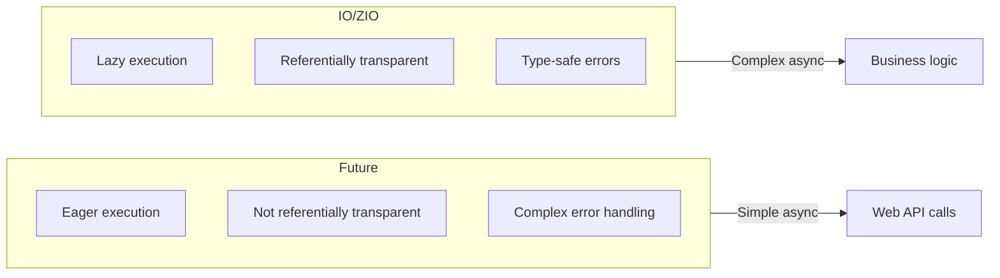


- **Future**: Type representing asynchronous computation results
- **ExecutionContext**: Manages thread pools, passed as implicit parameter
- **map/flatMap**: Compose Futures, can use for comprehension
- **Promise**: Write-only type that can complete Future directly
- Advanced libraries: Cats Effect, ZIO, Akka


**Target Audience:** Developers who understand asynchronous programming basics
**Prerequisites:** Higher-order functions, for comprehension, implicit parameters

Scala supports asynchronous programming through `Future`. This document covers `Future`, `Promise`, and `ExecutionContext`. Through asynchronous programming, you can perform other tasks during I/O wait time, greatly improving application throughput.

#### Future Basics

`Future` represents a value that has not yet been computed or is currently being computed. When you create a Future, computation starts immediately in the background, and you can process results through callbacks or composition methods once ready.

**Creation**

Futures are created with `Future { ... }` blocks. Code within the block executes asynchronously on a separate thread.

```scala
import scala.concurrent.{Future, ExecutionContext}
import scala.concurrent.ExecutionContext.Implicits.global

// Start asynchronous computation
val future: Future[Int] = Future {
  Thread.sleep(1000)  // Long-running operation
  42
}

// Returns immediately, computation proceeds in background
println("Computation started")
```

**ExecutionContext**

`Future` requires an `ExecutionContext` that manages the thread pool. Passed as an implicit parameter, most cases use the global ExecutionContext.

```scala
import scala.concurrent.ExecutionContext.Implicits.global

// Or custom ExecutionContext
import java.util.concurrent.Executors
implicit val ec: ExecutionContext =
  ExecutionContext.fromExecutor(Executors.newFixedThreadPool(4))
```


- Future is created with `Future { ... }` block
- ExecutionContext manages thread pool
- Computation starts in background immediately upon creation


#### Combining Futures

The true power of Future lies in composition. You can connect multiple asynchronous operations through methods like map and flatMap.

**map**

`map` transforms successful results. When Future fails, transformation is not applied and failure propagates.

```scala
val future = Future(42)
val doubled = future.map(_ * 2)  // Future(84)
```

**flatMap**

`flatMap` transforms with a function that returns a Future. Used to connect sequential asynchronous operations.

```scala
def fetchUser(id: Int): Future[String] = Future(s"User$id")
def fetchOrders(user: String): Future[List[String]] =
  Future(List(s"Order1-$user", s"Order2-$user"))

val orders: Future[List[String]] = fetchUser(1).flatMap(fetchOrders)
```

**for comprehension**

Makes flatMap chains more readable. Each `<-` translates to a flatMap call.

```scala
val result = for {
  user <- fetchUser(1)
  orders <- fetchOrders(user)
} yield (user, orders)

// Future(("User1", List("Order1-User1", "Order2-User1")))
```

**Parallel Execution**

Creating Futures within a for comprehension results in sequential execution. For parallel execution, create Futures first then combine results in for comprehension.

```scala
// Sequential execution (for comprehension)
val sequential = for {
  a <- Future(slowComputation1())
  b <- Future(slowComputation2())
} yield a + b

// Parallel execution
val futureA = Future(slowComputation1())
val futureB = Future(slowComputation2())

val parallel = for {
  a <- futureA
  b <- futureB
} yield a + b
```


- `map`: Transform successful result
- `flatMap`: Transform with Future-returning function (sequential connection)
- Future creation in for comprehension = sequential execution
- Create Futures first then compose = parallel execution


#### Error Handling

Future has success or failure states. There are several ways to recover from failed Futures or replace them with alternative Futures.

**recover**

`recover` replaces failure with a default value. Can selectively specify exception types to handle with partial function.

```scala
val future = Future {
  throw new RuntimeException("Error!")
}

val recovered = future.recover {
  case _: RuntimeException => 0
}
// Future(0)
```

**recoverWith**

`recoverWith` replaces failure with another Future. Useful when recovery logic itself is asynchronous.

```scala
val fallback = future.recoverWith {
  case _: RuntimeException => Future(0)
}
```

**failed**

`failed` extracts the exception from a failed Future. `NoSuchElementException` occurs for successful Futures.

```scala
val failure = Future.failed(new Exception("Error"))
val exception: Future[Throwable] = failure.failed
```


- `recover`: Replace failure with default value
- `recoverWith`: Replace failure with another Future
- `failed`: Extract exception from failed Future


#### Awaiting Results

There are cases when you need to wait synchronously for asynchronous results. Mainly used in tests or at application termination points.

**Await (for testing)**

`Await.result` blocks until Future completes. Should only be used in test code and avoided in production.

```scala
import scala.concurrent.Await
import scala.concurrent.duration._

val future = Future(42)
val result = Await.result(future, 5.seconds)  // 42
```

> **Warning:** Avoid using `Await` in production code!

**Callbacks**

`onComplete` executes a callback when Future completes. Can handle both success and failure.

```scala
import scala.util.{Success, Failure}

future.onComplete {
  case Success(value) => println(s"Success: $value")
  case Failure(e)     => println(s"Failure: ${e.getMessage}")
}
```


- `Await.result`: Blocking wait (for testing)
- `onComplete`: Execute callback on completion
- Avoid using Await in production


#### Promise

`Promise` allows you to complete a Future directly. While Future is read-only, Promise is write-only. Promises let you set Future results from external sources.

```scala
import scala.concurrent.Promise

val promise = Promise[Int]()
val future: Future[Int] = promise.future

// Complete from another thread
Future {
  Thread.sleep(1000)
  promise.success(42)  // or promise.failure(exception)
}

// future is now completed
future.foreach(println)  // 42
```

**Use Cases**

Promises are useful for implementing timeouts or wrapping callback-based APIs as Futures.

```scala
def timeout[T](future: Future[T], duration: FiniteDuration): Future[T] = {
  val promise = Promise[T]()

  // Set timeout
  Future {
    Thread.sleep(duration.toMillis)
    promise.tryFailure(new TimeoutException())
  }

  // Connect original Future
  future.onComplete(result => promise.tryComplete(result))

  promise.future
}
```


- Promise is write-only type that can complete Future directly
- Set results with `success`/`failure`
- Useful for timeouts and wrapping callback-based APIs


#### Utility Methods

The Future companion object provides utility methods for combining multiple Futures.

**Future.sequence**

`Future.sequence` converts `List[Future[A]]` to `Future[List[A]]`. Result succeeds only if all Futures succeed.

```scala
val futures: List[Future[Int]] = List(Future(1), Future(2), Future(3))
val combined: Future[List[Int]] = Future.sequence(futures)
// Future(List(1, 2, 3))
```

**Future.traverse**

`Future.traverse` applies an async function to each element in a list. Equivalent to `map` + `sequence` combination.

```scala
val ids = List(1, 2, 3)
val users: Future[List[String]] = Future.traverse(ids)(fetchUser)
// Future(List("User1", "User2", "User3"))
```

**Future.firstCompletedOf**

`Future.firstCompletedOf` returns the first Future to complete. Useful for racing patterns.

```scala
val futures = List(
  Future { Thread.sleep(100); "fast" },
  Future { Thread.sleep(1000); "slow" }
)

val first = Future.firstCompletedOf(futures)
// Future("fast")
```


- `Future.sequence`: `List[Future[A]]` -> `Future[List[A]]`
- `Future.traverse`: Apply async function to list elements
- `Future.firstCompletedOf`: Return first Future to complete


#### Advanced Libraries

The Scala ecosystem has more powerful async libraries than `Future`. They provide superior features for referential transparency, resource management, error handling, etc.

**Cats Effect**

Cats Effect supports pure functional asynchronous programming (dependency: `"org.typelevel" %% "cats-effect" % "3.5.2"`). IO type is lazily evaluated, ensuring referential transparency.

```scala
import cats.effect.{IO, IOApp}
import scala.concurrent.duration.*

object MyApp extends IOApp.Simple:
  val program: IO[Unit] = for
    _ <- IO.println("Hello")
    _ <- IO.sleep(1.second)
    _ <- IO.println("World")
  yield ()

  def run: IO[Unit] = program
```

> Using `IOApp` is recommended over `unsafeRunSync()`.

**ZIO**

ZIO integrates effect systems with dependency injection (dependency: `"dev.zio" %% "zio" % "2.0.19"`). Error types are explicit, enabling type-safe error handling.

```scala
import zio.*

object MyApp extends ZIOAppDefault:
  val program: ZIO[Any, java.io.IOException, Unit] = for
    _ <- Console.printLine("Hello")
    _ <- ZIO.sleep(1.second)
    _ <- Console.printLine("World")
  yield ()

  def run = program
```

**Akka (Classic & Typed)**

Akka provides actor-based concurrency model. Achieves concurrency through message passing without state sharing.

```scala
import akka.actor.typed.*
import akka.actor.typed.scaladsl.*

object HelloWorld {
  final case class Greet(whom: String, replyTo: ActorRef[Greeted])
  final case class Greeted(whom: String)

  def apply(): Behavior[Greet] = Behaviors.receive { (context, message) =>
    context.log.info("Hello {}!", message.whom)
    message.replyTo ! Greeted(message.whom)
    Behaviors.same
  }
}
```

#### Best Practices

Guidelines for avoiding common mistakes in asynchronous programming.

**DO**

Following these practices enables writing stable asynchronous code.

- Use Future for asynchronous operations
- Manage ExecutionContext explicitly
- Always include error handling
- Leverage parallel execution when possible

**DON'T**

These are anti-patterns that must be avoided.

- Never use `Await.result` in production
- Avoid infinite blocking
- Don't swallow exceptions inside Future

#### Common Mistakes and Anti-patterns

Common mistakes when using Future and correct alternatives.

**❌ What to Avoid**

These codes can cause performance issues or bugs.

```scala
import scala.concurrent.{Future, Await}
import scala.concurrent.duration._
import scala.concurrent.ExecutionContext.Implicits.global

// 1. Using Await.result in production
val result = Await.result(future, 5.seconds)  // Blocking! Thread waste

// 2. Blocking operations inside Future
Future {
  Thread.sleep(10000)  // Risk of thread pool exhaustion
  Await.result(anotherFuture, 5.seconds)  // Possible deadlock!
}

// 3. Unintentional sequential execution
for {
  a <- Future(compute1())  // Runs first
  b <- Future(compute2())  // Runs after a completes (sequential!)
} yield a + b

// 4. Ignoring exceptions
future.foreach(println)  // Nothing happens on failure!
```

**✅ The Right Way**

Correct patterns solving the above problems.

```scala
// 1. Use callbacks or composition
future.map(process).recover {
  case e: Exception => defaultValue
}

// 2. Use separate ExecutionContext for blocking operations
val blockingEc = ExecutionContext.fromExecutor(
  Executors.newCachedThreadPool()
)
Future {
  blocking {  // Mark as blocking
    Thread.sleep(10000)
  }
}(blockingEc)

// 3. Explicit parallel execution
val futureA = Future(compute1())  // Starts immediately
val futureB = Future(compute2())  // Starts immediately
for {
  a <- futureA
  b <- futureB
} yield a + b

// 4. Include error handling
future.onComplete {
  case Success(v) => println(s"Success: $v")
  case Failure(e) => println(s"Failure: ${e.getMessage}")
}
```

**Future vs IO/ZIO Comparison**

Comparing key differences between Future and functional effect libraries. Future executes immediately and doesn't guarantee referential transparency, while IO/ZIO execute lazily maintaining referential transparency.



*The diagram above compares characteristics and suitable use cases of Future vs IO/ZIO.*

#### Exercises

Practice Future usage with the following exercises.

**1. Parallel API Calls**

Call three APIs in parallel and combine results.

<details>
<summary>Show Answer</summary>

```scala
def fetchA(): Future[Int] = Future { Thread.sleep(100); 1 }
def fetchB(): Future[Int] = Future { Thread.sleep(100); 2 }
def fetchC(): Future[Int] = Future { Thread.sleep(100); 3 }

// Parallel execution
val aF = fetchA()
val bF = fetchB()
val cF = fetchC()

val result = for {
  a <- aF
  b <- bF
  c <- cF
} yield a + b + c

// Or
val result2 = Future.sequence(List(fetchA(), fetchB(), fetchC()))
  .map(_.sum)
```

</details>

#### Next Steps

- [Functional Patterns](functional-patterns/) — Advanced Functor, Monad
- [Akka Documentation](https://akka.io/)
- [ZIO Documentation](https://zio.dev/)
