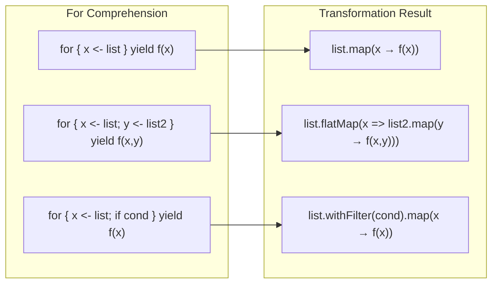


- For comprehension is syntactic sugar for `flatMap`, `map`, and `withFilter`
- Allows writing nested flatMap calls in a readable, declarative form
- Works with various monadic types including Option, Either, Future, and List
- Without yield, it only executes side effects (converted to foreach)


**Target Audience:** Developers who understand higher-order functions
**Prerequisites:** map, flatMap, and filter higher-order functions

For Comprehension is syntactic sugar that elegantly expresses `flatMap`, `map`, and `withFilter`. It allows you to write nested flatMap and map calls in a readable, declarative form, and works with various monadic types such as Option, Either, Future, and List.

#### Basic Syntax

Understanding the basic structure of for comprehension and how it converts to method calls is crucial.

**Transformation Rules Visualization**

The diagram below shows how for comprehension is transformed into map, flatMap, and withFilter calls.



*Diagram: Shows the process of transforming for comprehension into map, flatMap, and withFilter calls. A single generator converts to map, multiple generators convert to flatMap+map, and guards convert to withFilter.*

The basic for comprehension syntax is as follows:

```scala
// Basic form
for {
  x <- collection
} yield expression

// Multiple generators
for {
  x <- collection1
  y <- collection2
} yield (x, y)
```

#### Transformation to map/flatMap

The compiler transforms for comprehension into map, flatMap, and withFilter calls. Understanding these transformation rules helps clarify how for comprehension works.

**Single Generator → map**

When there's only a single generator, it simply converts to map.

```scala
// for comprehension
for (x <- List(1, 2, 3)) yield x * 2

// Transformed to
List(1, 2, 3).map(x => x * 2)

// Result: List(2, 4, 6)
```

**Multiple Generators → flatMap + map**

With multiple generators, all except the last convert to flatMap, and the last one converts to map.

```scala
// for comprehension
for {
  x <- List(1, 2, 3)
  y <- List("a", "b")
} yield (x, y)

// Transformed to
List(1, 2, 3).flatMap { x =>
  List("a", "b").map { y =>
    (x, y)
  }
}

// Result: List((1,a), (1,b), (2,a), (2,b), (3,a), (3,b))
```

**Guard → withFilter**

if conditions (guards) are transformed to withFilter calls. The reason for using withFilter instead of filter is to avoid creating intermediate collections.

```scala
// for comprehension
for {
  x <- List(1, 2, 3, 4, 5)
  if x % 2 == 0
} yield x * 2

// Transformed to
List(1, 2, 3, 4, 5)
  .withFilter(x => x % 2 == 0)
  .map(x => x * 2)

// Result: List(4, 8)
```

#### Value Definitions (=)

You can define intermediate values within for comprehension using `=`. This is useful for reusing computation results or improving readability.

```scala
for {
  x <- List(1, 2, 3)
  doubled = x * 2       // Intermediate value definition
  squared = doubled * doubled
} yield squared

// Transformed to
List(1, 2, 3).map { x =>
  val doubled = x * 2
  val squared = doubled * doubled
  squared
}

// Result: List(4, 16, 36)
```

#### With Option

Option is one of the most frequently used types with for comprehension. When performing consecutive Option operations, you can use clean for syntax instead of nested flatMap. If None occurs at any point, the entire result becomes None.

```scala
case class User(name: String)
case class Address(city: String)

def findUser(id: Int): Option[User] =
  if (id > 0) Some(User(s"User$id")) else None

def findAddress(user: User): Option[Address] =
  if (user.name.nonEmpty) Some(Address("Seoul")) else None

// If any None exists, the entire result is None
val result = for {
  user <- findUser(1)
  address <- findAddress(user)
} yield s"${user.name} lives in ${address.city}"

result  // Some("User1 lives in Seoul")

// Failure case
val failed = for {
  user <- findUser(-1)    // None
  address <- findAddress(user)
} yield s"${user.name} lives in ${address.city}"

failed  // None
```

#### With Either

Either can also be used with for comprehension. It continues as long as all operations are Right, and stops immediately upon encountering Left, returning that Left.

```scala
def parseInt(s: String): Either[String, Int] =
  s.toIntOption.toRight(s"'$s' is not a number")

def divide(a: Int, b: Int): Either[String, Int] =
  if (b == 0) Left("Cannot divide by zero")
  else Right(a / b)

// Continues if all operations are Right, stops on Left
val result = for {
  a <- parseInt("10")
  b <- parseInt("2")
  c <- divide(a, b)
} yield c

result  // Right(5)

val failed = for {
  a <- parseInt("10")
  b <- parseInt("zero")  // Left
  c <- divide(a, b)
} yield c

failed  // Left("'zero' is not a number")
```

#### With Future

Composing Futures with for comprehension allows sequential execution of asynchronous operations. Each step executes after the previous Future completes.

```scala
import scala.concurrent.{Future, ExecutionContext}
import scala.concurrent.ExecutionContext.Implicits.global

def fetchUser(id: Int): Future[String] =
  Future(s"User$id")

def fetchOrders(user: String): Future[List[String]] =
  Future(List(s"Order1 for $user", s"Order2 for $user"))

// Sequential execution
val result = for {
  user <- fetchUser(1)
  orders <- fetchOrders(user)
} yield (user, orders)

// result: Future((User1, List(Order1 for User1, Order2 for User1)))
```

#### List Combinations

Using for comprehension with List makes it easy to generate Cartesian products (all combinations). You can also add guards to select specific combinations.

```scala
// Cartesian product
val pairs = for {
  x <- List(1, 2, 3)
  y <- List("a", "b")
} yield (x, y)
// List((1,a), (1,b), (2,a), (2,b), (3,a), (3,b))

// With filtering
val evenPairs = for {
  x <- List(1, 2, 3, 4)
  if x % 2 == 0
  y <- List("a", "b")
} yield (x, y)
// List((2,a), (2,b), (4,a), (4,b))

// Multiplication table
val gugudan = for {
  i <- 2 to 9
  j <- 1 to 9
} yield s"$i x $j = ${i * j}"
```

#### Side Effects (Without yield)

Omitting yield executes only side effects without returning a value. In this case, it converts to foreach.

```scala
// Converted to foreach
for (x <- List(1, 2, 3)) {
  println(x)
}

// Equivalent to
List(1, 2, 3).foreach(x => println(x))
```

#### Pattern Matching

You can use pattern matching in for comprehension generators. This is useful for tuple decomposition or case class extraction. Elements that don't match are automatically filtered out.

```scala
val pairs = List((1, "one"), (2, "two"), (3, "three"))

// Tuple decomposition
for ((num, str) <- pairs) {
  println(s"$num = $str")
}

// Option filtering
val maybes = List(Some(1), None, Some(3), None, Some(5))

for (Some(x) <- maybes) {
  println(x)  // 1, 3, 5
}
```

#### Scala 3 Syntax

In Scala 3, the syntax for for comprehension has become more concise. The do keyword and indentation-based syntax have been added.


{}
```scala
// do keyword
for x <- List(1, 2, 3) do
  println(x)

// Indentation-based
for
  x <- List(1, 2, 3)
  y <- List("a", "b")
yield (x, y)
```
{}
{}
```scala
// Braces required
for (x <- List(1, 2, 3)) {
  println(x)
}

for {
  x <- List(1, 2, 3)
  y <- List("a", "b")
} yield (x, y)
```
{}


#### Using with Custom Types

For comprehension can be used with any type that has map, flatMap, and withFilter methods. By implementing these methods on your own types, you can leverage for comprehension.

```scala
case class Box[A](value: A) {
  def map[B](f: A => B): Box[B] = Box(f(value))
  def flatMap[B](f: A => Box[B]): Box[B] = f(value)
}

val result = for {
  x <- Box(1)
  y <- Box(2)
} yield x + y

result  // Box(3)
```

#### Practice Problems

Review the for comprehension concepts through the following exercises.

**1. Safe Calculator ⭐⭐**

Implement safe arithmetic operations using for comprehension.

<details>
<summary>View Answer</summary>

```scala
def safeAdd(a: Int, b: Int): Option[Int] = Some(a + b)
def safeSub(a: Int, b: Int): Option[Int] = Some(a - b)
def safeMul(a: Int, b: Int): Option[Int] = Some(a * b)
def safeDiv(a: Int, b: Int): Option[Int] =
  if (b == 0) None else Some(a / b)

// (10 + 5) * 2 / 3
val result = for {
  sum <- safeAdd(10, 5)
  product <- safeMul(sum, 2)
  quotient <- safeDiv(product, 3)
} yield quotient

result  // Some(10)
```

</details>

**2. Flattening Nested Option ⭐**

Handle nested Option using for comprehension.

<details>
<summary>View Answer</summary>

```scala
case class Company(address: Option[Address])
case class Address(street: Option[String])

val company = Company(Some(Address(Some("Gangnam-daero 123"))))

val street = for {
  address <- company.address
  street <- address.street
} yield street

street  // Some("Gangnam-daero 123")

// If there's a None in the middle
val noStreet = Company(Some(Address(None)))
val result = for {
  address <- noStreet.address
  street <- address.street
} yield street

result  // None
```

</details>

#### Next Steps

- [Implicit/Given]() — Contextual abstraction
- [Functional Patterns]() — Advanced Monad, Functor
