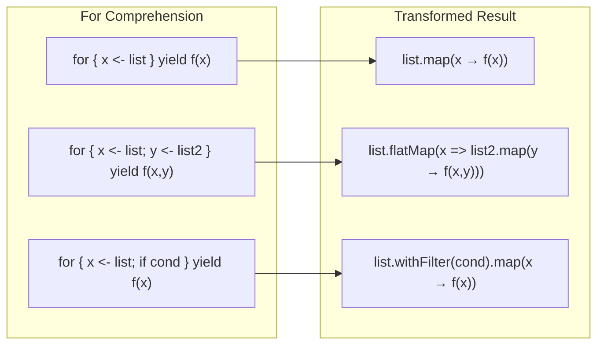

For Comprehension is syntactic sugar that elegantly expresses `flatMap`, `map`, and `withFilter`.

## Basic Syntax

### Transformation Rules Visualization



```scala
// Basic form
for {
  x <- collection
} yield expression

// Multiple generators
for {
  x <- collection1
  y <- collection2
} yield (x, y)
```

## Transformation to map/flatMap

### Single Generator → map

```scala
// for comprehension
for (x <- List(1, 2, 3)) yield x * 2

// Transforms to
List(1, 2, 3).map(x => x * 2)

// Result: List(2, 4, 6)
```

### Multiple Generators → flatMap + map

```scala
// for comprehension
for {
  x <- List(1, 2, 3)
  y <- List("a", "b")
} yield (x, y)

// Transforms to
List(1, 2, 3).flatMap { x =>
  List("a", "b").map { y =>
    (x, y)
  }
}

// Result: List((1,a), (1,b), (2,a), (2,b), (3,a), (3,b))
```

### Guard → withFilter

```scala
// for comprehension
for {
  x <- List(1, 2, 3, 4, 5)
  if x % 2 == 0
} yield x * 2

// Transforms to
List(1, 2, 3, 4, 5)
  .withFilter(x => x % 2 == 0)
  .map(x => x * 2)

// Result: List(4, 8)
```

## Value Definition (=)

```scala
for {
  x <- List(1, 2, 3)
  doubled = x * 2       // Intermediate value definition
  squared = doubled * doubled
} yield squared

// Transforms to
List(1, 2, 3).map { x =>
  val doubled = x * 2
  val squared = doubled * doubled
  squared
}

// Result: List(4, 16, 36)
```

## With Option

Option is frequently used with for comprehension.

```scala
case class User(name: String)
case class Address(city: String)

def findUser(id: Int): Option[User] =
  if (id > 0) Some(User(s"User$id")) else None

def findAddress(user: User): Option[Address] =
  if (user.name.nonEmpty) Some(Address("Seoul")) else None

// If any is None, entire result is None
val result = for {
  user <- findUser(1)
  address <- findAddress(user)
} yield s"${user.name} lives in ${address.city}"

result  // Some("User1 lives in Seoul")

// Failure case
val failed = for {
  user <- findUser(-1)    // None
  address <- findAddress(user)
} yield s"${user.name} lives in ${address.city}"

failed  // None
```

## With Either

```scala
def parseInt(s: String): Either[String, Int] =
  s.toIntOption.toRight(s"'$s' is not a number")

def divide(a: Int, b: Int): Either[String, Int] =
  if (b == 0) Left("Cannot divide by zero")
  else Right(a / b)

// Continues if all Right, stops at Left
val result = for {
  a <- parseInt("10")
  b <- parseInt("2")
  c <- divide(a, b)
} yield c

result  // Right(5)

val failed = for {
  a <- parseInt("10")
  b <- parseInt("zero")  // Left
  c <- divide(a, b)
} yield c

failed  // Left("'zero' is not a number")
```

## With Future

Combines asynchronous operations sequentially.

```scala
import scala.concurrent.{Future, ExecutionContext}
import scala.concurrent.ExecutionContext.Implicits.global

def fetchUser(id: Int): Future[String] =
  Future(s"User$id")

def fetchOrders(user: String): Future[List[String]] =
  Future(List(s"Order1 for $user", s"Order2 for $user"))

// Sequential execution
val result = for {
  user <- fetchUser(1)
  orders <- fetchOrders(user)
} yield (user, orders)

// result: Future((User1, List(Order1 for User1, Order2 for User1)))
```

## List Combination

```scala
// Cartesian product
val pairs = for {
  x <- List(1, 2, 3)
  y <- List("a", "b")
} yield (x, y)
// List((1,a), (1,b), (2,a), (2,b), (3,a), (3,b))

// With filtering
val evenPairs = for {
  x <- List(1, 2, 3, 4)
  if x % 2 == 0
  y <- List("a", "b")
} yield (x, y)
// List((2,a), (2,b), (4,a), (4,b))

// Multiplication table
val table = for {
  i <- 2 to 9
  j <- 1 to 9
} yield s"$i x $j = ${i * j}"
```

## Side Effects (without yield)

Without `yield`, only side effects are executed.

```scala
// Transforms to foreach
for (x <- List(1, 2, 3)) {
  println(x)
}

// Equivalent
List(1, 2, 3).foreach(x => println(x))
```

## Pattern Matching

```scala
val pairs = List((1, "one"), (2, "two"), (3, "three"))

// Tuple destructuring
for ((num, str) <- pairs) {
  println(s"$num = $str")
}

// Option filtering
val maybes = List(Some(1), None, Some(3), None, Some(5))

for (Some(x) <- maybes) {
  println(x)  // 1, 3, 5
}
```

## Scala 3 Syntax


{}
```scala
// do keyword
for x <- List(1, 2, 3) do
  println(x)

// Indentation-based
for
  x <- List(1, 2, 3)
  y <- List("a", "b")
yield (x, y)
```
{}
{}
```scala
// Braces required
for (x <- List(1, 2, 3)) {
  println(x)
}

for {
  x <- List(1, 2, 3)
  y <- List("a", "b")
} yield (x, y)
```
{}


## Using with Custom Types

Implement `map`, `flatMap`, and `withFilter` to enable for comprehension.

```scala
case class Box[A](value: A) {
  def map[B](f: A => B): Box[B] = Box(f(value))
  def flatMap[B](f: A => Box[B]): Box[B] = f(value)
}

val result = for {
  x <- Box(1)
  y <- Box(2)
} yield x + y

result  // Box(3)
```

## Exercises

### 1. Safe Calculator

Implement safe arithmetic operations with for comprehension.

<details>
<summary>Show Answer</summary>

```scala
def safeAdd(a: Int, b: Int): Option[Int] = Some(a + b)
def safeSub(a: Int, b: Int): Option[Int] = Some(a - b)
def safeMul(a: Int, b: Int): Option[Int] = Some(a * b)
def safeDiv(a: Int, b: Int): Option[Int] =
  if (b == 0) None else Some(a / b)

// (10 + 5) * 2 / 3
val result = for {
  sum <- safeAdd(10, 5)
  product <- safeMul(sum, 2)
  quotient <- safeDiv(product, 3)
} yield quotient

result  // Some(10)
```

</details>

### 2. Flatten Nested Option

Handle nested Options with for comprehension.

<details>
<summary>Show Answer</summary>

```scala
case class Company(address: Option[Address])
case class Address(street: Option[String])

val company = Company(Some(Address(Some("123 Main St"))))

val street = for {
  address <- company.address
  street <- address.street
} yield street

street  // Some("123 Main St")

// With None in the middle
val noStreet = Company(Some(Address(None)))
val result = for {
  address <- noStreet.address
  street <- address.street
} yield street

result  // None
```

</details>

## Next Steps

- [Implicit/Given](../implicits/) — Contextual abstraction
- [Functional Patterns](../functional-patterns/) — Monad, Functor advanced
