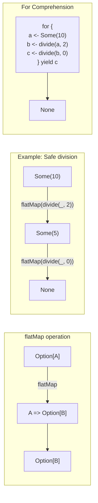

This document covers core functional programming patterns used in Scala.

> **Prerequisites**: To understand this document, you should be familiar with:
> - [Higher-Order Functions](../higher-order-functions/) - map, flatMap, filter
> - [For Comprehension](../for-comprehensions/) - Syntactic sugar for monadic operations
> - [Generics](../generics/) - Type parameters
>
> **Difficulty**: Advanced

## Referential Transparency

The property where a function call can be replaced with its result without changing program meaning.

```scala
// Referentially transparent
def add(a: Int, b: Int): Int = a + b

val x = add(1, 2)  // Can be replaced with 3
val y = x + x      // Same as add(1, 2) + add(1, 2)

// Referentially opaque (side effect)
var counter = 0
def increment(): Int = {
  counter += 1
  counter
}

val a = increment()  // 1
val b = increment()  // 2 (different result!)
```

## Immutability

Create new data instead of modifying existing data.

```scala
// Immutable list
val list1 = List(1, 2, 3)
val list2 = 0 :: list1  // list1 is not modified

// Case class update
case class Person(name: String, age: Int)
val alice = Person("Alice", 30)
val olderAlice = alice.copy(age = 31)  // alice is not modified
```

## Functor

A type that has a `map` operation.

### Functor Laws

```scala
// 1. Identity law: fa.map(identity) == fa
List(1, 2, 3).map(identity) == List(1, 2, 3)

// 2. Composition law: fa.map(f).map(g) == fa.map(f andThen g)
val f = (x: Int) => x + 1
val g = (x: Int) => x * 2

List(1, 2, 3).map(f).map(g) == List(1, 2, 3).map(f andThen g)
```

### Custom Functor

```scala
trait Functor[F[_]]:
  def map[A, B](fa: F[A])(f: A => B): F[B]

// Option Functor
given Functor[Option] with
  def map[A, B](fa: Option[A])(f: A => B): Option[B] = fa.map(f)

// List Functor
given Functor[List] with
  def map[A, B](fa: List[A])(f: A => B): List[B] = fa.map(f)
```

## Applicative

Combines independent effects.

```scala
trait Applicative[F[_]] extends Functor[F]:
  def pure[A](a: A): F[A]
  def ap[A, B](ff: F[A => B])(fa: F[A]): F[B]

// Example with Option
val some1: Option[Int] = Some(1)
val some2: Option[Int] = Some(2)

// Combine two Options
val sum: Option[Int] = (some1, some2) match
  case (Some(a), Some(b)) => Some(a + b)
  case _ => None
```

## Monad

Chains sequential effects.

### Monad Flow Visualization



### Monad Laws

```scala
trait Monad[F[_]] extends Applicative[F]:
  def flatMap[A, B](fa: F[A])(f: A => F[B]): F[B]

  // pure(a).flatMap(f) == f(a)  // Left identity
  // m.flatMap(pure) == m        // Right identity
  // m.flatMap(f).flatMap(g) == m.flatMap(a => f(a).flatMap(g))  // Associativity
```

### Standard Library Monads

```scala
// Option
val result = for {
  a <- Some(1)
  b <- Some(2)
} yield a + b  // Some(3)

// Either
val validated: Either[String, Int] = for {
  x <- Right(1)
  y <- Right(2)
} yield x + y  // Right(3)

// Future
import scala.concurrent.Future
import scala.concurrent.ExecutionContext.Implicits.global

def fetchUser(id: Int): Future[String] = Future(s"User$id")
def fetchOrders(user: String): Future[List[String]] = Future(List(s"Order1-$user"))

val asyncResult = for
  user <- fetchUser(1)
  orders <- fetchOrders(user)
yield orders
// Future(List("Order1-User1"))
```

## Option - null Alternative

```scala
// Safe division
def divide(a: Int, b: Int): Option[Int] =
  if b == 0 then None else Some(a / b)

// Chaining
val result = for {
  x <- divide(10, 2)  // Some(5)
  y <- divide(x, 0)   // None
} yield y             // None

// getOrElse
divide(10, 0).getOrElse(0)  // 0

// fold
divide(10, 2).fold(0)(_ * 2)  // 10
```

## Either - Error Handling

```scala
sealed trait ValidationError
case class EmptyName(field: String) extends ValidationError
case class InvalidAge(age: Int) extends ValidationError

def validateName(name: String): Either[ValidationError, String] =
  if name.isEmpty then Left(EmptyName("name"))
  else Right(name)

def validateAge(age: Int): Either[ValidationError, Int] =
  if age < 0 || age > 150 then Left(InvalidAge(age))
  else Right(age)

case class Person(name: String, age: Int)

def createPerson(name: String, age: Int): Either[ValidationError, Person] =
  for {
    validName <- validateName(name)
    validAge <- validateAge(age)
  } yield Person(validName, validAge)

createPerson("Alice", 30)  // Right(Person("Alice", 30))
createPerson("", 30)       // Left(EmptyName("name"))
```

## Try - Exception Handling

```scala
import scala.util.{Try, Success, Failure}

def parseInt(s: String): Try[Int] = Try(s.toInt)

parseInt("42") match
  case Success(n) => println(s"Number: $n")
  case Failure(e) => println(s"Error: ${e.getMessage}")

// Chaining
val result = for {
  a <- parseInt("10")
  b <- parseInt("20")
} yield a + b  // Success(30)

// Failure recovery
parseInt("abc").getOrElse(0)  // 0
parseInt("abc").recover { case _: NumberFormatException => 0 }
```

## Function Composition

```scala
val addOne = (x: Int) => x + 1
val double = (x: Int) => x * 2
val square = (x: Int) => x * x

// andThen: Left -> Right
val pipeline = addOne andThen double andThen square
pipeline(3)  // ((3 + 1) * 2)^2 = 64

// compose: Right -> Left
val composed = square compose double compose addOne
composed(3)  // ((3 + 1) * 2)^2 = 64
```

## Currying and Partial Application

```scala
// Currying
def add(a: Int)(b: Int): Int = a + b

val add5 = add(5)
add5(3)  // 8

// Partial application
def log(level: String, message: String): Unit =
  println(s"[$level] $message")

val error = log("ERROR", _)
val info = log("INFO", _)

error("Something went wrong")
info("Application started")
```

## Cats/ZIO Libraries

### Cats

```scala
import cats.*
import cats.implicits.*

// Validated - Error accumulation
import cats.data.Validated

type ValidationResult[A] = Validated[List[String], A]

val valid1: ValidationResult[Int] = Validated.valid(1)
val valid2: ValidationResult[Int] = Validated.valid(2)
val invalid: ValidationResult[Int] = Validated.invalid(List("Error"))

// Collect all errors
(valid1, invalid, invalid).mapN(_ + _ + _)
// Invalid(List("Error", "Error"))
```

### ZIO

```scala
import zio.*
import java.io.IOException

// Console operations can throw IOException
val program: ZIO[Any, IOException, Int] = for
  _ <- Console.printLine("Enter a number:")
  input <- Console.readLine
  num <- ZIO.fromOption(input.toIntOption)
           .orElseFail(new IOException("Not a number"))
yield num * 2
```

## Exercises

### 1. Custom Monad

Implement `flatMap` for `Box[A]` type.

<details>
<summary>Show Answer</summary>

```scala
case class Box[A](value: A):
  def map[B](f: A => B): Box[B] = Box(f(value))
  def flatMap[B](f: A => Box[B]): Box[B] = f(value)

val result = for {
  x <- Box(1)
  y <- Box(2)
} yield x + y  // Box(3)
```

</details>

### 2. Error Accumulation

Perform multiple validations and collect all errors.

<details>
<summary>Show Answer</summary>

```scala
type Errors = List[String]
type Validated[A] = Either[Errors, A]

def validateAll[A](validations: List[Validated[A]]): Validated[List[A]] =
  val (errors, values) = validations.partitionMap(identity)
  if errors.isEmpty then Right(values)
  else Left(errors.flatten)

val results = List(
  Right(1),
  Left(List("Error1")),
  Right(3),
  Left(List("Error2"))
)

validateAll(results)  // Left(List("Error1", "Error2"))
```

</details>

## References

- [Cats Documentation](https://typelevel.org/cats/)
- [ZIO Documentation](https://zio.dev/)
- [Functional Programming in Scala](https://www.manning.com/books/functional-programming-in-scala)

## Next Steps

- [Cats Library](https://typelevel.org/cats/)
- [ZIO Library](https://zio.dev/)
- [fs2 Streaming](https://fs2.io/)
