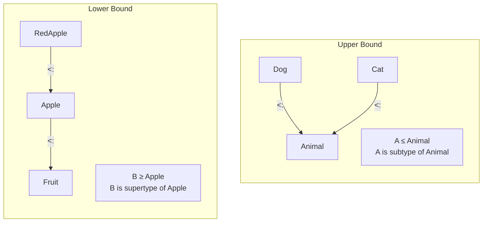


- Generics allow you to write **type-safe and reusable code**
- Upper bound (`A <: B`): A is a subtype of B
- Lower bound (`A >: B`): A is a supertype of B
- Context bound (`A : Ordering`): Requires a type class instance


**Target Audience:** Developers familiar with Java generics
**Prerequisites:** Classes, traits, basic type system

Generics allow you to write type-safe and reusable code. Through type parameters, you can define classes and methods that work with various types, while ensuring type safety at compile time.

#### Type Parameters

Type parameters can be used in classes, traits, and methods. They are declared within brackets `[]`, and by convention use single capital letters like A, B, T.

**In Classes**

Declaring type parameters in a class creates a generalized class for that type.

```scala
// Single type parameter
class Box[A](value: A) {
  def get: A = value
  def map[B](f: A => B): Box[B] = new Box(f(value))
}

val intBox = new Box(42)
val strBox = new Box("hello")

intBox.get        // 42
strBox.get        // "hello"
intBox.map(_ * 2) // Box(84)
```

You can also use multiple type parameters simultaneously.

```scala
// Multiple type parameters
class Pair[A, B](val first: A, val second: B) {
  def swap: Pair[B, A] = new Pair(second, first)
}

val pair = new Pair(1, "one")
pair.first   // 1
pair.second  // "one"
pair.swap    // Pair("one", 1)
```

**In Methods**

Methods can also declare independent type parameters. The compiler infers types from argument types when the method is called.

```scala
def identity[A](x: A): A = x

identity(42)      // 42
identity("hello") // "hello"

def swap[A, B](pair: (A, B)): (B, A) = (pair._2, pair._1)

swap((1, "one"))  // ("one", 1)
```

**In Traits**

Traits can also have type parameters, and classes implementing them specify concrete types.

```scala
trait Container[A] {
  def get: A
  def map[B](f: A => B): Container[B]
}

class Box[A](value: A) extends Container[A] {
  def get: A = value
  def map[B](f: A => B): Container[B] = new Box(f(value))
}
```


- Type parameters can be declared in classes, methods, and traits
- By convention, use single capital letters like A, B, T
- The compiler automatically infers types in most cases


#### Type Bounds

Type bounds restrict the range of types that a type parameter can have. You can specify the allowed range in the type hierarchy through upper and lower bounds.

**Type Bounds Visualization**

The diagram below visualizes the concepts of upper and lower bounds.



*The diagram above shows how upper and lower bounds work in the type hierarchy.*

**Upper Bound**

An upper bound specifies that a type parameter must be a subtype of a specific type.

`A <: B` means A must be a subtype of B.

```scala
trait Animal {
  def name: String
}

class Dog(val name: String) extends Animal
class Cat(val name: String) extends Animal

// A must be a subtype of Animal
def printNames[A <: Animal](animals: List[A]): Unit =
  animals.foreach(a => println(a.name))

printNames(List(Dog("Buddy"), Dog("Max")))
// printNames(List("not an animal"))  // Compile error
```


- `A <: B`: A must be a subtype of B
- Ensures the type parameter has specific methods
- Secures type safety by allowing only limited range of types


**Lower Bound**

A lower bound specifies that a type parameter must be a supertype of a specific type. Frequently used when handling method parameters in covariant types.

`A >: B` means A must be a supertype of B.

```scala
class Fruit
class Apple extends Fruit
class RedApple extends Apple

// B must be a supertype of Apple
def addFruit[B >: Apple](fruits: List[B], fruit: B): List[B] =
  fruit :: fruits

val fruits: List[Fruit] = List(new Apple)
addFruit(fruits, new Fruit)     // OK - Fruit >: Apple
addFruit(fruits, new Apple)     // OK - Apple >: Apple (same type)
addFruit(fruits, new RedApple)  // OK - RedApple upcasts to Apple
```

> **Key insight:** `B >: Apple` means "B is Apple or a supertype of Apple". Subtypes (RedApple) can also be used as they upcast to Apple.


- `A >: B`: A must be a supertype of B
- Used when handling method parameters in covariant types
- Subtypes can also be used through upcasting


**Context Bound**

A context bound declares that an implicit instance of a specific type class must exist. Written as `A : Ordering`, it means an implicit value of type `Ordering[A]` must be in scope.

`A : Ordering` means an implicit instance of `Ordering[A]` is required.

```scala
// Context bound
def max[A: Ordering](a: A, b: A): A = {
  val ord = implicitly[Ordering[A]]
  if (ord.gt(a, b)) a else b
}

max(1, 2)        // 2
max("a", "b")    // "b"

// Equivalent expression
def max2[A](a: A, b: A)(implicit ord: Ordering[A]): A =
  if (ord.gt(a, b)) a else b
```


- `A : Ordering`: Requires implicit instance of Ordering[A]
- Frequently used with type class pattern
- Access implicit values with `implicitly`


#### Type Inference

The Scala compiler automatically infers type parameters in most cases. Explicit type specification is needed when there isn't enough information to infer, such as when creating empty collections or using None.

```scala
// Types are inferred
val list = List(1, 2, 3)           // List[Int]
val map = Map("a" -> 1, "b" -> 2)  // Map[String, Int]

// Cases requiring explicit types
val empty = List.empty[Int]        // List[Int]
val none: Option[Int] = None       // Option[Int]
```


- Type parameters are automatically inferred in most cases
- Empty collections or None require explicit types
- Specify types when there's insufficient inference information


#### Common Generic Types

The Scala standard library has widely used generic types. Option, Either, and Try are representative types for type-safe representation of operations that may fail.

**Option[A]**

Option represents cases where a value may or may not be present. Used instead of null to prevent NullPointerException.

```scala
val some: Option[Int] = Some(42)
val none: Option[Int] = None

some.map(_ * 2)        // Some(84)
none.map(_ * 2)        // None
some.getOrElse(0)      // 42
none.getOrElse(0)      // 0
```

**Either[A, B]**

Either holds one of two possible types. By convention, Left holds failure (error info), and Right holds success value.

```scala
val right: Either[String, Int] = Right(42)
val left: Either[String, Int] = Left("error")

right.map(_ * 2)       // Right(84)
left.map(_ * 2)        // Left("error")

// Pattern matching
right match {
  case Right(value) => s"Value: $value"
  case Left(error)  => s"Error: $error"
}
```

**Try[A]**

Try encapsulates operations that may throw exceptions. Represents results as Success or Failure, treating exceptions as values instead of throwing them.

```scala
import scala.util.{Try, Success, Failure}

val success: Try[Int] = Try("42".toInt)
val failure: Try[Int] = Try("abc".toInt)

success.map(_ * 2)     // Success(84)
failure.map(_ * 2)     // Failure(NumberFormatException)

success.getOrElse(0)   // 42
failure.getOrElse(0)   // 0
```


- Option: Represents presence/absence of value (Some/None)
- Either: One of two results (Left/Right)
- Try: Encapsulates exception handling (Success/Failure)


#### Generic ADT

You can define Algebraic Data Types (ADT) using generics. Through type parameters, you can create versatile structures that express various result types.

```scala
// Generic result type
sealed trait Result[+E, +A]
case class Success[A](value: A) extends Result[Nothing, A]
case class Error[E](error: E) extends Result[E, Nothing]

def divide(a: Int, b: Int): Result[String, Int] =
  if (b == 0) Error("Cannot divide by zero")
  else Success(a / b)

divide(10, 2) match {
  case Success(v) => println(s"Result: $v")
  case Error(e)   => println(s"Error: $e")
}
```


- Define generic ADT with sealed trait + case class
- Handle unused type parameters with Nothing type
- Use pattern matching for type-safe branching


#### Comparison with Java Generics

Scala and Java generic syntax are similar but have some differences. The table below summarizes the main differences.

| Feature | Scala | Java |
|---------|-------|------|
| Syntax | `[A]` | `<A>` |
| Upper bound | `A <: B` | `A extends B` |
| Lower bound | `A >: B` | `A super B` |
| Wildcard | `_` | `?` |
| Variance | Declaration-site | Use-site |

```scala
// Scala
class Box[A](val value: A)
def process[A <: Comparable[A]](a: A): Unit = ???

// Java equivalent
// class Box<A> { ... }
// void process<A extends Comparable<A>>(A a) { ... }
```

#### Exercises

Practice generic concepts with the following exercises.

**1. Generic Stack Implementation ⭐⭐⭐**

Implement an immutable Stack with generics.

<details>
<summary>Show Answer</summary>

```scala
sealed trait Stack[+A] {
  def push[B >: A](elem: B): Stack[B]
  def pop: (A, Stack[A])
  def isEmpty: Boolean
}

case object EmptyStack extends Stack[Nothing] {
  def push[B](elem: B): Stack[B] = NonEmptyStack(elem, this)
  def pop: Nothing = throw new NoSuchElementException("Empty stack")
  def isEmpty: Boolean = true
}

case class NonEmptyStack[+A](top: A, rest: Stack[A]) extends Stack[A] {
  def push[B >: A](elem: B): Stack[B] = NonEmptyStack(elem, this)
  def pop: (A, Stack[A]) = (top, rest)
  def isEmpty: Boolean = false
}

val stack = EmptyStack.push(1).push(2).push(3)
val (top, rest) = stack.pop  // (3, Stack(2, 1))
```

</details>

**2. Generic find Function ⭐⭐**

Implement a generic function to find the first element matching a condition in a list.

<details>
<summary>Show Answer</summary>

```scala
def find[A](list: List[A])(predicate: A => Boolean): Option[A] =
  list match {
    case Nil                        => None
    case head :: _ if predicate(head) => Some(head)
    case _ :: tail                  => find(tail)(predicate)
  }

find(List(1, 2, 3, 4, 5))(_ > 3)  // Some(4)
find(List("a", "bb", "ccc"))(_.length > 2)  // Some("ccc")
```

</details>

#### Next Steps

- [Variance]() — Variance in generic types
- [Type Classes]() — Ad-hoc polymorphism
