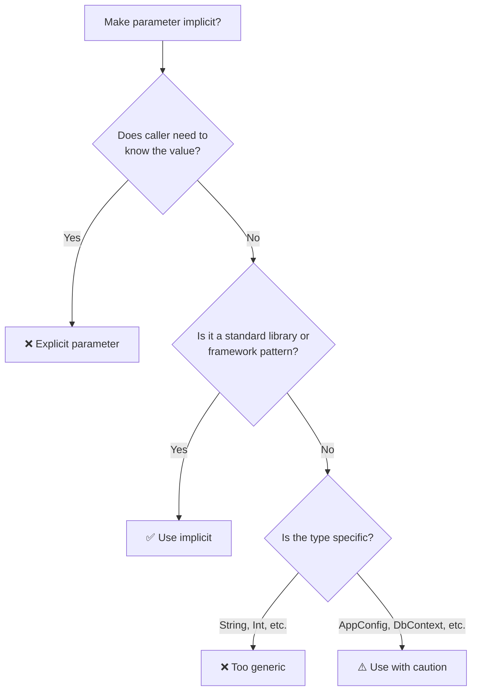


- Implicit features allow the compiler to automatically pass values or convert types
- Scala 2: `implicit` / Scala 3: `given`/`using`/`extension`
- Primarily used for **type classes**, **extension methods**, and **context passing**
- Avoid implicit definitions for overly generic types (`String`, `Int`)


**Target Audience:** Developers familiar with higher-order functions and generics
**Prerequisites:** For comprehensions, type parameters

Implicit features are one of Scala's most powerful capabilities. They allow the compiler to automatically pass values or convert types, reducing boilerplate code and increasing expressiveness. This covers both Scala 2's `implicit` and Scala 3's `given`/`using`.

#### Why Do We Need Implicits?

Let's examine three main problems that implicit features solve.

**Problem 1: Boilerplate Parameters**

Passing context in Java style requires repetitively passing parameters to every method:

```java
// Java: Passing ExecutionContext every time
public class OrderService {
    public CompletableFuture<Order> createOrder(OrderRequest req, ExecutionContext ec) {
        return validateOrder(req, ec)
            .thenCompose(valid -> saveOrder(valid, ec))
            .thenCompose(saved -> notifyUser(saved, ec));
    }

    private CompletableFuture<Order> validateOrder(OrderRequest req, ExecutionContext ec) { ... }
    private CompletableFuture<Order> saveOrder(Order order, ExecutionContext ec) { ... }
    private CompletableFuture<Void> notifyUser(Order order, ExecutionContext ec) { ... }
}
```

**Scala's Solution:** Use `implicit`/`using` to pass context automatically:

```scala
// Scala: ExecutionContext passed implicitly
class OrderService(using ec: ExecutionContext):
  def createOrder(req: OrderRequest): Future[Order] =
    validateOrder(req)
      .flatMap(saveOrder)
      .flatMap(notifyUser)

  private def validateOrder(req: OrderRequest): Future[Order] = ...
  private def saveOrder(order: Order): Future[Order] = ...
  private def notifyUser(order: Order): Future[Unit] = ...

// Provide once at usage site
given ExecutionContext = ExecutionContext.global
val service = OrderService()
service.createOrder(request)  // ec automatically injected
```

**Problem 2: Cannot Extend External Library Types**

In Java, adding methods to `String` requires a wrapper class:

```java
// Java: If you want to add a toSlug method to String
public class StringUtils {
    public static String toSlug(String s) {
        return s.toLowerCase().replaceAll(" ", "-");
    }
}
// Usage: StringUtils.toSlug(title) — awkward

// Or use a wrapper class
public class RichString {
    private final String value;
    public RichString(String value) { this.value = value; }
    public String toSlug() { return value.toLowerCase().replaceAll(" ", "-"); }
}
// Usage: new RichString(title).toSlug() — even more awkward
```

**Scala's Solution:** Extend existing types with extension methods:

```scala
// Scala 3: Add methods directly to String
extension (s: String)
  def toSlug: String = s.toLowerCase.replace(" ", "-")
  def words: List[String] = s.split("\\s+").toList

// Usage: as if they were original methods of String
"Hello World".toSlug   // "hello-world"
"Hello World".words    // List("Hello", "World")
```

**Problem 3: Difficulty Implementing Type-Specific Behavior**

In Java, handling various types in the same way requires complex conditionals:

```java
// Java: Type-specific serialization logic
public class JsonSerializer {
    public String toJson(Object obj) {
        if (obj instanceof String) {
            return "\"" + obj + "\"";
        } else if (obj instanceof Integer) {
            return obj.toString();
        } else if (obj instanceof List) {
            List<?> list = (List<?>) obj;
            return list.stream()
                .map(this::toJson)
                .collect(Collectors.joining(",", "[", "]"));
        }
        throw new IllegalArgumentException("Unsupported type");
    }
}
// Problem: Must modify this method when adding new types (violates Open-Closed Principle)
```

**Scala's Solution:** Design with type classes for extensibility:

```scala
// Scala: Type class pattern
trait JsonEncoder[A]:
  def encode(a: A): String

given JsonEncoder[String] with
  def encode(a: String): String = s"\"$a\""

given JsonEncoder[Int] with
  def encode(a: Int): String = a.toString

given [A](using enc: JsonEncoder[A]): JsonEncoder[List[A]] with
  def encode(list: List[A]): String =
    list.map(enc.encode).mkString("[", ",", "]")

def toJson[A](a: A)(using enc: JsonEncoder[A]): String = enc.encode(a)

// Add new type - extend without modifying existing code
case class User(name: String, age: Int)
given JsonEncoder[User] with
  def encode(u: User): String = s"""{"name":"${u.name}","age":${u.age}}"""

toJson(List("a", "b"))  // ["a","b"]
toJson(User("Kim", 30)) // {"name":"Kim","age":30}
```

#### Implicit/Given Usage Guide

Implicit features are powerful but can harm code readability if misused. Let's explore when to use them and when to avoid them.

**When Should You Use Them?**

The table below summarizes the suitability of implicit usage by situation.

| Situation | Suitability | Reason |
|-----------|-------------|--------|
| Passing `ExecutionContext` | ✅ Suitable | Standard pattern, clear context |
| Type class instances (`Ordering`, `Show`, etc.) | ✅ Suitable | Compile-time safety |
| JSON/DB codecs | ✅ Suitable | Library standard pattern |
| Loggers, configuration objects | ⚠️ Caution | Explicit DI might be better |
| Business logic parameters | ❌ Unsuitable | Reduces readability, difficult debugging |
| Default/fallback values | ❌ Unsuitable | Causes unexpected behavior |

**Usage Decision Flowchart**

A flowchart to help decide whether to use implicits.



**Anti-Patterns to Avoid**

```scala
// ❌ Anti-pattern 1: Too generic type
given String = "default"  // Injected to all String parameters!
given Int = 0             // Dangerous!

// ✅ Correct way: Use wrapper types
case class ApiKey(value: String)
given ApiKey = ApiKey("default-key")

// ❌ Anti-pattern 2: Hiding business logic
def processOrder(orderId: String)(using discount: Double): Order = ...
// Difficult to track where discount comes from

// ✅ Correct way: Explicit parameters
def processOrder(orderId: String, discount: Double): Order = ...

// ❌ Anti-pattern 3: Overusing implicit conversions
given Conversion[String, Int] = _.toInt
val x: Int = "123"  // Compiles but dangerous

// ✅ Correct way: Explicit conversion or extension
extension (s: String)
  def toIntSafe: Option[Int] = s.toIntOption
```

#### Scala 2: Implicit

In Scala 2, the implicit keyword was used to express multiple features.

**Implicit Values**

The basic way to define and use implicit values.

```scala
// Define implicit value
implicit val defaultName: String = "Guest"

// Use implicit parameter
def greet(implicit name: String): String = s"Hello, $name!"

greet              // "Hello, Guest!" (implicitly passed)
greet("Alice")     // "Hello, Alice!" (explicitly passed)
```

**Implicit Parameters**

Pattern for passing classes or configuration objects implicitly.

```scala
case class Config(url: String, timeout: Int)

implicit val defaultConfig: Config = Config("localhost", 5000)

def connect(implicit config: Config): Unit =
  println(s"Connecting to ${config.url} with timeout ${config.timeout}")

connect  // Uses implicit Config
```

**Implicit Conversions**

Defines automatic type conversions. Powerful but use with caution as it can make code harder to understand when overused.

```scala
// Implicit conversion from Int to String
implicit def intToString(i: Int): String = i.toString

val s: String = 42  // Automatically converted to "42"

// Use with caution - can be dangerous!
```

**Implicit Classes (Extension Methods)**

Pattern for adding new methods to existing types.

```scala
implicit class RichString(s: String) {
  def exclaim: String = s + "!"
  def words: List[String] = s.split(" ").toList
}

"Hello".exclaim          // "Hello!"
"Hello World".words      // List("Hello", "World")
```

#### Scala 3: Given / Using

In Scala 3, `implicit` is separated into clearer keywords. given provides values, using requests values, and extension adds methods.

**Given Instances**

Define implicit instances with given.


{}
```scala
// Define instance with given
given defaultName: String = "Guest"

// Use with using
def greet(using name: String): String = s"Hello, $name!"

greet              // "Hello, Guest!"
greet(using "Alice") // "Hello, Alice!"
```
{}
{}
```scala
implicit val defaultName: String = "Guest"

def greet(implicit name: String): String = s"Hello, $name!"

greet              // "Hello, Guest!"
greet("Alice")     // "Hello, Alice!"
```
{}


**Anonymous Given**

You can also define given without a name.

```scala
// Unnamed given
given String = "Guest"

// Reference by type only
summon[String]  // "Guest"
```

**Using Clause**

Declare implicit parameters with using clause.

```scala
case class Config(url: String, timeout: Int)

given Config = Config("localhost", 5000)

def connect(using config: Config): Unit =
  println(s"Connecting to ${config.url}")

connect  // Implicitly uses Config
```

**Extension Methods (Scala 3)**

Add methods to existing types with the extension keyword.


{}
```scala
extension (s: String)
  def exclaim: String = s + "!"
  def words: List[String] = s.split(" ").toList
  def repeatN(n: Int): String = s * n

"Hello".exclaim      // "Hello!"
"Hello".repeatN(3)   // "HelloHelloHello"
```
{}
{}
```scala
implicit class StringOps(s: String) {
  def exclaim: String = s + "!"
  def words: List[String] = s.split(" ").toList
  def repeatN(n: Int): String = s * n
}

"Hello".exclaim      // "Hello!"
"Hello".repeatN(3)   // "HelloHelloHello"
```
{}


#### Type Class Pattern

Type classes are the most important use case for implicit features. They add new functionality to existing types while maintaining type safety.

**Definition**


{}
```scala
// Type class definition
trait Show[A]:
  def show(a: A): String

// Instance definitions
given Show[Int] with
  def show(a: Int): String = a.toString

given Show[String] with
  def show(a: String): String = s"\"$a\""

// Usage
def print[A](a: A)(using s: Show[A]): Unit =
  println(s.show(a))

print(42)       // "42"
print("hello")  // "\"hello\""
```
{}
{}
```scala
// Type class definition
trait Show[A] {
  def show(a: A): String
}

// Instance definitions
implicit val intShow: Show[Int] = new Show[Int] {
  def show(a: Int): String = a.toString
}

implicit val stringShow: Show[String] = new Show[String] {
  def show(a: String): String = s"\"$a\""
}

// Usage
def print[A](a: A)(implicit s: Show[A]): Unit =
  println(s.show(a))

print(42)       // "42"
print("hello")  // "\"hello\""
```
{}


**Context Bounds**

Context bounds are concise syntax for requiring type class instances.

```scala
// Context bound syntax
def print[A: Show](a: A): Unit = {
  val s = summon[Show[A]]  // Scala 3
  // val s = implicitly[Show[A]]  // Scala 2
  println(s.show(a))
}
```

#### Implicit Scope

Implicit values are searched in this order:

1. **Current scope** - Local variables, imported implicits
2. **Companion objects of associated types** - Type parameters, parent types, etc.

```scala
case class User(name: String)

object User {
  // Implicit defined in companion object
  implicit val ordering: Ordering[User] =
    Ordering.by(_.name)
}

// Automatically finds User.ordering
List(User("Bob"), User("Alice")).sorted
// List(User("Alice"), User("Bob"))
```

#### Given Import (Scala 3)

In Scala 3, you must explicitly import given.

```scala
object Givens:
  given Int = 42
  given String = "hello"
  val normalValue = 100

// Import only specific type's given (using braces)
import Givens.{given Int}

// Import all givens
import Givens.given

// Import both regular members and givens
import Givens.*       // Only normalValue
import Givens.given   // Only given Int, given String

// If you need both
import Givens.{*, given}
```

> 💡 **Difference from Scala 2:** In Scala 2, `import Givens._` also imported implicits, but Scala 3 requires explicit `given` import.

#### Migration Guide

Keyword mapping reference when migrating from Scala 2 to Scala 3.

| Scala 2 | Scala 3 |
|---------|---------|
| `implicit val x: T = ...` | `given x: T = ...` |
| `implicit def f: T = ...` | `given f: T = ...` |
| `def f(implicit x: T)` | `def f(using x: T)` |
| `implicitly[T]` | `summon[T]` |
| `implicit class` | `extension` |

**Gradual Migration**

Scala 3 still supports `implicit`:

```scala
// Works in Scala 3
implicit val x: Int = 42
def f(implicit n: Int): Int = n * 2
```

#### Best Practices

**DO**

```scala
// Use for type classes
given Ordering[MyClass] = ???

// Pass configuration/context
def process(data: Data)(using config: Config): Result = ???

// Extension methods
extension (s: String)
  def toSlug: String = s.toLowerCase.replace(" ", "-")
```

**DON'T**

```scala
// Avoid indiscriminate implicit conversions
given Conversion[Int, String] = _.toString

// Avoid too generic implicit types
given String = "default"  // Used anywhere String is needed
```

#### Common Mistakes and Anti-patterns

**❌ What to Avoid**

```scala
// 1. Implicit with too generic type
implicit val defaultString: String = "hello"
// This value injected wherever String is needed!

// 2. Indiscriminate implicit conversions
implicit def stringToInt(s: String): Int = s.toInt
val x: Int = "123"  // Implicitly converted - dangerous!
val y: Int = "abc"  // NumberFormatException!

// 3. Implicit scope conflicts
import library1._
import library2._  // Both define implicit for same type
// "ambiguous implicit values" error!

// 4. Complex implicit chains
// If A → B → C → D conversion needed, compile time increases dramatically
```

**✅ The Right Way**

```scala
// 1. Use specific wrapper types
case class AppConfig(dbUrl: String, timeout: Int)
given AppConfig = AppConfig("localhost", 5000)

// 2. Use extension methods instead of implicit conversions
extension (s: String)
  def toIntSafe: Option[Int] = s.toIntOption

"123".toIntSafe  // Some(123)
"abc".toIntSafe  // None

// 3. Resolve conflicts with explicit imports
import library1.{given OrderingInstance}  // Import specific given only

// 4. Keep type class hierarchy simple
trait Show[A]:
  def show(a: A): String

// Limit derived instances to one level
given [A: Show]: Show[List[A]] = ...
```

**Debugging Tips**

How to check which implicit value was selected.

```scala
// Check which implicit was selected
// scalac: -Xprint:typer
// sbt: set scalacOptions += "-Xprint:typer"

// Use summon in Scala 3
val ord = summon[Ordering[Int]]
println(ord)  // scala.math.Ordering$Int$@...
```

#### Exercises

Practice implicit features with the following exercises.

**1. Printable Type Class**

Define a `Printable` type class and implement instances for `Int`, `String`, and `List[A]`.

<details>
<summary>Show Answer</summary>

```scala
// Scala 3
trait Printable[A]:
  def format(a: A): String

given Printable[Int] with
  def format(a: Int): String = a.toString

given Printable[String] with
  def format(a: String): String = s"\"$a\""

given [A](using p: Printable[A]): Printable[List[A]] with
  def format(list: List[A]): String =
    list.map(p.format).mkString("[", ", ", "]")

def print[A](a: A)(using p: Printable[A]): Unit =
  println(p.format(a))

print(42)                    // 42
print("hello")               // "hello"
print(List(1, 2, 3))         // [1, 2, 3]
print(List("a", "b", "c"))   // ["a", "b", "c"]
```

</details>

**2. Extension Method Implementation**

Add a `times` method to `Int`: `3.times { println("Hello") }`

<details>
<summary>Show Answer</summary>

```scala
extension (n: Int)
  def times(action: => Unit): Unit =
    for _ <- 1 to n do action

3.times {
  println("Hello")
}
// Hello
// Hello
// Hello
```

</details>

#### Next Steps

- [Type Classes]() — Advanced type class patterns
- [Functional Patterns]() — Functor, Monad
