
- Type classes are a pattern for adding new functionality **without modifying existing types**
- Three components: **type class** (trait), **instances** (given), **API** (extension)
- You can define multiple instances for the same type and choose based on context
- Show, Eq, Ordering, and Monoid are representative type classes


**Target Audience:** Developers who understand Implicit/Given
**Prerequisites:** Implicit features, generics

Type classes are a pattern for adding new functionality to existing types. They enable polymorphism without inheritance and allow you to define new behavior without modifying existing types. Originating from Haskell, this pattern combines with Scala's implicit features to provide powerful abstractions.

#### Why Type Classes?

**Limitations of Inheritance**

There are problems that are difficult to solve with traditional object-oriented inheritance.

```scala
// Problem: What if you want to add new methods to existing types like Int, String?
// → You can't inherit from Int!

// Problem: What if you want to add functionality to classes from external libraries?
// → You can't modify the source code!

// Problem: What if you need different behaviors for the same type depending on context?
// → You want to sort Person by name, age, etc. in various ways
```

**Type Class Solution**

The type class pattern elegantly solves these problems.

```scala
// 1. Can add new functionality to existing types (Int)
given Show[Int] with
  def show(i: Int): String = i.toString

// 2. Can also apply to external library types
given Show[java.time.LocalDate] with
  def show(d: java.time.LocalDate): String = d.toString

// 3. Can define multiple instances for the same type
val byName: Ordering[Person] = Ordering.by(_.name)
val byAge: Ordering[Person] = Ordering.by(_.age)
people.sorted(using byAge)  // Choose based on context!
```

#### What is a Type Class?

**Type Class Structure**

A type class consists of three components. The diagram below visualizes this structure.

```mermaid
graph TB
    subgraph "Type Class Pattern"
        TC["1. Type Class<br>(trait Show&#91;A&#93;)"]
        TI["2. Instance<br>(given Show&#91;Int&#93;)"]
        API["3. API<br>(def show&#91;A: Show&#93;(a))"]
    end

    subgraph "Usage Flow"
        Code["Code: 42.show"]
        Compiler["Compiler searches for Show&#91;Int&#93;"]
        Instance["Instance injection"]
        Result["Result: \"42\""]
    end

    TC --> TI
    TI --> API
    Code --> Compiler
    Compiler --> Instance
    Instance --> Result
```



*The diagram above shows the three components of a type class and the usage flow.*

A type class consists of three parts:

1. **Type class itself** - An interface defined as a trait
2. **Type class instances** - Implementations for specific types
3. **Interface methods** - API that uses the type class

#### Basic Example: Show

Let's examine the `Show` type class that converts values to strings.

**Definition**


{}
```scala
// 1. Type class definition
trait Show[A]:
  def show(a: A): String

// 2. Instance definition
object Show:
  given Show[Int] with
    def show(a: Int): String = a.toString

  given Show[String] with
    def show(a: String): String = s"\"$a\""

  given Show[Boolean] with
    def show(a: Boolean): String = if a then "yes" else "no"

// 3. Interface method
def show[A](a: A)(using s: Show[A]): String = s.show(a)

// More natural with extension method
extension [A](a: A)(using s: Show[A])
  def show: String = s.show(a)
```
{}
{}
```scala
// 1. Type class definition
trait Show[A] {
  def show(a: A): String
}

// 2. Instance definition
object Show {
  implicit val intShow: Show[Int] = new Show[Int] {
    def show(a: Int): String = a.toString
  }

  implicit val stringShow: Show[String] = new Show[String] {
    def show(a: String): String = s""""$a""""
  }

  implicit val boolShow: Show[Boolean] = new Show[Boolean] {
    def show(a: Boolean): String = if (a) "yes" else "no"
  }
}

// 3. Interface method
def show[A](a: A)(implicit s: Show[A]): String = s.show(a)

// Extension with implicit class
implicit class ShowOps[A](a: A)(implicit s: Show[A]) {
  def show: String = s.show(a)
}
```
{}


**Usage**

Importing type class instances enables their functionality.

```scala
import Show.given  // Scala 3
// import Show._   // Scala 2

show(42)           // "42"
show("hello")      // "\"hello\""
show(true)         // "yes"

// Extension method
42.show            // "42"
"hello".show       // "\"hello\""
```

#### Derived Instances

You can automatically derive new instances from existing ones. For example, if you have Show for type A, you can automatically create Show for List[A].

```scala
// Show instance for List[A] (given Show for A)
given [A](using s: Show[A]): Show[List[A]] with
  def show(list: List[A]): String =
    list.map(s.show).mkString("[", ", ", "]")

// Show instance for Option[A]
given [A](using s: Show[A]): Show[Option[A]] with
  def show(opt: Option[A]): String = opt match
    case Some(a) => s"Some(${s.show(a)})"
    case None    => "None"

// Usage
List(1, 2, 3).show        // "[1, 2, 3]"
Some("hello").show        // "Some(\"hello\")"
List(Some(1), None).show  // "[Some(1), None]"
```

#### Eq Type Class

A type class for equality comparison. While Scala's basic `==` allows comparison between any types, Eq ensures only same types can be compared, increasing type safety.

```scala
trait Eq[A]:
  def eqv(a: A, b: A): Boolean
  def neqv(a: A, b: A): Boolean = !eqv(a, b)

object Eq:
  given Eq[Int] with
    def eqv(a: Int, b: Int): Boolean = a == b

  given Eq[String] with
    def eqv(a: String, b: String): Boolean = a == b

extension [A](a: A)(using eq: Eq[A])
  def ===(b: A): Boolean = eq.eqv(a, b)
  def =!=(b: A): Boolean = eq.neqv(a, b)

// Usage
1 === 1      // true
1 === 2      // false
"a" === "a"  // true

// Type safe: cannot compare different types
// 1 === "1"  // Compile error!
```

#### Ordering Type Class

A standard library type class for sorting. You can define multiple Ordering instances for the same type and choose based on context.

```scala
case class Person(name: String, age: Int)

// Ordering instance for Person
given Ordering[Person] = Ordering.by(_.age)

val people = List(
  Person("Alice", 30),
  Person("Bob", 25),
  Person("Carol", 35)
)

people.sorted
// List(Person(Bob,25), Person(Alice,30), Person(Carol,35))

// Sort by different criteria
people.sorted(using Ordering.by(_.name))
// List(Person(Alice,30), Person(Bob,25), Person(Carol,35))
```


- Ordering is the standard library type class for sorting
- Use `Ordering.by` to sort by specific fields
- Use `using` to explicitly select a specific instance


#### Monoid Type Class

An algebraic structure that defines a combine operation and an identity element. Useful for parallel processing and folding operations.

```scala
trait Monoid[A]:
  def empty: A
  def combine(a: A, b: A): A

object Monoid:
  given Monoid[Int] with
    def empty: Int = 0
    def combine(a: Int, b: Int): Int = a + b

  given Monoid[String] with
    def empty: String = ""
    def combine(a: String, b: String): String = a + b

  given [A]: Monoid[List[A]] with
    def empty: List[A] = Nil
    def combine(a: List[A], b: List[A]): List[A] = a ++ b

// Generic combineAll function
def combineAll[A](list: List[A])(using m: Monoid[A]): A =
  list.foldLeft(m.empty)(m.combine)

combineAll(List(1, 2, 3, 4, 5))            // 15
combineAll(List("a", "b", "c"))            // "abc"
combineAll(List(List(1, 2), List(3, 4)))   // List(1, 2, 3, 4)
```


- Monoid: Defines identity element (empty) and combine operation
- Useful algebraic structure for folding and parallel processing
- Applicable to various types like Int, String, List


#### Type Classes vs Inheritance

Comparing the differences between type classes and traditional inheritance approaches.

| Characteristic | Type Class | Inheritance |
|------|-----------|------|
| Type modification | Not required | Required |
| Multiple implementations | Possible | Not possible |
| Extending existing types | Possible | Limited |
| Performance | Slight overhead | Direct call |


- Type class: Add functionality without modifying existing types
- Inheritance: Functionality determined at type definition time
- Multiple implementations possible for same type (type class)


#### Best Practices

**Define Instances in Companion Object**

Defining instances in a type's companion object automatically includes them in the implicit scope.

```scala
case class Email(value: String)

object Email:
  // Define instances in companion object
  given Show[Email] with
    def show(e: Email): String = e.value

  given Eq[Email] with
    def eqv(a: Email, b: Email): Boolean = a.value == b.value
```

**Instance Priority**

How to specify priority when multiple instances conflict.

```scala
trait LowPriorityInstances:
  given [A]: Show[List[A]] with
    def show(list: List[A]): String = list.toString

object Show extends LowPriorityInstances:
  // More specific instances take priority
  given (using s: Show[Int]): Show[List[Int]] with
    def show(list: List[Int]): String =
      list.map(s.show).mkString("[", ", ", "]")
```


- Instances defined in companion objects are automatically included in implicit scope
- Priority can be specified through inheritance
- More specific instances are selected first


#### Exercises

Practice type class concepts with the following exercises.

**1. JsonEncoder Type Class**

Implement a type class for JSON encoding.

<details>
<summary>Show Answer</summary>

```scala
trait JsonEncoder[A]:
  def encode(a: A): String

object JsonEncoder:
  given JsonEncoder[Int] with
    def encode(a: Int): String = a.toString

  given JsonEncoder[String] with
    def encode(a: String): String = s""""$a""""

  given JsonEncoder[Boolean] with
    def encode(a: Boolean): String = a.toString

  given [A](using e: JsonEncoder[A]): JsonEncoder[List[A]] with
    def encode(list: List[A]): String =
      list.map(e.encode).mkString("[", ",", "]")

  given [A](using e: JsonEncoder[A]): JsonEncoder[Option[A]] with
    def encode(opt: Option[A]): String = opt match
      case Some(a) => e.encode(a)
      case None    => "null"

extension [A](a: A)(using e: JsonEncoder[A])
  def toJson: String = e.encode(a)

// Usage
42.toJson                  // "42"
"hello".toJson             // "\"hello\""
List(1, 2, 3).toJson       // "[1,2,3]"
Some("world").toJson       // "\"world\""
None.toJson                // "null"
```

</details>

#### Next Steps

- [Variance](variance/) — Covariance and contravariance in generic types
- [Advanced Types](type-system-advanced/) — Advanced type features in Scala 3
