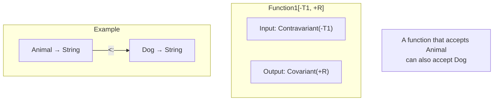


- **Covariant (+A)**: Producer role, `List[Dog] <: List[Animal]`
- **Contravariant (-A)**: Consumer role, `Printer[Animal] <: Printer[Dog]`
- **Invariant (A)**: When both read/write are needed (default)
- Function is contravariant in input, covariant in output: `Function1[-A, +B]`


**Target Audience:** Developers who understand generics
**Prerequisites:** Type parameters, inheritance hierarchy

Variance defines the subtyping relationship of type parameters. It determines how generic types behave in the inheritance hierarchy and is a core concept for writing type-safe generic code.

#### Basic Concepts

When `Dog <: Animal` (Dog is a subtype of Animal), what is the relationship between `List[Dog]` and `List[Animal]`?

- **Covariant**: `List[Dog] <: List[Animal]`
- **Contravariant**: `Printer[Animal] <: Printer[Dog]`
- **Invariant**: No relationship

```mermaid
graph LR
    subgraph "Type Relationship"
        Dog["Dog"] -->|"<:"| Animal["Animal"]
    end

    subgraph "Covariant (+A): Producer"
        ListDog["List&#91;Dog&#93;"] -->|"<:"| ListAnimal["List&#91;Animal&#93;"]
    end

    subgraph "Contravariant (-A): Consumer"
        PrinterAnimal["Printer&#91;Animal&#93;"] -->|"<:"| PrinterDog["Printer&#91;Dog&#93;"]
    end

    subgraph "Invariant (A)"
        ArrayDog["Array&#91;Dog&#93;"] -.-|"No relation"| ArrayAnimal["Array&#91;Animal&#93;"]
    end
```



*The diagram above shows how type relationships differ in three variance types (covariant, contravariant, invariant).*

> **Memory tip:**
> - **Covariant (+)**: "Same direction" - If Dog → Animal then Box[Dog] → Box[Animal]
> - **Contravariant (-)**: "Opposite direction" - If Dog → Animal then Handler[Animal] → Handler[Dog]

#### Covariance (+A)

Covariant types play a "producer" role. Suitable for types that return values, used in output positions.

```scala
// +A: Covariant
class Box[+A](val value: A)

class Animal
class Dog extends Animal
class Cat extends Animal

val dogBox: Box[Dog] = new Box(new Dog)
val animalBox: Box[Animal] = dogBox  // OK! If Dog <: Animal then Box[Dog] <: Box[Animal]

// List is also covariant
val dogs: List[Dog] = List(new Dog, new Dog)
val animals: List[Animal] = dogs  // OK!
```

**Covariance Restrictions**

Covariant type parameters cannot be used in method parameter (input) positions. This is a restriction to ensure type safety.

```scala
// Compile error!
class Box[+A](var value: A)  // var has setter, not allowed

// Compile error!
class Box[+A] {
  def set(a: A): Unit = ???  // Not allowed in parameter position
}
```

**Solution: Lower Bounds**

Using lower bounds allows method parameters to be used even in covariant types.

```scala
class Box[+A](val value: A) {
  // B >: A (B is a supertype of A)
  def set[B >: A](b: B): Box[B] = new Box(b)
}

val dogBox: Box[Dog] = new Box(new Dog)
val animalBox: Box[Animal] = dogBox.set(new Cat)  // OK!
```


- Covariant (+A): If Dog <: Animal then Box[Dog] <: Box[Animal]
- Can only be used in output (return) positions
- Can bypass input position restrictions with lower bounds


#### Contravariance (-A)

Contravariant types play a "consumer" role. Suitable for types that accept values, used in input positions.

```scala
// -A: Contravariant
trait Printer[-A] {
  def print(a: A): Unit
}

val animalPrinter: Printer[Animal] = new Printer[Animal] {
  def print(a: Animal): Unit = println(s"Animal: $a")
}

// If it can print Animal, it can also print Dog
val dogPrinter: Printer[Dog] = animalPrinter  // OK!

dogPrinter.print(new Dog)  // "Animal: Dog@..."
```

**Contravariance Restrictions**

Contravariant type parameters cannot be used in return (output) positions.

```scala
// Compile error!
trait Printer[-A] {
  def get: A  // Not allowed in return position
}
```


- Contravariant (-A): If Dog <: Animal then Printer[Animal] <: Printer[Dog]
- Can only be used in input (parameter) positions
- Suitable for consumer role types


#### Invariance (A)

Invariance is the default. Used when both reading and writing are needed, i.e., when used in both input and output positions.

```scala
// Invariant
class Container[A](var value: A)

val dogContainer: Container[Dog] = new Container(new Dog)
// val animalContainer: Container[Animal] = dogContainer  // Compile error!
```


- Invariant (A): No subtype relationship between types
- Used when both reading and writing are needed
- Default, no explicit notation required


#### Function Variance

Scala's function types are contravariant in input and covariant in output. `Function1[-A, +B]` represents a function that takes A and returns B.

```scala
// Function1[-T1, +R]
val animalToString: Animal => String = (a: Animal) => a.toString

// Dog => String is a supertype of Animal => String
val dogToString: Dog => String = animalToString

// Why? Because a function that accepts Animal can also accept Dog
```

**Intuitive Understanding**

The diagram below visualizes function type variance.



*The diagram above explains why input is contravariant and output is covariant in function types.*

> **Interpretation:** An `Animal => String` function can be used where `Dog => String` is needed.
> If it can handle Animal, it can certainly handle Dog.


- Function1[-T1, +R]: Input contravariant, output covariant
- Animal => String is a subtype of Dog => String
- Functions accepting more general input can also handle more specific input


#### Practical Examples

**Collections**

Standard library collections have appropriate variance.

```scala
// List[+A]: Covariant
val dogs: List[Dog] = List(new Dog)
val animals: List[Animal] = dogs  // OK

// Array[A]: Invariant (Java compatibility)
val dogArray: Array[Dog] = Array(new Dog)
// val animalArray: Array[Animal] = dogArray  // Compile error
```

**Observer Pattern**

Let's examine how contravariance is utilized in event handlers.

```scala
// Event handlers are contravariant
trait EventHandler[-E] {
  def handle(event: E): Unit
}

class ClickEvent
class ButtonClickEvent extends ClickEvent

val clickHandler: EventHandler[ClickEvent] =
  (event: ClickEvent) => println("Clicked!")

// ClickEvent handler can be used as ButtonClickEvent handler
val buttonHandler: EventHandler[ButtonClickEvent] = clickHandler
```


- List[+A]: Covariant, immutable collection
- Array[A]: Invariant, Java compatibility (mutable)
- EventHandler[-E]: Contravariant, event handling


#### Variance Rules Summary

The table below summarizes which variance is allowed in each position.

| Position | Covariant (+A) | Contravariant (-A) | Invariant (A) |
|----------|----------------|-------------------|---------------|
| Return type | O | X | O |
| Parameter type | X | O | O |
| val field | O | X | O |
| var field | X | X | O |

#### Best Practices

**Make Immutable Collections Covariant**

Immutable collections only produce values, so covariance is suitable.

```scala
sealed trait MyList[+A]
case object MyNil extends MyList[Nothing]
case class MyCons[+A](head: A, tail: MyList[A]) extends MyList[A]
```

**Make Callbacks/Handlers Contravariant**

Callbacks consume values, so contravariance is suitable.

```scala
trait Callback[-A] {
  def onResult(result: A): Unit
}
```

**Use Invariance When Both Read/Write Are Needed**

Use invariance when both reading and writing are needed, like mutable buffers.

```scala
class MutableBuffer[A] {
  private var items: List[A] = Nil
  def add(item: A): Unit = items = item :: items
  def get(index: Int): A = items(index)
}
```

#### Exercises

Practice variance concepts with the following exercises.

**1. Apply Variance ⭐⭐**

Apply appropriate variance to the following types:

```scala
trait Comparator[???A] {
  def compare(a: A, b: A): Int
}

trait Producer[???A] {
  def produce(): A
}

trait Transformer[???A, ???B] {
  def transform(a: A): B
}
```

<details>
<summary>Show Answer</summary>

```scala
// Used only as parameter -> Contravariant
trait Comparator[-A] {
  def compare(a: A, b: A): Int
}

// Used only as return -> Covariant
trait Producer[+A] {
  def produce(): A
}

// Input is contravariant, output is covariant
trait Transformer[-A, +B] {
  def transform(a: A): B
}
```

</details>

#### Next Steps

- [Advanced Types]() — Union, Intersection, Match Types
- [Type Classes]() — Advanced ad-hoc polymorphism
