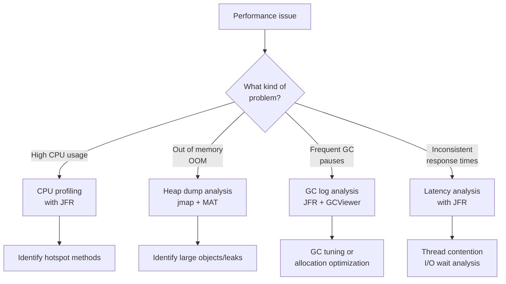

This guide walks you through finding and optimizing performance bottlenecks in Scala applications.

**Estimated time**: About 20-25 minutes


- **CPU profiling**: Identify hotspots with JFR (Java Flight Recorder)
- **Memory analysis**: Analyze heap dumps with VisualVM or MAT
- **Collection selection**: Choosing the right collection for the job can make a significant performance difference
- **Optimization techniques**: `@specialized`, `@tailrec`, avoiding boxing


---

## Problems This Guide Solves

Use this guide in the following situations:

- Your application's response time has suddenly become slow
- Memory usage is continuously increasing (suspected memory leak)
- You need to decide which collection to use from a performance perspective
- GC pauses are occurring frequently

### What This Guide Does Not Cover

- **JVM tuning (GC options, etc.)**: See the official JVM documentation
- **Distributed system performance optimization**: This is a separate topic
- **Cats Effect / ZIO performance optimization**: See the respective library documentation

---

## Before You Begin

Verify the following environment is ready:

| Item | Requirement | How to Verify |
|------|-----------|---------------|
| JDK version | 11+ (JFR included by default) | `java -version` |
| Scala version | 2.13.x or 3.x | `scala -version` |
| VisualVM (optional) | Latest version | `visualvm --version` |

```bash
# Check JDK version (JFR is included by default in JDK 11+)
java -version
# Example output: openjdk version "17.0.8"

# Install VisualVM (macOS)
brew install --cask visualvm
```

---

## Step 1: Choosing a Profiling Tool

Choose the appropriate tool based on the problem you are trying to solve:



*This diagram shows the decision flow for selecting the appropriate profiling tool based on the type of performance issue.*

---

## Step 2: CPU/Memory Profiling with JFR

### 2.1 Basic JFR Usage

JFR (Java Flight Recorder) is a low-overhead profiler built into JDK 11+:

```bash
# Attach JFR to a running application
# 1. First, find the PID
jps -l
# Example output: 12345 com.example.MyApp

# 2. Start a JFR recording (60 seconds)
jcmd 12345 JFR.start duration=60s filename=recording.jfr

# 3. Check the recording
jcmd 12345 JFR.check

# 4. Stop the recording (manual stop before duration)
jcmd 12345 JFR.stop
```

Or enable it at JVM startup:

```bash
# Enable JFR in sbt
sbt -J-XX:StartFlightRecording=duration=120s,filename=app.jfr run

# Or configure in build.sbt
javaOptions += "-XX:StartFlightRecording=duration=120s,filename=app.jfr"
```

### 2.2 Analyzing JFR Results

```bash
# Analyze with JDK Mission Control (JMC)
jmc  # Launch the GUI tool and open the .jfr file

# Quick check via CLI
jfr summary recording.jfr

# Filter events
jfr print --events jdk.CPULoad recording.jfr
jfr print --events jdk.ObjectAllocationSample recording.jfr
```

**Key events to check**:

| Event | Description |
|-------|-------------|
| `jdk.CPULoad` | CPU utilization |
| `jdk.ExecutionSample` | Hotspot methods (CPU profiling) |
| `jdk.ObjectAllocationSample` | Object allocation frequency |
| `jdk.GCPhasePause` | GC pause duration |
| `jdk.ThreadPark` | Thread wait |

---

## Step 3: Heap Dump Analysis

### 3.1 Generating a Heap Dump

```bash
# Heap dump of a running process
jmap -dump:format=b,file=heap.hprof 12345

# Automatic dump on OOM
sbt -J-XX:+HeapDumpOnOutOfMemoryError -J-XX:HeapDumpPath=./heap.hprof run
```

### 3.2 Analyzing with VisualVM

```bash
# Launch VisualVM
visualvm

# 1. File > Load... > Select heap.hprof
# 2. Check the largest objects in the Summary tab
# 3. Check classes with the most instances in the Classes tab
```

**Key things to check**:

| Indicator | Suspicious Situation |
|-----------|---------------------|
| Abnormally high instance count | Possible object leak |
| Many large arrays | Oversized collection allocation |
| Excessively many String instances | String duplication or leak |
| Instance count of the same class keeps growing | Check for non-GC'd references |

### 3.3 Common Memory Leak Patterns in Scala

```scala
// Wrong: closure captures the entire outer object
class DataProcessor {
  val largeData: Array[Byte] = new Array[Byte](100 * 1024 * 1024) // 100MB

  def getProcessor(): () => Unit = {
    // This closure holds a reference to the entire DataProcessor (including largeData)
    () => println("Processing...")
  }
}

// Correct: capture only the needed data
class DataProcessor {
  val largeData: Array[Byte] = new Array[Byte](100 * 1024 * 1024)

  def getProcessor(): () => Unit = {
    val message = "Processing..."  // Copy only the needed value locally
    () => println(message)
  }
}
```

---

## Step 4: Collection Performance Characteristics

### 4.1 Major Collection Comparison

| Operation | List | Vector | Array | ArrayBuffer |
|-----------|------|--------|-------|-------------|
| head | O(1) | O(1) | O(1) | O(1) |
| Index access | O(n) | O(log n) | **O(1)** | **O(1)** |
| append | O(n) | O(1)* | O(n) | O(1)* |
| prepend | **O(1)** | O(1)* | O(n) | O(n) |
| Traversal | O(n) | O(n) | **O(n)** | O(n) |

\* Amortized time complexity

### 4.2 Choosing Collections by Use Case

```scala
// 1. Frequent prepend/remove from front -> List
val stack = List(1, 2, 3)
val pushed = 0 :: stack        // O(1) prepend
val (head, tail) = (stack.head, stack.tail)  // O(1)

// 2. Random access needed -> Vector or Array
val indexed = Vector(1, 2, 3)
indexed(1)                     // O(log n), practically close to O(1)

// 3. Performance-critical numeric operations -> Array
val numbers = Array(1.0, 2.0, 3.0)
numbers(0)                     // O(1), no boxing (primitive)

// 4. Mutable collection needed -> ArrayBuffer
import scala.collection.mutable.ArrayBuffer
val buffer = ArrayBuffer(1, 2, 3)
buffer += 4                    // O(1) amortized append
```

### 4.3 Performance Benchmark Example

Add JMH (Java Microbenchmark Harness) to your sbt project:

```scala
// project/plugins.sbt
addSbtPlugin("pl.project13.scala" % "sbt-jmh" % "0.4.7")
```

```scala
// build.sbt
enablePlugins(JmhPlugin)
```

Benchmark code:

```scala
import org.openjdk.jmh.annotations._
import java.util.concurrent.TimeUnit

@BenchmarkMode(Array(Mode.AverageTime))
@OutputTimeUnit(TimeUnit.NANOSECONDS)
@State(Scope.Benchmark)
class CollectionBenchmark {
  val size = 10000
  val list: List[Int] = (1 to size).toList
  val vector: Vector[Int] = (1 to size).toVector
  val array: Array[Int] = (1 to size).toArray

  @Benchmark
  def listIndexAccess(): Int = list(size / 2)

  @Benchmark
  def vectorIndexAccess(): Int = vector(size / 2)

  @Benchmark
  def arrayIndexAccess(): Int = array(size / 2)
}
```

```bash
# Run the benchmark
sbt "jmh:run -i 10 -wi 5 -f 2 CollectionBenchmark"
```

---

## Step 5: Boxing/Unboxing Overhead

### 5.1 Understanding the Problem

Scala generics are type-erased on the JVM, so primitive types like `Int` and `Double` get boxed:

```scala
// Code that causes boxing
def sum[A](list: List[A])(implicit num: Numeric[A]): A = {
  list.foldLeft(num.zero)(num.plus)
  // Int gets repeatedly boxed/unboxed to java.lang.Integer
}

// Using primitive types directly avoids boxing
def sumInts(list: Array[Int]): Int = {
  var total = 0
  var i = 0
  while (i < list.length) {
    total += list(i)
    i += 1
  }
  total
}
```

### 5.2 @specialized Annotation

Generates specialized implementations for frequently used primitive types:

```scala
// Without @specialized: all types are boxed as Object
class Container[A](val value: A)

// With @specialized: separate classes generated for Int, Double, etc.
class Container[@specialized(Int, Double, Long) A](val value: A)

// No boxing when used
val intContainer = new Container[Int](42)       // Uses Container$mcI$sp
val doubleContainer = new Container[Double](3.14) // Uses Container$mcD$sp
```


In Scala 3, using opaque types instead of `@specialized` is recommended:
```scala
opaque type Meters = Double
object Meters:
  def apply(d: Double): Meters = d
  extension (m: Meters) def value: Double = m
// Handled as Double at runtime without boxing
```


---

## Step 6: Tail Recursion Optimization

### 6.1 @tailrec Annotation

Prevents stack overflow in recursive functions:

```scala
import scala.annotation.tailrec

// Wrong: not tail-recursive (stack overflow risk)
def factorial(n: Long): Long = {
  if (n <= 1) 1
  else n * factorial(n - 1)  // Multiplication after the recursive call
}

// Correct: tail-recursive (compiler transforms to a loop)
@tailrec
def factorial(n: Long, acc: Long = 1): Long = {
  if (n <= 1) acc
  else factorial(n - 1, n * acc)  // Recursive call is the last operation
}

factorial(100000)  // No stack overflow
```

### 6.2 When @tailrec Fails

```scala
import scala.annotation.tailrec

// Compilation error: could not optimize @tailrec annotated method
// Reason: the recursive call is not the last operation
// @tailrec
// def sum(list: List[Int]): Int = list match {
//   case Nil => 0
//   case head :: tail => head + sum(tail)  // + operation is last
// }

// Solution: use the accumulator pattern
@tailrec
def sum(list: List[Int], acc: Int = 0): Int = list match {
  case Nil => acc
  case head :: tail => sum(tail, acc + head)  // Recursive call is last
}
```

### 6.3 Optimizing Mutual Recursion with Trampolining

Mutual recursion cannot be optimized with `@tailrec`:

```scala
import scala.util.control.TailCalls._

def isEven(n: Long): TailRec[Boolean] = {
  if (n == 0) done(true)
  else tailcall(isOdd(n - 1))
}

def isOdd(n: Long): TailRec[Boolean] = {
  if (n == 0) done(false)
  else tailcall(isEven(n - 1))
}

// Runs without stack overflow
isEven(1000000).result  // true
```

---

## Step 7: Common Mistakes and Solutions

### 7.1 Unnecessary Intermediate Collections

```scala
// Wrong: creates 3 intermediate collections
val result = (1 to 1000000)
  .map(_ * 2)       // Intermediate collection 1
  .filter(_ > 100)  // Intermediate collection 2
  .take(10)          // Intermediate collection 3

// Correct: lazy evaluation with view
val result = (1 to 1000000).view
  .map(_ * 2)
  .filter(_ > 100)
  .take(10)
  .toList  // Only the final result is materialized

// Or use iterator
val result = (1 to 1000000).iterator
  .map(_ * 2)
  .filter(_ > 100)
  .take(10)
  .toList
```

### 7.2 String Concatenation Performance

```scala
// Wrong: O(n^2) - creates a new String on every concatenation
var result = ""
for (i <- 1 to 10000) {
  result += s"item-$i,"  // Copy on every iteration
}

// Correct: use StringBuilder - O(n)
val sb = new StringBuilder
for (i <- 1 to 10000) {
  sb.append(s"item-$i,")
}
val result = sb.toString()

// Or use mkString
val result = (1 to 10000).map(i => s"item-$i").mkString(",")
```

### 7.3 Excessive Pattern Matching Nesting

```scala
// Deeply nested matching that may affect performance
def process(data: Any): String = data match {
  case list: List[_] => list.headOption match {
    case Some(map: Map[_, _]) => map.headOption match {
      case Some((k, v)) => s"$k -> $v"
      case None => "empty map"
    }
    case _ => "not a map list"
  }
  case _ => "unknown"
}

// Simplify pattern matching with clear types
case class ProcessInput(data: List[Map[String, String]])

def process(input: ProcessInput): String = {
  input.data.headOption
    .flatMap(_.headOption)
    .map { case (k, v) => s"$k -> $v" }
    .getOrElse("empty")
}
```

---

## Checklist

Items to verify for performance optimization:

- [ ] **Have you profiled first?** - Optimize based on measurements, not guesses
- [ ] **Have you identified hotspots with JFR recording?** - Methods consuming the most CPU
- [ ] **Are there any memory leaks?** - Verify with heap dump analysis
- [ ] **Are you using appropriate collections?** - Choose the right collection for the use case
- [ ] **Is there unnecessary boxing?** - Use primitive types for numeric operations
- [ ] **Are you using view/iterator for lazy evaluation?** - Eliminate intermediate collections

**If you have checked all items and performance is still insufficient**, write JMH benchmarks to measure the exact bottleneck.

---

## Related Documents

- [Type Error Debugging](type-error-debugging/) - Resolving type-related compilation errors
- [Resolving sbt Dependency Conflicts](sbt-dependency-conflicts/) - Build dependency issues
- [Future Error Handling](future-error-handling/) - Async code performance and error handling
