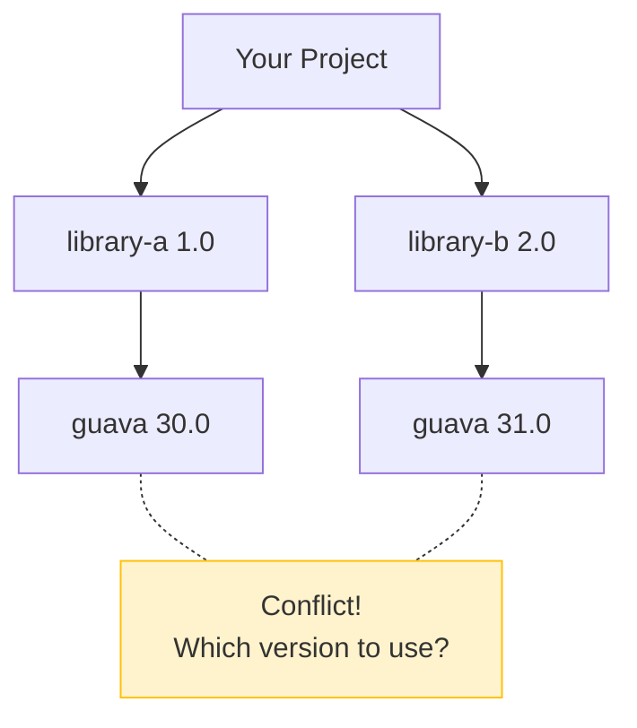
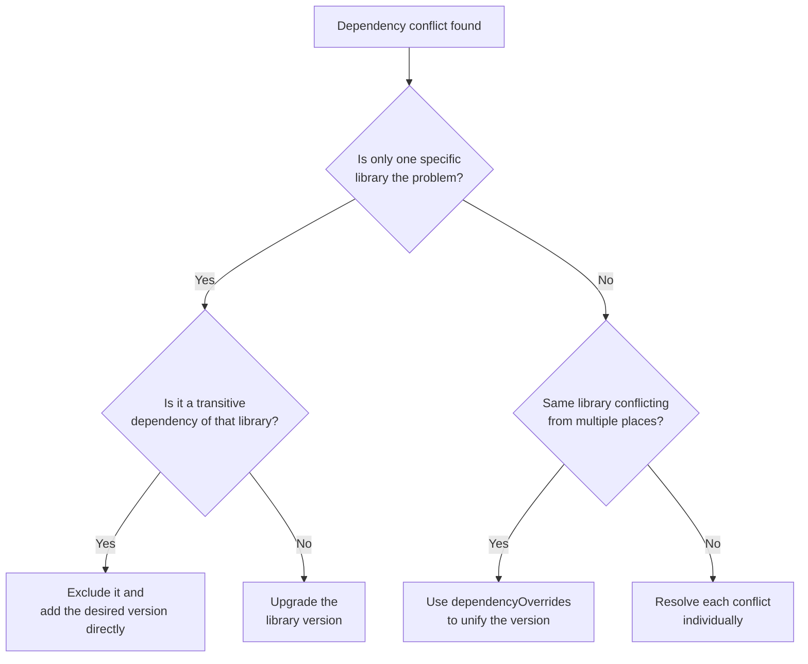

This guide walks you through diagnosing and resolving library version conflicts.

**Estimated time**: About 15-20 minutes


- **Symptom**: Compilation succeeds but `NoSuchMethodError` or `ClassNotFoundException` occurs at runtime
- **Diagnosis**: Use `sbt dependencyTree` to identify conflicting libraries
- **Resolution**: Use `exclude`, `dependencyOverrides`, or `force()`
- **Prevention**: Do not ignore eviction warnings


---

## Problems This Guide Solves

Use this guide in the following situations:

- Compilation succeeds but `NoSuchMethodError` occurs at runtime
- `ClassNotFoundException` occurs even though the library is clearly present
- Eviction warnings appear during the sbt build
- Multiple libraries require different versions of the same dependency

### Symptoms

```bash
# Compilation succeeds but error at runtime
$ sbt run
java.lang.NoSuchMethodError: 'void com.google.common.collect.ImmutableMap.forEach()'
```

```bash
# Or class not found
$ sbt run
java.lang.ClassNotFoundException: org.apache.commons.lang3.StringUtils
```

### What This Guide Does Not Cover

- **sbt basics**: See the official sbt documentation
- **Maven/Gradle dependency management**: See the respective build tool documentation
- **Scala binary compatibility**: Compatibility between Scala versions is a separate topic

---

## Before You Begin

Verify the following environment is ready:

| Item | Requirement | How to Verify |
|------|-----------|---------------|
| sbt version | 1.x | `sbt --version` |
| sbt-dependency-graph | Built-in with sbt 1.4+ | `sbt dependencyTree` |

```bash
# Check sbt version
sbt --version
# Example output: sbt version in this project: 1.9.7

# Check the dependency tree (built-in with sbt 1.4+)
sbt dependencyTree
```


If you are using an sbt version earlier than 1.4, you need to add the `sbt-dependency-graph` plugin separately:
```scala
// project/plugins.sbt
addSbtPlugin("net.virtual-void" % "sbt-dependency-graph" % "0.10.0-RC1")
```


---

## Step 1: Understanding Dependency Conflicts

### 1.1 What Are Transitive Dependencies

Dependencies that you did not declare directly but are used internally by your libraries:



### 1.2 sbt's Default Resolution Strategy

By default, sbt uses a **latest wins** strategy:

```
[warn] Found version conflict(s) in library dependencies; some are suspected to be binary incompatible:
[warn]   * com.google.guava:guava:31.0 is selected over 30.0
[warn]     +- library-b:library-b_2.13:2.0 (depends on 31.0)
[warn]     +- library-a:library-a_2.13:1.0 (depends on 30.0)
```


The latest version is not always compatible. If the major versions differ, the API may have changed.


---

## Step 2: Diagnosing Conflicts

### 2.1 Check the Full Tree with dependencyTree

```bash
# Print the full dependency tree
sbt dependencyTree

# Search for a specific library (when output is long)
sbt "dependencyTree" | grep guava
```

Example output:

```
[info] my-project:my-project_2.13:0.1.0 [S]
[info]   +-library-a:library-a_2.13:1.0 [S]
[info]   | +-com.google.guava:guava:30.0
[info]   |
[info]   +-library-b:library-b_2.13:2.0 [S]
[info]     +-com.google.guava:guava:31.0 (evicted)
```

### 2.2 Interpreting Eviction Warnings

Eviction means sbt automatically resolved a conflict:

| Warning Level | Meaning | Action |
|--------------|---------|--------|
| `(evicted)` | An older version was excluded | Verify compatibility |
| `binary incompatible` | Suspected binary incompatibility | **Resolve immediately** |
| `semver` violation | Semantic versioning rule violated | Resolution recommended |

### 2.3 evictionCheck Command

In sbt 1.5+, you can enforce strict eviction checks:

```scala
// build.sbt
ThisBuild / evictionErrorLevel := Level.Error  // Treat evictions as errors
```

```bash
sbt evicted
# Outputs all evictions
```

---

## Step 3: Resolution Methods

### 3.1 exclude - Remove a Specific Transitive Dependency

Exclude a specific dependency that a library brings in:

```scala
// build.sbt
libraryDependencies ++= Seq(
  "library-a" %% "library-a" % "1.0" exclude("com.google.guava", "guava"),
  "library-b" %% "library-b" % "2.0"  // Uses guava 31.0
)
```

To exclude multiple dependencies:

```scala
// build.sbt
libraryDependencies += ("library-a" %% "library-a" % "1.0")
  .exclude("com.google.guava", "guava")
  .exclude("org.slf4j", "slf4j-log4j12")
```

### 3.2 dependencyOverrides - Force a Specific Version

Force a specific version of a library across the entire project:

```scala
// build.sbt
dependencyOverrides ++= Seq(
  "com.google.guava" % "guava" % "31.0-jre",
  "org.apache.commons" % "commons-lang3" % "3.14.0"
)
```


`dependencyOverrides` is powerful but can be dangerous. Make sure the forced version is compatible with all your libraries.


### 3.3 force() - Force an Individual Dependency


`force()` is deprecated in sbt 1.x. Use `dependencyOverrides` instead.


```scala
// build.sbt (legacy approach)
libraryDependencies += "com.google.guava" % "guava" % "31.0-jre" force()
```

### 3.4 Resolution Method Selection Guide



---

## Step 4: Transitive Dependency Management Strategies

### 4.1 Using a BOM (Bill of Materials)

Some library ecosystems provide a BOM to manage versions collectively:

```scala
// build.sbt - AWS SDK BOM example
dependencyOverrides ++= Seq(
  "software.amazon.awssdk" % "bom" % "2.21.0"
)
```

### 4.2 Dependency Locking

Lock dependency versions for reproducible builds:

```scala
// project/plugins.sbt
addSbtPlugin("ch.epfl.scala" % "sbt-dependency-lock" % "0.1.0")
```

```bash
# Generate a dependency lock file
sbt dependencyLockWrite

# Compare the lock file with the current state
sbt dependencyLockCheck
```

### 4.3 Regular Dependency Updates

```scala
// project/plugins.sbt
addSbtPlugin("com.timushev.sbt" % "sbt-updates" % "0.6.4")
```

```bash
# Check for available dependency updates
sbt dependencyUpdates
```

Example output:

```
[info] Found 3 dependency updates for my-project
[info]   com.google.guava:guava                : 30.0-jre -> 31.0-jre -> 32.1.3-jre
[info]   org.apache.commons:commons-lang3      : 3.12.0   -> 3.14.0
[info]   io.circe:circe-core                   : 0.14.5   -> 0.14.7
```

---

## Step 5: Common Mistakes and Solutions

### 5.1 Scala Binary Version Conflict

```
[error] Modules were resolved with conflicting cross-version suffixes in ...
[error]   org.typelevel:cats-core _2.12, _2.13
```

**Cause**: Libraries built for Scala 2.12 and 2.13 are mixed together.

**Solution**: Unify the Scala version across all libraries:

```scala
// build.sbt
scalaVersion := "2.13.12"

// The %% operator automatically selects the correct Scala version
libraryDependencies += "org.typelevel" %% "cats-core" % "2.10.0"
```

### 5.2 Runtime Classpath Issues

The classpath at compile time and runtime may differ:

```bash
# Check the runtime classpath
sbt "show runtime:fullClasspath"

# Find which JAR contains a specific class
sbt "show runtime:fullClasspath" | xargs -I{} jar tf {} | grep StringUtils
```

### 5.3 SLF4J Binding Conflicts

Logging framework conflicts are among the most common issues:

```
SLF4J: Class path contains multiple SLF4J bindings.
SLF4J: Found binding in [jar:file:logback-classic-1.4.11.jar]
SLF4J: Found binding in [jar:file:slf4j-log4j12-1.7.36.jar]
```

**Solution**: Keep only one binding and exclude the rest:

```scala
// build.sbt - if you want to use logback
libraryDependencies ++= Seq(
  "ch.qos.logback" % "logback-classic" % "1.4.11",
  "some-library" %% "some-library" % "1.0" exclude("org.slf4j", "slf4j-log4j12")
)

// To exclude a specific dependency from all libraries
excludeDependencies += ExclusionRule("org.slf4j", "slf4j-log4j12")
```

---

## Checklist

Items to verify when resolving dependency conflicts:

- [ ] **Have you checked conflicts with `sbt dependencyTree`?** - Identify conflicting libraries and paths
- [ ] **Have you reviewed eviction warnings?** - `sbt evicted`
- [ ] **Have you verified binary compatibility?** - Be cautious of major version differences
- [ ] **Have you tested at runtime after resolving?** - Compilation success does not guarantee runtime success
- [ ] **Is there only one SLF4J binding?** - Check for logging conflicts

**If you have checked all items and the issue persists**, use `sbt "show runtime:fullClasspath"` to inspect the actual runtime classpath.

---

## Related Documents

- [Type Error Debugging](type-error-debugging/) - Resolving compile-time errors
- [Implicit/Given Debugging](implicit-debugging/) - Resolving implicit value errors
- [Future Error Handling](future-error-handling/) - Error handling in asynchronous code
