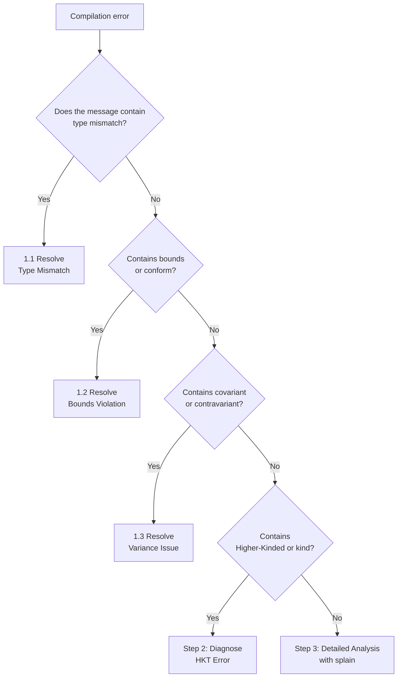

This guide walks you through decoding and resolving complex type error messages.

**Estimated time**: About 15-20 minutes


- **Type Mismatch**: Compare expected and actual types to find where the mismatch occurs
- **Bounds violation**: Check upper/lower bound constraints on type parameters
- **Variance issues**: Verify that the correct types appear in covariant/contravariant positions
- **splain plugin**: Transforms complex type errors into a more readable format


---

## Problems This Guide Solves

Use this guide when you encounter the following compilation errors:

```
type mismatch;
 found   : List[String]
 required: List[Int]
```

```
type arguments [Dog] do not conform to method process's
type parameter bounds [A <: Animal with Serializable]
```

```
covariant type A occurs in contravariant position in type A => Unit
```

### What This Guide Does Not Cover

- **Type system fundamentals**: See [Type System Concepts]()
- **Implicit value errors**: See [Implicit/Given Debugging]()
- **Macro/reflection errors**: See the relevant library documentation

---

## Before You Begin

Verify the following environment is ready:

| Item | Requirement | How to Verify |
|------|-----------|---------------|
| Scala version | 2.13.x or 3.x | `scala -version` |
| Build tool | sbt 1.x | `sbt --version` |
| IDE (optional) | IntelliJ IDEA + Scala plugin or VS Code + Metals | - |

---

## Step 1: Type Error Diagnosis Flow

Follow this flowchart to first identify the error type:



---

## Step 2: Common Type Error Patterns

### 2.1 Type Mismatch

The most common type error. It occurs when the type the compiler expects differs from the actual type:

```scala
// Error: type mismatch; found: String, required: Int
def add(a: Int, b: Int): Int = a + b
add(1, "2")  // Passing a String where an Int is expected
```

**How to read the error message**:

| Keyword | Meaning |
|---------|---------|
| `found` | The type that was actually passed (or inferred) |
| `required` | The type the compiler expects |

In complex generic types, the difference can be hard to spot:

```scala
// Error: type mismatch
//   found   : Map[String, List[Option[Int]]]
//   required: Map[String, List[Option[String]]]
def process(data: Map[String, List[Option[String]]]): Unit = {}

val input: Map[String, List[Option[Int]]] = Map("key" -> List(Some(1)))
process(input)  // Deeply nested type parameter mismatch
```

**Solution**: Compare `found` and `required` level by level to find the difference. In the example above, `Option[Int]` vs `Option[String]` is the point of mismatch.

### 2.2 Bounds Violation

Occurs when type parameters have upper (`<:`) or lower (`>:`) bound constraints:



```scala
trait Animal
trait Serializable
class Dog extends Animal  // Does not implement Serializable

def process[A <: Animal with Serializable](animal: A): Unit = {}

process(new Dog)
// Error: type arguments [Dog] do not conform to
// method process's type parameter bounds [A <: Animal with Serializable]
```

**Solution**: Modify the class to satisfy the type constraints:

```scala
class Dog extends Animal with Serializable  // Implements both traits
process(new Dog)  // Works correctly
```


```scala
trait Animal
trait Serializable
class Dog extends Animal  // Does not implement Serializable

def process[A <: Animal & Serializable](animal: A): Unit = {}

process(Dog())
// Error: Type argument Dog does not conform to upper bound Animal & Serializable

// Solution: implement both traits
class Dog extends Animal, Serializable
process(Dog())  // Works correctly
```



### 2.3 Variance Issues

Occurs when a type parameter is used in the wrong covariant (`+A`) / contravariant (`-A`) position:

```scala
// Error: covariant type A occurs in contravariant position
class Container[+A] {
  def add(item: A): Unit = {}  // A is used in a method parameter (contravariant position)
}
```

**Solution**: Use a lower bound to work around it:

```scala
class Container[+A] {
  def add[B >: A](item: B): Container[B] = {
    // B is a supertype of A
    new Container[B]
  }
}

val dogs: Container[Dog] = new Container[Dog]
val animals: Container[Animal] = dogs  // Allowed because of covariance
```

---

## Step 3: Detailed Compiler Message Analysis

### 3.1 splain Plugin (Scala 2)

Transforms complex type errors into a more readable format:

```scala
// build.sbt (Scala 2.13)
addCompilerPlugin("io.tryp" % "splain" % "1.1.0" cross CrossVersion.full)
```

Without splain:

```
found   : shapeless.::[Int, shapeless.::[String, shapeless.HNil]]
required: shapeless.::[String, shapeless.::[Int, shapeless.HNil]]
```

With splain:

```
found   : Int :: String :: HNil
required: String :: Int :: HNil
          ^^^      ^^^
```

### 3.2 Enhanced Error Messages in Scala 3

Scala 3 provides more detailed diagnostics by default:

```
-- [E007] Type Mismatch Error: example.scala:10:15 ---
10 |  process(input)
   |          ^^^^^
   |  Found:    Map[String, List[Option[Int]]]
   |  Required: Map[String, List[Option[String]]]
   |
   |  Note: the type parameter difference is at:
   |    Option[Int] vs Option[String]
```

### 3.3 -Xprint:typer Flag

To inspect the types inferred by the compiler, use the following flag:

```scala
// build.sbt
scalacOptions += "-Xprint:typer"
```

The output can be very long, so it is recommended to target only the file in question:

```bash
# Compile a specific file and inspect types
sbt "compile:doc"
# Or in the REPL
scala -Xprint:typer -e "val x = List(1, 2, 3).map(_ + 1)"
```

---

## Step 4: Diagnosing Higher-Kinded Type (HKT) Errors

### 4.1 Kind Mismatch

```scala
// F is a type constructor (e.g., List, Option)
trait Functor[F[_]] {
  def map[A, B](fa: F[A])(f: A => B): F[B]
}

// Error: Map takes two type parameters, expected: one
// Map[String, *] doesn't fit F[_]
// implicit val mapFunctor: Functor[Map] = ???  // Won't compile
```

**Solution**: Use a type alias to fix the kind:



```scala
// Type lambda (kind-projector plugin)
// addCompilerPlugin("org.typelevel" % "kind-projector" % "0.13.3" cross CrossVersion.full)

implicit val mapFunctor: Functor[Map[String, *]] = new Functor[Map[String, *]] {
  def map[A, B](fa: Map[String, A])(f: A => B): Map[String, B] = fa.view.mapValues(f).toMap
}

// Or use a type alias
type StringMap[A] = Map[String, A]
implicit val mapFunctor: Functor[StringMap] = new Functor[StringMap] {
  def map[A, B](fa: StringMap[A])(f: A => B): StringMap[B] = fa.view.mapValues(f).toMap
}
```


```scala
// Scala 3 native type lambda
given Functor[[A] =>> Map[String, A]] with
  def map[A, B](fa: Map[String, A])(f: A => B): Map[String, B] =
    fa.view.mapValues(f).toMap
```



### 4.2 Type Inference Failure

When the compiler cannot infer types, add explicit type annotations:

```scala
// Error: missing parameter type
val result = List(1, 2, 3).foldLeft(Map.empty)((acc, x) => acc + (x.toString -> x))

// Solution: specify the type of the initial value
val result = List(1, 2, 3).foldLeft(Map.empty[String, Int])((acc, x) =>
  acc + (x.toString -> x)
)
```

General type annotation strategies:

| Situation | Strategy |
|-----------|----------|
| `foldLeft`/`foldRight` initial value | Specify the type on the initial value |
| Empty collections | Use `List.empty[Type]` |
| Inference failure during method chaining | Add type annotations on intermediate results |
| Lambda parameters | Use `(x: Type) => ...` explicitly |
| Generic method calls | Specify type arguments: `method[Type](...)` |

```scala
// When the compiler fails to infer types
def transform[A, B](list: List[A])(f: A => B): List[B] = list.map(f)

// Error: missing parameter type for expanded function
// transform(List(1, 2, 3))(x => x.toString)

// Solution 1: specify the type on the lambda parameter
transform(List(1, 2, 3))((x: Int) => x.toString)

// Solution 2: specify the type arguments
transform[Int, String](List(1, 2, 3))(x => x.toString)
```

---

## Step 5: Common Mistakes and Solutions

### 5.1 Nothing Type Inference

```scala
// Wrong: Nothing is inferred for empty collections
val map = Map.empty  // Inferred as Map[Nothing, Nothing]
map + ("key" -> 1)   // Error: type mismatch

// Correct: specify the type
val map = Map.empty[String, Int]
map + ("key" -> 1)   // Works correctly
```

### 5.2 Path-Dependent Type Confusion

```scala
class Outer {
  class Inner
  def process(inner: Inner): Unit = {}
}

val a = new Outer
val b = new Outer
val innerA = new a.Inner

// Error: type mismatch; found: a.Inner, required: b.Inner
// b.process(innerA)

// Solution: use the same instance's Inner or use a type projection
def processAny(inner: Outer#Inner): Unit = {}
processAny(innerA)  // Works correctly
```

### 5.3 Type Erasure

```scala
// Warning: non-variable type argument String in type pattern
// List[String] is unchecked since it is eliminated by erasure
def process(list: Any): Unit = list match {
  case l: List[String] => println("String list")  // Cannot be checked at runtime
  case _ => println("Other")
}

// Solution: use TypeTag or ClassTag
import scala.reflect.ClassTag

def process[A: ClassTag](list: List[A]): Unit = {
  val clazz = implicitly[ClassTag[A]].runtimeClass
  println(s"List of ${clazz.getSimpleName}")
}
```

---

## Checklist

When you encounter a type error, verify the following:

- [ ] **Have you compared found and required level by level?** - Find the difference in nested types
- [ ] **Do the type parameter bounds satisfy?** - Check upper/lower bound constraints
- [ ] **Are covariant/contravariant positions correct?** - Method parameters vs return types
- [ ] **Have you added explicit annotations where type inference fails?** - `foldLeft`, empty collections, etc.
- [ ] **Have you tried the splain plugin?** - Decode complex error messages (Scala 2)

**If you have checked all items and still cannot resolve the issue**, share a minimal reproduction in Scastie (https://scastie.scala-lang.org).

---

## Related Documents

- [Type System]() - Scala type system fundamentals
- [Implicit/Given Debugging]() - Resolving implicit value errors
- [Future Error Handling]() - Error handling in asynchronous code
