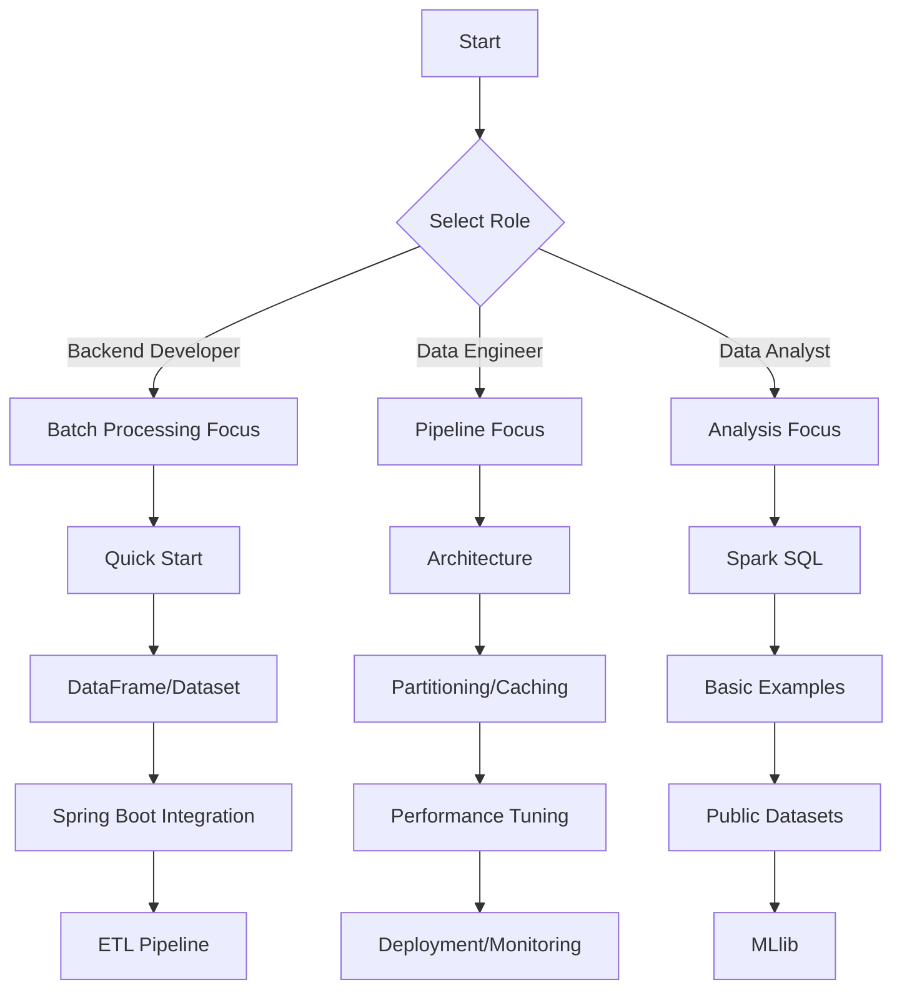

Apache Spark is a **unified analytics engine for large-scale data processing**. It provides processing speeds up to 100x faster in memory and 10x faster on disk compared to Hadoop MapReduce, supporting multiple languages including Java, Scala, Python, and R.

Spark is called a "unified" engine because it handles batch processing, real-time streaming, machine learning, and graph analysis all on a single platform.

**Why Do You Need Spark?**

Let's consider common situations Java/Spring developers face when dealing with large-scale data:

| Problems with Traditional Approaches | Spark's Solutions |
|-------------------------------------|-------------------|
| OOM when processing millions of records with for loops | Distributed processing across multiple nodes |
| Memory exhaustion with JDBC for large queries | Lazy evaluation processes only needed data |
| Complex aggregation queries overload the DB | Analysis processing in Spark without DB load |
| Batch and real-time processing require separate systems | Same API for both batch and streaming |
| Different tools needed for each data pipeline | SQL, DataFrame, ML all unified in one API |

As shown above, Spark effectively solves problems like memory shortage, DB load, and system fragmentation through distributed processing and unified APIs.

**Key Features of Spark**

Spark provides four key capabilities:

**1. In-Memory Computing**
Intermediate results are stored in memory rather than disk, providing dramatic performance improvements for iterative operations. This is especially effective for machine learning algorithms that repeatedly process the same data.

**2. Lazy Evaluation**
Transformation operations are not executed immediately when called. Instead, when an Action is triggered, the execution plan is optimized before processing. This helps eliminate unnecessary computations and build efficient execution plans.

**3. Fault Tolerance**
Through RDD lineage information, data loss triggers automatic recomputation. Reliable processing is possible without checkpoints.

**4. Unified Stack**
- **Spark SQL**: Structured data processing
- **Structured Streaming**: Real-time stream processing
- **MLlib**: Distributed machine learning
- **GraphX**: Graph analysis

**When Should You Use Spark?**

When considering Spark adoption, evaluate based on data scale and processing complexity.

**Suitable cases:**
- When processing large-scale data (tens of GBs or more)
- Building complex ETL (Extract-Transform-Load) pipelines
- Training machine learning models on massive datasets
- When real-time and batch processing need to be unified
- Running analytical queries on data lakes

**May be overkill:**
- Data is a few GB or less and can be processed on a single server
- Simple CRUD operations are the main workload
- Real-time processing requiring millisecond-level ultra-low latency
- Team lacks distributed systems experience and timeline is tight

## What This Guide Covers

This guide is structured step-by-step so Java/Spring developers can apply Spark in practice.

**[Quick Start](quick-start/)**
Run a Spark application in 5 minutes. See working code before concepts.

**[Concepts](concepts/)**

Explains Spark's core principles from a **Java/Spring developer's perspective**. The table below summarizes topics covered in each concept document:

| Topic | What You'll Learn |
|-------|-------------------|
| [Architecture](concepts/architecture/) | Roles and operation of Driver, Executor, Cluster Manager |
| [RDD Basics](concepts/rdd/) | Spark's basic abstraction, distributed collection concepts |
| [DataFrame and Dataset](concepts/dataframe-dataset/) | Modern type-safe distributed data processing API |
| [Spark SQL](concepts/spark-sql/) | Querying distributed data with SQL |
| [Transformations and Actions](concepts/transformations-actions/) | Difference between lazy evaluation and immediate execution |
| [Partitioning and Shuffle](concepts/partitioning/) | Core of distributed processing, data distribution strategies |
| [Caching and Persistence](concepts/caching/) | Leveraging in-memory processing |
| [Structured Streaming](concepts/structured-streaming/) | Real-time stream data processing |
| [MLlib](concepts/mllib/) | Machine learning in distributed environments |
| [Performance Tuning](concepts/tuning/) | Memory, partition, shuffle optimization |
| [Deployment and Cluster Management](concepts/deployment/) | Standalone, YARN, Kubernetes configuration |

Learning these concepts in order will give you a systematic understanding of Spark's internals.

**[Hands-on Examples](examples/)**

Executable example code based on Spring Boot. Learn through practice from environment setup to basic data processing:

- [Environment Setup](examples/setup/) - Java/Spring Boot and Spark integration setup
- [Basic Examples](examples/basic/) - Fundamentals of data loading, transformation, aggregation

**[How-To Guides](howto/)**

Step-by-step guides for solving specific problems:
- [Troubleshooting OutOfMemoryError](howto/oom-troubleshooting/) - Diagnosing and resolving memory errors
- [Resolving Data Skew](howto/data-skew/) - Fixing partition imbalance
- [Optimizing Shuffle](howto/shuffle-optimization/) - Minimizing network I/O

**[Appendix](appendix/)**

Reference materials for use during learning:
- [Glossary](appendix/glossary/) - Quick reference for Spark terms
- [FAQ](appendix/faq/) - Frequently asked questions
- [References](appendix/references/) - Official docs and additional learning resources

## Spark vs Hadoop MapReduce

Comparing Spark with Hadoop MapReduce helps understand Spark's position:

| Aspect | Hadoop MapReduce | Apache Spark |
|--------|-----------------|--------------|
| Processing Model | Disk-based | Memory-based |
| Iterative Operations | Disk I/O every time | Cache in memory and reuse |
| Processing Speed | Baseline | 10-100x faster |
| Real-time Processing | Not supported | Structured Streaming |
| API Level | Low-level (Map, Reduce) | High-level (SQL, DataFrame) |
| Language Support | Mainly Java | Java, Scala, Python, R |
| Learning Curve | Steep | Relatively gentle |

As shown in the table above, Spark provides significant performance improvements and development convenience over MapReduce through memory-based processing and high-level APIs.

> **Note:** Spark doesn't replace Hadoop but can run on top of the Hadoop ecosystem (HDFS, YARN). Many companies use HDFS for storage and Spark as the processing engine.

## Prerequisites

The following knowledge is required to effectively learn from this guide:

- **Required**: Java basics, Collections API (Stream, Lambda)
- **Helpful**: SQL basics, Spring Boot experience, basic distributed systems concepts

## Learning Path Guide

Efficient learning order varies by role and goals. The diagram below shows recommended learning paths by role:

**Learning Paths by Role**



**Documents by Difficulty**

Each document has different difficulty levels and estimated learning times. Use the table below to start with documents matching your current level:

| Document | Difficulty | Est. Time | Prerequisites |
|----------|------------|-----------|---------------|
| **Quick Start** | ⭐ Beginner | 30 min | None |
| **Architecture** | ⭐ Beginner | 45 min | None |
| **RDD Basics** | ⭐ Beginner | 30 min | None |
| **DataFrame/Dataset** | ⭐⭐ Basic | 60 min | Quick Start |
| **Spark SQL** | ⭐⭐ Basic | 45 min | DataFrame |
| **Transformation/Action** | ⭐⭐ Basic | 30 min | RDD or DataFrame |
| **Basic Examples** | ⭐⭐ Basic | 60 min | DataFrame, Spark SQL |
| **Partitioning and Shuffle** | ⭐⭐⭐ Intermediate | 60 min | Architecture, Transformation |
| **Caching and Persistence** | ⭐⭐⭐ Intermediate | 30 min | Partitioning |
| **Spring Boot Integration** | ⭐⭐⭐ Intermediate | 90 min | Basic Examples |
| **Monitoring** | ⭐⭐⭐ Intermediate | 60 min | Architecture |
| **Performance Tuning** | ⭐⭐⭐⭐ Advanced | 90 min | Partitioning, Caching |
| **Structured Streaming** | ⭐⭐⭐⭐ Advanced | 90 min | DataFrame, Partitioning |
| **ETL Pipeline** | ⭐⭐⭐⭐ Advanced | 120 min | Spring Boot, Basic Examples |
| **MLlib** | ⭐⭐⭐⭐ Advanced | 90 min | DataFrame, SQL |
| **Deployment** | ⭐⭐⭐⭐ Advanced | 60 min | Architecture, Performance Tuning |
| **Spark Connect** | ⭐⭐⭐⭐⭐ Expert | 45 min | Deployment |

**Recommended Paths by Goal**

If you need a concrete learning schedule, refer to the weekly plan below:

**Week 1 - Building Foundations (Beginners)**
```
Day 1-2: Quick Start → Architecture
Day 3-4: DataFrame/Dataset → Spark SQL
Day 5:   Transformation/Action → Basic Examples
```

**Week 2 - Production Application (Intermediate)**
```
Day 1-2: Spring Boot Integration → Monitoring
Day 3-4: Partitioning → Caching → Performance Tuning
Day 5:   ETL Pipeline
```

**Week 3 - Advanced Features (Advanced)**
```
Day 1-2: Structured Streaming
Day 3-4: MLlib
Day 5:   Deployment → Spark Connect
```

Each document can be read independently, but we recommend the order above if you're new.

## Common Misconceptions

Here are common misconceptions about Spark:

**"Spark requires Hadoop"** — No. Spark can run in Standalone mode, Kubernetes, YARN, and various other environments. For local development, you can run it directly without Hadoop.

**"Spark should only be used with Scala"** — No. The Java API is fully supported, and this guide provides Java examples for Java/Spring developers. However, since Spark itself is written in Scala, some advanced features are more concise in Scala.

**"Spark can't do real-time processing"** — No. Through Structured Streaming, micro-batch processing at millisecond to second intervals is possible. However, it has different characteristics from pure streaming engines like Kafka Streams or Flink.

**"Spark is only for big data"** — In development/test environments, you can process small-scale data in local mode. The advantage of Spark is that you can develop locally and process at scale on a cluster without code changes.
