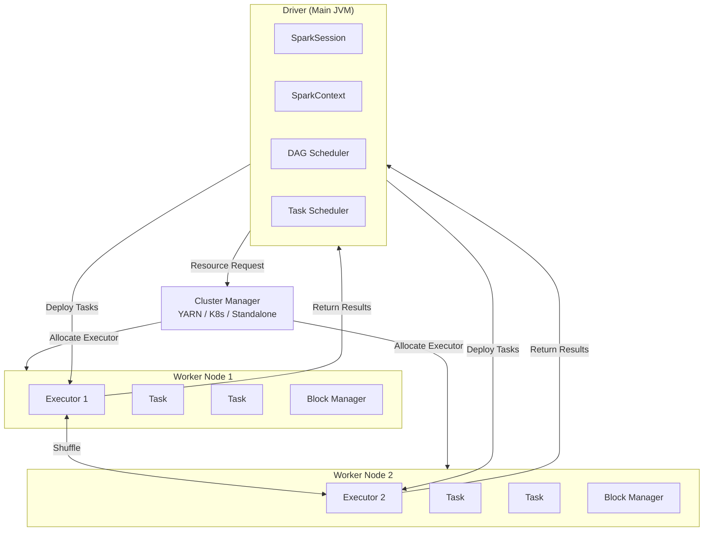
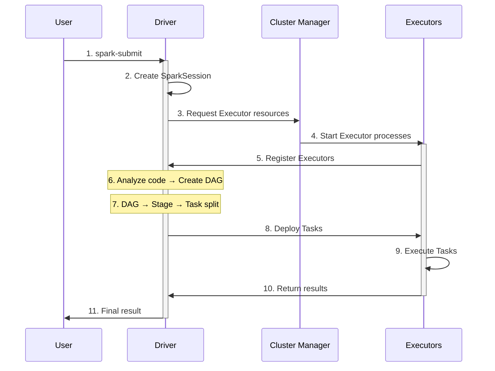
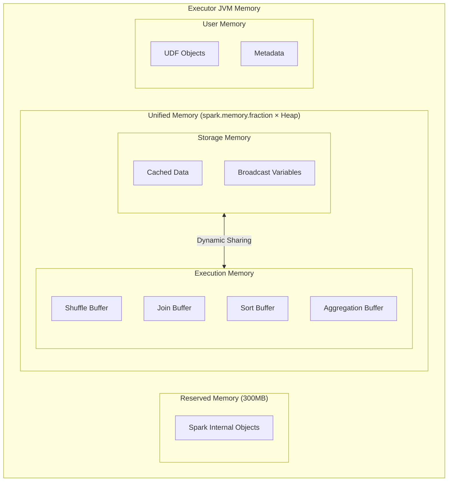

# Spark Architecture

Understand how Spark applications run in a distributed environment. We'll explain using concepts familiar to Java/Spring developers.

## Core Components

A Spark cluster consists of three main components:



### 1. Driver

The **Driver** is the central coordinator of a Spark application. It's the JVM process where the `main()` method runs.

```java
// This code runs on the Driver
public static void main(String[] args) {
    SparkSession spark = SparkSession.builder()
            .appName("MyApp")
            .master("local[*]")
            .getOrCreate();

    // Driver starts when SparkSession is created
    Dataset<Row> df = spark.read().csv("data.csv");
    df.show();  // When Action is called, work is distributed to Executors
}
```

**Driver Responsibilities:**
- Create and manage `SparkSession`/`SparkContext`
- Analyze user code's Transformations to create execution plan (DAG)
- Split execution plan into Stages and Tasks
- Request resources from Cluster Manager
- Deploy Tasks to Executors and monitor progress
- Collect results and return to user

**From a Java Developer's Perspective:**
The Driver is similar to a Spring application's main context. All configuration and coordination happens here, while actual work is performed by Executors (workers).

### 2. Executor

**Executors** are JVM processes running on worker nodes in the cluster. They handle actual data processing.

**Executor Responsibilities:**
- Execute Tasks assigned by the Driver
- Store data in memory or disk (caching)
- Return processing results to Driver
- Persist throughout application lifetime

**Characteristics:**
- Multiple Executors can be assigned to one application
- Each Executor is isolated as an independent JVM
- Runs multiple Tasks in parallel based on core count
- Data movement between Executors occurs through shuffle

```
┌─────────────────────────────────────────────────────┐
│                    Executor JVM                      │
│  ┌──────────┐ ┌──────────┐ ┌──────────┐            │
│  │  Task 1  │ │  Task 2  │ │  Task 3  │  ...       │
│  └──────────┘ └──────────┘ └──────────┘            │
│                                                      │
│  ┌─────────────────────────────────────────────┐   │
│  │              Block Manager                   │   │
│  │           (Cached Data Storage)              │   │
│  └─────────────────────────────────────────────┘   │
└─────────────────────────────────────────────────────┘
```

### 3. Cluster Manager

The **Cluster Manager** manages resources across the entire cluster. It allocates Executors based on Driver requests.

**Supported Cluster Managers:**

| Type | Characteristics | When to Use |
|------|-----------------|-------------|
| **Standalone** | Built into Spark, simple setup | Small clusters, learning |
| **YARN** | Hadoop ecosystem integration | When using existing Hadoop cluster |
| **Kubernetes** | Container-based, flexible scaling | Cloud-native environments |
| **Mesos** | General-purpose resource management | Mixed workloads |
| **Local** | Single JVM | Development/testing |

**Local Mode vs Cluster Mode:**

```java
// Local mode - for development/testing
.master("local[*]")      // Driver and Executor in same JVM

// Cluster mode - for production
.master("spark://host:7077")  // Standalone
.master("yarn")               // YARN
.master("k8s://https://...")  // Kubernetes
```

## Application Execution Flow

When a Spark application is submitted, it executes in the following order:



## Job, Stage, Task

When an Action is called, Spark internally divides work into a Job → Stage → Task hierarchy.

### Job

A **Job** is the complete computation unit corresponding to one Action.

```java
// Each Action creates one Job
df.count();         // Job 1
df.collect();       // Job 2
df.write().csv();   // Job 3
```

### Stage

A **Stage** is a set of Tasks divided by shuffle boundaries.

- **Narrow Transformation** (map, filter): Pipelined within same Stage
- **Wide Transformation** (groupBy, join): Shuffle occurs → New Stage created

```java
df.filter(col("age").gt(30))     // Narrow - included in Stage 1
  .groupBy("department")          // Wide - Stage boundary here
  .count()                        // Stage 2
  .show();                        // Action → Execute Job
```

### Task

A **Task** is the smallest unit of work executed on a single partition.

- Number of partitions = Number of Tasks
- Each Task runs independently on an Executor
- Tasks are serialized and sent to Executors

```
Example: 4 partitions, 2 Stages

Stage 1: [Task 1-1] [Task 1-2] [Task 1-3] [Task 1-4]
              ↓          ↓          ↓          ↓
         (Shuffle - Data Redistribution)
              ↓          ↓          ↓          ↓
Stage 2: [Task 2-1] [Task 2-2] [Task 2-3] [Task 2-4]
```

## DAG (Directed Acyclic Graph)

Spark represents Transformations as a **DAG**. This is a directed acyclic graph showing the dependency relationships between operations.

```java
Dataset<Row> df1 = spark.read().csv("file1.csv");
Dataset<Row> df2 = spark.read().csv("file2.csv");

Dataset<Row> filtered = df1.filter(col("status").equalTo("ACTIVE"));
Dataset<Row> joined = filtered.join(df2, "id");
Dataset<Row> result = joined.groupBy("category").count();

result.show();  // Action → Execute DAG
```

**DAG Structure:**
```
[Read df1] → [filter] ─┐
                       ├→ [join] → [groupBy] → [count] → [show]
[Read df2] ────────────┘
```

**DAG Benefits:**

1. **Lazy Evaluation**: No execution until Action
2. **Optimization**: Catalyst Optimizer analyzes DAG to optimize execution plan
3. **Fault Recovery**: Can recompute along DAG when partition is lost

## Understanding from a Java Developer's Perspective

### Comparison with Spring

| Spring Application | Spark Application |
|-------------------|-------------------|
| Spring Container | SparkSession |
| Main Thread | Driver |
| Thread Pool Worker | Executor |
| ExecutorService | Cluster Manager |
| Runnable/Callable | Task |
| CompletableFuture | Job/Stage |

### Distributed Processing Perspective

```java
// Regular Java code (single JVM)
List<Employee> employees = loadAll();
List<Employee> highPaid = employees.stream()
    .filter(e -> e.getSalary() > 100000)
    .collect(Collectors.toList());

// Spark code (distributed processing)
Dataset<Row> employees = spark.read().parquet("employees");
Dataset<Row> highPaid = employees
    .filter(col("salary").gt(100000));
```

Key differences:
1. **Data Location**: Java loads all data into memory; Spark distributes data across storage nodes
2. **Execution Location**: Java runs in a single JVM; Spark distributes work across multiple Executors
3. **Failure Handling**: Java fails on exception; Spark automatically retries failed tasks

## Memory Model (Unified Memory Management)

**Unified Memory Management**, introduced in Spark 1.6, dynamically shares execution and storage memory.

### Executor Memory Structure



### Memory Region Roles

| Region | Ratio (Default) | Purpose |
|--------|-----------------|---------|
| **Reserved** | 300MB fixed | Spark internal objects, OOM prevention buffer |
| **Unified Memory** | Heap × 0.6 | Shared between execution and storage |
| ├─ Storage | Dynamic (initial 50%) | Cache, broadcast, unrolling |
| └─ Execution | Dynamic (initial 50%) | Shuffle, join, sort, aggregation |
| **User Memory** | Heap × 0.4 | User code, UDFs, RDD metadata |

### Dynamic Memory Sharing

**Core Principle**: When Execution memory is insufficient, it borrows from Storage memory, and vice versa.

```java
// Memory configuration example
SparkSession spark = SparkSession.builder()
    .config("spark.memory.fraction", "0.6")           // Unified Memory ratio
    .config("spark.memory.storageFraction", "0.5")    // Storage initial ratio
    .getOrCreate();
```

**How It Works:**

1. **Execution → Storage borrowing**: Use cache space when shuffle runs low on memory
2. **Storage → Execution borrowing**: Use execution space when caching runs low on memory
3. **Priority**: Execution takes priority - cache data evicted when needed

### Memory Calculation Example

```
Executor Memory: 8GB
├── Reserved: 300MB
├── Unified Memory: (8GB - 300MB) × 0.6 = 4.6GB
│   ├── Storage (initial): 4.6GB × 0.5 = 2.3GB
│   └── Execution (initial): 4.6GB × 0.5 = 2.3GB
└── User Memory: (8GB - 300MB) × 0.4 = 3.1GB
```

### Off-Heap Memory

Use memory outside JVM heap to reduce GC impact:

```java
SparkSession spark = SparkSession.builder()
    .config("spark.memory.offHeap.enabled", "true")
    .config("spark.memory.offHeap.size", "2g")
    .getOrCreate();
```

**Off-Heap Benefits:**
- Excluded from GC, reducing Stop-the-World
- Effective for large caches
- Integrated with Tungsten memory management

### Memory Troubleshooting

| Symptom | Cause | Solution |
|---------|-------|----------|
| OOM in Executor | Data partition too large | Increase partition count (`repartition`) |
| OOM in Driver | `collect()` result too large | Use `take(n)` or save to file |
| GC overhead exceeded | Insufficient memory | Increase `spark.executor.memory` |
| Frequent cache eviction | Insufficient Storage Memory | Increase `storageFraction` or use DISK |

## Deployment Modes

### Client Mode

Driver runs on the client (where spark-submit is executed).

```bash
spark-submit --deploy-mode client myapp.jar
```

- Driver runs locally for easy debugging
- Network latency between client and cluster possible
- Application terminates when client exits
- Suitable for development/testing

### Cluster Mode

Driver runs inside the cluster.

```bash
spark-submit --deploy-mode cluster myapp.jar
```

- Driver runs in cluster, minimizing network latency
- Application continues even if client exits
- Log access relatively inconvenient
- Suitable for production

## Key Configuration

### Driver Configuration

```properties
# Driver memory
spark.driver.memory=4g

# Driver CPU cores
spark.driver.cores=2

# Max result size between Driver and Executor
spark.driver.maxResultSize=1g
```

### Executor Configuration

```properties
# Number of Executors
spark.executor.instances=10

# Memory per Executor
spark.executor.memory=8g

# CPU cores per Executor
spark.executor.cores=4
```

### Runtime Configuration Example

```bash
spark-submit \
  --master yarn \
  --deploy-mode cluster \
  --driver-memory 4g \
  --executor-memory 8g \
  --executor-cores 4 \
  --num-executors 10 \
  myapp.jar
```

Or in Java code:

```java
SparkSession spark = SparkSession.builder()
    .appName("MyApp")
    .config("spark.executor.memory", "8g")
    .config("spark.executor.cores", "4")
    .getOrCreate();
```

## Next Steps

After understanding the architecture, learn about data abstractions:

- [RDD Basics](../rdd/) - Spark's basic data abstraction
- [DataFrame and Dataset](../dataframe-dataset/) - Modern high-level APIs
