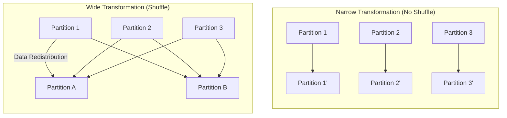


- RDD (Resilient Distributed Dataset) is a distributed immutable data collection, Spark's basic data abstraction
- Data processing through Transformation (lazy evaluation) and Action (immediate execution)
- Automatic recovery on failure through Lineage
- DataFrame/Dataset recommended now, but RDD useful when low-level control needed


**Target Audience**: Java/Spring developers, beginners learning Spark basics

**Prerequisites**:
- Java Collections API (List, Map, etc.)
- Lambda expressions and functional programming basics
- Understanding of [Architecture](architecture/) document

---

RDD is Spark's most fundamental data abstraction. As the low-level API underlying DataFrame and Dataset, it's essential for understanding how Spark works.

## What is RDD?

**RDD (Resilient Distributed Dataset)** is an immutable data collection distributed across multiple nodes.

- **Resilient**: Automatic recomputation through lineage when partitions are lost
- **Distributed**: Stored as partitions across multiple cluster nodes
- **Dataset**: General-purpose collection that can process unstructured data

### RDD Characteristics

| Characteristic | Description |
|----------------|-------------|
| **Immutable** | Once created, cannot be modified; transformations produce new RDDs |
| **Distributed** | Data split into multiple partitions across nodes |
| **Lazy** | Transformations are not executed immediately |
| **Type-safe** | Types can be specified with generics |
| **Fault-tolerant** | Lost data recomputed through lineage |

## Creating RDDs

### 1. From Collections (parallelize)

```java
import org.apache.spark.api.java.JavaRDD;
import org.apache.spark.api.java.JavaSparkContext;
import org.apache.spark.SparkConf;

import java.util.Arrays;
import java.util.List;

public class RddExample {
    public static void main(String[] args) {
        SparkConf conf = new SparkConf()
                .setAppName("RDD Example")
                .setMaster("local[*]");

        JavaSparkContext sc = new JavaSparkContext(conf);

        // Create RDD from List
        List<Integer> numbers = Arrays.asList(1, 2, 3, 4, 5, 6, 7, 8, 9, 10);
        JavaRDD<Integer> numbersRDD = sc.parallelize(numbers);

        // Specify number of partitions
        JavaRDD<Integer> numbersRDD4 = sc.parallelize(numbers, 4);

        System.out.println("Number of partitions: " + numbersRDD4.getNumPartitions());
        // Output: Number of partitions: 4

        sc.close();
    }
}
```

**Java Developer Notes:**
- `JavaSparkContext` is the entry point for RDD API
- Also accessible through `sparkSession.sparkContext()` or `new JavaSparkContext(spark.sparkContext())` from SparkSession
- `parallelize` converts a local collection to a distributed RDD

### 2. From External Data

```java
// Create from text file (one line = one element)
JavaRDD<String> lines = sc.textFile("path/to/file.txt");

// Multiple files or directory
JavaRDD<String> allLines = sc.textFile("path/to/directory/*.txt");

// HDFS
JavaRDD<String> hdfsLines = sc.textFile("hdfs://namenode:8020/data/file.txt");

// S3
JavaRDD<String> s3Lines = sc.textFile("s3a://bucket/path/file.txt");

// Entire file content as one element (filename, content) pairs
JavaPairRDD<String, String> wholeFiles = sc.wholeTextFiles("path/to/directory");
```

### 3. From Other RDDs (Transformation)

```java
JavaRDD<Integer> numbers = sc.parallelize(Arrays.asList(1, 2, 3, 4, 5));

// map: Transform each element
JavaRDD<Integer> doubled = numbers.map(n -> n * 2);

// filter: Select elements matching condition
JavaRDD<Integer> evens = numbers.filter(n -> n % 2 == 0);
```

## Transformations

Transformations produce new RDDs from existing ones. They are **lazily evaluated**, meaning they are not executed immediately.

### Narrow vs Wide Transformations



| Type | Examples | Characteristics |
|------|----------|-----------------|
| **Narrow** | map, filter, flatMap | 1:1 partition mapping, fast |
| **Wide** | groupByKey, reduceByKey, join | Shuffle occurs, network cost |

### Basic Transformations

```java
JavaRDD<String> lines = sc.parallelize(Arrays.asList(
    "Hello World",
    "Hello Spark",
    "Spark is fast"
));

// map: Apply function to each element
JavaRDD<Integer> lengths = lines.map(String::length);
// [11, 11, 13]

// flatMap: Expand each element into multiple elements
JavaRDD<String> words = lines.flatMap(
    line -> Arrays.asList(line.split(" ")).iterator()
);
// ["Hello", "World", "Hello", "Spark", "Spark", "is", "fast"]

// filter: Select elements matching condition
JavaRDD<String> sparks = lines.filter(line -> line.contains("Spark"));
// ["Hello Spark", "Spark is fast"]

// distinct: Remove duplicates
JavaRDD<String> uniqueWords = words.distinct();
// ["Hello", "World", "Spark", "is", "fast"]
```

### Pair RDD Transformations

RDDs with key-value pairs provide additional operations.

```java
import org.apache.spark.api.java.JavaPairRDD;
import scala.Tuple2;

// Word frequency example
JavaRDD<String> words = lines.flatMap(
    line -> Arrays.asList(line.split(" ")).iterator()
);

// Convert each word to (word, 1) pair
JavaPairRDD<String, Integer> wordPairs = words.mapToPair(
    word -> new Tuple2<>(word, 1)
);

// Sum values for same key
JavaPairRDD<String, Integer> wordCounts = wordPairs.reduceByKey(Integer::sum);

// Check results
wordCounts.collect().forEach(System.out::println);
// (Hello,2)
// (World,1)
// (Spark,2)
// (is,1)
// (fast,1)
```

### Key Pair RDD Operations

```java
JavaPairRDD<String, Integer> scores = sc.parallelizePairs(Arrays.asList(
    new Tuple2<>("Alice", 85),
    new Tuple2<>("Bob", 90),
    new Tuple2<>("Alice", 95),
    new Tuple2<>("Bob", 80)
));

// reduceByKey: Sum values for same key
JavaPairRDD<String, Integer> totalScores = scores.reduceByKey(Integer::sum);
// (Alice,180), (Bob,170)

// groupByKey: Group values for same key (caution: high memory usage)
JavaPairRDD<String, Iterable<Integer>> grouped = scores.groupByKey();
// (Alice,[85,95]), (Bob,[90,80])

// mapValues: Transform only values
JavaPairRDD<String, Integer> doubledScores = scores.mapValues(v -> v * 2);
// (Alice,170), (Bob,180), (Alice,190), (Bob,160)

// keys, values: Extract only keys/values
JavaRDD<String> names = scores.keys();
JavaRDD<Integer> values = scores.values();

// sortByKey: Sort by key
JavaPairRDD<String, Integer> sorted = totalScores.sortByKey();
```

### Join Operations

```java
JavaPairRDD<String, Integer> ages = sc.parallelizePairs(Arrays.asList(
    new Tuple2<>("Alice", 30),
    new Tuple2<>("Bob", 25)
));

JavaPairRDD<String, String> cities = sc.parallelizePairs(Arrays.asList(
    new Tuple2<>("Alice", "Seoul"),
    new Tuple2<>("Charlie", "Busan")
));

// join: Inner join (only keys in both)
JavaPairRDD<String, Tuple2<Integer, String>> joined = ages.join(cities);
// (Alice, (30, Seoul))

// leftOuterJoin: Based on left
JavaPairRDD<String, Tuple2<Integer, Optional<String>>> leftJoined =
    ages.leftOuterJoin(cities);
// (Alice, (30, Optional[Seoul])), (Bob, (25, Optional.empty))

// rightOuterJoin: Based on right
// fullOuterJoin: Both sides
```

## Actions

Actions actually compute the RDD and return results.

```java
JavaRDD<Integer> numbers = sc.parallelize(Arrays.asList(1, 2, 3, 4, 5));

// collect: Bring all elements to Driver (caution: OOM with large data)
List<Integer> all = numbers.collect();

// count: Number of elements
long count = numbers.count();  // 5

// first: First element
Integer first = numbers.first();  // 1

// take: First n elements
List<Integer> firstThree = numbers.take(3);  // [1, 2, 3]

// takeSample: Random sample
List<Integer> sample = numbers.takeSample(false, 2);  // e.g., [3, 1]

// reduce: Aggregate all elements into one
Integer sum = numbers.reduce(Integer::sum);  // 15

// fold: Aggregate with initial value
Integer sumWithInit = numbers.fold(10, Integer::sum);  // 25

// aggregate: Aggregation with different type (for complex aggregations)
// Average calculation example: aggregate as (sum, count) pair
Tuple2<Integer, Integer> sumAndCount = numbers.aggregate(
    new Tuple2<>(0, 0),  // initial value
    (acc, n) -> new Tuple2<>(acc._1 + n, acc._2 + 1),  // seqOp
    (acc1, acc2) -> new Tuple2<>(acc1._1 + acc2._1, acc1._2 + acc2._2)  // combOp
);
double average = (double) sumAndCount._1 / sumAndCount._2;

// foreach: Execute function on each element (runs on Executor)
numbers.foreach(n -> System.out.println(n));  // Output to Executor logs

// countByValue: Frequency of each value
Map<Integer, Long> valueCounts = numbers.countByValue();

// saveAsTextFile: Save to file
numbers.saveAsTextFile("output/numbers");
```

## Lineage

RDDs maintain information about how they were created (lineage). This enables:

1. **Lazy Evaluation**: Defer execution until computation is actually needed
2. **Optimization**: Optimize by pipelining multiple operations
3. **Fault Recovery**: Recompute lost partitions by following lineage

```java
JavaRDD<String> lines = sc.textFile("data.txt");      // Step 1
JavaRDD<String> words = lines.flatMap(...);           // Step 2
JavaRDD<String> filtered = words.filter(...);         // Step 3
long count = filtered.count();                         // Action!

// If one Executor fails, only that partition is recomputed
// Full lineage: textFile → flatMap → filter → count
```

### Checking Lineage

```java
System.out.println(filtered.toDebugString());
```

Output:
```
(2) MapPartitionsRDD[2] at filter at RddExample.java:15 []
 |  MapPartitionsRDD[1] at flatMap at RddExample.java:14 []
 |  data.txt MapPartitionsRDD[0] at textFile at RddExample.java:13 []
```

## Narrow vs Wide Dependencies

Performance varies significantly depending on dependency type of Transformations.

### Narrow Dependency

Each parent partition is used by at most one child partition.

```java
// Narrow Transformation - no shuffle
JavaRDD<Integer> mapped = numbers.map(n -> n * 2);
JavaRDD<Integer> filtered = numbers.filter(n -> n > 5);
```

- Processing completed within same partition
- Pipelining possible
- Very efficient

### Wide Dependency

One parent partition is used by multiple child partitions.

```java
// Wide Transformation - shuffle occurs
JavaPairRDD<String, Integer> grouped = wordPairs.reduceByKey(Integer::sum);
JavaPairRDD<String, Tuple2<Integer, String>> joined = rdd1.join(rdd2);
```

- Data redistribution (shuffle) required
- Network I/O, disk I/O occurs
- Becomes Stage boundary
- Significant performance impact

## Persistence

Frequently used RDDs can be cached in memory to prevent recomputation.

```java
import org.apache.spark.storage.StorageLevel;

JavaRDD<String> lines = sc.textFile("large-file.txt");
JavaRDD<String> words = lines.flatMap(...);
JavaRDD<String> filtered = words.filter(...);

// Cache in memory (default)
filtered.cache();  // Same as persist(StorageLevel.MEMORY_ONLY)

// Or specify storage level
filtered.persist(StorageLevel.MEMORY_AND_DISK());

// Use cached RDD
long count1 = filtered.count();   // First computation, cached
long count2 = filtered.count();   // Read from cache (fast)

// Release cache
filtered.unpersist();
```

### Storage Levels

| Level | Memory | Disk | Serialized | Replicas |
|-------|--------|------|------------|----------|
| MEMORY_ONLY | O | X | X | 1 |
| MEMORY_AND_DISK | O | O | X | 1 |
| MEMORY_ONLY_SER | O | X | O | 1 |
| MEMORY_AND_DISK_SER | O | O | O | 1 |
| DISK_ONLY | X | O | X | 1 |
| *_2 | - | - | - | 2 |

## RDD vs DataFrame/Dataset

While DataFrame/Dataset APIs are recommended in current Spark, RDD is still needed in some cases:

### When to Use RDD

1. **Need low-level control**: Fine-grained control over partitions, shuffle
2. **Unstructured data**: Data without schema
3. **Maintaining legacy RDD code**
4. **Need custom serialization logic**

### When to Use DataFrame/Dataset

1. **Structured data processing**
2. **Using SQL**
3. **Performance optimization (Catalyst Optimizer)**
4. **Connecting to various data sources**

### Interconversion

```java
import org.apache.spark.sql.SparkSession;
import org.apache.spark.sql.Dataset;
import org.apache.spark.sql.Row;
import org.apache.spark.sql.Encoders;

SparkSession spark = SparkSession.builder()
        .appName("Conversion")
        .master("local[*]")
        .getOrCreate();

// DataFrame → RDD
Dataset<Row> df = spark.read().json("data.json");
JavaRDD<Row> rdd = df.javaRDD();

// RDD → DataFrame (schema inference)
JavaRDD<String> jsonRdd = sc.parallelize(Arrays.asList(
    "{\"name\":\"Alice\",\"age\":30}",
    "{\"name\":\"Bob\",\"age\":25}"
));
Dataset<Row> df2 = spark.read().json(jsonRdd);

// RDD<T> → Dataset<T>
JavaRDD<Integer> numberRdd = sc.parallelize(Arrays.asList(1, 2, 3));
Dataset<Integer> ds = spark.createDataset(numberRdd.rdd(), Encoders.INT());
```

## Practical Example: Log Analysis

Example analyzing errors from web server logs:

```java
public class LogAnalysis {
    public static void main(String[] args) {
        SparkConf conf = new SparkConf()
                .setAppName("Log Analysis")
                .setMaster("local[*]");

        JavaSparkContext sc = new JavaSparkContext(conf);

        // Load log file
        JavaRDD<String> logs = sc.textFile("access.log");

        // Filter ERROR logs
        JavaRDD<String> errors = logs.filter(line -> line.contains("ERROR"));

        // Cache (will be used multiple times)
        errors.cache();

        // Count errors
        System.out.println("Total errors: " + errors.count());

        // Count by error type
        JavaPairRDD<String, Integer> errorTypes = errors
                .mapToPair(line -> {
                    // Assuming "ERROR [ErrorType]: message" format
                    String type = extractErrorType(line);
                    return new Tuple2<>(type, 1);
                })
                .reduceByKey(Integer::sum);

        // Print results
        System.out.println("Errors by type:");
        errorTypes.collect().forEach(t ->
            System.out.println(t._1 + ": " + t._2)
        );

        // Most frequent error type
        Tuple2<String, Integer> topError = errorTypes
                .mapToPair(Tuple2::swap)  // Convert to (count, type)
                .sortByKey(false)          // Sort descending
                .first();

        System.out.println("Most frequent error: " + topError._2 + " (" + topError._1 + " occurrences)");

        errors.unpersist();
        sc.close();
    }

    private static String extractErrorType(String line) {
        // Actual implementation depends on log format
        int start = line.indexOf("[") + 1;
        int end = line.indexOf("]");
        return start > 0 && end > start ? line.substring(start, end) : "UNKNOWN";
    }
}
```

## Next Steps

After understanding RDD basics, learn more efficient APIs:

- [DataFrame and Dataset](dataframe-dataset/) - High-level APIs and Catalyst optimization
- [Transformations and Actions](transformations-actions/) - Deep dive into lazy evaluation
