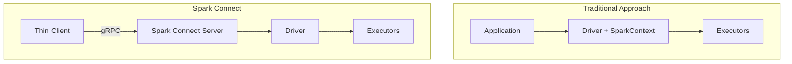

# Spark Connect (Spark 3.4+)

Spark Connect is a new client-server architecture introduced in Spark 3.4. It enables connecting to remote Spark clusters with a thin client.

## Traditional Approach vs Spark Connect



### Key Differences

| Aspect | Traditional Approach | Spark Connect |
|--------|---------------------|---------------|
| **Architecture** | Monolithic (Driver embedded) | Client-server separation |
| **Client size** | Hundreds of MB (full Spark) | Few MB (gRPC client) |
| **Language support** | JVM required | Language independent (gRPC) |
| **Resource isolation** | Driver resources needed on client | Resources used only on server |
| **Upgrades** | Client redeployment required | Only server upgrade needed |
| **Stability** | Job stops on client crash | Server runs independently stable |

## Spark Connect Advantages

### 1. Lightweight Client

```xml
<!-- Traditional approach: spark-core + spark-sql (~200MB) -->
<dependency>
    <groupId>org.apache.spark</groupId>
    <artifactId>spark-sql_2.13</artifactId>
    <version>3.5.1</version>
</dependency>

<!-- Spark Connect: lightweight client (~10MB) -->
<dependency>
    <groupId>org.apache.spark</groupId>
    <artifactId>spark-connect-client-jvm_2.13</artifactId>
    <version>3.5.1</version>
</dependency>
```

### 2. Isolated Execution Environment

- Client memory exhaustion doesn't affect Spark jobs
- Multiple clients can share the same cluster
- Server continues work on client failure

### 3. Language Independence

- gRPC-based connectivity from various languages
- Supports Python, Scala, Java, Go, etc.
- More languages planned for future support

## Server Setup

### Starting Spark Connect Server

```bash
# Start standalone server
./sbin/start-connect-server.sh \
    --packages org.apache.spark:spark-connect_2.13:3.5.1 \
    --conf spark.connect.grpc.binding.port=15002

# Or start with spark-submit
spark-submit \
    --class org.apache.spark.sql.connect.service.SparkConnectServer \
    --packages org.apache.spark:spark-connect_2.13:3.5.1 \
    --conf spark.connect.grpc.binding.port=15002 \
    local:///dev/null
```

### Running Server with Docker

```yaml
# docker-compose.yml
version: '3.8'
services:
  spark-connect:
    image: apache/spark:3.5.1
    command: >
      /opt/spark/sbin/start-connect-server.sh
      --packages org.apache.spark:spark-connect_2.13:3.5.1
    ports:
      - "15002:15002"  # gRPC port
      - "4040:4040"    # Spark UI
    environment:
      - SPARK_CONNECT_GRPC_BINDING_PORT=15002
    volumes:
      - ./data:/opt/spark/data
```

### Server Configuration Options

```properties
# spark-defaults.conf
spark.connect.grpc.binding.port=15002
spark.connect.grpc.arrow.maxBatchSize=4194304
spark.connect.grpc.maxInboundMessageSize=134217728
spark.connect.extensions.relation.classes=
spark.connect.extensions.expression.classes=
spark.connect.extensions.command.classes=
```

## Java Client Usage

### Dependency Setup

```kotlin
// build.gradle.kts
dependencies {
    // Spark Connect client (lightweight)
    implementation("org.apache.spark:spark-connect-client-jvm_2.13:3.5.1")
}
```

### Connection and Usage

```java
import org.apache.spark.sql.SparkSession;
import org.apache.spark.sql.Dataset;
import org.apache.spark.sql.Row;
import static org.apache.spark.sql.functions.*;

public class SparkConnectExample {
    public static void main(String[] args) {
        // Connect to Spark Connect server
        SparkSession spark = SparkSession.builder()
                .remote("sc://localhost:15002")  // Spark Connect URL
                .build();

        try {
            // Use existing DataFrame API identically
            Dataset<Row> df = spark.read()
                    .option("header", "true")
                    .option("inferSchema", "true")
                    .csv("data/sales.csv");

            Dataset<Row> result = df
                    .filter(col("amount").gt(100))
                    .groupBy("category")
                    .agg(
                        sum("amount").alias("total"),
                        count("*").alias("count")
                    )
                    .orderBy(col("total").desc());

            result.show();

            // Collect results
            List<Row> rows = result.collectAsList();
            for (Row row : rows) {
                System.out.println(row.getString(0) + ": " + row.getDouble(1));
            }

        } finally {
            spark.stop();
        }
    }
}
```

### Connection URL Format

```java
// Basic connection
SparkSession.builder().remote("sc://hostname:port")

// Token authentication
SparkSession.builder().remote("sc://hostname:port;token=<auth_token>")

// User ID specification
SparkSession.builder().remote("sc://hostname:port;user_id=my_user")

// SSL/TLS
SparkSession.builder().remote("sc://hostname:port;use_ssl=true")
```

## Supported Features

### Fully Supported

| Feature | Status | Notes |
|---------|--------|-------|
| DataFrame API | ✅ Supported | select, filter, groupBy, etc. |
| SQL queries | ✅ Supported | spark.sql() |
| UDF (User-defined functions) | ✅ Supported | Must be registered on server |
| File read/write | ✅ Supported | CSV, JSON, Parquet |
| Aggregate functions | ✅ Supported | sum, avg, count, etc. |
| Window functions | ✅ Supported | rank, row_number, etc. |
| Joins | ✅ Supported | inner, left, right, etc. |

### Limitations

| Feature | Status | Alternative |
|---------|--------|-------------|
| RDD API | ❌ Not supported | Use DataFrame API |
| Streaming | ⚠️ Partial support | Execute on server side |
| MLlib | ⚠️ Partial support | Basic features only |
| GraphX | ❌ Not supported | Use GraphFrame |
| Local file access | ❌ Not supported | Server path or cloud storage |

## Spring Boot Integration

```java
package com.example.config;

import org.apache.spark.sql.SparkSession;
import org.springframework.beans.factory.annotation.Value;
import org.springframework.context.annotation.Bean;
import org.springframework.context.annotation.Configuration;
import org.springframework.context.annotation.Profile;
import jakarta.annotation.PreDestroy;

@Configuration
public class SparkConnectConfig {

    @Value("${spark.connect.url:sc://localhost:15002}")
    private String sparkConnectUrl;

    private SparkSession spark;

    @Bean
    @Profile("!local")  // Use in non-local environments
    public SparkSession sparkSession() {
        this.spark = SparkSession.builder()
                .remote(sparkConnectUrl)
                .build();
        return spark;
    }

    @Bean
    @Profile("local")  // For local development
    public SparkSession localSparkSession() {
        this.spark = SparkSession.builder()
                .appName("local-dev")
                .master("local[*]")
                .getOrCreate();
        return spark;
    }

    @PreDestroy
    public void cleanup() {
        if (spark != null) {
            spark.stop();
        }
    }
}
```

```yaml
# application.yml
spring:
  profiles:
    active: local

---
spring:
  config:
    activate:
      on-profile: production

spark:
  connect:
    url: sc://spark-connect.internal:15002;token=${SPARK_TOKEN}
```

## Best Practices

### 1. Connection Pooling

```java
@Component
public class SparkConnectionPool {
    private final SparkSession spark;

    public SparkConnectionPool(SparkSession spark) {
        this.spark = spark;
    }

    // SparkSession is thread-safe so it can be shared
    public SparkSession getSession() {
        return spark;
    }
}
```

### 2. Large Result Handling

```java
// ❌ Collect all - memory risk
List<Row> allRows = df.collectAsList();

// ✅ Collect limited results only
List<Row> topRows = df.limit(1000).collectAsList();

// ✅ Save to file on server then download
df.write().parquet("s3://bucket/results/");
```

### 3. Error Handling

```java
import io.grpc.StatusRuntimeException;

try {
    Dataset<Row> result = spark.sql("SELECT * FROM table");
    result.show();
} catch (StatusRuntimeException e) {
    if (e.getStatus().getCode() == Status.Code.UNAVAILABLE) {
        logger.error("Spark Connect server connection failed");
        // Reconnection logic
    } else {
        throw e;
    }
} catch (AnalysisException e) {
    logger.error("SQL analysis error: {}", e.getMessage());
}
```

## Migration Guide

### Migrating from Existing Code to Spark Connect

```java
// Before: Traditional approach
SparkSession spark = SparkSession.builder()
        .appName("MyApp")
        .master("spark://master:7077")
        .config("spark.executor.memory", "4g")
        .getOrCreate();

// After: Spark Connect
SparkSession spark = SparkSession.builder()
        .remote("sc://spark-connect:15002")
        .build();

// DataFrame API is used identically
Dataset<Row> df = spark.read().parquet("data.parquet");
```

### Considerations

1. **No local file access**: Use cloud storage instead of client local files
2. **RDD API not supported**: Convert to DataFrame/Dataset API
3. **UDF server registration**: User-defined functions must be pre-registered on server
4. **Network latency**: Some overhead from remote connection

## Related Documents

- [Architecture]() - Spark cluster structure
- [Spring Boot Integration]() - Spring integration
- [Deployment]() - Cluster deployment methods
