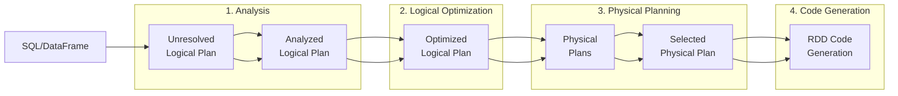

# Spark SQL

Spark SQL is a Spark module for structured data processing. It supports both SQL queries and the DataFrame API, using the same execution engine (Catalyst Optimizer).

## Benefits of Spark SQL

1. **Familiar SQL syntax**: Leverage existing SQL knowledge directly
2. **Optimization**: Catalyst Optimizer automatically optimizes queries
3. **Various data sources**: Integration with JDBC, Parquet, JSON, Hive, etc.
4. **DataFrame interoperability**: SQL results returned as DataFrames

## Deep Dive into Catalyst Optimizer

Catalyst is Spark SQL's query optimization engine. It analyzes user queries and optimizes them to generate efficient execution plans.

### Query Processing Stages



### Stage Details

#### Stage 1: Analysis

Maps table and column names to actual schemas.

```java
// User code
df.filter(col("salary").gt(5000));

// Unresolved Plan: Don't know what type "salary" is
// Analyzed Plan: salary is IntegerType, 3rd column of df
```

#### Stage 2: Logical Optimization

Optimizes queries using rule-based transformations.

| Optimization Rule | Description | Example |
|------------------|-------------|---------|
| **Predicate Pushdown** | Push filters to data source | Move WHERE clause to Parquet read stage |
| **Column Pruning** | Read only needed columns | Skip columns not in SELECT |
| **Constant Folding** | Pre-compute constant expressions | `1 + 2` → `3` |
| **Boolean Simplification** | Simplify boolean conditions | `true AND x` → `x` |
| **Filter Pushdown** | Filter before join | Apply filters to each table before join |

```java
// Before optimization
df.join(other, "id")
  .filter(col("status").equalTo("ACTIVE"))
  .select("name");

// After optimization (Catalyst auto-transforms)
// 1. filter moves before join (Predicate Pushdown)
// 2. Only "name" is read (Column Pruning)
```

#### Stage 3: Physical Planning

Selects optimal execution strategy from multiple options.

```java
// Join strategy selection example
// Catalyst analyzes table sizes to decide:
// - Small table: Broadcast Hash Join
// - Large table: Sort Merge Join
// - Streaming: Shuffle Hash Join
```

#### Stage 4: Code Generation (Tungsten)

Generates optimized Java bytecode at runtime.

```java
// Whole-Stage Code Generation
// Fuses multiple operators into a single function
// Eliminates virtual function call overhead
spark.conf().set("spark.sql.codegen.wholeStage", "true");  // default
```

### Checking Execution Plans

```java
Dataset<Row> result = df
    .filter(col("age").gt(30))
    .groupBy("department")
    .agg(avg("salary").alias("avg_salary"));

// Logical plan
result.explain(true);

// Output example:
// == Parsed Logical Plan ==
// 'Aggregate ['department], ['department, avg('salary) AS avg_salary]
// +- 'Filter ('age > 30)
//    +- 'UnresolvedRelation [employees]
//
// == Analyzed Logical Plan ==
// department: string, avg_salary: double
// Aggregate [department], [department, avg(salary) AS avg_salary]
// +- Filter (age > 30)
//    +- Relation[id,name,age,department,salary] parquet
//
// == Optimized Logical Plan ==
// Aggregate [department], [department, avg(salary) AS avg_salary]
// +- Project [department, salary]        ← Column Pruning
//    +- Filter (age > 30)
//       +- Relation[id,name,age,department,salary] parquet
//
// == Physical Plan ==
// *(2) HashAggregate(keys=[department], functions=[avg(salary)])
// +- Exchange hashpartitioning(department, 200)   ← Shuffle
//    +- *(1) HashAggregate(keys=[department], functions=[partial_avg(salary)])
//       +- *(1) Project [department, salary]
//          +- *(1) Filter (age > 30)
//             +- *(1) ColumnarToRow
//                +- FileScan parquet [age,department,salary]  ← Only needed columns
```

### AQE (Adaptive Query Execution)

**Runtime optimization** introduced in Spark 3.0+. Collects statistics during execution to dynamically adjust plans.

```java
// Enable AQE (enabled by default in Spark 3.2+)
spark.conf().set("spark.sql.adaptive.enabled", "true");

// Key features:
// 1. Dynamic partition coalescing
spark.conf().set("spark.sql.adaptive.coalescePartitions.enabled", "true");

// 2. Skew join optimization
spark.conf().set("spark.sql.adaptive.skewJoin.enabled", "true");

// 3. Dynamic broadcast join conversion
spark.conf().set("spark.sql.adaptive.autoBroadcastJoinThreshold", "10MB");
```

**AQE in action:**

```
Static plan: Shuffle with 200 partitions
    ↓
During execution: Actual data is small, most partitions nearly empty
    ↓
AQE: Merges to 5 partitions at runtime
    ↓
Result: Reduced task count, less overhead
```

## Basic Usage

### Creating Temporary Views

```java
SparkSession spark = SparkSession.builder()
        .appName("Spark SQL")
        .master("local[*]")
        .getOrCreate();

// Create DataFrame
Dataset<Row> employees = spark.read()
        .option("header", "true")
        .option("inferSchema", "true")
        .csv("employees.csv");

// Register temporary view
employees.createOrReplaceTempView("employees");

// Execute SQL query
Dataset<Row> result = spark.sql("""
    SELECT department, COUNT(*) as count, AVG(salary) as avg_salary
    FROM employees
    WHERE age > 25
    GROUP BY department
    ORDER BY avg_salary DESC
    """);

result.show();
```

### View Types

```java
// Session-scoped temporary view (default)
df.createOrReplaceTempView("my_view");
// Accessible only within same SparkSession

// Global temporary view
df.createOrReplaceGlobalTempView("global_view");
// Accessible from all SparkSessions (in global_temp database)
spark.sql("SELECT * FROM global_temp.global_view");

// Drop views
spark.catalog().dropTempView("my_view");
spark.catalog().dropGlobalTempView("global_view");
```

## SQL Syntax

### SELECT

```sql
-- Basic SELECT
SELECT name, age, salary FROM employees;

-- Aliases
SELECT name AS employee_name, salary * 12 AS annual_salary FROM employees;

-- DISTINCT
SELECT DISTINCT department FROM employees;

-- LIMIT
SELECT * FROM employees LIMIT 10;
```

### WHERE

```sql
-- Comparison operators
SELECT * FROM employees WHERE age > 30;
SELECT * FROM employees WHERE department = 'Engineering';

-- Logical operators
SELECT * FROM employees WHERE age > 25 AND salary > 50000;
SELECT * FROM employees WHERE department = 'Engineering' OR department = 'Marketing';

-- IN
SELECT * FROM employees WHERE department IN ('Engineering', 'Marketing');

-- BETWEEN
SELECT * FROM employees WHERE age BETWEEN 25 AND 35;

-- LIKE
SELECT * FROM employees WHERE name LIKE 'John%';
SELECT * FROM employees WHERE name LIKE '%son';
SELECT * FROM employees WHERE name LIKE '%ohn%';

-- NULL check
SELECT * FROM employees WHERE manager_id IS NULL;
SELECT * FROM employees WHERE manager_id IS NOT NULL;
```

### GROUP BY and Aggregation

```sql
-- Basic aggregation
SELECT
    department,
    COUNT(*) as employee_count,
    AVG(salary) as avg_salary,
    MAX(salary) as max_salary,
    MIN(salary) as min_salary,
    SUM(salary) as total_salary
FROM employees
GROUP BY department;

-- HAVING (group filtering)
SELECT department, COUNT(*) as count
FROM employees
GROUP BY department
HAVING count > 5;

-- Multi-column grouping
SELECT department, level, AVG(salary) as avg_salary
FROM employees
GROUP BY department, level;
```

### ORDER BY

```sql
-- Ascending (default)
SELECT * FROM employees ORDER BY salary;
SELECT * FROM employees ORDER BY salary ASC;

-- Descending
SELECT * FROM employees ORDER BY salary DESC;

-- Multiple sort columns
SELECT * FROM employees ORDER BY department ASC, salary DESC;

-- NULL handling
SELECT * FROM employees ORDER BY salary NULLS FIRST;
SELECT * FROM employees ORDER BY salary DESC NULLS LAST;
```

### JOIN

```sql
-- INNER JOIN
SELECT e.name, e.salary, d.department_name
FROM employees e
INNER JOIN departments d ON e.department_id = d.id;

-- LEFT JOIN
SELECT e.name, d.department_name
FROM employees e
LEFT JOIN departments d ON e.department_id = d.id;

-- RIGHT JOIN
SELECT e.name, d.department_name
FROM employees e
RIGHT JOIN departments d ON e.department_id = d.id;

-- FULL OUTER JOIN
SELECT e.name, d.department_name
FROM employees e
FULL OUTER JOIN departments d ON e.department_id = d.id;

-- CROSS JOIN
SELECT e.name, p.project_name
FROM employees e
CROSS JOIN projects p;

-- Self join
SELECT e1.name as employee, e2.name as manager
FROM employees e1
LEFT JOIN employees e2 ON e1.manager_id = e2.id;
```

### Subqueries

```sql
-- WHERE clause subquery
SELECT * FROM employees
WHERE salary > (SELECT AVG(salary) FROM employees);

-- IN subquery
SELECT * FROM employees
WHERE department_id IN (
    SELECT id FROM departments WHERE location = 'New York'
);

-- EXISTS
SELECT * FROM employees e
WHERE EXISTS (
    SELECT 1 FROM projects p WHERE p.manager_id = e.id
);

-- FROM clause subquery (inline view)
SELECT department, avg_salary
FROM (
    SELECT department, AVG(salary) as avg_salary
    FROM employees
    GROUP BY department
) dept_stats
WHERE avg_salary > 50000;
```

### Set Operations

```sql
-- UNION (removes duplicates)
SELECT name FROM employees_newyork
UNION
SELECT name FROM employees_boston;

-- UNION ALL (includes duplicates)
SELECT name FROM employees_newyork
UNION ALL
SELECT name FROM employees_boston;

-- INTERSECT (intersection)
SELECT name FROM employees_newyork
INTERSECT
SELECT name FROM employees_boston;

-- EXCEPT (difference)
SELECT name FROM employees_newyork
EXCEPT
SELECT name FROM employees_boston;
```

## Built-in Functions

### String Functions

```sql
-- Case conversion
SELECT UPPER(name), LOWER(name) FROM employees;

-- String length
SELECT LENGTH(name) FROM employees;

-- Substring
SELECT SUBSTRING(name, 1, 3) FROM employees;

-- Concatenation
SELECT CONCAT(first_name, ' ', last_name) as full_name FROM employees;
SELECT first_name || ' ' || last_name as full_name FROM employees;

-- Trim whitespace
SELECT TRIM(name), LTRIM(name), RTRIM(name) FROM employees;

-- Replace
SELECT REPLACE(phone, '-', '') FROM employees;

-- Split
SELECT SPLIT(tags, ',') FROM products;
```

### Numeric Functions

```sql
-- Rounding
SELECT ROUND(salary, -3) FROM employees;  -- Round to thousands
SELECT CEIL(score), FLOOR(score) FROM tests;

-- Absolute value, sign
SELECT ABS(difference), SIGN(difference) FROM results;

-- Power
SELECT POWER(base, exponent), SQRT(value) FROM calculations;
```

### Date/Time Functions

```sql
-- Current date/time
SELECT CURRENT_DATE(), CURRENT_TIMESTAMP();

-- Extract date parts
SELECT
    YEAR(hire_date),
    MONTH(hire_date),
    DAY(hire_date),
    HOUR(created_at),
    MINUTE(created_at)
FROM employees;

-- Date formatting
SELECT DATE_FORMAT(hire_date, 'yyyy-MM-dd') FROM employees;
SELECT DATE_FORMAT(created_at, 'MMM dd, yyyy') FROM orders;

-- Date arithmetic
SELECT DATE_ADD(hire_date, 30) FROM employees;  -- 30 days later
SELECT DATE_SUB(end_date, 7) FROM projects;     -- 7 days before
SELECT DATEDIFF(end_date, start_date) as duration FROM projects;
SELECT MONTHS_BETWEEN(end_date, start_date) FROM projects;

-- Date truncation
SELECT TRUNC(created_at, 'MONTH') FROM orders;  -- First day of month
SELECT TRUNC(created_at, 'YEAR') FROM orders;   -- First day of year
```

### Conditional Functions

```sql
-- CASE WHEN
SELECT
    name,
    salary,
    CASE
        WHEN salary >= 80000 THEN 'High'
        WHEN salary >= 50000 THEN 'Medium'
        ELSE 'Low'
    END as salary_level
FROM employees;

-- IF
SELECT name, IF(age >= 30, 'Senior', 'Junior') as level FROM employees;

-- COALESCE (first non-null value)
SELECT COALESCE(nickname, name, 'Unknown') as display_name FROM users;

-- NULLIF (returns null if equal)
SELECT NULLIF(value1, value2) FROM data;

-- NVL (null replacement)
SELECT NVL(commission, 0) as commission FROM employees;
```

### Aggregate Functions

```sql
-- Basic aggregation
SELECT
    COUNT(*),                    -- row count
    COUNT(DISTINCT department),  -- unique value count
    SUM(salary),
    AVG(salary),
    MAX(salary),
    MIN(salary),
    STDDEV(salary),              -- standard deviation
    VARIANCE(salary)             -- variance
FROM employees;

-- Array aggregation
SELECT
    department,
    COLLECT_LIST(name) as names,      -- list (with duplicates)
    COLLECT_SET(level) as levels      -- set (deduplicated)
FROM employees
GROUP BY department;

-- Conditional aggregation
SELECT
    SUM(CASE WHEN department = 'Engineering' THEN salary ELSE 0 END) as eng_total,
    COUNT(CASE WHEN age > 30 THEN 1 END) as senior_count
FROM employees;
```

### Window Functions

```sql
-- Ranking functions
SELECT
    name,
    department,
    salary,
    ROW_NUMBER() OVER (PARTITION BY department ORDER BY salary DESC) as row_num,
    RANK() OVER (PARTITION BY department ORDER BY salary DESC) as rank,
    DENSE_RANK() OVER (PARTITION BY department ORDER BY salary DESC) as dense_rank,
    NTILE(4) OVER (ORDER BY salary) as quartile
FROM employees;

-- Aggregate window
SELECT
    name,
    department,
    salary,
    AVG(salary) OVER (PARTITION BY department) as dept_avg,
    salary - AVG(salary) OVER (PARTITION BY department) as diff_from_avg,
    SUM(salary) OVER (PARTITION BY department ORDER BY hire_date) as running_total
FROM employees;

-- LAG/LEAD
SELECT
    name,
    salary,
    LAG(salary, 1) OVER (ORDER BY hire_date) as prev_salary,
    LEAD(salary, 1) OVER (ORDER BY hire_date) as next_salary
FROM employees;

-- FIRST/LAST
SELECT
    department,
    FIRST_VALUE(name) OVER (PARTITION BY department ORDER BY salary DESC) as top_earner,
    LAST_VALUE(name) OVER (
        PARTITION BY department
        ORDER BY salary DESC
        ROWS BETWEEN UNBOUNDED PRECEDING AND UNBOUNDED FOLLOWING
    ) as lowest_earner
FROM employees;
```

## Catalog API

Manage Spark SQL metadata programmatically.

```java
import org.apache.spark.sql.catalog.Catalog;

Catalog catalog = spark.catalog();

// Current database
String currentDb = catalog.currentDatabase();

// List databases
catalog.listDatabases().show();

// List tables
catalog.listTables().show();
catalog.listTables("my_database").show();

// Check table existence
boolean exists = catalog.tableExists("employees");
boolean existsInDb = catalog.tableExists("my_database", "employees");

// List columns
catalog.listColumns("employees").show();

// Cache management
catalog.cacheTable("employees");
catalog.isCached("employees");
catalog.uncacheTable("employees");
catalog.clearCache();

// Refresh table (reflect external changes)
catalog.refreshTable("employees");
```

## Hive Integration

Spark SQL can integrate with Hive metastore for persistent table management.

```java
// SparkSession with Hive support
SparkSession spark = SparkSession.builder()
        .appName("Hive Integration")
        .config("spark.sql.warehouse.dir", "/user/hive/warehouse")
        .enableHiveSupport()
        .getOrCreate();

// Create database
spark.sql("CREATE DATABASE IF NOT EXISTS my_database");
spark.sql("USE my_database");

// Create table
spark.sql("""
    CREATE TABLE IF NOT EXISTS employees (
        id INT,
        name STRING,
        department STRING,
        salary DOUBLE
    )
    USING PARQUET
    PARTITIONED BY (department)
    """);

// Insert data
spark.sql("""
    INSERT INTO employees
    VALUES (1, 'Alice', 'Engineering', 75000)
    """);

// Or save from DataFrame
df.write()
    .mode("append")
    .partitionBy("department")
    .saveAsTable("employees");

// Query table
spark.sql("SELECT * FROM employees").show();

// Drop table
spark.sql("DROP TABLE IF EXISTS employees");
```

## Performance Optimization

### Explain Plan

```java
// Check execution plan
Dataset<Row> result = spark.sql("""
    SELECT department, AVG(salary)
    FROM employees
    WHERE age > 30
    GROUP BY department
    """);

// Simple plan
result.explain();

// Detailed plan
result.explain(true);

// Extended plan (Spark 3.0+)
result.explain("extended");    // Logical/physical plans
result.explain("codegen");     // Generated code
result.explain("cost");        // Cost estimates
result.explain("formatted");   // Nicely formatted
```

### Hints

```sql
-- Broadcast hint
SELECT /*+ BROADCAST(d) */ e.name, d.department_name
FROM employees e
JOIN departments d ON e.department_id = d.id;

-- Shuffle hint
SELECT /*+ SHUFFLE_HASH(e) */ e.name, d.department_name
FROM employees e
JOIN departments d ON e.department_id = d.id;

-- Coalesce hint
SELECT /*+ COALESCE(4) */ * FROM employees;

-- Repartition hint
SELECT /*+ REPARTITION(8, department) */ * FROM employees;
```

### Key Settings

```java
// Shuffle partition count
spark.conf().set("spark.sql.shuffle.partitions", "200");

// Broadcast join threshold
spark.conf().set("spark.sql.autoBroadcastJoinThreshold", "10485760");  // 10MB

// Adaptive Query Execution (Spark 3.0+)
spark.conf().set("spark.sql.adaptive.enabled", "true");
spark.conf().set("spark.sql.adaptive.coalescePartitions.enabled", "true");

// Code generation
spark.conf().set("spark.sql.codegen.wholeStage", "true");
```

## Practical Example: Complex Analysis Query

```java
public class ComplexAnalysis {
    public static void main(String[] args) {
        SparkSession spark = SparkSession.builder()
                .appName("Complex Analysis")
                .master("local[*]")
                .getOrCreate();

        // Load data and create views
        spark.read().parquet("orders.parquet")
            .createOrReplaceTempView("orders");
        spark.read().parquet("customers.parquet")
            .createOrReplaceTempView("customers");
        spark.read().parquet("products.parquet")
            .createOrReplaceTempView("products");

        // Complex analysis: Customer purchase pattern analysis
        Dataset<Row> analysis = spark.sql("""
            WITH customer_orders AS (
                SELECT
                    c.customer_id,
                    c.name as customer_name,
                    c.segment,
                    o.order_id,
                    o.order_date,
                    o.total_amount,
                    ROW_NUMBER() OVER (
                        PARTITION BY c.customer_id
                        ORDER BY o.order_date
                    ) as order_sequence
                FROM customers c
                JOIN orders o ON c.customer_id = o.customer_id
                WHERE o.order_date >= DATE_SUB(CURRENT_DATE(), 365)
            ),
            customer_stats AS (
                SELECT
                    customer_id,
                    customer_name,
                    segment,
                    COUNT(*) as order_count,
                    SUM(total_amount) as total_spent,
                    AVG(total_amount) as avg_order_value,
                    MAX(order_date) as last_order_date,
                    DATEDIFF(CURRENT_DATE(), MAX(order_date)) as days_since_last_order
                FROM customer_orders
                GROUP BY customer_id, customer_name, segment
            ),
            segment_stats AS (
                SELECT
                    segment,
                    AVG(total_spent) as segment_avg_spent
                FROM customer_stats
                GROUP BY segment
            )
            SELECT
                cs.*,
                ss.segment_avg_spent,
                CASE
                    WHEN cs.total_spent > ss.segment_avg_spent * 1.5 THEN 'VIP'
                    WHEN cs.total_spent > ss.segment_avg_spent THEN 'Regular'
                    ELSE 'Low'
                END as customer_tier,
                PERCENT_RANK() OVER (ORDER BY cs.total_spent) as spending_percentile
            FROM customer_stats cs
            JOIN segment_stats ss ON cs.segment = ss.segment
            ORDER BY cs.total_spent DESC
            """);

        analysis.show(20);

        // Save results
        analysis.write()
            .mode("overwrite")
            .parquet("output/customer_analysis");

        spark.stop();
    }
}
```

## Next Steps

- [Transformations and Actions](transformations-actions/) - Understanding lazy evaluation
- [Partitioning and Shuffle](partitioning/) - Distributed processing optimization
