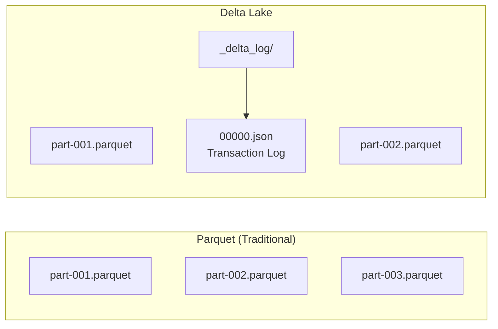

Add ACID transactions, schema management, and time travel capabilities to your data lake using Delta Lake.

## What is Delta Lake?

### Problems with Traditional Data Lakes

| Problem | Description |
|---------|-------------|
| **No ACID Support** | Data corruption possible during concurrent writes |
| **Schema Inconsistency** | Different schemas across files |
| **Small Files** | Performance degradation |
| **No Rollback** | Difficult to recover from bad data |

### Delta Lake Solution




With Parquet files alone, there's no way to know "who added/deleted which files and when." Delta Lake's `_delta_log/` records all changes as JSON, ensuring data consistency even when multiple jobs write concurrently, and allowing rollback to a previous point in time when issues arise. It serves the same role as a WAL (Write-Ahead Log) in relational databases.


| Feature | Description |
|---------|-------------|
| **ACID Transactions** | Atomic writes, concurrency control |
| **Schema Evolution** | Safe column addition/modification |
| **Time Travel** | Query/restore past versions |
| **Compaction** | Auto merge small files |
| **Z-Order** | Query optimization clustering |

---

## Environment Setup




**build.gradle.kts**

```kotlin
plugins {
    java
    application
}

dependencies {
    implementation("org.apache.spark:spark-core_2.13:3.5.1")
    implementation("org.apache.spark:spark-sql_2.13:3.5.1")
    implementation("io.delta:delta-spark_2.13:3.1.0")
}
```




**build.sbt**

```scala
ThisBuild / scalaVersion := "2.13.12"

lazy val root = (project in file("."))
  .settings(
    name := "spark-delta-example",
    libraryDependencies ++= Seq(
      "org.apache.spark" %% "spark-core" % "3.5.1",
      "org.apache.spark" %% "spark-sql"  % "3.5.1",
      "io.delta" %% "delta-spark" % "3.1.0"
    )
  )
```




### SparkSession Configuration




```java
import org.apache.spark.sql.SparkSession;

SparkSession spark = SparkSession.builder()
        .appName("Delta Lake Example")
        .master("local[*]")
        .config("spark.sql.extensions", "io.delta.sql.DeltaSparkSessionExtension")
        .config("spark.sql.catalog.spark_catalog",
                "org.apache.spark.sql.delta.catalog.DeltaCatalog")
        .getOrCreate();
```




```scala
import org.apache.spark.sql.SparkSession
import io.delta.sql.DeltaSparkSessionExtension

val spark = SparkSession.builder()
  .appName("Delta Lake Example")
  .master("local[*]")
  .config("spark.sql.extensions", "io.delta.sql.DeltaSparkSessionExtension")
  .config("spark.sql.catalog.spark_catalog", "org.apache.spark.sql.delta.catalog.DeltaCatalog")
  .getOrCreate()
```





- **spark-sql-extensions**: Enables Delta Lake SQL commands
- **spark_catalog**: Registers Delta tables as default catalog
- **Version Compatibility**: Spark 3.5.x and Delta 3.1.x combination recommended
- **Scala Version**: Must use the same Scala version (2.13) as Spark
- **Same for Java**: Delta Lake API uses `DeltaTable.forPath(spark, path)` form in both Java and Scala


---

## Basic CRUD Operations

### Create: Create Delta Table




```java
import org.apache.spark.sql.Dataset;
import org.apache.spark.sql.Row;
import org.apache.spark.sql.RowFactory;
import org.apache.spark.sql.types.*;
import static org.apache.spark.sql.functions.*;

// Define schema
StructType schema = new StructType()
    .add("orderId", DataTypes.StringType)
    .add("customerId", DataTypes.StringType)
    .add("product", DataTypes.StringType)
    .add("quantity", DataTypes.IntegerType)
    .add("price", DataTypes.DoubleType)
    .add("orderDate", DataTypes.StringType);

// Create data
List<Row> rows = Arrays.asList(
    RowFactory.create("O001", "C1", "Laptop", 1, 1200.0, "2024-01-15"),
    RowFactory.create("O002", "C2", "Phone", 2, 800.0, "2024-01-15"),
    RowFactory.create("O003", "C1", "Tablet", 1, 500.0, "2024-01-16")
);
Dataset<Row> orders = spark.createDataFrame(rows, schema);

// Save as Delta table
orders.write()
    .format("delta")
    .mode("overwrite")
    .save("/data/orders");

// Create table with SQL
spark.sql("CREATE TABLE IF NOT EXISTS orders ("
    + "orderId STRING, customerId STRING, product STRING, "
    + "quantity INT, price DOUBLE, orderDate DATE) "
    + "USING DELTA LOCATION '/data/orders' PARTITIONED BY (orderDate)");
```




```scala
import io.delta.tables._
import org.apache.spark.sql.functions._

case class Order(
  orderId: String,
  customerId: String,
  product: String,
  quantity: Int,
  price: Double,
  orderDate: String
)

// Scala's case class enables automatic schema inference
// .toDF() requires import spark.implicits._ (implicit conversion)
val orders = Seq(
  Order("O001", "C1", "Laptop", 1, 1200.0, "2024-01-15"),
  Order("O002", "C2", "Phone", 2, 800.0, "2024-01-15"),
  Order("O003", "C1", "Tablet", 1, 500.0, "2024-01-16")
).toDF()

// Save as Delta table
orders.write
  .format("delta")
  .mode("overwrite")
  .save("/data/orders")
```





In Scala code, syntax like `.toDF()` and `$"columnName"` are Scala-only implicit conversions that require `import spark.implicits._`. In Java, use `col("columnName")` or `functions.col()` instead.


### Read: Query Data




```java
// DataFrame API
Dataset<Row> df = spark.read().format("delta").load("/data/orders");
df.show();

// SQL
spark.sql("SELECT * FROM delta.`/data/orders`").show();

// Register as table then query
spark.sql("SELECT * FROM orders WHERE quantity > 1").show();
```




```scala
// DataFrame API
val df = spark.read.format("delta").load("/data/orders")
df.show()

// SQL
spark.sql("SELECT * FROM delta.`/data/orders`").show()
```




### Update: Modify Data




```java
import io.delta.tables.DeltaTable;
import java.util.HashMap;
import java.util.Map;

DeltaTable deltaTable = DeltaTable.forPath(spark, "/data/orders");

// Conditional update
Map<String, Column> set = new HashMap<>();
set.put("quantity", lit(3));
set.put("price", lit(750.0));
deltaTable.update(expr("orderId = 'O002'"), set);

// SQL update
spark.sql("UPDATE orders SET quantity = 3, price = 750.0 WHERE orderId = 'O002'");
```




```scala
import io.delta.tables.DeltaTable

val deltaTable = DeltaTable.forPath(spark, "/data/orders")

// Conditional update
deltaTable.update(
  condition = expr("orderId = 'O002'"),
  set = Map(
    "quantity" -> lit(3),
    "price" -> lit(750.0)
  )
)

// SQL update
spark.sql("""
  UPDATE orders
  SET quantity = 3, price = 750.0
  WHERE orderId = 'O002'
""")
```




### Delete: Remove Data




```java
// Conditional delete
deltaTable.delete(expr("customerId = 'C2'"));

// SQL delete
spark.sql("DELETE FROM orders WHERE customerId = 'C2'");
```




```scala
// Conditional delete
deltaTable.delete(expr("customerId = 'C2'"))

// SQL delete
spark.sql("DELETE FROM orders WHERE customerId = 'C2'")
```




### Merge (Upsert)




```java
// Prepare new order data
List<Row> newRows = Arrays.asList(
    RowFactory.create("O002", "C2", "Phone", 5, 700.0, "2024-01-17"),  // Update existing order
    RowFactory.create("O004", "C3", "Monitor", 2, 300.0, "2024-01-17") // Insert new order
);
Dataset<Row> newOrders = spark.createDataFrame(newRows, schema);

deltaTable.as("target")
    .merge(newOrders.as("source"), "target.orderId = source.orderId")
    .whenMatched().updateAll()
    .whenNotMatched().insertAll()
    .execute();
```




```scala
val newOrders = Seq(
  Order("O002", "C2", "Phone", 5, 700.0, "2024-01-17"),  // Update existing
  Order("O004", "C3", "Monitor", 2, 300.0, "2024-01-17") // Insert new
).toDF()

deltaTable.as("target")
  .merge(
    newOrders.as("source"),
    "target.orderId = source.orderId"
  )
  .whenMatched
  .updateAll()
  .whenNotMatched
  .insertAll()
  .execute()
```





- **MERGE (Upsert)**: Insert + Update in a single transaction
- **Conditional Update/Delete**: Use `expr()` or SQL WHERE conditions
- **SQL Support**: All operations available via SQL syntax


---

## Time Travel

### Query by Version




```java
// Query specific version
Dataset<Row> version0 = spark.read()
    .format("delta")
    .option("versionAsOf", 0)
    .load("/data/orders");

// Query as of timestamp
Dataset<Row> asOf = spark.read()
    .format("delta")
    .option("timestampAsOf", "2024-01-16 10:00:00")
    .load("/data/orders");

// SQL query
spark.sql("SELECT * FROM orders VERSION AS OF 0").show();
spark.sql("SELECT * FROM orders TIMESTAMP AS OF '2024-01-16 10:00:00'").show();
```




```scala
// Query specific version
val version0 = spark.read
  .format("delta")
  .option("versionAsOf", 0)
  .load("/data/orders")

// Query as of timestamp
val asOf = spark.read
  .format("delta")
  .option("timestampAsOf", "2024-01-16 10:00:00")
  .load("/data/orders")

// SQL query
spark.sql("""
  SELECT * FROM orders VERSION AS OF 0
""").show()

spark.sql("""
  SELECT * FROM orders TIMESTAMP AS OF '2024-01-16 10:00:00'
""").show()
```




### View Version History

```java
// Same API for both Java and Scala
deltaTable.history()
    .select("version", "timestamp", "operation", "operationParameters")
    .show(false);

// Result:
// +-------+--------------------+---------+---------------------------+
// |version|timestamp           |operation|operationParameters        |
// +-------+--------------------+---------+---------------------------+
// |3      |2024-01-17 15:30:00|MERGE    |{predicate -> ...}         |
// |2      |2024-01-17 14:00:00|UPDATE   |{predicate -> orderId = ...}|
// |1      |2024-01-16 10:00:00|WRITE    |{mode -> Append}           |
// |0      |2024-01-15 09:00:00|WRITE    |{mode -> Overwrite}        |
// +-------+--------------------+---------+---------------------------+
```

### Restore to Previous Version

```java
// Same API for both Java and Scala
// Restore to version
deltaTable.restoreToVersion(1);

// Restore to timestamp
deltaTable.restoreToTimestamp("2024-01-16 10:00:00");

// SQL restore
spark.sql("RESTORE orders TO VERSION AS OF 1");
```


- **versionAsOf**: Query by specific version number
- **timestampAsOf**: Query by specific point in time
- **history()**: View all change history
- **Restore**: Revert data to any past version
- **Caution**: Versions before the Vacuum retention period cannot be queried


---

## Schema Evolution

### Add Columns




```java
// Data with new column (status)
StructType schemaWithStatus = new StructType()
    .add("orderId", DataTypes.StringType)
    .add("customerId", DataTypes.StringType)
    .add("product", DataTypes.StringType)
    .add("quantity", DataTypes.IntegerType)
    .add("price", DataTypes.DoubleType)
    .add("orderDate", DataTypes.StringType)
    .add("status", DataTypes.StringType);

Dataset<Row> ordersWithStatus = spark.createDataFrame(
    Arrays.asList(RowFactory.create("O005", "C4", "Keyboard", 1, 100.0, "2024-01-18", "CONFIRMED")),
    schemaWithStatus
);

// Auto merge schema
ordersWithStatus.write()
    .format("delta")
    .mode("append")
    .option("mergeSchema", "true")
    .save("/data/orders");
```




```scala
// Data with new column
val ordersWithStatus = Seq(
  ("O005", "C4", "Keyboard", 1, 100.0, "2024-01-18", "CONFIRMED")
).toDF("orderId", "customerId", "product", "quantity", "price", "orderDate", "status")

// Auto merge schema
ordersWithStatus.write
  .format("delta")
  .mode("append")
  .option("mergeSchema", "true")
  .save("/data/orders")
```




**Schema Overwrite**

```java
// Same API for both Java and Scala
// Completely change schema
newSchema.write()
    .format("delta")
    .mode("overwrite")
    .option("overwriteSchema", "true")
    .save("/data/orders");
```


- **mergeSchema**: Automatically adds new columns (non-breaking change)
- **overwriteSchema**: Completely replaces schema (breaking change, use with caution)
- **Default behavior**: Schema mismatch throws AnalysisException


---

## Optimization

### Compaction (File Merging)

```java
// Same API for both Java and Scala
// Merge small files
deltaTable.optimize().executeCompaction();

// Optimize specific partition
deltaTable.optimize()
    .where("orderDate = '2024-01-15'")
    .executeCompaction();

// SQL
spark.sql("OPTIMIZE orders");
spark.sql("OPTIMIZE orders WHERE orderDate = '2024-01-15'");
```

### Z-Order (Data Clustering)

```java
// Cluster by frequently filtered columns
deltaTable.optimize()
    .executeZOrderBy("customerId", "product");

// SQL
spark.sql("OPTIMIZE orders ZORDER BY (customerId, product)");
```

### Vacuum (Clean Old Files)

```java
// Delete versions older than 7 days
deltaTable.vacuum(168);  // 168 hours = 7 days

// SQL
spark.sql("VACUUM orders RETAIN 168 HOURS");

// Warning: Versions before retention period cannot time travel
```

---

## Change Data Feed (CDC)

### Enable CDC

```scala
// Enable when creating table
spark.sql("""
  CREATE TABLE orders_cdc (
    orderId STRING,
    customerId STRING,
    product STRING,
    quantity INT,
    price DOUBLE
  )
  USING DELTA
  TBLPROPERTIES (delta.enableChangeDataFeed = true)
""")

// Enable on existing table
spark.sql("""
  ALTER TABLE orders
  SET TBLPROPERTIES (delta.enableChangeDataFeed = true)
""")
```

### Query Changes




```java
// Query changes by version range
Dataset<Row> changes = spark.read()
    .format("delta")
    .option("readChangeFeed", "true")
    .option("startingVersion", 2)
    .option("endingVersion", 5)
    .table("orders");

changes.show();
// +-------+----------+-------+--------+-----+------------------+---------------+
// |orderId|customerId|product|quantity|price|_change_type      |_commit_version|
// +-------+----------+-------+--------+-----+------------------+---------------+
// |O002   |C2        |Phone  |5       |700.0|update_postimage  |3              |
// |O002   |C2        |Phone  |3       |750.0|update_preimage   |3              |
// |O004   |C3        |Monitor|2       |300.0|insert            |3              |
// +-------+----------+-------+--------+-----+------------------+---------------+

// Receive changes via Streaming
Dataset<Row> changesStream = spark.readStream()
    .format("delta")
    .option("readChangeFeed", "true")
    .option("startingVersion", 0)
    .table("orders");

changesStream.writeStream()
    .format("console")
    .start();
```




```scala
// Query changes by version range
val changes = spark.read
  .format("delta")
  .option("readChangeFeed", "true")
  .option("startingVersion", 2)
  .option("endingVersion", 5)
  .table("orders")

changes.show()
// +-------+----------+-------+--------+-----+------------------+---------------+
// |orderId|customerId|product|quantity|price|_change_type      |_commit_version|
// +-------+----------+-------+--------+-----+------------------+---------------+
// |O002   |C2        |Phone  |5       |700.0|update_postimage  |3              |
// |O002   |C2        |Phone  |3       |750.0|update_preimage   |3              |
// |O004   |C3        |Monitor|2       |300.0|insert            |3              |
// +-------+----------+-------+--------+-----+------------------+---------------+
```





- **Activation Required**: `delta.enableChangeDataFeed = true` table property
- **Change Types**: insert, update_preimage, update_postimage, delete
- **Streaming Support**: Real-time change capture via `readStream`
- **Use Cases**: Data synchronization, audit logs, real-time dashboards


---

## Practical Example: ETL Pipeline

### Bronze → Silver → Gold Architecture

A standard pattern for progressively improving data quality in a data lakehouse:

- **Bronze (Raw)**: Stores data from external sources as-is without processing. Preserves originals for potential reprocessing later.
- **Silver (Cleaned)**: Clean data that has passed quality checks such as deduplication, type conversion, and NULL filtering.
- **Gold (Business Aggregates)**: Aggregation tables ready for reporting and dashboards (e.g., daily revenue, customer LTV).




```java
public class DeltaLakePipeline {
    private final SparkSession spark;

    public DeltaLakePipeline(SparkSession spark) {
        this.spark = spark;
    }

    // Bronze: Store raw data as-is
    public void ingestToBronze() {
        Dataset<Row> rawData = spark.read()
            .option("header", "true")
            .csv("/data/raw/orders/*.csv");

        rawData.write()
            .format("delta")
            .mode("append")
            .option("mergeSchema", "true")
            .save("/data/bronze/orders");
    }

    // Silver: Clean and validate
    public void transformToSilver() {
        Dataset<Row> bronze = spark.read().format("delta").load("/data/bronze/orders");

        Dataset<Row> silver = bronze
            .filter(col("orderId").isNotNull().and(col("price").gt(0)))
            .withColumn("price", col("price").cast("double"))
            .withColumn("quantity", col("quantity").cast("int"))
            .withColumn("orderDate", to_date(col("orderDate")))
            .dropDuplicates("orderId")
            .withColumn("totalAmount", col("price").multiply(col("quantity")))
            .withColumn("processedAt", current_timestamp());

        DeltaTable silverTable = DeltaTable.forPath(spark, "/data/silver/orders");
        silverTable.as("target")
            .merge(silver.as("source"), "target.orderId = source.orderId")
            .whenMatched().updateAll()
            .whenNotMatched().insertAll()
            .execute();
    }

    // Gold: Business aggregations
    public void aggregateToGold() {
        Dataset<Row> silver = spark.read().format("delta").load("/data/silver/orders");

        Dataset<Row> dailySales = silver
            .groupBy(col("orderDate"))
            .agg(
                count("*").as("orderCount"),
                sum("totalAmount").as("totalRevenue"),
                avg("totalAmount").as("avgOrderValue"),
                countDistinct("customerId").as("uniqueCustomers")
            )
            .withColumn("updatedAt", current_timestamp());

        dailySales.write()
            .format("delta")
            .mode("overwrite")
            .save("/data/gold/daily_sales");
    }

    // Run pipeline
    public void runPipeline() {
        ingestToBronze();
        transformToSilver();
        aggregateToGold();

        DeltaTable.forPath(spark, "/data/silver/orders").optimize().executeCompaction();
        DeltaTable.forPath(spark, "/data/silver/orders").vacuum(168);
    }
}
```




```scala
object DeltaLakePipeline extends App {
  val spark = SparkSession.builder()
    .appName("Delta Lake Pipeline")
    .config("spark.sql.extensions", "io.delta.sql.DeltaSparkSessionExtension")
    .config("spark.sql.catalog.spark_catalog", "org.apache.spark.sql.delta.catalog.DeltaCatalog")
    .getOrCreate()

  import spark.implicits._

  // Bronze: Store raw data as-is
  def ingestToBronze(): Unit = {
    val rawData = spark.read
      .option("header", "true")
      .csv("/data/raw/orders/*.csv")

    rawData.write
      .format("delta")
      .mode("append")
      .option("mergeSchema", "true")
      .save("/data/bronze/orders")

    println("Bronze layer ingestion complete")
  }

  // Silver: Clean and validate
  def transformToSilver(): Unit = {
    val bronze = spark.read.format("delta").load("/data/bronze/orders")

    val silver = bronze
      // Data cleaning
      .filter($"orderId".isNotNull && $"price" > 0)
      // Type conversion
      .withColumn("price", $"price".cast("double"))
      .withColumn("quantity", $"quantity".cast("int"))
      .withColumn("orderDate", to_date($"orderDate"))
      // Deduplicate
      .dropDuplicates("orderId")
      // Derived columns
      .withColumn("totalAmount", $"price" * $"quantity")
      .withColumn("processedAt", current_timestamp())

    // Incremental processing with Merge
    val silverTable = DeltaTable.forPath(spark, "/data/silver/orders")

    silverTable.as("target")
      .merge(silver.as("source"), "target.orderId = source.orderId")
      .whenMatched.updateAll()
      .whenNotMatched.insertAll()
      .execute()

    println("Silver layer transformation complete")
  }

  // Gold: Business aggregations
  def aggregateToGold(): Unit = {
    val silver = spark.read.format("delta").load("/data/silver/orders")

    // Daily sales aggregation
    val dailySales = silver
      .groupBy($"orderDate")
      .agg(
        count("*").as("orderCount"),
        sum("totalAmount").as("totalRevenue"),
        avg("totalAmount").as("avgOrderValue"),
        countDistinct("customerId").as("uniqueCustomers")
      )
      .withColumn("updatedAt", current_timestamp())

    dailySales.write
      .format("delta")
      .mode("overwrite")
      .save("/data/gold/daily_sales")

    // Customer metrics
    val customerMetrics = silver
      .groupBy($"customerId")
      .agg(
        count("*").as("totalOrders"),
        sum("totalAmount").as("lifetimeValue"),
        min("orderDate").as("firstOrderDate"),
        max("orderDate").as("lastOrderDate")
      )
      .withColumn("updatedAt", current_timestamp())

    customerMetrics.write
      .format("delta")
      .mode("overwrite")
      .save("/data/gold/customer_metrics")

    println("Gold layer aggregation complete")
  }

  // Run pipeline
  def runPipeline(): Unit = {
    ingestToBronze()
    transformToSilver()
    aggregateToGold()

    // Optimize
    DeltaTable.forPath(spark, "/data/silver/orders").optimize().executeCompaction()
    DeltaTable.forPath(spark, "/data/silver/orders").vacuum(168)

    println("Pipeline complete")
  }

  runPipeline()
  spark.stop()
}
```




---

## Considerations

| Item | Note |
|------|------|
| **Vacuum** | Versions before retention period cannot time travel |
| **Concurrent Writes** | Conflicts possible when writing to same partition |
| **Schema Changes** | Type changes require overwriteSchema |
| **File Size** | Recommend target file size setting (128MB~1GB) |

---

## Next Steps

- [Structured Streaming](../concepts/structured-streaming/) - Real-time processing
- [Performance Tuning](../concepts/tuning/) - Spark optimization
- [Kafka Integration](../../kafka/) - Stream source
