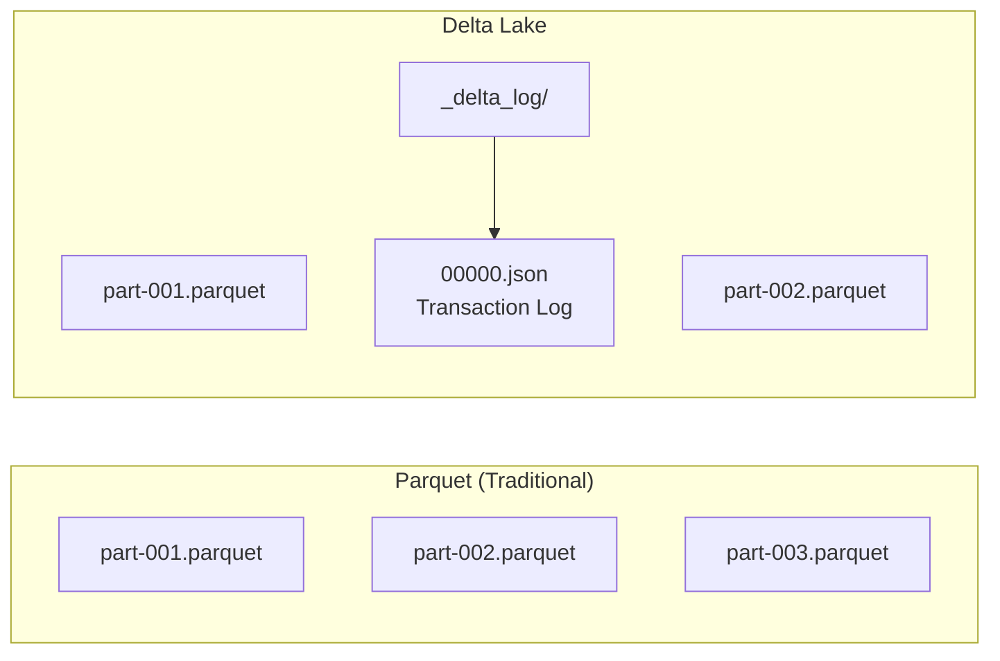

Add ACID transactions, schema management, and time travel capabilities to your data lake using Delta Lake.

## What is Delta Lake?

### Problems with Traditional Data Lakes

| Problem | Description |
|---------|-------------|
| **No ACID Support** | Data corruption possible during concurrent writes |
| **Schema Inconsistency** | Different schemas across files |
| **Small Files** | Performance degradation |
| **No Rollback** | Difficult to recover from bad data |

### Delta Lake Solution



| Feature | Description |
|---------|-------------|
| **ACID Transactions** | Atomic writes, concurrency control |
| **Schema Evolution** | Safe column addition/modification |
| **Time Travel** | Query/restore past versions |
| **Compaction** | Auto merge small files |
| **Z-Order** | Query optimization clustering |

---

## Environment Setup

### build.sbt

```scala
ThisBuild / scalaVersion := "2.13.12"

lazy val root = (project in file("."))
  .settings(
    name := "spark-delta-example",
    libraryDependencies ++= Seq(
      "org.apache.spark" %% "spark-core" % "3.5.1",
      "org.apache.spark" %% "spark-sql"  % "3.5.1",
      "io.delta" %% "delta-spark" % "3.1.0"
    )
  )
```

### SparkSession Configuration

```scala
import org.apache.spark.sql.SparkSession
import io.delta.sql.DeltaSparkSessionExtension

val spark = SparkSession.builder()
  .appName("Delta Lake Example")
  .master("local[*]")
  .config("spark.sql.extensions", "io.delta.sql.DeltaSparkSessionExtension")
  .config("spark.sql.catalog.spark_catalog", "org.apache.spark.sql.delta.catalog.DeltaCatalog")
  .getOrCreate()
```

---

## Basic CRUD Operations

### Create: Create Delta Table

```scala
import io.delta.tables._
import org.apache.spark.sql.functions._

case class Order(
  orderId: String,
  customerId: String,
  product: String,
  quantity: Int,
  price: Double,
  orderDate: String
)

val orders = Seq(
  Order("O001", "C1", "Laptop", 1, 1200.0, "2024-01-15"),
  Order("O002", "C2", "Phone", 2, 800.0, "2024-01-15"),
  Order("O003", "C1", "Tablet", 1, 500.0, "2024-01-16")
).toDF()

// Save as Delta table
orders.write
  .format("delta")
  .mode("overwrite")
  .save("/data/orders")
```

### Read: Query Data

```scala
// DataFrame API
val df = spark.read.format("delta").load("/data/orders")
df.show()

// SQL
spark.sql("SELECT * FROM delta.`/data/orders`").show()
```

### Update: Modify Data

```scala
import io.delta.tables.DeltaTable

val deltaTable = DeltaTable.forPath(spark, "/data/orders")

// Conditional update
deltaTable.update(
  condition = expr("orderId = 'O002'"),
  set = Map(
    "quantity" -> lit(3),
    "price" -> lit(750.0)
  )
)

// SQL update
spark.sql("""
  UPDATE orders
  SET quantity = 3, price = 750.0
  WHERE orderId = 'O002'
""")
```

### Delete: Remove Data

```scala
// Conditional delete
deltaTable.delete(expr("customerId = 'C2'"))

// SQL delete
spark.sql("DELETE FROM orders WHERE customerId = 'C2'")
```

### Merge (Upsert)

```scala
val newOrders = Seq(
  Order("O002", "C2", "Phone", 5, 700.0, "2024-01-17"),  // Update existing
  Order("O004", "C3", "Monitor", 2, 300.0, "2024-01-17") // Insert new
).toDF()

deltaTable.as("target")
  .merge(
    newOrders.as("source"),
    "target.orderId = source.orderId"
  )
  .whenMatched
  .updateAll()
  .whenNotMatched
  .insertAll()
  .execute()
```

---

## Time Travel

### Query by Version

```scala
// Query specific version
val version0 = spark.read
  .format("delta")
  .option("versionAsOf", 0)
  .load("/data/orders")

// Query as of timestamp
val asOf = spark.read
  .format("delta")
  .option("timestampAsOf", "2024-01-16 10:00:00")
  .load("/data/orders")

// SQL query
spark.sql("""
  SELECT * FROM orders VERSION AS OF 0
""").show()

spark.sql("""
  SELECT * FROM orders TIMESTAMP AS OF '2024-01-16 10:00:00'
""").show()
```

### View Version History

```scala
val history = deltaTable.history()
history.select("version", "timestamp", "operation", "operationParameters").show(false)

// Result:
// +-------+--------------------+---------+---------------------------+
// |version|timestamp           |operation|operationParameters        |
// +-------+--------------------+---------+---------------------------+
// |3      |2024-01-17 15:30:00|MERGE    |{predicate -> ...}         |
// |2      |2024-01-17 14:00:00|UPDATE   |{predicate -> orderId = ...}|
// |1      |2024-01-16 10:00:00|WRITE    |{mode -> Append}           |
// |0      |2024-01-15 09:00:00|WRITE    |{mode -> Overwrite}        |
// +-------+--------------------+---------+---------------------------+
```

### Restore to Previous Version

```scala
// Restore to version
deltaTable.restoreToVersion(1)

// Restore to timestamp
deltaTable.restoreToTimestamp("2024-01-16 10:00:00")

// SQL restore
spark.sql("RESTORE orders TO VERSION AS OF 1")
```

---

## Schema Evolution

### Add Columns

```scala
// Data with new column
val ordersWithStatus = Seq(
  ("O005", "C4", "Keyboard", 1, 100.0, "2024-01-18", "CONFIRMED")
).toDF("orderId", "customerId", "product", "quantity", "price", "orderDate", "status")

// Auto merge schema
ordersWithStatus.write
  .format("delta")
  .mode("append")
  .option("mergeSchema", "true")
  .save("/data/orders")
```

---

## Optimization

### Compaction (File Merging)

```scala
// Merge small files
deltaTable.optimize().executeCompaction()

// Optimize specific partition
deltaTable.optimize()
  .where("orderDate = '2024-01-15'")
  .executeCompaction()

// SQL
spark.sql("OPTIMIZE orders")
```

### Z-Order (Data Clustering)

```scala
// Cluster by frequently filtered columns
deltaTable.optimize()
  .executeZOrderBy("customerId", "product")

// SQL
spark.sql("OPTIMIZE orders ZORDER BY (customerId, product)")
```

### Vacuum (Clean Old Files)

```scala
// Delete versions older than 7 days
deltaTable.vacuum(168)  // 168 hours = 7 days

// SQL
spark.sql("VACUUM orders RETAIN 168 HOURS")

// Warning: Versions before retention period cannot time travel
```

---

## Change Data Feed (CDC)

### Enable CDC

```scala
// Enable when creating table
spark.sql("""
  CREATE TABLE orders_cdc (
    orderId STRING,
    customerId STRING,
    product STRING,
    quantity INT,
    price DOUBLE
  )
  USING DELTA
  TBLPROPERTIES (delta.enableChangeDataFeed = true)
""")

// Enable on existing table
spark.sql("""
  ALTER TABLE orders
  SET TBLPROPERTIES (delta.enableChangeDataFeed = true)
""")
```

### Query Changes

```scala
// Query changes by version range
val changes = spark.read
  .format("delta")
  .option("readChangeFeed", "true")
  .option("startingVersion", 2)
  .option("endingVersion", 5)
  .table("orders")

changes.show()
// +-------+----------+-------+--------+-----+------------------+---------------+
// |orderId|customerId|product|quantity|price|_change_type      |_commit_version|
// +-------+----------+-------+--------+-----+------------------+---------------+
// |O002   |C2        |Phone  |5       |700.0|update_postimage  |3              |
// |O002   |C2        |Phone  |3       |750.0|update_preimage   |3              |
// |O004   |C3        |Monitor|2       |300.0|insert            |3              |
// +-------+----------+-------+--------+-----+------------------+---------------+
```

---

## Practical Example: ETL Pipeline

### Bronze → Silver → Gold Architecture

```scala
object DeltaLakePipeline extends App {
  val spark = SparkSession.builder()
    .appName("Delta Lake Pipeline")
    .config("spark.sql.extensions", "io.delta.sql.DeltaSparkSessionExtension")
    .config("spark.sql.catalog.spark_catalog", "org.apache.spark.sql.delta.catalog.DeltaCatalog")
    .getOrCreate()

  import spark.implicits._

  // Bronze: Store raw data as-is
  def ingestToBronze(): Unit = {
    val rawData = spark.read
      .option("header", "true")
      .csv("/data/raw/orders/*.csv")

    rawData.write
      .format("delta")
      .mode("append")
      .option("mergeSchema", "true")
      .save("/data/bronze/orders")

    println("Bronze layer ingestion complete")
  }

  // Silver: Clean and validate
  def transformToSilver(): Unit = {
    val bronze = spark.read.format("delta").load("/data/bronze/orders")

    val silver = bronze
      // Data cleaning
      .filter($"orderId".isNotNull && $"price" > 0)
      // Type conversion
      .withColumn("price", $"price".cast("double"))
      .withColumn("quantity", $"quantity".cast("int"))
      .withColumn("orderDate", to_date($"orderDate"))
      // Deduplicate
      .dropDuplicates("orderId")
      // Derived columns
      .withColumn("totalAmount", $"price" * $"quantity")
      .withColumn("processedAt", current_timestamp())

    // Incremental processing with Merge
    val silverTable = DeltaTable.forPath(spark, "/data/silver/orders")

    silverTable.as("target")
      .merge(silver.as("source"), "target.orderId = source.orderId")
      .whenMatched.updateAll()
      .whenNotMatched.insertAll()
      .execute()

    println("Silver layer transformation complete")
  }

  // Gold: Business aggregations
  def aggregateToGold(): Unit = {
    val silver = spark.read.format("delta").load("/data/silver/orders")

    // Daily sales aggregation
    val dailySales = silver
      .groupBy($"orderDate")
      .agg(
        count("*").as("orderCount"),
        sum("totalAmount").as("totalRevenue"),
        avg("totalAmount").as("avgOrderValue"),
        countDistinct("customerId").as("uniqueCustomers")
      )
      .withColumn("updatedAt", current_timestamp())

    dailySales.write
      .format("delta")
      .mode("overwrite")
      .save("/data/gold/daily_sales")

    // Customer metrics
    val customerMetrics = silver
      .groupBy($"customerId")
      .agg(
        count("*").as("totalOrders"),
        sum("totalAmount").as("lifetimeValue"),
        min("orderDate").as("firstOrderDate"),
        max("orderDate").as("lastOrderDate")
      )
      .withColumn("updatedAt", current_timestamp())

    customerMetrics.write
      .format("delta")
      .mode("overwrite")
      .save("/data/gold/customer_metrics")

    println("Gold layer aggregation complete")
  }

  // Run pipeline
  def runPipeline(): Unit = {
    ingestToBronze()
    transformToSilver()
    aggregateToGold()

    // Optimize
    DeltaTable.forPath(spark, "/data/silver/orders").optimize().executeCompaction()
    DeltaTable.forPath(spark, "/data/silver/orders").vacuum(168)

    println("Pipeline complete")
  }

  runPipeline()
  spark.stop()
}
```

---

## Considerations

| Item | Note |
|------|------|
| **Vacuum** | Versions before retention period cannot time travel |
| **Concurrent Writes** | Conflicts possible when writing to same partition |
| **Schema Changes** | Type changes require overwriteSchema |
| **File Size** | Recommend target file size setting (128MB~1GB) |

---

## Next Steps

- [Structured Streaming](../concepts/structured-streaming/) - Real-time processing
- [Performance Tuning](../concepts/tuning/) - Spark optimization
- [Kafka Integration]() - Stream source
