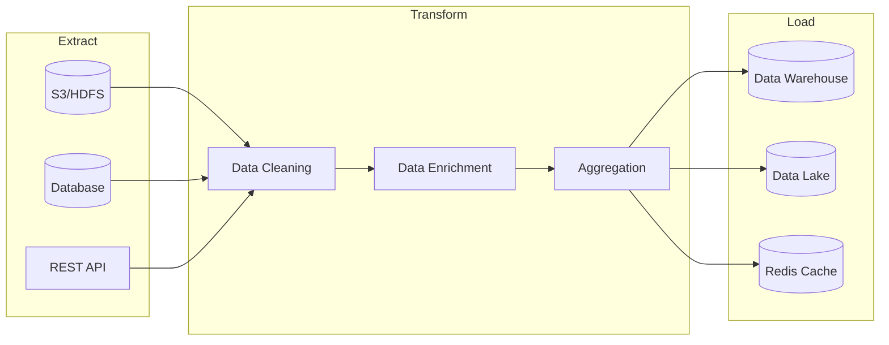

# Production ETL Pipeline Examples

Complete ETL (Extract-Transform-Load) pipeline examples ready for production environments.

## Pipeline Architecture



## Project Structure

```
etl-pipeline/
├── src/main/java/com/example/etl/
│   ├── EtlApplication.java
│   ├── config/
│   │   └── SparkConfig.java
│   ├── job/
│   │   ├── AbstractEtlJob.java
│   │   ├── SalesEtlJob.java
│   │   └── CustomerEtlJob.java
│   ├── transformer/
│   │   ├── DataCleaner.java
│   │   └── DataEnricher.java
│   └── util/
│       ├── SchemaUtils.java
│       └── DateUtils.java
├── src/main/resources/
│   ├── application.yml
│   └── schemas/
│       └── sales-schema.json
└── build.gradle.kts
```

## Basic ETL Structure

### Abstract ETL Job Class

```java
package com.example.etl.job;

import org.apache.spark.sql.Dataset;
import org.apache.spark.sql.Row;
import org.apache.spark.sql.SaveMode;
import org.apache.spark.sql.SparkSession;
import org.slf4j.Logger;
import org.slf4j.LoggerFactory;

import java.time.LocalDate;
import java.time.format.DateTimeFormatter;

/**
 * Abstract class defining the basic structure of ETL jobs
 */
public abstract class AbstractEtlJob {
    protected final Logger logger = LoggerFactory.getLogger(getClass());
    protected final SparkSession spark;
    protected final LocalDate processDate;

    protected AbstractEtlJob(SparkSession spark, LocalDate processDate) {
        this.spark = spark;
        this.processDate = processDate;
    }

    /**
     * Execute ETL job (Template Method pattern: the parent class defines the overall flow, subclasses provide specific implementations)
     */
    public final EtlResult execute() {
        String jobName = getJobName();
        long startTime = System.currentTimeMillis();
        logger.info("ETL job started: {} (processing date: {})", jobName, processDate);

        try {
            // 1. Extract
            logger.info("[Extract] Starting data extraction");
            Dataset<Row> rawData = extract();
            long extractCount = rawData.count();
            logger.info("[Extract] Complete: {} records", extractCount);

            // 2. Transform
            logger.info("[Transform] Starting data transformation");
            Dataset<Row> transformedData = transform(rawData);
            long transformCount = transformedData.count();
            logger.info("[Transform] Complete: {} records", transformCount);

            // 3. Validate
            logger.info("[Validate] Starting data validation");
            ValidationResult validation = validate(transformedData);
            if (!validation.isValid()) {
                throw new EtlValidationException(validation.getErrors());
            }
            logger.info("[Validate] Complete: validation passed");

            // 4. Load
            logger.info("[Load] Starting data loading");
            load(transformedData);
            logger.info("[Load] Complete");

            long duration = System.currentTimeMillis() - startTime;
            logger.info("ETL job completed: {} (duration: {}ms)", jobName, duration);

            return EtlResult.success(extractCount, transformCount, duration);

        } catch (Exception e) {
            long duration = System.currentTimeMillis() - startTime;
            logger.error("ETL job failed: {} - {}", jobName, e.getMessage(), e);
            return EtlResult.failure(e.getMessage(), duration);
        }
    }

    // Implemented by subclasses
    protected abstract String getJobName();
    protected abstract Dataset<Row> extract();
    protected abstract Dataset<Row> transform(Dataset<Row> data);
    protected abstract ValidationResult validate(Dataset<Row> data);
    protected abstract void load(Dataset<Row> data);

    // Common utility methods
    protected String getPartitionPath() {
        return processDate.format(DateTimeFormatter.ofPattern("year=yyyy/month=MM/day=dd"));
    }
}
```

### ETL Result Class

```java
package com.example.etl.job;

public record EtlResult(
    boolean success,
    long inputRecords,
    long outputRecords,
    long durationMs,
    String errorMessage
) {
    public static EtlResult success(long input, long output, long duration) {
        return new EtlResult(true, input, output, duration, null);
    }

    public static EtlResult failure(String error, long duration) {
        return new EtlResult(false, 0, 0, duration, error);
    }
}
```

## Sales Data ETL Example

### Full Implementation

```java
package com.example.etl.job;

import org.apache.spark.sql.Dataset;
import org.apache.spark.sql.Row;
import org.apache.spark.sql.SaveMode;
import org.apache.spark.sql.SparkSession;
import org.apache.spark.sql.types.*;

import java.time.LocalDate;
import java.util.ArrayList;
import java.util.List;

import static org.apache.spark.sql.functions.*;

/**
 * Sales Data ETL Pipeline
 * - Source: S3 JSON files
 * - Transform: Cleaning, derived columns, aggregation
 * - Load: Parquet partitioned table
 */
public class SalesEtlJob extends AbstractEtlJob {

    private final String inputPath;
    private final String outputPath;
    private final StructType inputSchema;

    public SalesEtlJob(SparkSession spark, LocalDate processDate,
                       String inputPath, String outputPath) {
        super(spark, processDate);
        this.inputPath = inputPath;
        this.outputPath = outputPath;
        this.inputSchema = createInputSchema();
    }

    @Override
    protected String getJobName() {
        return "SalesETL";
    }

    private StructType createInputSchema() {
        return new StructType()
            .add("order_id", DataTypes.StringType, false)
            .add("customer_id", DataTypes.StringType, false)
            .add("product_id", DataTypes.StringType, false)
            .add("quantity", DataTypes.IntegerType, false)
            .add("unit_price", DataTypes.DoubleType, false)
            .add("discount", DataTypes.DoubleType, true)
            .add("order_timestamp", DataTypes.TimestampType, false)
            .add("shipping_address", DataTypes.StringType, true)
            .add("payment_method", DataTypes.StringType, true);
    }

    @Override
    protected Dataset<Row> extract() {
        String datePath = processDate.format(
            java.time.format.DateTimeFormatter.ofPattern("yyyy/MM/dd")
        );

        return spark.read()
            .schema(inputSchema)
            .option("mode", "PERMISSIVE")  // Allow corrupt records
            .option("columnNameOfCorruptRecord", "_corrupt_record")
            .json(inputPath + "/" + datePath + "/*.json");
    }

    @Override
    protected Dataset<Row> transform(Dataset<Row> data) {
        return data
            // 1. Remove corrupt records
            .filter(col("_corrupt_record").isNull())
            .drop("_corrupt_record")

            // 2. Handle NULL values
            .withColumn("discount",
                when(col("discount").isNull(), lit(0.0))
                .otherwise(col("discount")))
            .withColumn("shipping_address",
                when(col("shipping_address").isNull(), lit("Unknown"))
                .otherwise(col("shipping_address")))

            // 3. Create derived columns
            .withColumn("gross_amount",
                col("quantity").multiply(col("unit_price")))
            .withColumn("discount_amount",
                col("gross_amount").multiply(col("discount")))
            .withColumn("net_amount",
                col("gross_amount").minus(col("discount_amount")))

            // 4. Time derived columns
            .withColumn("order_date",
                to_date(col("order_timestamp")))
            .withColumn("order_hour",
                hour(col("order_timestamp")))
            .withColumn("order_dayofweek",
                dayofweek(col("order_timestamp")))

            // 5. Extract region (from address)
            .withColumn("region",
                when(col("shipping_address").contains("New York"), "Northeast")
                .when(col("shipping_address").contains("Los Angeles"), "West")
                .when(col("shipping_address").contains("Chicago"), "Midwest")
                .when(col("shipping_address").contains("Houston"), "South")
                .otherwise("Other"))

            // 6. Add processing metadata
            .withColumn("etl_timestamp", current_timestamp())
            .withColumn("etl_batch_id",
                lit(processDate.format(
                    java.time.format.DateTimeFormatter.BASIC_ISO_DATE
                )));
    }

    @Override
    protected ValidationResult validate(Dataset<Row> data) {
        List<String> errors = new ArrayList<>();

        // 1. Check required columns exist
        String[] requiredColumns = {"order_id", "customer_id", "net_amount"};
        for (String col : requiredColumns) {
            if (!java.util.Arrays.asList(data.columns()).contains(col)) {
                errors.add("Missing required column: " + col);
            }
        }

        // 2. Data quality checks
        long totalCount = data.count();
        if (totalCount == 0) {
            errors.add("No data to process");
        }

        // Check for negative amounts
        long negativeAmounts = data.filter(col("net_amount").lt(0)).count();
        if (negativeAmounts > 0) {
            double ratio = (double) negativeAmounts / totalCount * 100;
            if (ratio > 1.0) {  // Error if exceeds 1%
                errors.add(String.format("Negative amount ratio exceeded: %.2f%%", ratio));
            } else {
                logger.warn("Negative amount records found: {} ({}%)", negativeAmounts, ratio);
            }
        }

        // Check for duplicate orders
        long uniqueOrders = data.select("order_id").distinct().count();
        if (uniqueOrders < totalCount) {
            long duplicates = totalCount - uniqueOrders;
            errors.add("Duplicate orders found: " + duplicates);
        }

        // 3. Schema validation
        StructType actualSchema = data.schema();
        if (!actualSchema.fieldNames().length >= 10) {
            errors.add("Schema mismatch from expected");
        }

        return new ValidationResult(errors.isEmpty(), errors);
    }

    @Override
    protected void load(Dataset<Row> data) {
        // Save partitioned by date
        data.write()
            .mode(SaveMode.Overwrite)
            .partitionBy("order_date")
            .option("compression", "snappy")
            .parquet(outputPath + "/sales_fact");

        // Also create daily summary table
        Dataset<Row> dailySummary = data
            .groupBy("order_date", "region")
            .agg(
                count("*").alias("order_count"),
                sum("net_amount").alias("total_revenue"),
                avg("net_amount").alias("avg_order_value"),
                countDistinct("customer_id").alias("unique_customers")
            );

        dailySummary.write()
            .mode(SaveMode.Overwrite)
            .parquet(outputPath + "/daily_summary/" + getPartitionPath());
    }
}
```

### Validation Result Class

```java
package com.example.etl.job;

import java.util.List;

public record ValidationResult(
    boolean valid,
    List<String> errors
) {
    public boolean isValid() {
        return valid;
    }

    public List<String> getErrors() {
        return errors;
    }
}
```

## Data Cleaning Utilities

### Reusable Data Cleaner

```java
package com.example.etl.transformer;

import org.apache.spark.sql.Dataset;
import org.apache.spark.sql.Row;
import org.apache.spark.sql.types.DataTypes;

import java.util.Arrays;
import java.util.List;

import static org.apache.spark.sql.functions.*;

/**
 * Reusable data cleaning transformers
 */
public class DataCleaner {

    /**
     * Remove duplicates (based on specified keys)
     */
    public Dataset<Row> removeDuplicates(Dataset<Row> df, String... keyColumns) {
        return df.dropDuplicates(keyColumns);
    }

    /**
     * Handle NULL values (replace with defaults)
     */
    public Dataset<Row> fillNulls(Dataset<Row> df,
                                   java.util.Map<String, Object> defaults) {
        Dataset<Row> result = df;
        for (var entry : defaults.entrySet()) {
            String colName = entry.getKey();
            Object defaultValue = entry.getValue();

            if (Arrays.asList(df.columns()).contains(colName)) {
                result = result.withColumn(colName,
                    when(col(colName).isNull(), lit(defaultValue))
                    .otherwise(col(colName)));
            }
        }
        return result;
    }

    /**
     * Normalize strings (trim whitespace, lowercase)
     */
    public Dataset<Row> normalizeStrings(Dataset<Row> df, String... columns) {
        Dataset<Row> result = df;
        for (String colName : columns) {
            result = result.withColumn(colName,
                lower(trim(col(colName))));
        }
        return result;
    }

    /**
     * Filter outliers (IQR method)
     */
    public Dataset<Row> removeOutliers(Dataset<Row> df, String column,
                                        double lowerPercentile,
                                        double upperPercentile) {
        // Calculate percentiles
        double[] percentiles = df.stat().approxQuantile(
            column,
            new double[]{lowerPercentile, upperPercentile},
            0.01
        );

        double lower = percentiles[0];
        double upper = percentiles[1];

        return df.filter(
            col(column).geq(lower).and(col(column).leq(upper))
        );
    }

    /**
     * Standardize date format
     */
    public Dataset<Row> standardizeDates(Dataset<Row> df,
                                          String column,
                                          String inputFormat) {
        return df.withColumn(column,
            to_date(col(column), inputFormat));
    }

    /**
     * Validate email format
     */
    public Dataset<Row> validateEmails(Dataset<Row> df, String column) {
        String emailPattern = "^[a-zA-Z0-9._%+-]+@[a-zA-Z0-9.-]+\\.[a-zA-Z]{2,}$";
        return df.withColumn(column + "_valid",
            col(column).rlike(emailPattern));
    }

    /**
     * Normalize phone numbers (US format)
     */
    public Dataset<Row> normalizePhoneNumbers(Dataset<Row> df, String column) {
        return df.withColumn(column,
            regexp_replace(col(column), "[^0-9]", ""))
            .withColumn(column,
                when(col(column).startsWith("1"),
                    substring(col(column), 2, 100))
                .otherwise(col(column)));
    }
}
```

## Incremental ETL

### CDC-Based Incremental Processing

```java
package com.example.etl.job;

import org.apache.spark.sql.Dataset;
import org.apache.spark.sql.Row;
import org.apache.spark.sql.SaveMode;
import org.apache.spark.sql.SparkSession;

import java.time.LocalDateTime;
import java.time.format.DateTimeFormatter;

import static org.apache.spark.sql.functions.*;

/**
 * Incremental ETL Job (Delta approach)
 */
public class IncrementalEtlJob {
    private final SparkSession spark;
    private final String watermarkPath;

    public IncrementalEtlJob(SparkSession spark, String watermarkPath) {
        this.spark = spark;
        this.watermarkPath = watermarkPath;
    }

    /**
     * Get last processing timestamp
     */
    public LocalDateTime getLastWatermark() {
        try {
            Dataset<Row> watermark = spark.read().json(watermarkPath);
            String lastTs = watermark.first().getString(0);
            return LocalDateTime.parse(lastTs, DateTimeFormatter.ISO_DATE_TIME);
        } catch (Exception e) {
            // Return default if watermark file doesn't exist
            return LocalDateTime.of(1970, 1, 1, 0, 0);
        }
    }

    /**
     * Update watermark
     */
    public void updateWatermark(LocalDateTime newWatermark) {
        spark.createDataFrame(
            java.util.List.of(new Watermark(
                newWatermark.format(DateTimeFormatter.ISO_DATE_TIME)
            )),
            Watermark.class
        ).write().mode(SaveMode.Overwrite).json(watermarkPath);
    }

    /**
     * Extract incremental data
     */
    public Dataset<Row> extractIncremental(String sourcePath,
                                            LocalDateTime fromTs,
                                            LocalDateTime toTs) {
        return spark.read()
            .parquet(sourcePath)
            .filter(col("updated_at").gt(lit(fromTs.toString()))
                .and(col("updated_at").leq(lit(toTs.toString()))));
    }

    /**
     * Upsert (Insert or Update)
     */
    public void upsertToTarget(Dataset<Row> updates,
                                String targetPath,
                                String... keyColumns) {
        // Read existing data
        Dataset<Row> existing;
        try {
            existing = spark.read().parquet(targetPath);
        } catch (Exception e) {
            // Create new if target table doesn't exist
            updates.write()
                .mode(SaveMode.Overwrite)
                .parquet(targetPath);
            return;
        }

        // Remove duplicate keys (new data takes priority)
        Dataset<Row> merged = existing
            // JavaConverters: converts Java collections to Scala collections used internally by Spark
            // (needed because Spark API requires Scala Seq)
            .join(updates.select(keyColumns), scala.collection.JavaConverters
                .asScalaBuffer(java.util.Arrays.asList(keyColumns)).toSeq(), "left_anti")
            .union(updates);

        // Save result
        merged.write()
            .mode(SaveMode.Overwrite)
            .parquet(targetPath);
    }

    // DTO
    public static class Watermark implements java.io.Serializable {
        private String timestamp;

        public Watermark() {}

        public Watermark(String timestamp) {
            this.timestamp = timestamp;
        }

        public String getTimestamp() { return timestamp; }
        public void setTimestamp(String timestamp) { this.timestamp = timestamp; }
    }
}
```

## Error Handling and Retry

### Robust ETL Runner

```java
package com.example.etl;

import com.example.etl.job.AbstractEtlJob;
import com.example.etl.job.EtlResult;
import org.slf4j.Logger;
import org.slf4j.LoggerFactory;

import java.time.LocalDate;
import java.util.concurrent.TimeUnit;

/**
 * ETL runner with retry logic
 */
public class EtlRunner {
    private static final Logger logger = LoggerFactory.getLogger(EtlRunner.class);

    private final int maxRetries;
    private final long retryDelayMs;

    public EtlRunner(int maxRetries, long retryDelayMs) {
        this.maxRetries = maxRetries;
        this.retryDelayMs = retryDelayMs;
    }

    public EtlResult runWithRetry(AbstractEtlJob job) {
        int attempt = 0;
        EtlResult lastResult = null;

        while (attempt < maxRetries) {
            attempt++;
            logger.info("ETL execution attempt {}/{}", attempt, maxRetries);

            lastResult = job.execute();

            if (lastResult.success()) {
                logger.info("ETL success: input={}, output={}, time={}ms",
                    lastResult.inputRecords(),
                    lastResult.outputRecords(),
                    lastResult.durationMs());
                return lastResult;
            }

            if (attempt < maxRetries) {
                logger.warn("ETL failed, retrying in {}ms: {}",
                    retryDelayMs, lastResult.errorMessage());
                try {
                    TimeUnit.MILLISECONDS.sleep(retryDelayMs);
                } catch (InterruptedException e) {
                    Thread.currentThread().interrupt();
                    break;
                }
            }
        }

        logger.error("ETL final failure ({} attempts): {}",
            attempt, lastResult != null ? lastResult.errorMessage() : "Unknown");
        return lastResult;
    }

    /**
     * Run ETL for date range
     */
    public void runForDateRange(java.util.function.Function<LocalDate, AbstractEtlJob> jobFactory,
                                 LocalDate startDate,
                                 LocalDate endDate) {
        LocalDate current = startDate;

        while (!current.isAfter(endDate)) {
            logger.info("=== Processing date: {} ===", current);

            AbstractEtlJob job = jobFactory.apply(current);
            EtlResult result = runWithRetry(job);

            if (!result.success()) {
                logger.error("Failed processing date {}, aborting", current);
                throw new RuntimeException("ETL failed: " + current);
            }

            current = current.plusDays(1);
        }

        logger.info("Complete date range processing: {} ~ {}", startDate, endDate);
    }
}
```

## Scheduling (Spring)

```java
package com.example.etl;

import com.example.etl.job.SalesEtlJob;
import org.apache.spark.sql.SparkSession;
import org.springframework.scheduling.annotation.Scheduled;
import org.springframework.stereotype.Component;

import java.time.LocalDate;

@Component
public class EtlScheduler {

    private final SparkSession spark;
    private final EtlRunner runner;
    private final String inputPath;
    private final String outputPath;

    public EtlScheduler(SparkSession spark) {
        this.spark = spark;
        this.runner = new EtlRunner(3, 60000);  // 3 retries, 1 minute wait
        this.inputPath = System.getenv("ETL_INPUT_PATH");
        this.outputPath = System.getenv("ETL_OUTPUT_PATH");
    }

    @Scheduled(cron = "0 30 1 * * *")  // Daily at 1:30 AM
    public void runDailyEtl() {
        LocalDate yesterday = LocalDate.now().minusDays(1);
        SalesEtlJob job = new SalesEtlJob(spark, yesterday, inputPath, outputPath);
        runner.runWithRetry(job);
    }
}
```

## Related Documents

- [Basic Examples](basic/) - DataFrame basic operations
- [Monitoring](monitoring/) - Pipeline monitoring
- [Performance Tuning](../concepts/tuning/) - Large-scale processing optimization
