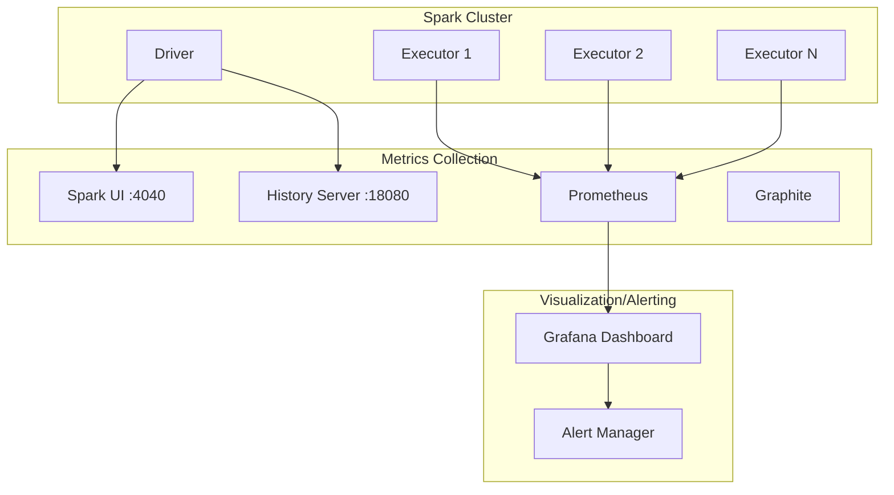

# Spark Monitoring Setup Guide

Monitoring configuration guide for stable operation of Spark applications in production environments.

## Monitoring Architecture



## Spark UI Configuration

### Enable Basic Spark UI

```java
SparkSession spark = SparkSession.builder()
        .appName("Monitored Application")
        // Spark UI settings
        .config("spark.ui.enabled", "true")
        .config("spark.ui.port", "4040")
        .config("spark.ui.retainedJobs", "1000")
        .config("spark.ui.retainedStages", "1000")
        .config("spark.ui.retainedTasks", "10000")
        // Shuffle/storage metrics retention
        .config("spark.sql.ui.retainedExecutions", "200")
        .getOrCreate();
```

### History Server Setup

View logs even after application termination.

```bash
# spark-defaults.conf
spark.eventLog.enabled=true
spark.eventLog.dir=hdfs:///spark-logs
spark.eventLog.compress=true
spark.history.fs.logDirectory=hdfs:///spark-logs
spark.history.ui.port=18080
spark.history.retainedApplications=50
```

```java
// Configure in code
SparkSession spark = SparkSession.builder()
        .appName("Production App")
        .config("spark.eventLog.enabled", "true")
        .config("spark.eventLog.dir", "/var/log/spark/events")
        .config("spark.eventLog.compress", "true")
        .getOrCreate();
```

## Prometheus + Grafana Integration

### 1. Prometheus Metrics Setup

Create `metrics.properties` file:

```properties
# metrics.properties
*.sink.prometheusServlet.class=org.apache.spark.metrics.sink.PrometheusServlet
*.sink.prometheusServlet.path=/metrics/prometheus
master.sink.prometheusServlet.path=/metrics/master/prometheus
applications.sink.prometheusServlet.path=/metrics/applications/prometheus
```

### 2. Spark Configuration

```java
SparkSession spark = SparkSession.builder()
        .appName("Prometheus Monitored App")
        // Metrics settings
        .config("spark.metrics.conf", "/path/to/metrics.properties")
        .config("spark.metrics.namespace", "my_spark_app")
        // Executor metrics
        .config("spark.executor.processTreeMetrics.enabled", "true")
        // Dropwizard metrics
        .config("spark.metrics.staticSources.enabled", "true")
        .config("spark.metrics.appStatusSource.enabled", "true")
        .getOrCreate();
```

### 3. Prometheus Configuration

```yaml
# prometheus.yml
scrape_configs:
  - job_name: 'spark'
    scrape_interval: 15s
    static_configs:
      - targets: ['spark-master:4040']
    metrics_path: /metrics/prometheus

  - job_name: 'spark-executors'
    scrape_interval: 15s
    static_configs:
      - targets: ['executor1:4040', 'executor2:4040']
```

### 4. Grafana Dashboard Query Examples

```promql
# Active Executor count
spark_executor_count{app_name="$app"}

# Executor memory usage
spark_executor_memoryUsed_MB{app_name="$app"} / spark_executor_maxMemory_MB{app_name="$app"} * 100

# Records processed per second
rate(spark_executor_inputRecords_total{app_name="$app"}[5m])

# Shuffle read/write
rate(spark_executor_shuffleRead_bytes_total{app_name="$app"}[5m])
rate(spark_executor_shuffleWrite_bytes_total{app_name="$app"}[5m])

# GC time
rate(spark_executor_gcTime_ms_total{app_name="$app"}[5m])

# Task failure rate
rate(spark_executor_failedTasks_total{app_name="$app"}[5m]) /
rate(spark_executor_completedTasks_total{app_name="$app"}[5m]) * 100
```

## Custom Metrics Implementation

### Application-Level Metrics

```java
import org.apache.spark.sql.SparkSession;
import com.codahale.metrics.*;
import org.apache.spark.metrics.source.Source;
import org.slf4j.Logger;
import org.slf4j.LoggerFactory;

/**
 * Custom business metrics collector
 */
public class CustomMetricsCollector implements Source {
    private static final Logger logger = LoggerFactory.getLogger(CustomMetricsCollector.class);

    private final MetricRegistry metricRegistry = new MetricRegistry();
    private final Counter processedRecords;
    private final Counter failedRecords;
    private final Histogram processingTime;
    private final Meter throughput;

    public CustomMetricsCollector(String appName) {
        // Processed record count
        this.processedRecords = metricRegistry.counter(
            MetricRegistry.name(appName, "records", "processed")
        );

        // Failed record count
        this.failedRecords = metricRegistry.counter(
            MetricRegistry.name(appName, "records", "failed")
        );

        // Processing time distribution
        this.processingTime = metricRegistry.histogram(
            MetricRegistry.name(appName, "processing", "time_ms")
        );

        // Throughput (records/sec)
        this.throughput = metricRegistry.meter(
            MetricRegistry.name(appName, "throughput", "records_per_sec")
        );
    }

    @Override
    public String sourceName() {
        return "CustomMetrics";
    }

    @Override
    public MetricRegistry metricRegistry() {
        return metricRegistry;
    }

    public void recordProcessed(int count) {
        processedRecords.inc(count);
        throughput.mark(count);
    }

    public void recordFailed(int count) {
        failedRecords.inc(count);
    }

    public void recordProcessingTime(long timeMs) {
        processingTime.update(timeMs);
    }

    public void logStats() {
        logger.info("=== Processing Statistics ===");
        logger.info("Processed records: {}", processedRecords.getCount());
        logger.info("Failed records: {}", failedRecords.getCount());
        logger.info("Average processing time: {}ms", processingTime.getSnapshot().getMean());
        logger.info("Throughput: {} records/sec", throughput.getOneMinuteRate());
    }
}
```

### Metrics Application Example

```java
public class MonitoredETLJob {
    private static final Logger logger = LoggerFactory.getLogger(MonitoredETLJob.class);

    public static void main(String[] args) {
        SparkSession spark = SparkSession.builder()
                .appName("Monitored ETL")
                .config("spark.metrics.conf", "metrics.properties")
                .getOrCreate();

        CustomMetricsCollector metrics = new CustomMetricsCollector("etl_job");

        // Register with Spark metrics system
        spark.sparkContext().env().metricsSystem().registerSource(metrics);

        try {
            long startTime = System.currentTimeMillis();

            Dataset<Row> source = spark.read()
                    .parquet("input/data.parquet");

            // Data processing
            Dataset<Row> processed = source
                    .filter(col("valid").equalTo(true))
                    .withColumn("processed_at", current_timestamp());

            // Collect batch metrics
            long count = processed.count();
            metrics.recordProcessed((int) count);

            // Save
            processed.write()
                    .mode("overwrite")
                    .parquet("output/processed");

            long duration = System.currentTimeMillis() - startTime;
            metrics.recordProcessingTime(duration);
            metrics.logStats();

        } catch (Exception e) {
            metrics.recordFailed(1);
            logger.error("ETL job failed: {}", e.getMessage(), e);
            throw e;
        } finally {
            spark.stop();
        }
    }
}
```

## Logging Configuration

### Log4j2 Configuration (Recommended)

```xml
<!-- log4j2.xml -->
<?xml version="1.0" encoding="UTF-8"?>
<Configuration status="WARN">
    <Properties>
        <Property name="LOG_PATTERN">
            %d{yyyy-MM-dd HH:mm:ss.SSS} [%t] %-5level %logger{36} - %msg%n
        </Property>
        <Property name="LOG_DIR">/var/log/spark</Property>
    </Properties>

    <Appenders>
        <!-- Console output -->
        <Console name="Console" target="SYSTEM_OUT">
            <PatternLayout pattern="${LOG_PATTERN}"/>
        </Console>

        <!-- Rolling file output -->
        <RollingFile name="RollingFile"
                     fileName="${LOG_DIR}/app.log"
                     filePattern="${LOG_DIR}/app-%d{yyyy-MM-dd}-%i.log.gz">
            <PatternLayout pattern="${LOG_PATTERN}"/>
            <Policies>
                <TimeBasedTriggeringPolicy interval="1"/>
                <SizeBasedTriggeringPolicy size="100MB"/>
            </Policies>
            <DefaultRolloverStrategy max="30"/>
        </RollingFile>

        <!-- JSON format (for ELK integration) -->
        <RollingFile name="JsonFile"
                     fileName="${LOG_DIR}/app-json.log"
                     filePattern="${LOG_DIR}/app-json-%d{yyyy-MM-dd}.log.gz">
            <JsonLayout compact="true" eventEol="true">
                <KeyValuePair key="app_name" value="${sys:spark.app.name}"/>
            </JsonLayout>
            <Policies>
                <TimeBasedTriggeringPolicy interval="1"/>
            </Policies>
        </RollingFile>
    </Appenders>

    <Loggers>
        <!-- Adjust Spark internal log level -->
        <Logger name="org.apache.spark" level="WARN"/>
        <Logger name="org.apache.hadoop" level="WARN"/>
        <Logger name="org.apache.parquet" level="ERROR"/>

        <!-- Application logs -->
        <Logger name="com.mycompany" level="INFO" additivity="false">
            <AppenderRef ref="Console"/>
            <AppenderRef ref="RollingFile"/>
            <AppenderRef ref="JsonFile"/>
        </Logger>

        <Root level="INFO">
            <AppenderRef ref="Console"/>
            <AppenderRef ref="RollingFile"/>
        </Root>
    </Loggers>
</Configuration>
```

### Structured Logging

```java
import org.slf4j.Logger;
import org.slf4j.LoggerFactory;
import org.slf4j.MDC;

public class StructuredLoggingExample {
    private static final Logger logger = LoggerFactory.getLogger(StructuredLoggingExample.class);

    public void processPartition(String partitionId, Dataset<Row> data) {
        // Add context with MDC (included in JSON logs)
        MDC.put("partition_id", partitionId);
        MDC.put("job_id", UUID.randomUUID().toString());

        try {
            long startTime = System.currentTimeMillis();

            // Processing logic
            long count = data.count();

            long duration = System.currentTimeMillis() - startTime;

            // Structured log
            logger.info("Partition processing complete: records={}, duration_ms={}", count, duration);

        } catch (Exception e) {
            logger.error("Partition processing failed: error={}", e.getMessage(), e);
            throw e;
        } finally {
            MDC.clear();
        }
    }
}
```

## Alert Configuration

### Grafana Alert Rules (YAML)

```yaml
# grafana-alerts.yml
apiVersion: 1
groups:
  - orgId: 1
    name: spark_alerts
    folder: Spark
    interval: 1m
    rules:
      - uid: spark-executor-failure
        title: Executor Failure Detected
        condition: C
        data:
          - refId: A
            queryType: prometheus
            expr: increase(spark_executor_failedTasks_total[5m]) > 10
        for: 5m
        annotations:
          summary: "Multiple Task failures detected on Spark Executor"

      - uid: spark-memory-pressure
        title: Memory Pressure Warning
        condition: C
        data:
          - refId: A
            queryType: prometheus
            expr: >
              spark_executor_memoryUsed_MB / spark_executor_maxMemory_MB > 0.9
        for: 10m
        annotations:
          summary: "Executor memory usage exceeded 90%"

      - uid: spark-shuffle-spill
        title: Shuffle Spill Warning
        condition: C
        data:
          - refId: A
            queryType: prometheus
            expr: spark_executor_diskBytesSpilled_total > 1073741824
        for: 5m
        annotations:
          summary: "Disk Spill exceeded 1GB - memory increase needed"
```

## Monitoring Checklist

### Daily Check Items

| Metric | Normal Range | Warning | Critical |
|--------|--------------|---------|----------|
| **Executor Memory** | < 70% | 70-85% | > 85% |
| **GC Time Ratio** | < 5% | 5-10% | > 10% |
| **Task Failure Rate** | < 0.1% | 0.1-1% | > 1% |
| **Shuffle Spill** | 0 | < 100MB | > 1GB |
| **Processing Latency** | < Expected time | 1.5x | > 2x |

### Weekly Check Items

```java
// Weekly performance report generation
public class WeeklyReportGenerator {
    public void generateReport(SparkSession spark, String startDate, String endDate) {
        // Collect data from History Server API
        Dataset<Row> jobHistory = spark.read()
                .json("/var/log/spark/events/*.json");

        // Weekly statistics aggregation
        Dataset<Row> weeklyStats = jobHistory
            .filter(col("timestamp").between(startDate, endDate))
            .groupBy("app_name")
            .agg(
                count("*").alias("total_jobs"),
                avg("duration").alias("avg_duration_sec"),
                max("duration").alias("max_duration_sec"),
                sum(when(col("status").equalTo("FAILED"), 1).otherwise(0))
                    .alias("failed_jobs"),
                avg("executor_memory_used").alias("avg_memory_used_mb"),
                sum("shuffle_bytes_written").alias("total_shuffle_bytes")
            );

        weeklyStats.show();

        // Save report
        weeklyStats.coalesce(1)
            .write()
            .mode("overwrite")
            .option("header", "true")
            .csv("reports/weekly/" + startDate);
    }
}
```

## Related Documents

- [Performance Tuning](../../concepts/tuning/) - Optimization based on monitoring results
- [FAQ - Debugging Guide](../../appendix/faq/#spark-ui-debugging-guide) - Troubleshooting
- [Architecture](../../concepts/architecture/) - Understanding memory model
