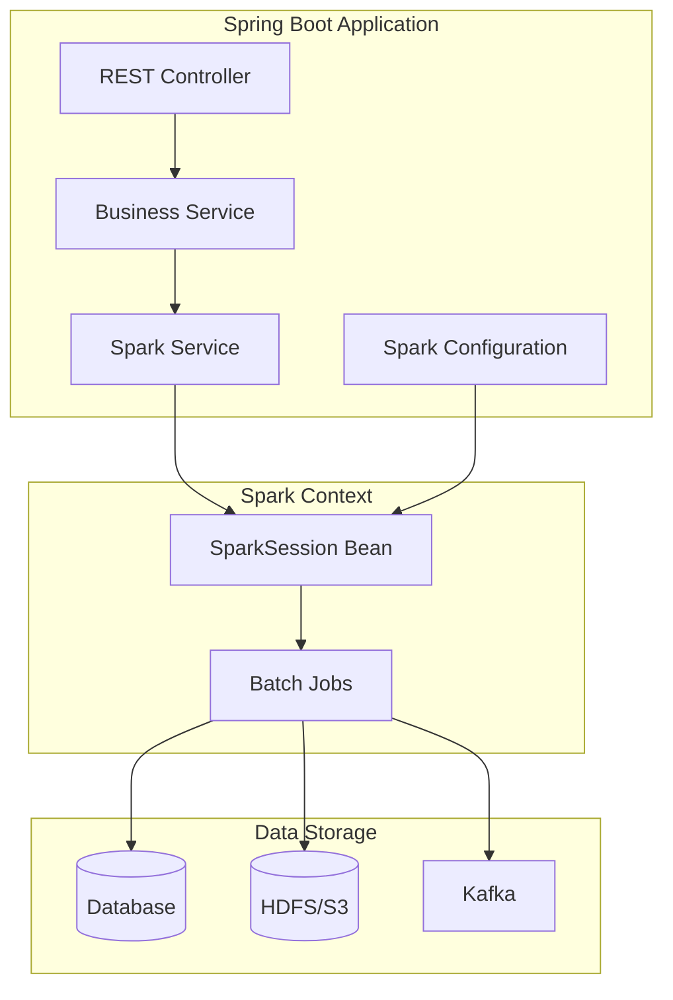

# Spring Boot and Spark Integration Guide

Spark and Spring Boot integration patterns for Java/Spring developers.

## Architecture Pattern



## Gradle Configuration

```kotlin
// build.gradle.kts
plugins {
    java
    id("org.springframework.boot") version "3.2.5"
    id("io.spring.dependency-management") version "1.1.4"
}

java {
    toolchain {
        languageVersion.set(JavaLanguageVersion.of(17))
    }
}

repositories {
    mavenCentral()
}

val sparkVersion = "3.5.1"
val scalaVersion = "2.13"

dependencies {
    // Spring Boot
    implementation("org.springframework.boot:spring-boot-starter-web")
    implementation("org.springframework.boot:spring-boot-starter-actuator")

    // Spark (Log4j exclusion required)
    implementation("org.apache.spark:spark-core_$scalaVersion:$sparkVersion") {
        exclude(group = "org.slf4j", module = "slf4j-log4j12")
        exclude(group = "log4j", module = "log4j")
        exclude(group = "org.apache.logging.log4j")
    }
    implementation("org.apache.spark:spark-sql_$scalaVersion:$sparkVersion") {
        exclude(group = "org.slf4j", module = "slf4j-log4j12")
    }

    // Spark JDBC (optional)
    implementation("org.apache.spark:spark-hive_$scalaVersion:$sparkVersion")

    // Jackson for JSON (version unification)
    implementation("com.fasterxml.jackson.module:jackson-module-scala_$scalaVersion:2.15.3")

    // Logging (Spring Boot standard)
    implementation("org.springframework.boot:spring-boot-starter-logging")

    // Test
    testImplementation("org.springframework.boot:spring-boot-starter-test")
}

// Dependency conflict resolution
configurations.all {
    exclude(group = "org.slf4j", module = "slf4j-log4j12")
    exclude(group = "log4j", module = "log4j")
    resolutionStrategy {
        force("com.fasterxml.jackson.core:jackson-databind:2.15.3")
        force("com.fasterxml.jackson.core:jackson-core:2.15.3")
    }
}
```

## SparkSession Bean Configuration

### Basic Configuration

```java
package com.example.spark.config;

import org.apache.spark.SparkConf;
import org.apache.spark.sql.SparkSession;
import org.springframework.beans.factory.annotation.Value;
import org.springframework.context.annotation.Bean;
import org.springframework.context.annotation.Configuration;
import org.springframework.context.annotation.Profile;
import jakarta.annotation.PreDestroy;
import org.slf4j.Logger;
import org.slf4j.LoggerFactory;

@Configuration
public class SparkConfig {
    private static final Logger logger = LoggerFactory.getLogger(SparkConfig.class);

    @Value("${spark.app.name:spring-spark-app}")
    private String appName;

    @Value("${spark.master:local[*]}")
    private String masterUrl;

    @Value("${spark.driver.memory:2g}")
    private String driverMemory;

    @Value("${spark.executor.memory:2g}")
    private String executorMemory;

    @Value("${spark.sql.shuffle.partitions:200}")
    private int shufflePartitions;

    private SparkSession sparkSession;

    @Bean
    @Profile("!test")  // Use separate configuration for tests
    public SparkSession sparkSession() {
        logger.info("Initializing SparkSession: app={}, master={}", appName, masterUrl);

        SparkConf conf = new SparkConf()
                .setAppName(appName)
                .setMaster(masterUrl)
                .set("spark.driver.memory", driverMemory)
                .set("spark.executor.memory", executorMemory)
                .set("spark.sql.shuffle.partitions", String.valueOf(shufflePartitions))
                // Adaptive Query Execution
                .set("spark.sql.adaptive.enabled", "true")
                .set("spark.sql.adaptive.coalescePartitions.enabled", "true")
                // Serialization optimization
                .set("spark.serializer", "org.apache.spark.serializer.KryoSerializer")
                .set("spark.kryoserializer.buffer.max", "1024m")
                // UI settings
                .set("spark.ui.enabled", "true")
                .set("spark.ui.port", "4040");

        this.sparkSession = SparkSession.builder()
                .config(conf)
                .getOrCreate();

        // Adjust Spark log level
        sparkSession.sparkContext().setLogLevel("WARN");

        logger.info("SparkSession initialized successfully");
        return sparkSession;
    }

    @Bean
    @Profile("test")
    public SparkSession testSparkSession() {
        logger.info("Initializing Test SparkSession");

        this.sparkSession = SparkSession.builder()
                .appName("test-spark")
                .master("local[2]")
                .config("spark.sql.shuffle.partitions", "2")
                .config("spark.ui.enabled", "false")
                .config("spark.driver.bindAddress", "127.0.0.1")
                .getOrCreate();

        return sparkSession;
    }

    @PreDestroy
    public void cleanup() {
        if (sparkSession != null && !sparkSession.sparkContext().isStopped()) {
            logger.info("Stopping SparkSession");
            sparkSession.stop();
        }
    }
}
```

### application.yml Configuration

```yaml
# application.yml
spring:
  application:
    name: spark-spring-app

# Spark settings
spark:
  app:
    name: ${spring.application.name}
  master: local[*]
  driver:
    memory: 2g
  executor:
    memory: 2g
  sql:
    shuffle:
      partitions: 100

# Profile-specific settings
---
spring:
  config:
    activate:
      on-profile: production

spark:
  master: spark://spark-master:7077
  driver:
    memory: 4g
  executor:
    memory: 8g
  sql:
    shuffle:
      partitions: 200

---
spring:
  config:
    activate:
      on-profile: test

spark:
  master: local[2]
  driver:
    memory: 512m
  sql:
    shuffle:
      partitions: 2
```

## Service Layer Patterns

### Basic Spark Service

```java
package com.example.spark.service;

import org.apache.spark.sql.Dataset;
import org.apache.spark.sql.Row;
import org.apache.spark.sql.SparkSession;
import org.springframework.stereotype.Service;
import org.slf4j.Logger;
import org.slf4j.LoggerFactory;

import static org.apache.spark.sql.functions.*;

@Service
public class DataAnalysisService {
    private static final Logger logger = LoggerFactory.getLogger(DataAnalysisService.class);

    private final SparkSession spark;

    public DataAnalysisService(SparkSession spark) {
        this.spark = spark;
    }

    /**
     * Generate sales summary report
     */
    public SalesSummary generateSalesSummary(String dataPath, String startDate, String endDate) {
        logger.info("Generating sales summary: {} ~ {}", startDate, endDate);

        Dataset<Row> sales = spark.read()
                .option("header", "true")
                .option("inferSchema", "true")
                .parquet(dataPath);

        Dataset<Row> filtered = sales
                .filter(col("sale_date").between(startDate, endDate));

        Row summary = filtered.agg(
                count("*").alias("total_orders"),
                sum("amount").alias("total_revenue"),
                avg("amount").alias("avg_order_value"),
                countDistinct("customer_id").alias("unique_customers")
        ).first();

        return new SalesSummary(
                summary.getLong(0),
                summary.getDouble(1),
                summary.getDouble(2),
                summary.getLong(3)
        );
    }

    /**
     * Revenue aggregation by category
     */
    public List<CategoryRevenue> getCategoryRevenue(String dataPath) {
        Dataset<Row> result = spark.read()
                .parquet(dataPath)
                .groupBy("category")
                .agg(
                    sum("amount").alias("revenue"),
                    count("*").alias("order_count")
                )
                .orderBy(col("revenue").desc());

        return result.collectAsList().stream()
                .map(row -> new CategoryRevenue(
                        row.getString(0),
                        row.getDouble(1),
                        row.getLong(2)
                ))
                .toList();
    }

    // DTO classes
    public record SalesSummary(
            long totalOrders,
            double totalRevenue,
            double avgOrderValue,
            long uniqueCustomers
    ) {}

    public record CategoryRevenue(
            String category,
            double revenue,
            long orderCount
    ) {}
}
```

### Asynchronous Batch Processing

```java
package com.example.spark.service;

import org.apache.spark.sql.Dataset;
import org.apache.spark.sql.Row;
import org.apache.spark.sql.SaveMode;
import org.apache.spark.sql.SparkSession;
import org.springframework.scheduling.annotation.Async;
import org.springframework.scheduling.annotation.Scheduled;
import org.springframework.stereotype.Service;
import org.slf4j.Logger;
import org.slf4j.LoggerFactory;

import java.time.LocalDate;
import java.time.format.DateTimeFormatter;
import java.util.concurrent.CompletableFuture;

import static org.apache.spark.sql.functions.*;

@Service
public class BatchProcessingService {
    private static final Logger logger = LoggerFactory.getLogger(BatchProcessingService.class);

    private final SparkSession spark;

    public BatchProcessingService(SparkSession spark) {
        this.spark = spark;
    }

    /**
     * Daily ETL job (scheduled)
     */
    @Scheduled(cron = "0 0 2 * * *")  // Daily at 2 AM
    public void dailyETL() {
        String yesterday = LocalDate.now().minusDays(1)
                .format(DateTimeFormatter.ISO_DATE);

        logger.info("Starting daily ETL: {}", yesterday);

        try {
            // 1. Read raw data
            Dataset<Row> rawData = spark.read()
                    .parquet("s3://data-lake/raw/events/date=" + yesterday);

            // 2. Data cleaning
            Dataset<Row> cleaned = rawData
                    .filter(col("event_type").isNotNull())
                    .dropDuplicates("event_id")
                    .withColumn("processed_at", current_timestamp());

            // 3. Create aggregation table
            Dataset<Row> aggregated = cleaned
                    .groupBy("user_id", "event_type")
                    .agg(
                        count("*").alias("event_count"),
                        sum("value").alias("total_value")
                    );

            // 4. Save
            aggregated.write()
                    .mode(SaveMode.Overwrite)
                    .partitionBy("event_type")
                    .parquet("s3://data-lake/processed/daily/" + yesterday);

            logger.info("Daily ETL completed: {} records processed", cleaned.count());

        } catch (Exception e) {
            logger.error("Daily ETL failed: {}", e.getMessage(), e);
            throw new RuntimeException("ETL failed", e);
        }
    }

    /**
     * Asynchronous large dataset processing
     */
    @Async
    public CompletableFuture<ProcessingResult> processLargeDataset(String inputPath, String outputPath) {
        logger.info("Starting async processing: {}", inputPath);
        long startTime = System.currentTimeMillis();

        try {
            Dataset<Row> data = spark.read().parquet(inputPath);

            Dataset<Row> processed = data
                    .repartition(200)  // Parallel processing optimization
                    .transform(this::applyBusinessLogic);

            processed.write()
                    .mode(SaveMode.Overwrite)
                    .parquet(outputPath);

            long duration = System.currentTimeMillis() - startTime;
            long recordCount = processed.count();

            logger.info("Async processing completed: {} records, {}ms", recordCount, duration);

            return CompletableFuture.completedFuture(
                    new ProcessingResult(true, recordCount, duration, null)
            );

        } catch (Exception e) {
            logger.error("Async processing failed: {}", e.getMessage(), e);
            return CompletableFuture.completedFuture(
                    new ProcessingResult(false, 0, 0, e.getMessage())
            );
        }
    }

    private Dataset<Row> applyBusinessLogic(Dataset<Row> df) {
        return df
                .filter(col("status").equalTo("ACTIVE"))
                .withColumn("score", col("value").multiply(0.8).plus(col("bonus")));
    }

    public record ProcessingResult(
            boolean success,
            long recordCount,
            long durationMs,
            String errorMessage
    ) {}
}
```

## REST API Integration

### Analytics API Controller

```java
package com.example.spark.controller;

import com.example.spark.service.DataAnalysisService;
import com.example.spark.service.DataAnalysisService.SalesSummary;
import com.example.spark.service.DataAnalysisService.CategoryRevenue;
import com.example.spark.service.BatchProcessingService;
import com.example.spark.service.BatchProcessingService.ProcessingResult;

import org.springframework.http.ResponseEntity;
import org.springframework.web.bind.annotation.*;

import java.util.List;
import java.util.concurrent.CompletableFuture;

@RestController
@RequestMapping("/api/v1/analytics")
public class AnalyticsController {

    private final DataAnalysisService analysisService;
    private final BatchProcessingService batchService;

    public AnalyticsController(
            DataAnalysisService analysisService,
            BatchProcessingService batchService) {
        this.analysisService = analysisService;
        this.batchService = batchService;
    }

    /**
     * Get sales summary
     * GET /api/v1/analytics/sales/summary?start=2024-01-01&end=2024-01-31
     */
    @GetMapping("/sales/summary")
    public ResponseEntity<SalesSummary> getSalesSummary(
            @RequestParam String start,
            @RequestParam String end) {

        SalesSummary summary = analysisService.generateSalesSummary(
                "data/sales.parquet", start, end);

        return ResponseEntity.ok(summary);
    }

    /**
     * Get revenue by category
     * GET /api/v1/analytics/category/revenue
     */
    @GetMapping("/category/revenue")
    public ResponseEntity<List<CategoryRevenue>> getCategoryRevenue() {
        List<CategoryRevenue> revenues = analysisService.getCategoryRevenue(
                "data/sales.parquet");

        return ResponseEntity.ok(revenues);
    }

    /**
     * Start async batch processing
     * POST /api/v1/analytics/batch/process
     */
    @PostMapping("/batch/process")
    public ResponseEntity<String> startBatchProcess(
            @RequestBody BatchRequest request) {

        CompletableFuture<ProcessingResult> future = batchService
                .processLargeDataset(request.inputPath(), request.outputPath());

        // Return job ID (integrate with job tracking system in real implementation)
        String jobId = "job-" + System.currentTimeMillis();

        return ResponseEntity.accepted()
                .body("{\"jobId\": \"" + jobId + "\", \"status\": \"PROCESSING\"}");
    }

    public record BatchRequest(String inputPath, String outputPath) {}
}
```

## Writing Tests

### Spark Integration Tests

```java
package com.example.spark.service;

import org.apache.spark.sql.Dataset;
import org.apache.spark.sql.Row;
import org.apache.spark.sql.RowFactory;
import org.apache.spark.sql.SparkSession;
import org.apache.spark.sql.types.DataTypes;
import org.apache.spark.sql.types.StructField;
import org.apache.spark.sql.types.StructType;
import org.junit.jupiter.api.*;
import org.springframework.beans.factory.annotation.Autowired;
import org.springframework.boot.test.context.SpringBootTest;
import org.springframework.test.context.ActiveProfiles;

import java.util.Arrays;
import java.util.List;

import static org.assertj.core.api.Assertions.assertThat;

@SpringBootTest
@ActiveProfiles("test")
@TestInstance(TestInstance.Lifecycle.PER_CLASS)
class DataAnalysisServiceTest {

    @Autowired
    private SparkSession spark;

    @Autowired
    private DataAnalysisService analysisService;

    private String testDataPath;

    @BeforeAll
    void setupTestData() {
        // Test data schema
        StructType schema = new StructType(new StructField[]{
                DataTypes.createStructField("order_id", DataTypes.StringType, false),
                DataTypes.createStructField("category", DataTypes.StringType, false),
                DataTypes.createStructField("amount", DataTypes.DoubleType, false),
                DataTypes.createStructField("customer_id", DataTypes.StringType, false),
                DataTypes.createStructField("sale_date", DataTypes.StringType, false)
        });

        // Generate test data
        List<Row> testData = Arrays.asList(
                RowFactory.create("O001", "Electronics", 150.0, "C001", "2024-01-15"),
                RowFactory.create("O002", "Electronics", 200.0, "C002", "2024-01-15"),
                RowFactory.create("O003", "Clothing", 50.0, "C001", "2024-01-16"),
                RowFactory.create("O004", "Books", 25.0, "C003", "2024-01-17"),
                RowFactory.create("O005", "Electronics", 300.0, "C002", "2024-01-18")
        );

        Dataset<Row> testDf = spark.createDataFrame(testData, schema);

        testDataPath = "target/test-data/sales.parquet";
        testDf.write()
                .mode("overwrite")
                .parquet(testDataPath);
    }

    @Test
    @DisplayName("Sales summary should be calculated correctly")
    void shouldCalculateSalesSummary() {
        // when
        var summary = analysisService.generateSalesSummary(
                testDataPath, "2024-01-01", "2024-01-31");

        // then
        assertThat(summary.totalOrders()).isEqualTo(5);
        assertThat(summary.totalRevenue()).isEqualTo(725.0);
        assertThat(summary.avgOrderValue()).isEqualTo(145.0);
        assertThat(summary.uniqueCustomers()).isEqualTo(3);
    }

    @Test
    @DisplayName("Category revenues should be sorted descending")
    void shouldReturnCategoryRevenuesSorted() {
        // when
        var revenues = analysisService.getCategoryRevenue(testDataPath);

        // then
        assertThat(revenues).hasSize(3);
        assertThat(revenues.get(0).category()).isEqualTo("Electronics");
        assertThat(revenues.get(0).revenue()).isEqualTo(650.0);
    }

    @AfterAll
    void cleanup() {
        // Clean up test data
        new java.io.File(testDataPath).delete();
    }
}
```

## Java vs Scala Comparison

| Aspect | Java | Scala |
|--------|------|-------|
| **Type declaration** | `Dataset<Row>` | `DataFrame` (type alias) |
| **Lambda expressions** | `df.filter(row -> row.getInt(0) > 10)` | `df.filter(row => row.getInt(0) > 10)` |
| **Column reference** | `col("name")` | `$"name"` |
| **String interpolation** | `"value: " + value` | `s"value: $value"` |
| **Case Class** | `record` (Java 17+) | `case class` |
| **Pattern matching** | switch expression (Java 21+) | `match` expression |
| **Spring integration** | Native support | Annotation compatible |
| **IDE support** | IntelliJ, VS Code | IntelliJ + Scala plugin |

### Same Logic Comparison

**Java:**
```java
Dataset<Row> result = df
    .filter(col("age").gt(18))
    .groupBy("city")
    .agg(avg("salary").alias("avg_salary"))
    .orderBy(col("avg_salary").desc());
```

**Scala:**
```scala
val result = df
  .filter($"age" > 18)
  .groupBy("city")
  .agg(avg("salary").alias("avg_salary"))
  .orderBy($"avg_salary".desc)
```

## Related Documents

- [Environment Setup](setup/) - Basic project configuration
- [Monitoring](monitoring/) - Operational monitoring setup
- [Performance Tuning](../concepts/tuning/) - Optimization strategies
