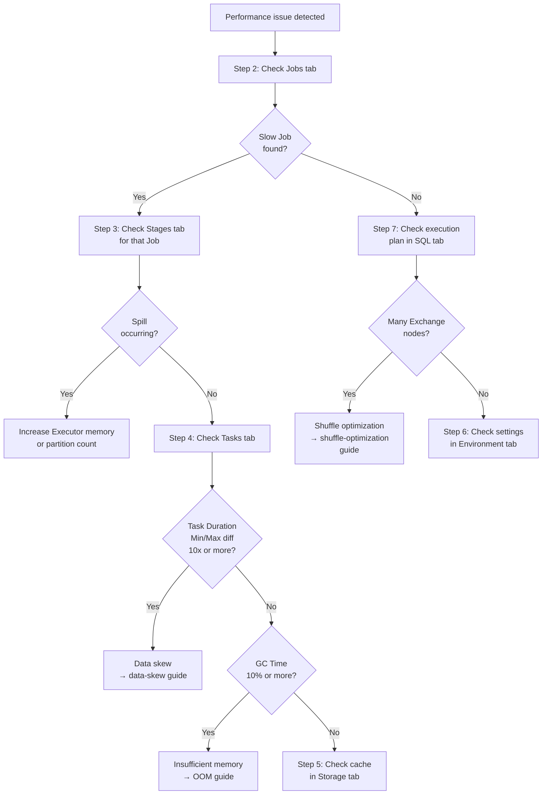


**Estimated Time**: About 20 minutes



- Find slow Jobs in the **Jobs tab**, then identify the bottleneck Stage in the **Stages tab**
- If Duration Min/Max differs by more than 10x in the **Tasks tab**, you have data skew
- If the **SQL tab** shows many Exchange nodes, you need to reduce shuffles


## Problem Definition

You've opened the Spark UI but there are multiple tabs, and you're not sure what to look for in each one. Follow this guide to find performance bottlenecks in **Jobs → Stages → Tasks** order.

**What this guide covers:**
- How to read the key metrics in each Spark UI tab
- The order to narrow down bottleneck causes

**What this guide does not cover:**
- Prometheus/Grafana-based monitoring setup → [Monitoring Setup](../examples/monitoring/)
- Resolving OOM errors → [Troubleshooting OutOfMemoryError](oom-troubleshooting/)

---

## Prerequisites

| Item | Requirement | How to Verify |
|------|-------------|---------------|
| **Spark Version** | 2.4 or higher (3.x recommended) | `spark-submit --version` |
| **Java Version** | 8, 11, or 17 | `java -version` |
| **Spark UI** | Accessible | Open `http://localhost:4040` in browser |

### Environment Verification

```bash
# Check Spark version
spark-submit --version

# Verify Spark UI access (while application is running)
curl -s http://localhost:4040/api/v1/applications | head -1
```

Expected output:

```json
[{"id":"local-1234567890","name":"MyApp",...}]
```

If there is no output, see the [Troubleshooting](#troubleshooting) section.

---

## Step 1/7: Accessing the Spark UI

The URL varies depending on your environment.

| Environment | URL | Notes |
|-------------|-----|-------|
| **Local / Standalone** | `http://localhost:4040` | Only accessible while app is running |
| **YARN** | YARN ResourceManager → Application → **ApplicationMaster** link | Check app ID with `yarn application -list` |
| **Kubernetes** | `kubectl port-forward <driver-pod> 4040:4040` then `localhost:4040` | Find Driver Pod with `kubectl get pods` |
| **History Server** | `http://localhost:18080` | Available even after app terminates |

### Verifying Access

```bash
# Local environment
curl -s -o /dev/null -w "%{http_code}" http://localhost:4040

# YARN environment — check app list
yarn application -list 2>/dev/null | grep RUNNING

# Kubernetes environment — Driver Pod port forwarding
kubectl port-forward svc/spark-driver 4040:4040
```

If the HTTP response is `200`, everything is working. Proceed to the next step.

---

## Step 2/7: Jobs Tab — Getting the Big Picture

Click the **Jobs** tab. This shows the full list of jobs.

### What to Look For

| Item | Meaning | What to Check |
|------|---------|---------------|
| **Duration** | Job execution time | Look for jobs that are abnormally longer than others |
| **Stages** | Number of Stages in a Job | Check the Succeeded/Failed ratio |
| **Status** | Completed/Failed/Running | If any are Failed, click that Job |


**Job = one Action**. Each Action call such as `count()`, `collect()`, or `save()` creates one Job.


### Decision Criteria

- If a specific Job's Duration is **3x or more** longer than others, click that Job
- If the **Failed** count in the Stages column is not 0, investigate immediately

Once you find a slow Job, click it to navigate to its Stage list.

---

## Step 3/7: Stages Tab — Finding the Bottleneck

Click the **Stages** tab. Alternatively, clicking a slow Job from Step 2 shows that Job's Stage list.

### Key Metrics

| Metric | Meaning | Warning Sign |
|--------|---------|-------------|
| **Duration** | Stage execution time | A Stage consuming 80%+ of total Job time |
| **Shuffle Read** | Data size read from previous Stage | Shuffle optimization needed if several GB or more |
| **Shuffle Write** | Data size sent to next Stage | Check alongside Shuffle Read |
| **Spill (Memory)** | Memory → disk spill | Non-zero means insufficient memory |
| **Spill (Disk)** | Total disk spill volume | Non-zero means severe memory shortage |


**When Spill occurs**, performance degrades sharply due to disk I/O. Increase Executor memory or raise the partition count.


### Decision Criteria

Once you find the slow Stage, click it to view Task-level details.

---

## Step 4/7: Tasks Tab — Analyzing Individual Tasks

Clicking a Stage reveals the **Task** list and statistics. This is where you find the root cause of the bottleneck.

### Key Metrics

| Metric | Normal Range | Warning Sign | Cause |
|--------|-------------|-------------|-------|
| **Duration (Min/Max)** | Similar (within 2x) | 10x+ difference | Data skew |
| **GC Time** | Less than 5% of total | 10% or more | Insufficient memory |
| **Shuffle Read Size (Min/Max)** | Even distribution | Only some tasks are large | Data skew |
| **Locality Level** | PROCESS_LOCAL | ANY | Data locality issue |

### Diagnosing Data Skew

If the Min/Max difference in Task Duration is **10x or more**, you have data skew.

```java
import static org.apache.spark.sql.functions.*;

// Check data distribution per partition
df.groupBy(spark_partition_id().alias("partition"))
  .count()
  .orderBy(col("count").desc())
  .show(10);
```

Expected output (when skew exists):

```
+---------+-------+
|partition| count |
+---------+-------+
|        5|1000000|  <-- abnormally large
|        3|   5000|
|        1|   4800|
+---------+-------+
```

If you found data skew → see [Resolving Data Skew](data-skew/).

### Diagnosing GC Issues

If GC Time is **10% or more** of total Task Duration, memory is insufficient.

```bash
# <app-id> can be found at the top of the Jobs tab or via:
# curl -s http://localhost:4040/api/v1/applications | python3 -m json.tool

# Check Stage metrics via REST API
curl -s http://localhost:4040/api/v1/applications/<app-id>/stages \
  | python3 -m json.tool | grep -E "gcTime|executorRunTime"
```

If you found GC issues → see [Troubleshooting OutOfMemoryError](oom-troubleshooting/).

---

## Step 5/7: Storage Tab — Checking Cache

Click the **Storage** tab. This shows the list of RDDs/DataFrames cached with `cache()` or `persist()`.

### What to Check

| Item | Meaning | What to Check |
|------|---------|---------------|
| **RDD Name** | Name of cached data | Verify the intended data is cached |
| **Storage Level** | Storage location (memory/disk) | `MEMORY_ONLY` is the default |
| **Cached Partitions** | Number of cached partitions | Compare against total partition count |
| **Fraction Cached** | Cache ratio | If not 100%, memory is insufficient |
| **Size in Memory** | Memory usage | Verify it's reasonable relative to Executor memory |


**If Fraction Cached is below 100%**, some partitions were evicted from cache due to insufficient memory. Change the Storage Level to `MEMORY_AND_DISK`.


---

## Step 6/7: Environment Tab — Checking Configuration

Click the **Environment** tab. This shows all currently applied Spark configurations.

### Key Settings to Check

| Setting | Default | What to Check |
|---------|---------|---------------|
| `spark.executor.memory` | 1g | Verify it's not too small for your workload |
| `spark.executor.cores` | 1 | Verify roughly 5GB of memory per core (balances GC overhead and parallelism) |
| `spark.sql.shuffle.partitions` | 200 | Verify it's tuned for your data size |
| `spark.sql.adaptive.enabled` | true (3.x) | Verify AQE is enabled |
| `spark.serializer` | JavaSerializer | Verify KryoSerializer is being used |

```bash
# Find <app-id>: curl -s http://localhost:4040/api/v1/applications | python3 -c "import sys,json;print(json.load(sys.stdin)[0]['id'])"

# Check settings via REST API
curl -s http://localhost:4040/api/v1/applications/<app-id>/environment \
  | python3 -m json.tool | grep -E "executor.memory|shuffle.partitions"
```


**If your intended settings are not reflected**, check the priority order of spark-submit options, spark-defaults.conf, and in-code settings. The `.config()` setting in code has the highest priority.


---

## Step 7/7: SQL Tab — Analyzing Execution Plans

Click the **SQL** tab. This shows the execution plans (DAGs) for queries executed via Spark SQL or the DataFrame API.

### Key Items to Check

| Node | Meaning | Warning Sign |
|------|---------|-------------|
| **Exchange** | Shuffle occurred | Too many Exchange nodes means shuffle optimization is needed |
| **BroadcastHashJoin** | Broadcast join | If not used for small tables, check settings |
| **SortMergeJoin** | Shuffle-based join | If the table is small, switch to broadcast join |
| **Scan** | Data read | A full scan means partition pruning failed |
| **Filter** | Filter condition | Should be directly above Scan for pushdown to work |

### Verifying Partition Pruning

```java
// Check execution plan
df.explain(true);
```

If `PartitionFilters` is empty in the output, partition pruning has failed.

```
// Partition pruning succeeded
+- FileScan parquet [...] PartitionFilters: [date >= 2026-01-01]

// Partition pruning failed
+- FileScan parquet [...] PartitionFilters: []
```

If shuffles are excessive → see [Optimizing Shuffles](shuffle-optimization/).

---

## History Server Setup (Optional)

To access the Spark UI even after your app terminates, set up the History Server.

### 1. Enable Event Logging

```java
SparkSession spark = SparkSession.builder()
    .appName("My App")
    .config("spark.eventLog.enabled", "true")
    .config("spark.eventLog.dir", "/var/log/spark/events")
    .config("spark.eventLog.compress", "true")
    .getOrCreate();
```

### 2. Start the History Server

```bash
# Create event log directory
mkdir -p /var/log/spark/events

# Add to spark-defaults.conf
# spark.history.fs.logDirectory=/var/log/spark/events
# spark.history.ui.port=18080

# Start History Server
$SPARK_HOME/sbin/start-history-server.sh
```

### 3. Verify Access

```bash
curl -s -o /dev/null -w "%{http_code}" http://localhost:18080
```

If `200` is returned, it's working. Access `http://localhost:18080` in your browser.

---

## Troubleshooting

| Symptom | Cause | Solution |
|---------|-------|----------|
| UI won't open (`Connection refused`) | Spark app is not running | Verify the app is running via `spark-submit` |
| UI won't open (port conflict) | Port 4040 is used by another app | Change `spark.ui.port` to 4041, etc. |
| UI won't open (firewall) | Port is blocked on remote server | Tunnel with `ssh -L 4040:localhost:4040 <server>` |
| UI is disabled | `spark.ui.enabled=false` is set | Check in the **Environment** tab or set to `true` in code |
| Previous jobs not in History Server | Event logging not configured | Set `spark.eventLog.enabled=true` |
| Previous jobs not in History Server | Log path mismatch | Verify `spark.eventLog.dir` and `spark.history.fs.logDirectory` match |
| Cannot access UI on YARN | Need ApplicationMaster URL | Click the app in YARN ResourceManager and use the **ApplicationMaster** link |

---

## Decision Tree

When a performance issue occurs, diagnose in the following order.



*Diagram summary: Performance issue → Check Jobs tab for slow Jobs → Check Stages tab for Spill → Check Tasks tab for skew (Duration difference) and GC → Branch to cause-specific guide. If many Exchange nodes, shuffle optimization is needed.*

---

## Verification

After completing this guide, you should achieve the following.

| Item | Success Criteria |
|------|-----------------|
| **Bottleneck located** | Identified which Stage of which Job is slow |
| **Root cause diagnosed** | Determined cause as skew/GC/shuffle/spill |
| **Next action** | Ready to proceed to the cause-specific resolution guide |

---


- **Analysis order**: Jobs → Stages → Tasks → branch by cause
- **Data skew**: Task Duration Min/Max difference of 10x or more
- **Insufficient memory**: GC Time 10%+ or Spill occurring
- **Excessive shuffles**: Many Exchange nodes in SQL tab
- **Settings not applied**: Verify intended values in Environment tab


## Next Steps

- [Troubleshooting OutOfMemoryError](oom-troubleshooting/) - Resolve GC/memory issues
- [Resolving Data Skew](data-skew/) - Fix uneven Task distribution
- [Optimizing Shuffles](shuffle-optimization/) - Reduce network I/O
- [Performance Tuning](../concepts/tuning/) - Comprehensive performance optimization
