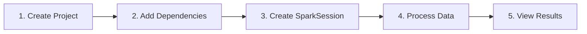

> **Target Audience**: Java developers interested in big data processing
> **Prerequisites**: Basic Java syntax, SQL fundamentals, Gradle/Maven experience
> **After reading**: You'll be able to create a Spark project locally and query/aggregate CSV data with DataFrame


- SparkSession is Spark's unified entry point, created with `SparkSession.builder().getOrCreate()`
- DataFrame API allows filtering, aggregation, and SQL queries
- `local[*]` mode enables testing in local development environment


Run a Spark application and process data in 5 minutes. Following this guide, you'll experience the entire process from project creation to data querying.

## Overview

The diagram below shows the Quick Start flow:



## Prerequisites

Prepare the following environment before starting:

- **Java 17+** (Java 8, 11 also supported, but 17 recommended)
- **Gradle** or **Maven**
- **IDE** (IntelliJ IDEA, VS Code, etc.)

**Pre-start Verification**

| Item | Command | Expected Result |
|------|---------|-----------------|
| Java | `java -version` | `openjdk version "17.x.x"` or higher |
| Gradle | `gradle --version` | `Gradle 8.x` or higher |
| Maven (alternative) | `mvn --version` | `Apache Maven 3.x.x` |

## Step 1/5: Create Project (~1 min)

Create a Java project using Spring Initializr or your IDE. This example starts with a plain Java project.

```bash
mkdir spark-quickstart
cd spark-quickstart
```

## Step 2/5: Gradle Setup (~2 min)

Create a `build.gradle` file:

```groovy
plugins {
    id 'java'
    id 'application'
}

group = 'com.example'
version = '1.0.0'

java {
    sourceCompatibility = '17'
}

repositories {
    mavenCentral()
}

dependencies {
    // Spark Core
    implementation 'org.apache.spark:spark-core_2.13:3.5.1'
    // Spark SQL (for DataFrame, Dataset)
    implementation 'org.apache.spark:spark-sql_2.13:3.5.1'

    // Logging
    implementation 'org.slf4j:slf4j-simple:2.0.9'
}

application {
    mainClass = 'com.example.SparkQuickStart'
}

// Prevent Spark JAR conflicts
configurations.all {
    exclude group: 'org.slf4j', module: 'slf4j-log4j12'
}
```

> **Version note:** The `2.13` in `spark-core_2.13` is the Scala version. Even when using Java, the Scala runtime is required, so it must be specified.

**Using Maven**

If you prefer Maven, use the following `pom.xml`:

`pom.xml` file:

```xml
<?xml version="1.0" encoding="UTF-8"?>
<project xmlns="http://maven.apache.org/POM/4.0.0"
         xmlns:xsi="http://www.w3.org/2001/XMLSchema-instance"
         xsi:schemaLocation="http://maven.apache.org/POM/4.0.0
         http://maven.apache.org/xsd/maven-4.0.0.xsd">
    <modelVersion>4.0.0</modelVersion>

    <groupId>com.example</groupId>
    <artifactId>spark-quickstart</artifactId>
    <version>1.0.0</version>
    <packaging>jar</packaging>

    <properties>
        <maven.compiler.source>17</maven.compiler.source>
        <maven.compiler.target>17</maven.compiler.target>
        <spark.version>3.5.1</spark.version>
        <scala.version>2.13</scala.version>
    </properties>

    <dependencies>
        <dependency>
            <groupId>org.apache.spark</groupId>
            <artifactId>spark-core_${scala.version}</artifactId>
            <version>${spark.version}</version>
        </dependency>
        <dependency>
            <groupId>org.apache.spark</groupId>
            <artifactId>spark-sql_${scala.version}</artifactId>
            <version>${spark.version}</version>
        </dependency>
        <dependency>
            <groupId>org.slf4j</groupId>
            <artifactId>slf4j-simple</artifactId>
            <version>2.0.9</version>
        </dependency>
    </dependencies>

    <build>
        <plugins>
            <plugin>
                <groupId>org.codehaus.mojo</groupId>
                <artifactId>exec-maven-plugin</artifactId>
                <version>3.1.0</version>
                <configuration>
                    <mainClass>com.example.SparkQuickStart</mainClass>
                </configuration>
            </plugin>
        </plugins>
    </build>
</project>
```

Run:
```bash
mvn compile exec:java
```

## Step 3/5: Create Sample Data (~1 min)

Create `src/main/resources/employees.csv` file:

```csv
id,name,department,salary
1,John Smith,Engineering,5000
2,Jane Doe,Marketing,4500
3,Bob Johnson,Engineering,5500
4,Alice Williams,Sales,4000
5,Charlie Brown,Engineering,6000
6,Diana Lee,Marketing,4800
7,Edward Kim,Sales,4200
8,Fiona Chen,Engineering,5200
```

## Step 4/5: Write Spark Application (~3 min)

`src/main/java/com/example/SparkQuickStart.java`:

```java
package com.example;

import org.apache.spark.sql.Dataset;
import org.apache.spark.sql.Row;
import org.apache.spark.sql.SparkSession;
import static org.apache.spark.sql.functions.*;

public class SparkQuickStart {

    public static void main(String[] args) {
        // 1. Create SparkSession - Entry point to Spark
        SparkSession spark = SparkSession.builder()
                .appName("Quick Start")
                .master("local[*]")  // Local mode, use all cores
                .getOrCreate();

        // Adjust log level (prevent excessive logs)
        spark.sparkContext().setLogLevel("WARN");

        System.out.println("=== Spark Quick Start ===\n");

        // 2. Read CSV file
        Dataset<Row> employees = spark.read()
                .option("header", "true")       // First line as header
                .option("inferSchema", "true")  // Auto-infer types
                .csv("src/main/resources/employees.csv");

        // 3. View data
        System.out.println("=== All Employee Data ===");
        employees.show();

        // 4. Check schema
        System.out.println("=== Schema ===");
        employees.printSchema();

        // 5. Filter - Salary >= 5000
        System.out.println("=== Employees with Salary >= 5000 ===");
        employees.filter(col("salary").geq(5000)).show();

        // 6. Aggregate - Average salary by department
        System.out.println("=== Average Salary by Department ===");
        employees.groupBy("department")
                .agg(
                    avg("salary").alias("avg_salary"),
                    count("*").alias("employee_count")
                )
                .orderBy(desc("avg_salary"))
                .show();

        // 7. SQL - Same operation with SQL
        employees.createOrReplaceTempView("employees");

        System.out.println("=== SQL Query: Engineering Department ===");
        spark.sql("""
            SELECT name, salary
            FROM employees
            WHERE department = 'Engineering'
            ORDER BY salary DESC
            """).show();

        // 8. Close SparkSession
        spark.stop();

        System.out.println("=== Complete ===");
    }
}
```

## Step 5/5: Run (~1 min)

```bash
./gradlew run
```

For Windows:
```bash
gradlew.bat run
```

## Expected Output

When run successfully, you should see output like this:

```
=== Spark Quick Start ===

=== All Employee Data ===
+---+--------------+-----------+------+
| id|          name| department|salary|
+---+--------------+-----------+------+
|  1|    John Smith|Engineering|  5000|
|  2|      Jane Doe|  Marketing|  4500|
|  3|   Bob Johnson|Engineering|  5500|
|  4|Alice Williams|      Sales|  4000|
|  5| Charlie Brown|Engineering|  6000|
|  6|     Diana Lee|  Marketing|  4800|
|  7|    Edward Kim|      Sales|  4200|
|  8|    Fiona Chen|Engineering|  5200|
+---+--------------+-----------+------+

=== Schema ===
root
 |-- id: integer (nullable = true)
 |-- name: string (nullable = true)
 |-- department: string (nullable = true)
 |-- salary: integer (nullable = true)

=== Employees with Salary >= 5000 ===
+---+-------------+-----------+------+
| id|         name| department|salary|
+---+-------------+-----------+------+
|  1|   John Smith|Engineering|  5000|
|  3|  Bob Johnson|Engineering|  5500|
|  5|Charlie Brown|Engineering|  6000|
|  8|   Fiona Chen|Engineering|  5200|
+---+-------------+-----------+------+

=== Average Salary by Department ===
+-----------+----------+--------------+
| department|avg_salary|employee_count|
+-----------+----------+--------------+
|Engineering|    5425.0|             4|
|  Marketing|    4650.0|             2|
|      Sales|    4100.0|             2|
+-----------+----------+--------------+

=== SQL Query: Engineering Department ===
+-------------+------+
|         name|salary|
+-------------+------+
|Charlie Brown|  6000|
|  Bob Johnson|  5500|
|   Fiona Chen|  5200|
|   John Smith|  5000|
+-------------+------+

=== Complete ===
```

**Congratulations!** You've successfully run your first Spark application.

---

## Production-Level Code

In real production environments, exception handling and resource cleanup are essential:

```java
package com.example;

import org.apache.spark.sql.Dataset;
import org.apache.spark.sql.Row;
import org.apache.spark.sql.SparkSession;
import org.apache.spark.sql.AnalysisException;
import org.slf4j.Logger;
import org.slf4j.LoggerFactory;

import static org.apache.spark.sql.functions.*;

public class SparkQuickStartProduction {
    private static final Logger logger = LoggerFactory.getLogger(SparkQuickStartProduction.class);

    public static void main(String[] args) {
        SparkSession spark = null;
        int exitCode = 0;

        try {
            // Create SparkSession
            spark = SparkSession.builder()
                    .appName("Quick Start Production")
                    .master("local[*]")
                    .config("spark.sql.session.timeZone", "UTC")
                    .getOrCreate();

            spark.sparkContext().setLogLevel("WARN");
            logger.info("SparkSession created successfully");

            // Read data (with error mode)
            Dataset<Row> employees = spark.read()
                    .option("header", "true")
                    .option("inferSchema", "true")
                    .option("mode", "FAILFAST")  // Fail immediately on bad data
                    .csv("src/main/resources/employees.csv");

            // Validate schema
            validateSchema(employees);

            // Process data
            Dataset<Row> result = employees
                    .filter(col("salary").isNotNull())
                    .groupBy("department")
                    .agg(
                        avg("salary").alias("avg_salary"),
                        count("*").alias("count")
                    );

            // Output results
            result.show();
            logger.info("Processing complete: {} departments", result.count());

        } catch (AnalysisException e) {
            logger.error("Data analysis error: {}", e.getMessage());
            exitCode = 1;
        } catch (Exception e) {
            logger.error("Spark job failed", e);
            exitCode = 1;
        } finally {
            // Resource cleanup (always execute)
            if (spark != null) {
                spark.stop();
                logger.info("SparkSession closed");
            }
        }

        System.exit(exitCode);
    }

    private static void validateSchema(Dataset<Row> df) {
        String[] requiredColumns = {"id", "name", "department", "salary"};
        for (String col : requiredColumns) {
            if (!java.util.Arrays.asList(df.columns()).contains(col)) {
                throw new IllegalArgumentException("Missing required column: " + col);
            }
        }
    }
}
```

**Key Points for Production Code:**

The table below summarizes essential code patterns for production environments:

| Item | Description |
|------|-------------|
| `try-finally` | Ensures SparkSession is always cleaned up |
| `option("mode", "FAILFAST")` | Fail immediately when bad data is found |
| `Logger` | Structured logging instead of System.out |
| `exitCode` | Exit code for script/CI integration |
| `validateSchema` | Runtime schema validation |

Each item helps prevent or debug issues that can occur in production environments.

---

## What Just Happened?

Let's examine how each step works in the code above.

**1. SparkSession Creation**

```java
SparkSession spark = SparkSession.builder()
        .appName("Quick Start")
        .master("local[*]")
        .getOrCreate();
```

- `SparkSession`: Unified entry point since Spark 2.0. Consolidates previous `SparkContext`, `SQLContext`, and `HiveContext`
- `appName`: Application name displayed in Spark UI
- `master("local[*]")`: Run in local mode, `*` uses all available CPU cores
  - `local`: Single thread
  - `local[4]`: 4 threads
  - `local[*]`: All cores
  - In cluster environments, use `spark://master:7077`, `yarn`, etc.

**2. Reading Data**

```java
Dataset<Row> employees = spark.read()
        .option("header", "true")
        .option("inferSchema", "true")
        .csv("src/main/resources/employees.csv");
```

- `Dataset<Row>`: Spark's distributed data collection. In Java, Dataset of `Row` type serves as DataFrame
- `option("inferSchema", "true")`: Samples data to auto-infer column types
- Spark supports various data sources: CSV, JSON, Parquet, JDBC, etc.

**3. DataFrame Operations**

```java
employees.filter(col("salary").geq(5000))
```

- Similar to Java's Stream API, but distributed
- `filter`, `select`, `groupBy`, etc. are **Transformations** — lazily evaluated
- `show`, `collect`, `count`, etc. are **Actions** — execute actual computation

**4. Using SQL**

```java
employees.createOrReplaceTempView("employees");
spark.sql("SELECT * FROM employees WHERE ...");
```

- Register DataFrame as a temporary view to enable SQL queries
- Leverage existing SQL knowledge directly
- Uses the same execution engine (Catalyst Optimizer) internally

---

## Java Developer Comparison

Comparing existing Java code with Spark code makes similarities and differences easy to understand.

**Java Stream vs Spark DataFrame**

```java
// Java Stream (single JVM)
List<Employee> highEarners = employees.stream()
        .filter(e -> e.getSalary() >= 5000)
        .collect(Collectors.toList());

// Spark DataFrame (distributed processing)
Dataset<Row> highEarners = employees
        .filter(col("salary").geq(5000));
```

The two code snippets are very similar, but:
- **Java Stream**: Runs in single JVM, memory limited
- **Spark DataFrame**: Distributed across multiple nodes, can process tens of TBs

---

## Troubleshooting

Common problems and solutions when running Spark.

**Too Many Logs**

Spark outputs many logs by default. Add a `log4j2.properties` file to `src/main/resources` or:

```java
spark.sparkContext().setLogLevel("WARN");  // or "ERROR"
```

**Java Version Error**

Spark 3.5 supports Java 8, 11, and 17. Java 21 is not yet officially supported.

```
Error: A JNI error has occurred
```

→ Check Java version: `java -version`

**OutOfMemoryError**

Default memory may be insufficient for local execution:

```bash
./gradlew run -Dorg.gradle.jvmargs="-Xmx2g"
```

Or add to `build.gradle`:

```groovy
application {
    applicationDefaultJvmArgs = ['-Xmx2g']
}
```

**Hadoop-related Errors on Windows**

When running on Windows, you may see warnings related to `winutils.exe`. This doesn't affect functionality, but to resolve:

1. Download from [winutils](https://github.com/steveloughran/winutils)
2. Save to `C:\hadoop\bin\winutils.exe`
3. Set environment variable `HADOOP_HOME=C:\hadoop`

---

## Checking Spark UI

While the Spark application is running, access `http://localhost:4040` to view the Spark UI:

- **Jobs**: List and status of executed Jobs
- **Stages**: Task distribution for each Stage
- **Storage**: Cached RDD/DataFrame information
- **Environment**: Spark configuration values

> **Note:** The UI shuts down when the application terminates. To check before shutdown, add `Thread.sleep(60000);` before `spark.stop()`.

---

## Next Steps

After completing Quick Start, choose your next document based on your learning goals:

| Goal | Recommended Document |
|------|---------------------|
| Understand Spark internals | [Architecture]() |
| Learn RDD basics | [RDD Basics]() |
| Deep dive into DataFrame | [DataFrame and Dataset]() |
| Spring Boot integration | [Environment Setup]() |

To understand Spark's overall operation, read the Architecture document first. For a practice-focused approach, start with the Environment Setup document.
