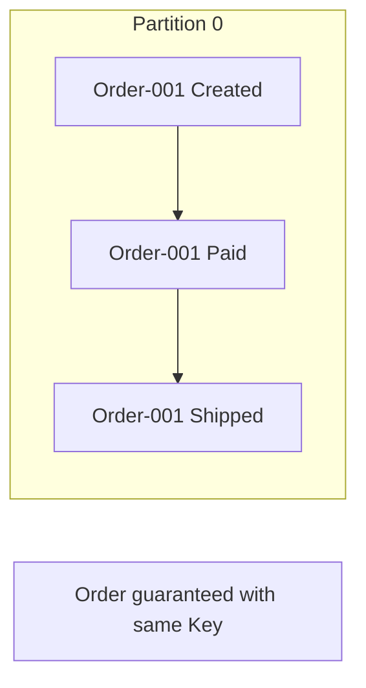
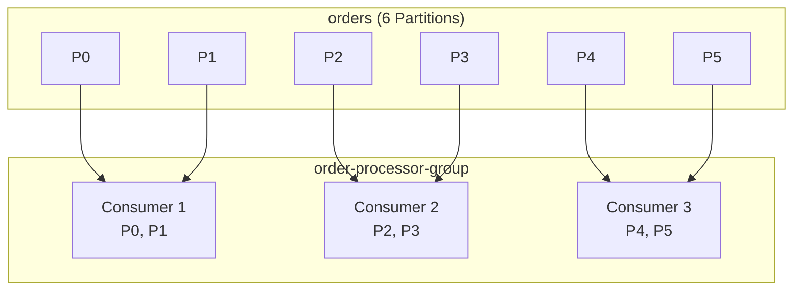
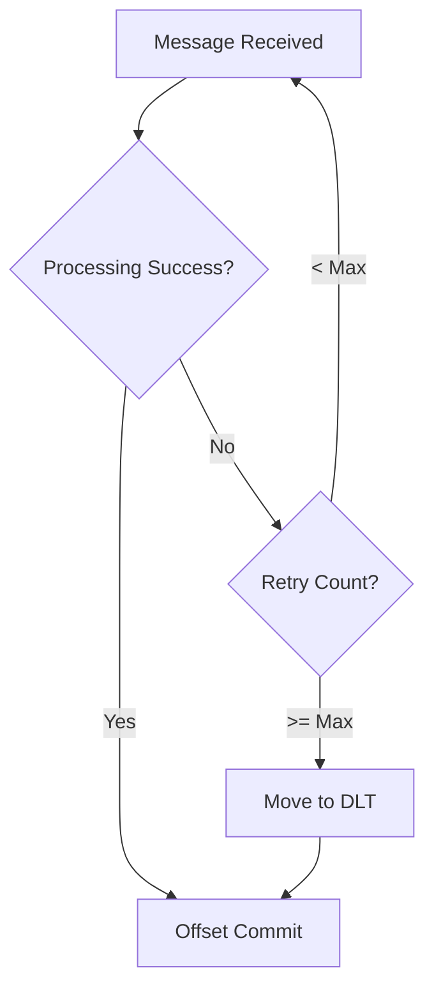
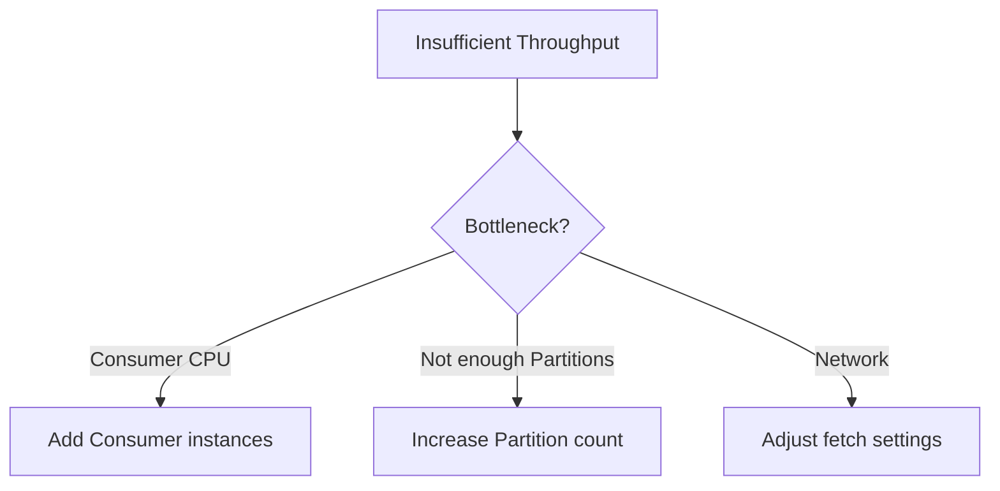
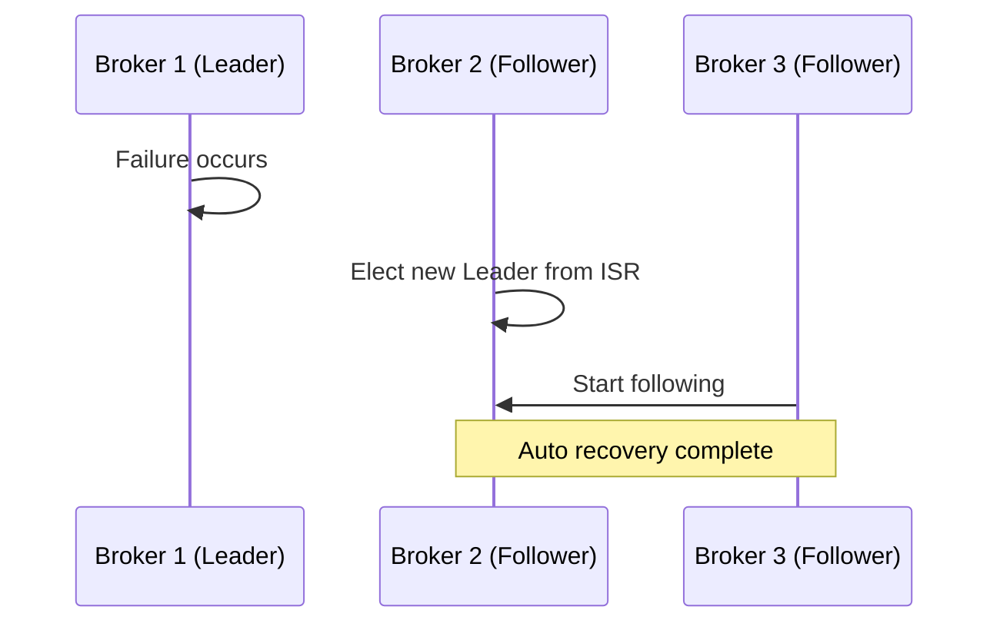

# Kafka Frequently Asked Questions (FAQ)

Common questions and answers when using Kafka.

## Basic Concepts

### Q: Is Kafka a message queue?

**A:** No. Kafka is a **distributed event streaming platform**.

| Characteristic | Message Queue (RabbitMQ) | Kafka |
|----------------|--------------------------|-------|
| **Message Retention** | Deleted after consumption | Retained until retention period |
| **Reprocessing** | Not possible | Possible (move offset) |
| **Ordering** | Per queue | Per Partition |
| **Scalability** | Vertical | Horizontal |

**When Kafka is appropriate:**
- Event sourcing, CQRS
- Real-time stream processing
- Log aggregation
- Message reprocessing needed

---

### Q: How many Partitions should I have?

**A:** Decide based on **throughput and number of Consumers**.

```
Partition count = max(throughput requirement / single Partition throughput, Consumer count)
```

**General Guidelines:**

| Scale | Recommended Partitions |
|-------|------------------------|
| Small (dev/test) | 3-6 |
| Medium (general production) | 6-12 |
| Large (high throughput) | 12-50 |

**Cautions:**
- Partitions can be increased but **cannot be decreased**
- More Partitions mean longer leader election time
- Fewer Partitions than Consumers create idle Consumers

---

### Q: How is message ordering guaranteed?

**A:** Ordering is guaranteed **only within the same Partition**.

```java
// Messages with the same key always go to the same Partition
kafkaTemplate.send("orders", orderId, orderEvent);
//                          ↑ Key
```



**Key Selection Criteria:**
- Order system: `orderId`
- User activity: `userId`
- IoT data: `deviceId`

---

### Q: Why do I need Consumer Groups?

**A:** For **parallel processing and fault recovery**.



**Benefits:**
- Consumers in the same group share Partition processing
- Automatic rebalancing on Consumer failure
- Independent groups each process the same messages

---

## Configuration Related

### Q: How should I set the acks configuration?

**A:** Choose based on **data importance**.

| acks | Behavior | Throughput | Durability | Use Case |
|------|----------|------------|------------|----------|
| `0` | No confirmation after send | Highest | Low | Logs, metrics |
| `1` | Leader only confirms | High | Medium | General events |
| `all` | All ISR confirms | Low | High | Finance, orders |

```yaml
# application.yml
spring:
  kafka:
    producer:
      acks: all                    # Recommended
      properties:
        min.insync.replicas: 2     # Confirm at least 2 replicas
```

---

### Q: What value should I use for auto.offset.reset?

**A:** Choose **earliest** or **latest** based on business requirements.

| Value | Behavior | Use Case |
|-------|----------|----------|
| `earliest` | Read from beginning | Data loss prevention needed |
| `latest` | Read from latest | Only real-time processing needed |
| `none` | Throw exception | Strict offset management |

```yaml
spring:
  kafka:
    consumer:
      auto-offset-reset: earliest  # Recommended
```

**Note:** Only applies when it's a new Consumer Group. Existing groups use stored offset.

---

### Q: Should enable.auto.commit be on?

**A:** **Recommend false with manual commit**.

```java
// ❌ Auto commit: May commit before processing
@KafkaListener(topics = "orders")
public void listen(String message) {
    processOrder(message);  // Offset already committed even if this fails
}

// ✅ Manual commit: Commit after successful processing
@KafkaListener(topics = "orders")
public void listen(String message, Acknowledgment ack) {
    processOrder(message);
    ack.acknowledge();  // Explicit commit after success
}
```

```yaml
spring:
  kafka:
    consumer:
      enable-auto-commit: false
    listener:
      ack-mode: manual
```

---

## Error Handling

### Q: What happens when an exception occurs in a Consumer?

**A:** By default, **infinite retries** then application stops.



**Recommended Configuration:**

```java
@RetryableTopic(
    attempts = "3",
    backoff = @Backoff(delay = 1000, multiplier = 2),
    dltTopicSuffix = "-dlt"
)
@KafkaListener(topics = "orders")
public void listen(OrderEvent event) {
    processOrder(event);
}
```

---

### Q: How do I handle Dead Letter Topic (DLT)?

**A:** **Monitor with separate Consumer and handle manually**.

```java
// DLT message handling
@DltHandler
public void handleDlt(OrderEvent event,
                      @Header(KafkaHeaders.ORIGINAL_TOPIC) String topic,
                      @Header(KafkaHeaders.EXCEPTION_MESSAGE) String error) {
    log.error("DLT received - Topic: {}, Error: {}", topic, error);
    alertService.sendAlert(event, error);
    // Manual review then reprocess or discard
}
```

**DLT Operational Strategy:**
1. Set up alerts (Slack, Email)
2. Periodically review DLT messages
3. Reprocess or discard after fixing issues

---

### Q: Why is idempotency important?

**A:** Because network failures can cause **duplicate messages**.

```
Scenario:
1. Producer sends message
2. Broker saves and sends ack
3. Ack lost due to network error
4. Producer retries → Duplicate!
```

**Solution:**

```yaml
# Enable Producer idempotency
spring:
  kafka:
    producer:
      properties:
        enable.idempotence: true
```

```java
// Consumer-side idempotency handling
@KafkaListener(topics = "orders")
public void listen(OrderEvent event) {
    if (processedIds.contains(event.orderId())) {
        return;  // Already processed
    }
    processOrder(event);
    processedIds.add(event.orderId());
}
```

---

## Performance Tuning

### Q: How do I increase Producer throughput?

**A:** Enable **batching and compression**.

```yaml
spring:
  kafka:
    producer:
      batch-size: 32768         # 32KB batch
      properties:
        linger.ms: 20           # Wait 20ms before sending
        compression.type: lz4   # Compression
        buffer.memory: 67108864 # 64MB buffer
```

| Setting | Default | Recommended | Effect |
|---------|---------|-------------|--------|
| `batch.size` | 16KB | 32KB+ | Increase batch size |
| `linger.ms` | 0 | 5-100 | Batch wait time |
| `compression.type` | none | lz4 | Reduce network load |

---

### Q: How do I increase Consumer throughput?

**A:** **Increase Consumer count** and **adjust fetch settings**.

```yaml
spring:
  kafka:
    consumer:
      properties:
        fetch.min.bytes: 50000      # Minimum 50KB
        fetch.max.wait.ms: 500      # Max 500ms wait
        max.poll.records: 500       # Max 500 per poll
```

**Scaling Strategy:**



---

### Q: Consumer Lag keeps increasing

**A:** **Processing speed is slower than message ingestion rate**.

**How to Check:**

```bash
kafka-consumer-groups.sh --bootstrap-server localhost:9092 \
  --group order-processor-group --describe
```

**Solutions:**

| Cause | Solution |
|-------|----------|
| Not enough Consumers | Add instances |
| Slow external API calls | Async processing, set timeouts |
| DB bottleneck | Batch processing, index optimization |
| Inefficient logic | Profile and optimize |

---

## Operations Related

### Q: How do I monitor Kafka?

**A:** Collect **JMX metrics** and monitor key indicators.

**Key Monitoring Metrics:**

| Metric | Description | Threshold |
|--------|-------------|-----------|
| Consumer Lag | Processing delay | > 1000 warning |
| Under-replicated Partitions | Replication lag | > 0 warning |
| Request Latency | Request delay | > 100ms warning |
| Disk Usage | Disk utilization | > 80% warning |

**Alert Configuration Example:**

```yaml
# Prometheus AlertManager
- alert: KafkaConsumerLagHigh
  expr: kafka_consumer_lag > 10000
  for: 5m
  labels:
    severity: warning
```

---

### Q: What happens when a Broker goes down?

**A:** **Automatic recovery** based on Replication settings.



**Recovery Conditions:**
- `replication.factor >= 2`
- `min.insync.replicas >= 2`
- Surviving Broker exists in ISR

---

### Q: How do I set message retention period?

**A:** Configure **retention** per Topic.

```bash
# 7-day retention
kafka-configs.sh --bootstrap-server localhost:9092 \
  --alter --entity-type topics --entity-name orders \
  --add-config retention.ms=604800000
```

| Setting | Description | Example |
|---------|-------------|---------|
| `retention.ms` | Time-based | 7 days = 604800000 |
| `retention.bytes` | Size-based | 1GB = 1073741824 |

**Recommendations:**
- General events: 7 days
- Audit logs: 90+ days
- Debugging: 1-3 days

---

## Spring Kafka Related

### Q: What's the difference between KafkaTemplate and KafkaProducer?

**A:** `KafkaTemplate` is a Spring abstraction that's **more convenient**.

```java
// ✅ KafkaTemplate (Spring abstraction)
@Autowired
private KafkaTemplate<String, OrderEvent> template;

public void send(OrderEvent event) {
    template.send("orders", event.orderId(), event);
}

// ❌ KafkaProducer (low-level API) - Not recommended in Spring
Producer<String, OrderEvent> producer = new KafkaProducer<>(props);
producer.send(new ProducerRecord<>("orders", event));
```

**KafkaTemplate Benefits:**
- Auto-configuration integration
- Transaction support
- Simplified callback handling

---

### Q: How many threads does @KafkaListener run on?

**A:** By default, **as many threads as Partitions**.

```yaml
spring:
  kafka:
    listener:
      concurrency: 3  # Max 3 threads
```

```
Rule:
- concurrency <= Partition count → concurrency threads
- concurrency > Partition count → Partition count threads (rest idle)
```

---

## Next Steps

- [Glossary](../glossary/) - Kafka terminology
- [References](../references/) - Learning resources
