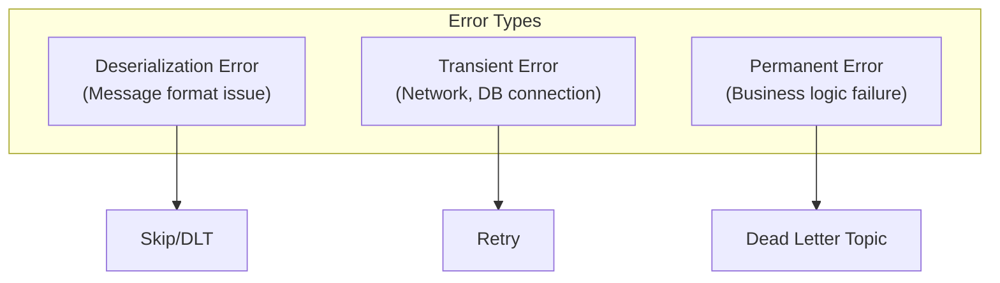
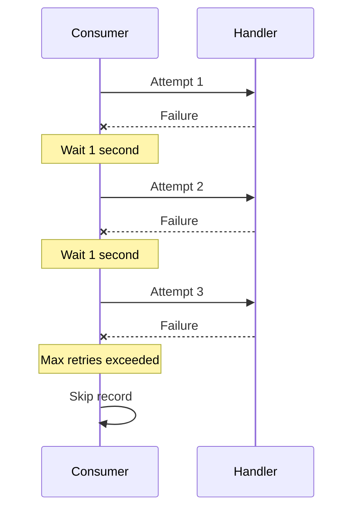
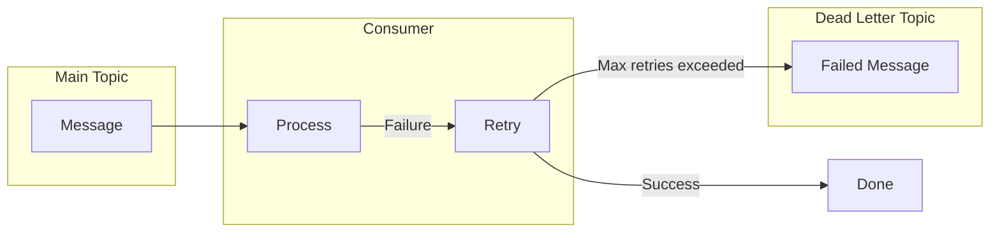
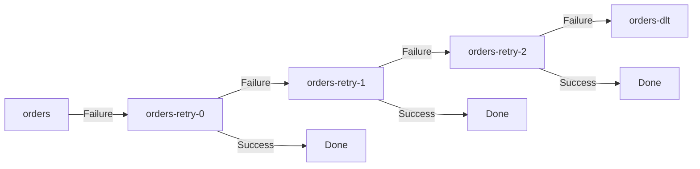
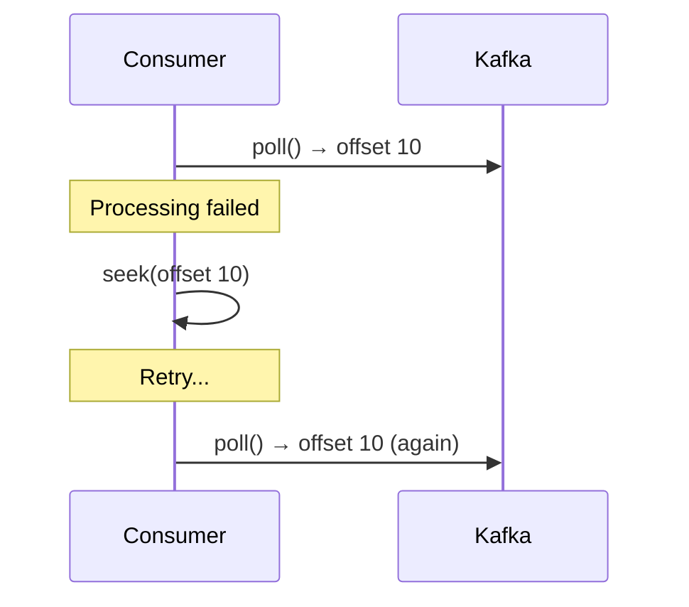
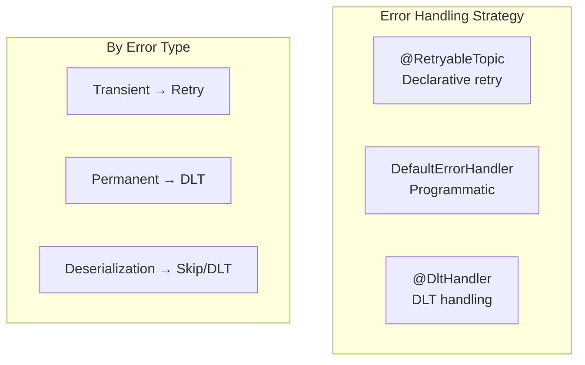

# Advanced Error Handling

Understanding Kafka Consumer error handling strategies and the Dead Letter Topic pattern.

## Error Types



| Type | Example | Handling |
|------|---------|----------|
| **Deserialization** | JSON parsing failure | Skip or DLT |
| **Transient** | DB connection failure, timeout | Retry |
| **Permanent** | Validation failure | DLT |

## Basic Error Handling

### DefaultErrorHandler (Spring Kafka 2.8+)

```java
@Configuration
public class KafkaConfig {

    @Bean
    public DefaultErrorHandler errorHandler() {
        // 3 retries at 1 second intervals
        return new DefaultErrorHandler(
            new FixedBackOff(1000L, 3L)
        );
    }
}
```

### Retry Strategies

#### FixedBackOff



#### ExponentialBackOff

```java
@Bean
public DefaultErrorHandler errorHandler() {
    ExponentialBackOff backOff = new ExponentialBackOff(1000L, 2.0);
    backOff.setMaxElapsedTime(60000L);  // Max 1 minute
    return new DefaultErrorHandler(backOff);
}
```

```
Attempt 1: Immediately
Attempt 2: After 1 second
Attempt 3: After 2 seconds
Attempt 4: After 4 seconds
Attempt 5: After 8 seconds
...
```

## Dead Letter Topic (DLT)

A separate Topic to store messages that cannot be processed even after retries.

### Basic Flow



### DeadLetterPublishingRecoverer

```java
@Configuration
public class KafkaConfig {

    @Bean
    public DefaultErrorHandler errorHandler(
            KafkaTemplate<String, Object> kafkaTemplate) {

        DeadLetterPublishingRecoverer recoverer =
            new DeadLetterPublishingRecoverer(kafkaTemplate);

        return new DefaultErrorHandler(
            recoverer,
            new FixedBackOff(1000L, 3L)
        );
    }
}
```

DLT Topic naming convention: `original-topic.DLT` (e.g., `orders.DLT`)

### DLT Customization

```java
@Bean
public DefaultErrorHandler errorHandler(
        KafkaTemplate<String, Object> kafkaTemplate) {

    // Customize DLT Topic name
    DeadLetterPublishingRecoverer recoverer =
        new DeadLetterPublishingRecoverer(kafkaTemplate,
            (record, exception) ->
                new TopicPartition(
                    record.topic() + "-dead-letter",
                    record.partition()
                ));

    // Don't retry specific exceptions
    DefaultErrorHandler handler = new DefaultErrorHandler(
        recoverer,
        new FixedBackOff(1000L, 3L)
    );

    handler.addNotRetryableExceptions(
        ValidationException.class,
        NullPointerException.class
    );

    return handler;
}
```

## @RetryableTopic (Recommended)

Declarative retry and DLT handling provided in Spring Kafka 2.7+.

### Basic Usage

```java
@Component
public class OrderConsumer {

    @RetryableTopic(
        attempts = "4",  // 1 original + 3 retries
        backoff = @Backoff(delay = 1000, multiplier = 2)
    )
    @KafkaListener(topics = "orders")
    public void consume(OrderEvent event) {
        // Processing logic
        processOrder(event);
    }

    @DltHandler
    public void handleDlt(OrderEvent event,
                          @Header(KafkaHeaders.RECEIVED_TOPIC) String topic,
                          @Header(KafkaHeaders.EXCEPTION_MESSAGE) String error) {
        log.error("DLT received - Topic: {}, Error: {}", topic, error);
        // DLT message handling (alerts, logging, etc.)
        alertService.sendAlert(event, error);
    }
}
```

### Retry Topic Structure



### Advanced Configuration

```java
@RetryableTopic(
    attempts = "4",
    backoff = @Backoff(delay = 1000, multiplier = 2, maxDelay = 10000),
    autoCreateTopics = "true",
    topicSuffixingStrategy = TopicSuffixingStrategy.SUFFIX_WITH_INDEX_VALUE,
    dltStrategy = DltStrategy.ALWAYS_RETRY_ON_ERROR,
    include = {RetryableException.class},  // Exceptions to retry
    exclude = {NonRetryableException.class}  // Exceptions not to retry
)
@KafkaListener(topics = "orders")
public void consume(OrderEvent event) {
    // ...
}
```

### Configuration Options

| Option | Description | Default |
|--------|-------------|---------|
| `attempts` | Total attempts | 3 |
| `backoff.delay` | Base wait time | 1000ms |
| `backoff.multiplier` | Wait time multiplier | 0 (fixed) |
| `backoff.maxDelay` | Max wait time | - |
| `include` | Exceptions to retry | All exceptions |
| `exclude` | Exceptions not to retry | - |

## Deserialization Error Handling

### ErrorHandlingDeserializer

Handles message deserialization failures.

```yaml
spring:
  kafka:
    consumer:
      key-deserializer: org.springframework.kafka.support.serializer.ErrorHandlingDeserializer
      value-deserializer: org.springframework.kafka.support.serializer.ErrorHandlingDeserializer
      properties:
        spring.deserializer.key.delegate.class: org.apache.kafka.common.serialization.StringDeserializer
        spring.deserializer.value.delegate.class: org.springframework.kafka.support.serializer.JsonDeserializer
        spring.json.trusted.packages: "com.example.*"
```

```java
@KafkaListener(topics = "orders")
public void consume(ConsumerRecord<String, OrderEvent> record) {
    if (record.value() == null) {
        // Deserialization failed
        log.error("Deserialization failed: {}", new String(record.headers()
            .lastHeader("springDeserializerExceptionValue").value()));
        return;
    }
    processOrder(record.value());
}
```

## Error Handling Patterns

### Pattern 1: Retry + DLT

The most common pattern.

```java
@RetryableTopic(attempts = "4")
@KafkaListener(topics = "orders")
public void consume(OrderEvent event) {
    validateAndProcess(event);
}

@DltHandler
public void handleDlt(OrderEvent event) {
    saveToFailedOrders(event);
    notifyAdmin(event);
}
```

### Pattern 2: Conditional Retry

```java
@KafkaListener(topics = "orders")
public void consume(OrderEvent event) {
    try {
        processOrder(event);
    } catch (TemporaryException e) {
        // Retryable → throw exception
        throw e;
    } catch (PermanentException e) {
        // Not retryable → log and skip
        log.error("Cannot process: {}", event, e);
        saveToFailedOrders(event, e);
    }
}
```

### Pattern 3: Manual Reprocessing

```java
@KafkaListener(topics = "orders-dlt")
public void processDlt(
        ConsumerRecord<String, OrderEvent> record,
        @Header(KafkaHeaders.EXCEPTION_MESSAGE) String error) {

    OrderEvent event = record.value();

    // Reprocess after manual review
    if (canBeFixed(event)) {
        OrderEvent fixed = fixEvent(event);
        kafkaTemplate.send("orders", record.key(), fixed);
        log.info("Reprocessing complete: {}", record.key());
    } else {
        permanentlyFailed(event, error);
    }
}
```

## Reprocessing with Seek

### Move to Specific Offset

```java
@KafkaListener(topics = "orders", id = "orderListener")
public void consume(OrderEvent event) {
    processOrder(event);
}

// Reset offset when needed
public void reprocessFrom(long offset) {
    Consumer<?, ?> consumer = kafkaListenerEndpointRegistry
        .getListenerContainer("orderListener")
        .getConsumerFactory()
        .createConsumer();

    consumer.seek(new TopicPartition("orders", 0), offset);
}
```

### SeekToCurrentErrorHandler Behavior



## Monitoring and Alerting

### DLT Message Alerting

```java
@DltHandler
public void handleDlt(
        ConsumerRecord<String, OrderEvent> record,
        @Header(KafkaHeaders.EXCEPTION_MESSAGE) String error,
        @Header(KafkaHeaders.ORIGINAL_TOPIC) String originalTopic,
        @Header(KafkaHeaders.ORIGINAL_OFFSET) long originalOffset) {

    DltMessage dltMessage = DltMessage.builder()
        .key(record.key())
        .value(record.value())
        .originalTopic(originalTopic)
        .originalOffset(originalOffset)
        .error(error)
        .timestamp(Instant.now())
        .build();

    // Slack/Email alert
    alertService.sendDltAlert(dltMessage);

    // Record metrics
    meterRegistry.counter("kafka.dlt.received",
        "topic", originalTopic).increment();
}
```

### DLT Dashboard Data

```java
@Scheduled(fixedRate = 60000)
public void collectDltMetrics() {
    // Aggregate message counts from DLT Topics
    Map<String, Long> dltCounts = dltTopics.stream()
        .collect(Collectors.toMap(
            topic -> topic,
            this::getMessageCount
        ));

    metricsService.recordDltCounts(dltCounts);
}
```

## Summary



| Situation | Recommended Handling |
|-----------|---------------------|
| **Transient error** | Retry with exponential backoff |
| **Permanent error** | Move to DLT immediately |
| **Deserialization error** | Log and skip |
| **DLT accumulation** | Alert + manual review |

## Next Steps

- [Monitoring Basics](../monitoring/) - Kafka monitoring and metrics
