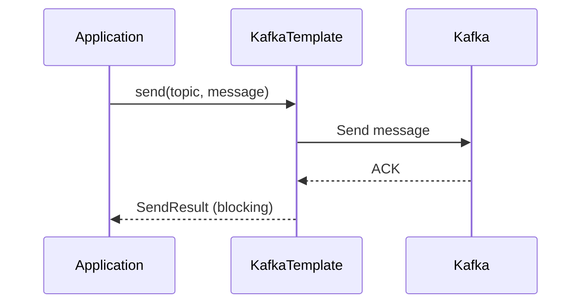
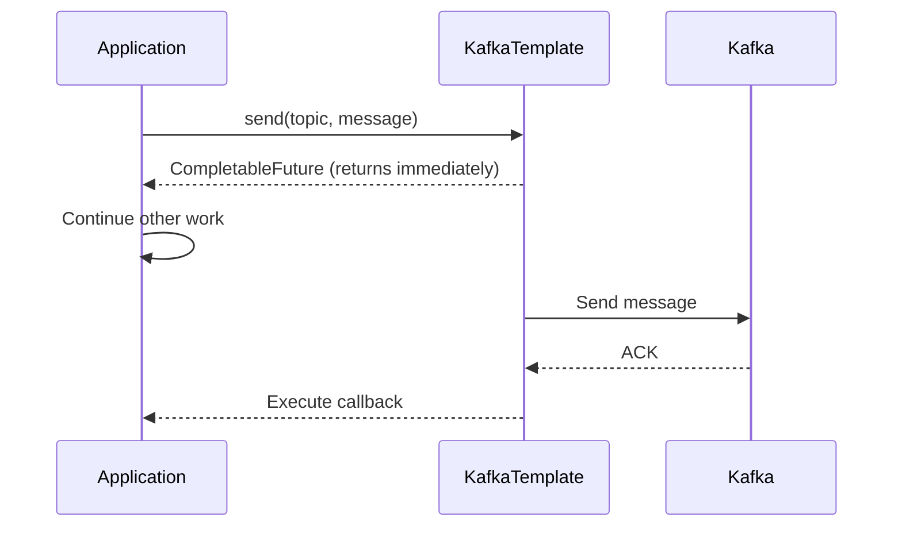
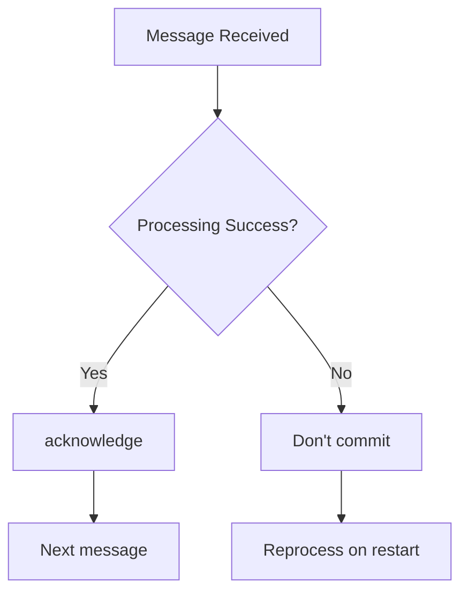
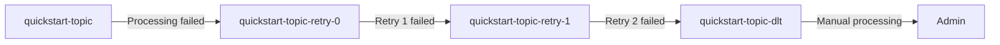

# Basic Producer/Consumer Examples

Explaining basic message send/receive implementation with Spring Kafka.

> **Prerequisite**: Completing the [Quick Start](../../quick-start/) first will make this document easier to understand.

This document extends the simple Quick Start example to learn patterns used in production.

---

## Producer Implementation

### KafkaTemplate Injection

```java
@Service
public class MessageProducer {

    private final KafkaTemplate<String, String> kafkaTemplate;

    public MessageProducer(KafkaTemplate<String, String> kafkaTemplate) {
        this.kafkaTemplate = kafkaTemplate;
    }
}
```

> Spring Boot automatically creates and injects the `KafkaTemplate`.

### Synchronous Send

In Quick Start, we didn't check the `send()` result. In production, you often need to verify send results.

```java
public void sendSync(String topic, String message) {
    try {
        SendResult<String, String> result = kafkaTemplate.send(topic, message).get();

        RecordMetadata metadata = result.getRecordMetadata();
        log.info("Send complete - Topic: {}, Partition: {}, Offset: {}",
                metadata.topic(),
                metadata.partition(),
                metadata.offset());
    } catch (Exception e) {
        log.error("Send failed", e);
        throw new RuntimeException("Message send failed", e);
    }
}
```



### Asynchronous Send

```java
public void sendAsync(String topic, String message) {
    CompletableFuture<SendResult<String, String>> future =
            kafkaTemplate.send(topic, message);

    future.whenComplete((result, ex) -> {
        if (ex == null) {
            log.info("Send success: {}", result.getRecordMetadata().offset());
        } else {
            log.error("Send failed", ex);
        }
    });
}
```



### Send with Key

```java
public void sendWithKey(String topic, String key, String message) {
    kafkaTemplate.send(topic, key, message);
}
```

**Benefits of using Key:**
- Same Key goes to same Partition
- Essential when ordering is required

### Send to Specific Partition

```java
public void sendToPartition(String topic, int partition, String key, String message) {
    kafkaTemplate.send(topic, partition, key, message);
}
```

---

## Consumer Implementation

### Basic @KafkaListener

The most basic form used in Quick Start.

```java
@Component
public class MessageConsumer {

    @KafkaListener(topics = "quickstart-topic", groupId = "quickstart-group")
    public void consume(String message) {
        log.info("Message received: {}", message);
    }
}
```

### Receive with ConsumerRecord

Use when you need metadata in addition to the message.

```java
@KafkaListener(topics = "quickstart-topic")
public void consume(ConsumerRecord<String, String> record) {
    log.info("Topic: {}", record.topic());
    log.info("Partition: {}", record.partition());
    log.info("Offset: {}", record.offset());
    log.info("Key: {}", record.key());
    log.info("Value: {}", record.value());
    log.info("Timestamp: {}", record.timestamp());
}
```

### Subscribe to Multiple Topics

```java
@KafkaListener(topics = {"topic-a", "topic-b", "topic-c"})
public void consumeMultiple(String message) {
    log.info("Message received: {}", message);
}
```

### Subscribe with Pattern

```java
@KafkaListener(topicPattern = "order-.*")
public void consumePattern(String message) {
    // Receives all of order-created, order-paid, order-shipped, etc.
    log.info("Order event: {}", message);
}
```

### Batch Receive

```java
@KafkaListener(topics = "quickstart-topic", batch = "true")
public void consumeBatch(List<String> messages) {
    log.info("Batch received: {} messages", messages.size());
    for (String message : messages) {
        process(message);
    }
}
```

---

## Manual Offset Commit

Quick Start used auto commit. Use manual commit when reprocessing on failure is needed.

### Configuration

```yaml
spring:
  kafka:
    consumer:
      enable-auto-commit: false
    listener:
      ack-mode: manual
```

### Implementation

```java
@KafkaListener(topics = "quickstart-topic")
public void consume(String message, Acknowledgment ack) {
    try {
        // Business logic processing
        processMessage(message);

        // Commit on success
        ack.acknowledge();
    } catch (Exception e) {
        // Don't commit on failure → will be reprocessed
        log.error("Processing failed", e);
    }
}
```



---

## Error Handling

### ErrorHandler Configuration

```java
@Configuration
public class KafkaConfig {

    @Bean
    public DefaultErrorHandler errorHandler() {
        return new DefaultErrorHandler(
            new FixedBackOff(1000L, 3L)  // 1 second interval, 3 retries
        );
    }
}
```

### Using @RetryableTopic

```java
@RetryableTopic(
    attempts = "3",
    backoff = @Backoff(delay = 1000, multiplier = 2)
)
@KafkaListener(topics = "quickstart-topic")
public void consume(String message) {
    // Auto retry on failure
    // After 3 failures, moves to quickstart-topic-dlt
    processMessage(message);
}
```

### Dead Letter Topic (DLT)



---

## Complete Example Code

Extended version of the Quick Start example.

### Producer (Extended REST API)

In Quick Start, we only sent simple strings. In production, you often send JSON objects with keys.

```java
@RestController
@RequestMapping("/api/messages")
public class MessageController {

    private final KafkaTemplate<String, String> kafkaTemplate;

    public MessageController(KafkaTemplate<String, String> kafkaTemplate) {
        this.kafkaTemplate = kafkaTemplate;
    }

    // Same simple send as Quick Start
    @PostMapping("/simple")
    public ResponseEntity<String> sendSimple(@RequestBody String message) {
        kafkaTemplate.send("quickstart-topic", message);
        return ResponseEntity.ok("Message sent: " + message);
    }

    // Extended: Send with Key and Topic specified
    @PostMapping("/advanced")
    public ResponseEntity<String> sendAdvanced(@RequestBody MessageRequest request) {
        kafkaTemplate.send(request.topic(), request.key(), request.message());
        return ResponseEntity.ok("Message sent");
    }
}

record MessageRequest(String topic, String key, String message) {}
```

**API Usage Examples:**

```bash
# Same approach as Quick Start
curl -X POST http://localhost:8080/api/messages/simple \
  -H "Content-Type: text/plain" \
  -d "Hello Kafka!"

# Extended approach (specify Key and Topic)
curl -X POST http://localhost:8080/api/messages/advanced \
  -H "Content-Type: application/json" \
  -d '{"topic": "quickstart-topic", "key": "user-123", "message": "Hello!"}'
```

### Consumer (Manual Commit)

```java
@Component
@Slf4j
public class MessageConsumer {

    @KafkaListener(
        topics = "quickstart-topic",
        groupId = "quickstart-group"
    )
    public void consume(
            ConsumerRecord<String, String> record,
            Acknowledgment ack) {

        log.info("Received - Partition: {}, Offset: {}, Key: {}, Value: {}",
                record.partition(),
                record.offset(),
                record.key(),
                record.value());

        try {
            processMessage(record.value());
            ack.acknowledge();
        } catch (Exception e) {
            log.error("Processing failed: {}", record.value(), e);
            // Retry logic or send to DLT
        }
    }

    private void processMessage(String message) {
        // Business logic
    }
}
```

---

## Testing

### Embedded Kafka

```java
@SpringBootTest
@EmbeddedKafka(partitions = 1, topics = {"quickstart-topic"})
class KafkaIntegrationTest {

    @Autowired
    private KafkaTemplate<String, String> kafkaTemplate;

    @Test
    void testSendAndReceive() throws Exception {
        kafkaTemplate.send("quickstart-topic", "test-message").get();

        // Consumer verification logic
    }
}
```

---

## Summary

| Component | Class/Annotation | Purpose |
|-----------|------------------|---------|
| **Producer** | `KafkaTemplate` | Send messages |
| **Consumer** | `@KafkaListener` | Receive messages |
| **Manual Commit** | `Acknowledgment` | Confirm processing complete |
| **Error Handling** | `@RetryableTopic` | Retry and DLT |

## Quick Start vs Basic Examples

| Item | Quick Start | Basic Examples |
|------|-------------|----------------|
| Send method | Fire-and-forget | Sync/async choice |
| Offset commit | Auto | Manual available |
| Error handling | None | Retry + DLT |
| Key usage | None | Supported |

---

## Next Steps

- [Order System](../order-system/) - Real-world example
