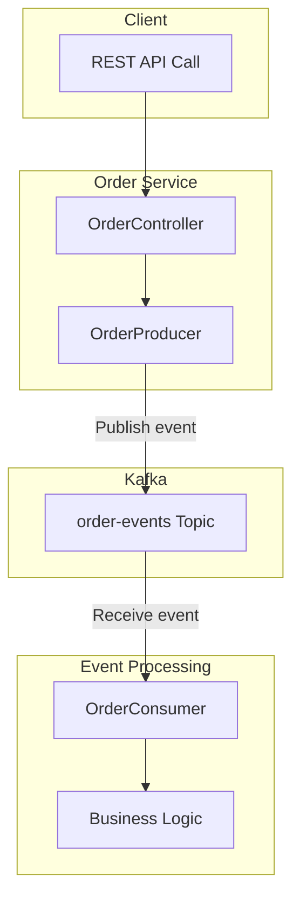
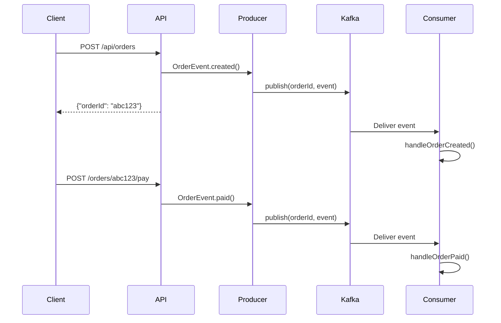
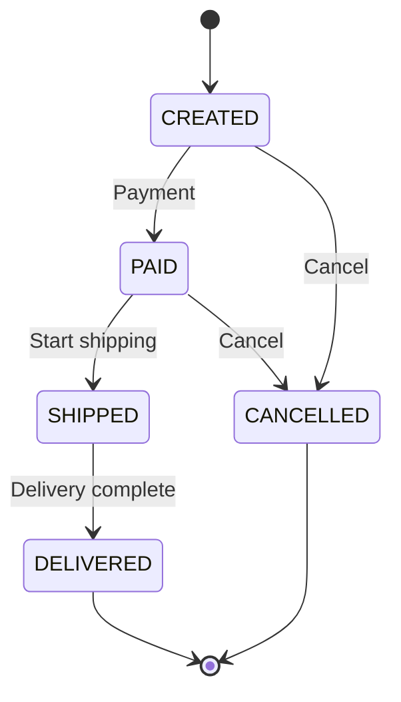
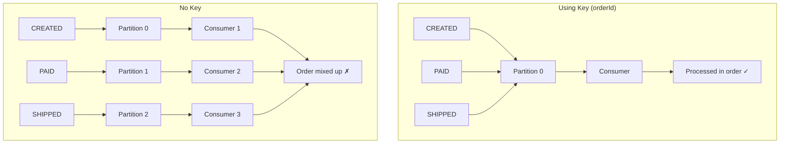
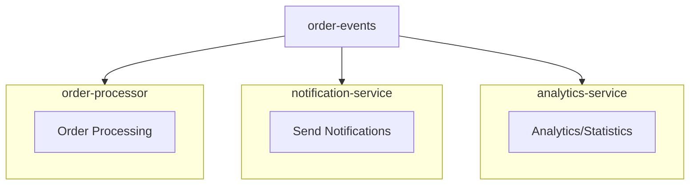

# Order System Example

Implementing an event-driven order system closer to real-world applications.

## System Architecture



## Event Flow



## Event Types

### OrderEvent

```java
public record OrderEvent(
    String orderId,
    String customerId,
    OrderStatus status,
    String description,
    LocalDateTime timestamp
) {}
```

### OrderStatus

| Status | Description | Next Status |
|--------|-------------|-------------|
| `CREATED` | Order created | PAID, CANCELLED |
| `PAID` | Payment complete | SHIPPED, CANCELLED |
| `SHIPPED` | Shipping started | DELIVERED |
| `DELIVERED` | Delivery complete | - |
| `CANCELLED` | Order cancelled | - |



## Message Key Usage

### Why use orderId as Key?

```java
kafkaTemplate.send(TOPIC, event.orderId(), event);
//                 topic  key           value
```

Because **ordering** is required.



### Event Order for Same Order

```
Order "abc123":
  Partition 2: [CREATED] → [PAID] → [SHIPPED] → [DELIVERED]
                   ↓          ↓         ↓            ↓
  Consumer:     Process 1  Process 2  Process 3   Process 4
                (Order guaranteed)
```

## Producer Implementation

```java
@Component
public class OrderProducer {

    private static final String TOPIC = "order-events";
    private final KafkaTemplate<String, OrderEvent> kafkaTemplate;

    public void publish(OrderEvent event) {
        // Use orderId as Key for ordering
        kafkaTemplate.send(TOPIC, event.orderId(), event)
                .whenComplete((result, ex) -> {
                    if (ex == null) {
                        log.info("Publish success - Partition: {}, Offset: {}",
                                result.getRecordMetadata().partition(),
                                result.getRecordMetadata().offset());
                    } else {
                        log.error("Publish failed", ex);
                    }
                });
    }
}
```

## Consumer Implementation

```java
@Component
public class OrderConsumer {

    @KafkaListener(topics = "order-events", groupId = "order-processor")
    public void consume(ConsumerRecord<String, OrderEvent> record) {
        OrderEvent event = record.value();

        // Events for same order arrive in order via Key(orderId)
        log.info("Received - OrderId: {}, Status: {}",
                record.key(), event.status());

        switch (event.status()) {
            case CREATED -> handleOrderCreated(event);
            case PAID -> handleOrderPaid(event);
            case SHIPPED -> handleOrderShipped(event);
            case DELIVERED -> handleOrderDelivered(event);
            case CANCELLED -> handleOrderCancelled(event);
        }
    }
}
```

## Running the Example

### 1. Start Kafka

```bash
cd docker
docker-compose up -d
```

### 2. Run Application

```bash
cd examples/order-system
./gradlew bootRun
```

### 3. Create Order

```bash
curl -X POST http://localhost:8080/api/orders \
  -H "Content-Type: application/json" \
  -d '{"customerId": "customer-123"}'
```

Response:
```json
{"orderId": "abc12345", "message": "Order has been created"}
```

### 4. Process Order

```bash
# Payment
curl -X POST "http://localhost:8080/api/orders/abc12345/pay?customerId=customer-123"

# Ship
curl -X POST "http://localhost:8080/api/orders/abc12345/ship?customerId=customer-123"

# Deliver
curl -X POST "http://localhost:8080/api/orders/abc12345/deliver?customerId=customer-123"
```

### 5. Check Logs

```
========================================
Event Received
  Partition: 0, Offset: 0
  Key (OrderId): abc12345
  Status: CREATED
========================================
[Processing] Order created - Checking inventory and awaiting payment

========================================
Event Received
  Partition: 0, Offset: 1
  Key (OrderId): abc12345
  Status: PAID
========================================
[Processing] Payment complete - Starting shipping preparation
```

## Extension Points

### Multiple Consumer Groups



Each service processes the same events independently.

### Adding Error Handling

```java
@RetryableTopic(attempts = "3")
@KafkaListener(topics = "order-events")
public void consume(OrderEvent event) {
    // After 3 retry failures, moves to DLT
}
```

## Summary

| Pattern | Implementation |
|---------|----------------|
| **Event Publishing** | KafkaTemplate + JSON Serializer |
| **Event Consumption** | @KafkaListener + JSON Deserializer |
| **Ordering Guarantee** | Message Key (orderId) |
| **State Transition** | Event-based state machine |

## Full Source Code

The complete source code for this example is available at the link below. Check out the full implementation of Producer, Consumer, Controller, and domain objects.

- [**`examples/order-system`**](../../../../examples/order-system/)

## Next Steps

- [Appendix](../../appendix/) - Glossary and references
