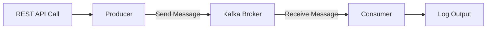
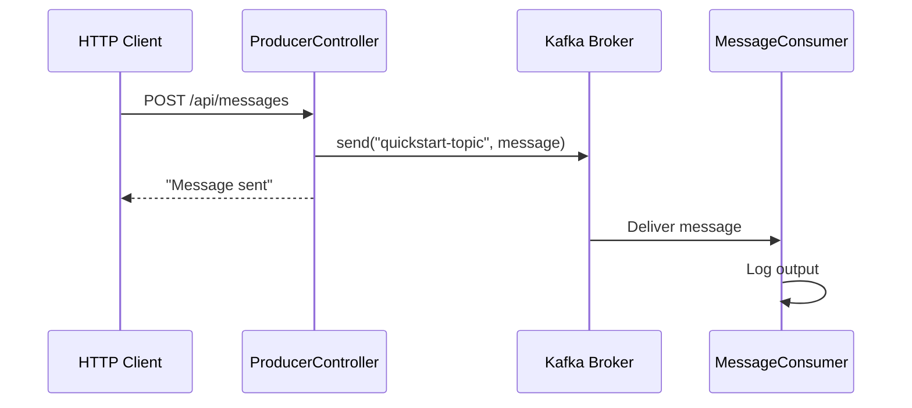

# Quick Start

Experience Kafka message sending and receiving in just 5 minutes.

## Overall Flow



## Prerequisites

- **Docker Desktop** or Docker Engine
- **Java 17+**
- **IDE** (IntelliJ IDEA, VS Code, etc.)

## Step 1: Start Kafka

Run Kafka with Docker Compose from the root directory of this repository.

```bash
# Navigate to the docker directory at repository root
cd docker
docker-compose up -d
```

> **No docker-compose.yml?**
> Check the [Environment Setup Guide](../examples/setup/) for the docker-compose.yml content and save it as `docker/docker-compose.yml`.

Verify successful startup:

```bash
docker-compose ps
```

Expected result:
```
NAME      COMMAND                  STATUS
kafka     "/etc/kafka/docker..."   Up
```

> **Note:** It may take 10-20 seconds for Kafka to fully start.

## Step 2: Run the Example Project

In a new terminal, run the Quick Start example.

```bash
# Navigate to the example directory from repository root
cd examples/quick-start
./gradlew bootRun
```

> **Windows users:** Use `gradlew.bat bootRun`

When startup is complete, you'll see this log:
```
Started QuickStartApplication in X.XXX seconds
```

## Step 3: Send a Message

In a new terminal, send a message via REST API.

```bash
curl -X POST http://localhost:8080/api/messages \
  -H "Content-Type: text/plain" \
  -d "Hello Kafka!"
```

Response:
```
Message sent: Hello Kafka!
```

## Step 4: Verify Message Reception

Check the Consumer log in the **terminal where the Spring Boot application is running**.

```
INFO  c.e.quickstart.MessageConsumer : Message received: Hello Kafka!
```

**Congratulations!** You've successfully sent and received messages through Kafka.

## Shutdown

```bash
# Spring Boot application: Ctrl+C

# Stop Kafka (in the docker directory)
cd docker
docker-compose down
```

---

## What Just Happened?



1. **HTTP Request**: You sent a message with curl
2. **Producer**: `ProducerController` published the message to Kafka
3. **Kafka Broker**: Stored the message in `quickstart-topic`
4. **Consumer**: `MessageConsumer` received and logged the message

> **When is the topic created?**
> By default, Kafka automatically creates a topic when you send a message to a non-existent topic (`auto.create.topics.enable=true`).

---

## Exploring the Code

Let's look at how the Quick Start example is structured.

### Producer (Message Sending)

```java
// ProducerController.java
@RestController
@RequestMapping("/api/messages")
public class ProducerController {

    private static final String TOPIC = "quickstart-topic";
    private final KafkaTemplate<String, String> kafkaTemplate;

    public ProducerController(KafkaTemplate<String, String> kafkaTemplate) {
        this.kafkaTemplate = kafkaTemplate;
    }

    @PostMapping
    public String sendMessage(@RequestBody String message) {
        kafkaTemplate.send(TOPIC, message);
        return "Message sent: " + message;
    }
}
```

**Key Points:**
- `KafkaTemplate`: Message sending class provided by Spring Kafka
- `send(topic, message)`: Sends a message to the specified topic

### Consumer (Message Receiving)

```java
// MessageConsumer.java
@Component
public class MessageConsumer {

    private static final Logger log = LoggerFactory.getLogger(MessageConsumer.class);

    @KafkaListener(topics = "quickstart-topic", groupId = "quickstart-group")
    public void consume(String message) {
        log.info("Message received: {}", message);
    }
}
```

**Key Points:**
- `@KafkaListener`: Automatically receives messages from the specified topic
- `groupId`: Consumer Group ID - consumers in the same group share messages

### Configuration (application.yml)

```yaml
spring:
  kafka:
    bootstrap-servers: localhost:9092
    consumer:
      group-id: quickstart-group
      auto-offset-reset: earliest
    producer:
      key-serializer: org.apache.kafka.common.serialization.StringSerializer
      value-serializer: org.apache.kafka.common.serialization.StringSerializer
```

**Key Points:**
- `bootstrap-servers`: Kafka broker address
- `auto-offset-reset: earliest`: Read from the oldest message when Consumer starts

---

## Troubleshooting

### Kafka Connection Failed

```
Connection to node -1 could not be established
```

**Solution:**
1. Verify Docker is running: `docker ps`
2. Check Kafka container status: `docker-compose ps`
3. Wait for Kafka to fully start (up to 30 seconds)
4. Restart Kafka: `docker-compose restart`

### Port Conflict

```
Port 9092 is already in use
```

**Solution:**
1. Terminate existing Kafka process
2. Or change the port in `docker-compose.yml`

### Gradle Build Failed

```
Could not resolve dependencies
```

**Solution:**
1. Verify Java 17+ installation: `java -version`
2. Clear Gradle cache: `./gradlew clean`

### Consumer Log Not Showing

If you sent a message but don't see the Consumer log:

1. Check **the terminal where Spring Boot is running** (not the terminal where you ran curl)
2. Look for `KafkaMessageListenerContainer` related logs in the application startup output
3. If not present, there may be a Kafka connection issue

---

## Next Steps

After completing Quick Start, proceed to the following:

| Goal | Recommended Reading |
|------|----------|
| Understand Kafka concepts | [Core Components](../concepts/core-components/) |
| Practice more complex examples | [Basic Examples](../examples/basic/) |
| Learn production settings | [Environment Setup](../examples/setup/) |
