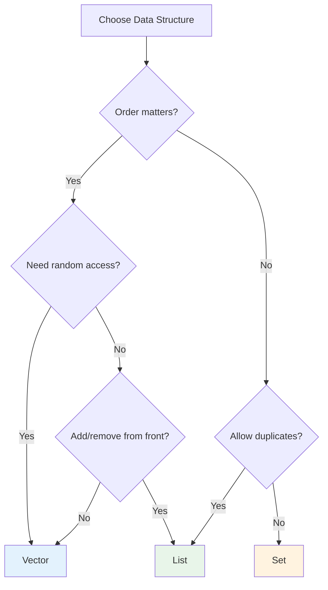

Scala's collection library provides rich data structures optimized for functional programming.

## Collection Hierarchy

```
                  Iterable
                     │
        ┌────────────┼────────────┐
        │            │            │
       Seq          Set          Map
        │            │            │
   ┌────┴────┐       │       ┌────┴────┐
   │         │       │       │         │
IndexedSeq LinearSeq SortedSet HashMap SortedMap
   │         │       │
Vector    List    TreeSet
Array   LazyList
```

## Immutable vs Mutable

Scala uses **immutable collections** by default.

```scala
// Immutable (default)
import scala.collection.immutable._  // Implicitly imported
val list = List(1, 2, 3)
val set = Set(1, 2, 3)
val map = Map("a" -> 1, "b" -> 2)

// Mutable (explicit import required)
import scala.collection.mutable
val mutableList = mutable.ListBuffer(1, 2, 3)
val mutableSet = mutable.Set(1, 2, 3)
val mutableMap = mutable.Map("a" -> 1)
```

## Seq (Sequence)

Ordered collections.

### List (Linked List)

```scala
val list = List(1, 2, 3, 4, 5)

// Element access
list.head          // 1
list.tail          // List(2, 3, 4, 5)
list(2)            // 3 (index access - O(n))

// Add element (front - O(1))
val newList = 0 :: list    // List(0, 1, 2, 3, 4, 5)
val concat = list :+ 6     // List(1, 2, 3, 4, 5, 6) - O(n)

// List concatenation
val combined = List(1, 2) ::: List(3, 4)  // List(1, 2, 3, 4)
// or
val combined2 = List(1, 2) ++ List(3, 4)

// Pattern matching
list match {
  case Nil          => "Empty list"
  case head :: tail => s"First: $head, rest: $tail"
}
```

### Vector (Indexed Sequence)

Immutable sequence with fast random access.

```scala
val vector = Vector(1, 2, 3, 4, 5)

// Random access - O(~1) (effectively constant time)
vector(2)  // 3

// Update (returns new Vector)
val updated = vector.updated(2, 100)  // Vector(1, 2, 100, 4, 5)

// Add
val appended = vector :+ 6
val prepended = 0 +: vector
```

### Range

Represents a range of numbers.

```scala
val r1 = 1 to 10      // 1 to 10 (inclusive)
val r2 = 1 until 10   // 1 to 9 (excludes 10)
val r3 = 1 to 10 by 2 // 1, 3, 5, 7, 9

r1.toList  // List(1, 2, 3, 4, 5, 6, 7, 8, 9, 10)
```

## Set

Collection without duplicates.

```scala
val set = Set(1, 2, 3, 2, 1)  // Set(1, 2, 3)

// Membership
set.contains(2)  // true
set(2)           // true (apply = contains)

// Add/Remove
val added = set + 4       // Set(1, 2, 3, 4)
val removed = set - 2     // Set(1, 3)

// Set operations
val a = Set(1, 2, 3)
val b = Set(2, 3, 4)

a union b      // Set(1, 2, 3, 4)
a | b          // Same as above

a intersect b  // Set(2, 3)
a & b          // Same as above

a diff b       // Set(1)
a -- b         // Same as above
```

### SortedSet

Sorted set.

```scala
import scala.collection.immutable.SortedSet

val sorted = SortedSet(3, 1, 4, 1, 5, 9, 2, 6)
// SortedSet(1, 2, 3, 4, 5, 6, 9)

sorted.firstKey  // 1
sorted.lastKey   // 9
sorted.range(2, 6)  // SortedSet(2, 3, 4, 5)
```

## Map

Collection of key-value pairs.

```scala
val map = Map("a" -> 1, "b" -> 2, "c" -> 3)

// Value access
map("a")              // 1
map.get("a")          // Some(1)
map.get("z")          // None
map.getOrElse("z", 0) // 0

// Add/Update
val added = map + ("d" -> 4)
val updated = map + ("a" -> 10)

// Remove
val removed = map - "a"

// Iteration
for ((key, value) <- map) {
  println(s"$key = $value")
}

// keys, values
map.keys    // Iterable("a", "b", "c")
map.values  // Iterable(1, 2, 3)
```

## Collection Operations

### Transform Operations

```scala
val numbers = List(1, 2, 3, 4, 5)

// map: Transform each element
numbers.map(_ * 2)           // List(2, 4, 6, 8, 10)
numbers.map(n => n * n)      // List(1, 4, 9, 16, 25)

// flatMap: Transform and flatten
numbers.flatMap(n => List(n, n * 10))
// List(1, 10, 2, 20, 3, 30, 4, 40, 5, 50)

// filter: Only matching elements
numbers.filter(_ % 2 == 0)   // List(2, 4)

// filterNot: Only non-matching elements
numbers.filterNot(_ % 2 == 0) // List(1, 3, 5)

// collect: Filter + transform with pattern matching
numbers.collect {
  case n if n % 2 == 0 => n * 10
}  // List(20, 40)
```

### Reduce Operations

```scala
val numbers = List(1, 2, 3, 4, 5)

// reduce: Reduce elements to one
numbers.reduce(_ + _)      // 15
numbers.reduce(_ * _)      // 120

// fold: Reduce with initial value
numbers.foldLeft(0)(_ + _)   // 15
numbers.foldLeft(10)(_ + _)  // 25

// foldLeft vs foldRight
List("a", "b", "c").foldLeft("")(_ + _)   // "abc"
List("a", "b", "c").foldRight("")(_ + _)  // "abc" (same result, different direction)
```

### Partition Operations

```scala
val numbers = List(1, 2, 3, 4, 5, 6)

// partition: Split into two by condition
val (evens, odds) = numbers.partition(_ % 2 == 0)
// evens = List(2, 4, 6), odds = List(1, 3, 5)

// groupBy: Group by key
val grouped = numbers.groupBy(_ % 3)
// Map(0 -> List(3, 6), 1 -> List(1, 4), 2 -> List(2, 5))

// span: Split while condition is true
val (before, after) = numbers.span(_ < 4)
// before = List(1, 2, 3), after = List(4, 5, 6)

// splitAt: Split by index
val (first, second) = numbers.splitAt(3)
// first = List(1, 2, 3), second = List(4, 5, 6)
```

### Search Operations

```scala
val numbers = List(1, 2, 3, 4, 5)

// find: First matching element
numbers.find(_ > 3)    // Some(4)
numbers.find(_ > 10)   // None

// exists: Any element matches?
numbers.exists(_ > 3)  // true

// forall: All elements match?
numbers.forall(_ > 0)  // true

// contains: Contains value?
numbers.contains(3)    // true

// count: Count matching elements
numbers.count(_ % 2 == 0)  // 2
```

### Sort Operations

```scala
val numbers = List(3, 1, 4, 1, 5, 9, 2, 6)

numbers.sorted           // List(1, 1, 2, 3, 4, 5, 6, 9)
numbers.sortWith(_ > _)  // List(9, 6, 5, 4, 3, 2, 1, 1)

case class Person(name: String, age: Int)
val people = List(Person("Alice", 30), Person("Bob", 25), Person("Carol", 35))

people.sortBy(_.age)        // By age
people.sortBy(_.name)       // By name
people.sortWith(_.age > _.age)  // Age descending
```

## Working with Option

```scala
val maybeValue: Option[Int] = Some(42)
val noValue: Option[Int] = None

// map
maybeValue.map(_ * 2)  // Some(84)
noValue.map(_ * 2)     // None

// flatMap
def safeDivide(a: Int, b: Int): Option[Int] =
  if (b == 0) None else Some(a / b)

maybeValue.flatMap(v => safeDivide(v, 2))  // Some(21)

// getOrElse
maybeValue.getOrElse(0)  // 42
noValue.getOrElse(0)     // 0

// fold
maybeValue.fold(0)(_ * 2)  // 84
noValue.fold(0)(_ * 2)     // 0

// for comprehension
for {
  a <- Some(10)
  b <- Some(20)
} yield a + b  // Some(30)
```

## Performance Characteristics

| Collection | head | tail | Index | Update | Prepend | Append |
|------------|------|------|-------|--------|---------|--------|
| List | O(1) | O(1) | O(n) | O(n) | O(1) | O(n) |
| Vector | O(1) | O(1) | O(log₃₂n)* | O(log₃₂n)* | O(log₃₂n)* | O(log₃₂n)* |
| Array | O(1) | O(n) | O(1) | O(1) | - | - |
| Set | - | - | O(log n)** | O(log n)** | O(log n)** | - |
| Map | - | - | O(log n)** | O(log n)** | O(log n)** | - |

> **Notes:**
> - `*` Vector's O(log₃₂n) is about 6 steps even for n=1 billion, **effectively constant time**.
> - `**` HashSet/HashMap are average O(1), TreeSet/TreeMap are O(log n)

### Which Collection to Choose?

```scala
// Frequent add/remove from front → List
val queue = 1 :: 2 :: 3 :: Nil

// Frequent random access → Vector
val indexed = Vector(1, 2, 3, 4, 5)
indexed(3)  // Fast!

// No duplicates, fast lookup → Set
val unique = Set(1, 2, 3)
unique.contains(2)  // Fast!

// Key-value lookup → Map
val lookup = Map("a" -> 1, "b" -> 2)
lookup.get("a")  // Fast!
```

## Common Mistakes and Anti-patterns

### What to Avoid

```scala
// 1. Index-based access abuse (on List)
val list = List(1, 2, 3, 4, 5)
for (i <- 0 until list.length) {
  println(list(i))  // O(n^2) - Very slow!
}

// 2. Mutable collection abuse
val mutableList = mutable.ListBuffer[Int]()
for (i <- 1 to 1000) {
  mutableList += i  // Unnecessary mutability
}

// 3. map then flatten instead of flatMap
list.map(x => List(x, x * 2)).flatten  // Inefficient

// 4. head/last on empty collection
List.empty[Int].head  // NoSuchElementException!
```

### The Right Way

```scala
// 1. Use foreach or iterator
list.foreach(println)  // O(n)
// Or use Vector for frequent index access
val vector = Vector(1, 2, 3, 4, 5)
vector(2)  // O(~1)

// 2. Immutable collections with functional transforms
val result = (1 to 1000).toList

// 3. Use flatMap
list.flatMap(x => List(x, x * 2))

// 4. Use headOption/lastOption
List.empty[Int].headOption  // None
List(1, 2, 3).headOption    // Some(1)
```

### Collection Selection Guide



## Exercises

### 1. Word Frequency

Calculate the frequency of each word in a list of strings.

<details>
<summary>Show Answer</summary>

```scala
val words = List("apple", "banana", "apple", "cherry", "banana", "apple")

val frequency = words.groupBy(identity).map { case (word, list) =>
  word -> list.length
}
// Map(apple -> 3, banana -> 2, cherry -> 1)

// Or
val frequency2 = words.groupMapReduce(identity)(_ => 1)(_ + _)
```

</details>

### 2. Flatten Nested List

Flatten a nested list to one dimension.

<details>
<summary>Show Answer</summary>

```scala
val nested = List(List(1, 2), List(3, 4, 5), List(6))

val flat = nested.flatten  // List(1, 2, 3, 4, 5, 6)

// Or
val flat2 = nested.flatMap(identity)
```

</details>

## Next Steps

- [Higher-Order Functions](../higher-order-functions/) — map, filter, fold advanced
- [For Comprehension](../for-comprehensions/) — Monadic operations
