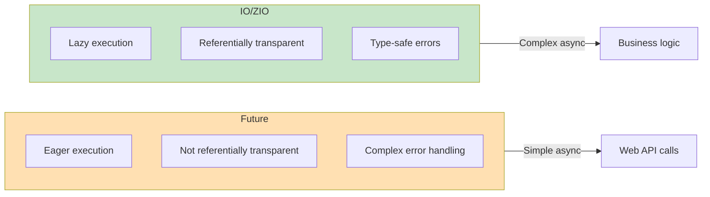

Scala supports asynchronous programming through `Future`. This document covers `Future`, `Promise`, and `ExecutionContext`.

## Future Basics

`Future` represents a value that has not yet been computed or is currently being computed.

### Creation

```scala
import scala.concurrent.{Future, ExecutionContext}
import scala.concurrent.ExecutionContext.Implicits.global

// Start asynchronous computation
val future: Future[Int] = Future {
  Thread.sleep(1000)  // Long-running operation
  42
}

// Returns immediately, computation runs in background
println("Computation started")
```

### ExecutionContext

`Future` requires an `ExecutionContext` that manages the thread pool.

```scala
import scala.concurrent.ExecutionContext.Implicits.global

// Or custom ExecutionContext
import java.util.concurrent.Executors
implicit val ec: ExecutionContext =
  ExecutionContext.fromExecutor(Executors.newFixedThreadPool(4))
```

## Combining Futures

### map

Transforms a successful result.

```scala
val future = Future(42)
val doubled = future.map(_ * 2)  // Future(84)
```

### flatMap

Transforms with a function that returns a Future.

```scala
def fetchUser(id: Int): Future[String] = Future(s"User$id")
def fetchOrders(user: String): Future[List[String]] =
  Future(List(s"Order1-$user", s"Order2-$user"))

val orders: Future[List[String]] = fetchUser(1).flatMap(fetchOrders)
```

### for comprehension

```scala
val result = for {
  user <- fetchUser(1)
  orders <- fetchOrders(user)
} yield (user, orders)

// Future(("User1", List("Order1-User1", "Order2-User1")))
```

### Parallel Execution

```scala
// Sequential execution (for comprehension)
val sequential = for {
  a <- Future(slowComputation1())
  b <- Future(slowComputation2())
} yield a + b

// Parallel execution
val futureA = Future(slowComputation1())
val futureB = Future(slowComputation2())

val parallel = for {
  a <- futureA
  b <- futureB
} yield a + b
```

## Error Handling

### recover

Replaces failure with a default value.

```scala
val future = Future {
  throw new RuntimeException("Error!")
}

val recovered = future.recover {
  case _: RuntimeException => 0
}
// Future(0)
```

### recoverWith

Replaces failure with another Future.

```scala
val fallback = future.recoverWith {
  case _: RuntimeException => Future(0)
}
```

### failed

Extracts the exception from a failed Future.

```scala
val failure = Future.failed(new Exception("Error"))
val exception: Future[Throwable] = failure.failed
```

## Awaiting Results

### Await (for testing)

```scala
import scala.concurrent.Await
import scala.concurrent.duration._

val future = Future(42)
val result = Await.result(future, 5.seconds)  // 42
```

> **Warning:** Avoid using `Await` in production code!

### Callbacks

```scala
import scala.util.{Success, Failure}

future.onComplete {
  case Success(value) => println(s"Success: $value")
  case Failure(e)     => println(s"Failure: ${e.getMessage}")
}
```

## Promise

`Promise` allows you to complete a Future directly.

```scala
import scala.concurrent.Promise

val promise = Promise[Int]()
val future: Future[Int] = promise.future

// Complete from another thread
Future {
  Thread.sleep(1000)
  promise.success(42)  // or promise.failure(exception)
}

// future is now completed
future.foreach(println)  // 42
```

### Use Case

```scala
def timeout[T](future: Future[T], duration: FiniteDuration): Future[T] = {
  val promise = Promise[T]()

  // Set timeout
  Future {
    Thread.sleep(duration.toMillis)
    promise.tryFailure(new TimeoutException())
  }

  // Connect original Future
  future.onComplete(result => promise.tryComplete(result))

  promise.future
}
```

## Utility Methods

### Future.sequence

Converts `List[Future[A]]` to `Future[List[A]]`.

```scala
val futures: List[Future[Int]] = List(Future(1), Future(2), Future(3))
val combined: Future[List[Int]] = Future.sequence(futures)
// Future(List(1, 2, 3))
```

### Future.traverse

Applies an async function to each element in a list.

```scala
val ids = List(1, 2, 3)
val users: Future[List[String]] = Future.traverse(ids)(fetchUser)
// Future(List("User1", "User2", "User3"))
```

### Future.firstCompletedOf

Returns the first Future to complete.

```scala
val futures = List(
  Future { Thread.sleep(100); "fast" },
  Future { Thread.sleep(1000); "slow" }
)

val first = Future.firstCompletedOf(futures)
// Future("fast")
```

## Advanced Libraries

The Scala ecosystem has more powerful async libraries than `Future`.

### Cats Effect

Pure functional asynchronous programming (dependency: `"org.typelevel" %% "cats-effect" % "3.5.2"`):

```scala
import cats.effect.{IO, IOApp}
import scala.concurrent.duration.*

object MyApp extends IOApp.Simple:
  val program: IO[Unit] = for
    _ <- IO.println("Hello")
    _ <- IO.sleep(1.second)
    _ <- IO.println("World")
  yield ()

  def run: IO[Unit] = program
```

> Using `IOApp` is recommended over `unsafeRunSync()`.

### ZIO

Effect system with dependency injection (dependency: `"dev.zio" %% "zio" % "2.0.19"`):

```scala
import zio.*

object MyApp extends ZIOAppDefault:
  val program: ZIO[Any, java.io.IOException, Unit] = for
    _ <- Console.printLine("Hello")
    _ <- ZIO.sleep(1.second)
    _ <- Console.printLine("World")
  yield ()

  def run = program
```

### Akka (Classic & Typed)

Actor-based concurrency:

```scala
import akka.actor.typed.*
import akka.actor.typed.scaladsl.*

object HelloWorld {
  final case class Greet(whom: String, replyTo: ActorRef[Greeted])
  final case class Greeted(whom: String)

  def apply(): Behavior[Greet] = Behaviors.receive { (context, message) =>
    context.log.info("Hello {}!", message.whom)
    message.replyTo ! Greeted(message.whom)
    Behaviors.same
  }
}
```

## Best Practices

### DO

- Use Future for asynchronous operations
- Manage ExecutionContext explicitly
- Always include error handling
- Leverage parallel execution when possible

### DON'T

- Never use `Await.result` in production
- Avoid infinite blocking
- Don't swallow exceptions inside Future

## Common Mistakes and Anti-patterns

### What to Avoid

```scala
import scala.concurrent.{Future, Await}
import scala.concurrent.duration._
import scala.concurrent.ExecutionContext.Implicits.global

// 1. Using Await.result in production
val result = Await.result(future, 5.seconds)  // Blocking! Wastes threads

// 2. Blocking operations inside Future
Future {
  Thread.sleep(10000)  // Risk of thread pool exhaustion
  Await.result(anotherFuture, 5.seconds)  // Possible deadlock!
}

// 3. Unintentional sequential execution
for {
  a <- Future(compute1())  // Runs first
  b <- Future(compute2())  // Runs after a completes (sequential!)
} yield a + b

// 4. Ignoring exceptions
future.foreach(println)  // Nothing happens on failure!
```

### The Right Way

```scala
// 1. Use callbacks or composition
future.map(process).recover {
  case e: Exception => defaultValue
}

// 2. Use separate ExecutionContext for blocking operations
val blockingEc = ExecutionContext.fromExecutor(
  Executors.newCachedThreadPool()
)
Future {
  blocking {  // Mark as blocking
    Thread.sleep(10000)
  }
}(blockingEc)

// 3. Explicit parallel execution
val futureA = Future(compute1())  // Starts immediately
val futureB = Future(compute2())  // Starts immediately
for {
  a <- futureA
  b <- futureB
} yield a + b

// 4. Include error handling
future.onComplete {
  case Success(v) => println(s"Success: $v")
  case Failure(e) => println(s"Failure: ${e.getMessage}")
}
```

### Future vs IO/ZIO Comparison



## Exercises

### 1. Parallel API Calls

Call three APIs in parallel and combine the results.

<details>
<summary>Show Answer</summary>

```scala
def fetchA(): Future[Int] = Future { Thread.sleep(100); 1 }
def fetchB(): Future[Int] = Future { Thread.sleep(100); 2 }
def fetchC(): Future[Int] = Future { Thread.sleep(100); 3 }

// Parallel execution
val aF = fetchA()
val bF = fetchB()
val cF = fetchC()

val result = for {
  a <- aF
  b <- bF
  c <- cF
} yield a + b + c

// Or
val result2 = Future.sequence(List(fetchA(), fetchB(), fetchC()))
  .map(_.sum)
```

</details>

## Next Steps

- [Functional Patterns](../functional-patterns/) — Advanced Functor, Monad
- [Akka Documentation](https://akka.io/)
- [ZIO Documentation](https://zio.dev/)
