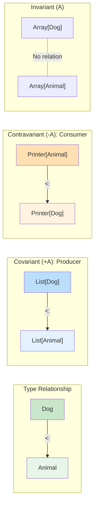
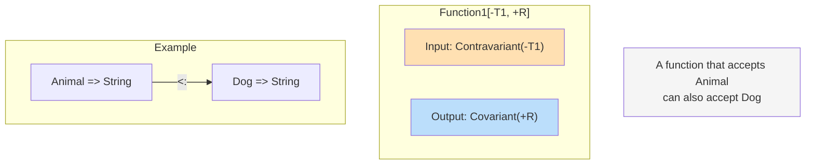

Variance defines subtyping relationships for type parameters. It's a core concept for writing type-safe generic code.

## Basic Concepts

When `Dog <: Animal` (Dog is a subtype of Animal):

- **Covariant**: `List[Dog] <: List[Animal]`
- **Contravariant**: `Printer[Animal] <: Printer[Dog]`
- **Invariant**: No relationship



> **Memory tip:**
> - **Covariant(+)**: "Same direction" - If Dog → Animal then Box[Dog] → Box[Animal]
> - **Contravariant(-)**: "Opposite direction" - If Dog → Animal then Handler[Animal] → Handler[Dog]

## Covariance (+A)

Used in **"producer"** positions. Suitable for types that return values.

```scala
// +A: Covariant
class Box[+A](val value: A)

class Animal
class Dog extends Animal
class Cat extends Animal

val dogBox: Box[Dog] = new Box(new Dog)
val animalBox: Box[Animal] = dogBox  // OK! If Dog <: Animal then Box[Dog] <: Box[Animal]

// List is also covariant
val dogs: List[Dog] = List(new Dog, new Dog)
val animals: List[Animal] = dogs  // OK!
```

### Covariance Restrictions

Covariant type parameters cannot be used in method parameter positions:

```scala
// Compile error!
class Box[+A](var value: A)  // var has setter, not allowed

// Compile error!
class Box[+A] {
  def set(a: A): Unit = ???  // Not allowed in parameter position
}
```

### Solution: Lower Bounds

```scala
class Box[+A](val value: A) {
  // B >: A (B is a supertype of A)
  def set[B >: A](b: B): Box[B] = new Box(b)
}

val dogBox: Box[Dog] = new Box(new Dog)
val animalBox: Box[Animal] = dogBox.set(new Cat)  // OK!
```

## Contravariance (-A)

Used in **"consumer"** positions. Suitable for types that accept values.

```scala
// -A: Contravariant
trait Printer[-A] {
  def print(a: A): Unit
}

val animalPrinter: Printer[Animal] = new Printer[Animal] {
  def print(a: Animal): Unit = println(s"Animal: $a")
}

// If it can print Animal, it can also print Dog
val dogPrinter: Printer[Dog] = animalPrinter  // OK!

dogPrinter.print(new Dog)  // "Animal: Dog@..."
```

### Contravariance Restrictions

Contravariant type parameters cannot be used in return positions:

```scala
// Compile error!
trait Printer[-A] {
  def get: A  // Not allowed in return position
}
```

## Invariance (A)

The default. Used when both reading and writing are needed.

```scala
// Invariant
class Container[A](var value: A)

val dogContainer: Container[Dog] = new Container(new Dog)
// val animalContainer: Container[Animal] = dogContainer  // Compile error!
```

## Function Variance

Scala's `Function1[-A, +B]` is contravariant in input and covariant in output:

```scala
// Function1[-T1, +R]
val animalToString: Animal => String = (a: Animal) => a.toString

// Dog => String is a supertype of Animal => String
val dogToString: Dog => String = animalToString

// Why? Because a function that accepts Animal can also accept Dog
```

### Intuitive Understanding



> **Interpretation:** An `Animal => String` function can be used where `Dog => String` is expected.
> If it can handle Animal, it can certainly handle Dog.

## Practical Examples

### Collections

```scala
// List[+A]: Covariant
val dogs: List[Dog] = List(new Dog)
val animals: List[Animal] = dogs  // OK

// Array[A]: Invariant (Java compatibility)
val dogArray: Array[Dog] = Array(new Dog)
// val animalArray: Array[Animal] = dogArray  // Compile error
```

### Observer Pattern

```scala
// Event handlers are contravariant
trait EventHandler[-E] {
  def handle(event: E): Unit
}

class ClickEvent
class ButtonClickEvent extends ClickEvent

val clickHandler: EventHandler[ClickEvent] =
  (event: ClickEvent) => println("Clicked!")

// ClickEvent handler can be used as ButtonClickEvent handler
val buttonHandler: EventHandler[ButtonClickEvent] = clickHandler
```

## Variance Rules Summary

| Position | Covariant (+A) | Contravariant (-A) | Invariant (A) |
|----------|----------------|-------------------|---------------|
| Return type | O | X | O |
| Parameter type | X | O | O |
| val field | O | X | O |
| var field | X | X | O |

## Best Practices

### Make Immutable Collections Covariant

```scala
sealed trait MyList[+A]
case object MyNil extends MyList[Nothing]
case class MyCons[+A](head: A, tail: MyList[A]) extends MyList[A]
```

### Make Callbacks/Handlers Contravariant

```scala
trait Callback[-A] {
  def onResult(result: A): Unit
}
```

### Use Invariance When Both Read/Write Are Needed

```scala
class MutableBuffer[A] {
  private var items: List[A] = Nil
  def add(item: A): Unit = items = item :: items
  def get(index: Int): A = items(index)
}
```

## Exercises

### 1. Apply Variance

Apply appropriate variance to the following types:

```scala
trait Comparator[???A] {
  def compare(a: A, b: A): Int
}

trait Producer[???A] {
  def produce(): A
}

trait Transformer[???A, ???B] {
  def transform(a: A): B
}
```

<details>
<summary>Show Answer</summary>

```scala
// Used only as parameter -> Contravariant
trait Comparator[-A] {
  def compare(a: A, b: A): Int
}

// Used only as return -> Covariant
trait Producer[+A] {
  def produce(): A
}

// Input is contravariant, output is covariant
trait Transformer[-A, +B] {
  def transform(a: A): B
}
```

</details>

## Next Steps

- [Advanced Types](../type-system-advanced/) — Union, Intersection, Match Types
- [Type Classes](../type-classes/) — Advanced ad-hoc polymorphism
