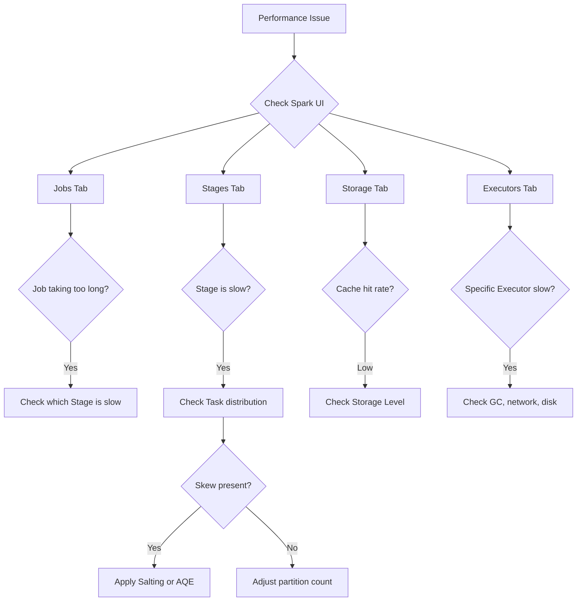

# FAQ

Frequently asked questions and solutions to common problems.

## General Questions

### Which Java versions does Spark support?

Spark 3.5 supports Java 8, 11, and 17. Java 21 is not officially supported yet.

```bash
java -version  # Check version
```

### Can I use Spark with Java only, without Scala?

Yes, you can. Spark fully supports the Java API. However, since the Spark runtime is written in Scala, Scala libraries are included in the dependencies.

### What's the difference between DataFrame and Dataset?

- **DataFrame** (`Dataset<Row>`): Has schema but no compile-time type checking
- **Dataset** (`Dataset<T>`): Uses POJO types to provide compile-time type safety

In Java, DataFrame is an alias for `Dataset<Row>`.

### Should I use RDD or DataFrame?

**DataFrame is recommended.** Reasons:
- Automatic optimization by Catalyst Optimizer
- More concise API
- Support for various data sources

Use RDD when you need low-level control or are processing unstructured data.

## Error Resolution

### OutOfMemoryError

```
java.lang.OutOfMemoryError: Java heap space
```

**Cause**: Insufficient Driver or Executor memory

**Solution**:
```java
// Increase Driver memory
.config("spark.driver.memory", "4g")

// Increase Executor memory
.config("spark.executor.memory", "8g")

// Or in spark-submit
spark-submit --driver-memory 4g --executor-memory 8g
```

### Disk Space Shortage During Shuffle

```
No space left on device
```

**Solution**:
```properties
# Change shuffle directory
spark.local.dir=/data/spark-local

# Or specify multiple directories
spark.local.dir=/data/spark1,/data/spark2
```

### Task Retries Exhausted

```
Task failed, total retries exceeded
```

**Solution**:
```properties
# Increase retry count
spark.task.maxFailures=8

# Or enable speculative execution
spark.speculation=true
```

### Serialization Error

```
NotSerializableException
```

**Cause**: Closure references non-serializable objects

**Solution**:
```java
// Bad example: referencing external object
MyService service = new MyService();  // Not serializable
df.foreach(row -> service.process(row));  // Error!

// Good example: use only serializable values
String config = getConfig();  // String is serializable
df.foreach(row -> process(row, config));

// Or create object within foreachPartition
df.foreachPartition(partition -> {
    MyService service = new MyService();  // Created within partition
    while (partition.hasNext()) {
        service.process(partition.next());
    }
});
```

### Logging Conflicts

```
SLF4J: Class path contains multiple SLF4J bindings
```

**Solution**:
```groovy
// build.gradle
configurations.all {
    exclude group: 'org.slf4j', module: 'slf4j-log4j12'
    exclude group: 'log4j', module: 'log4j'
}
```

### Duplicate SparkContext Creation

```
Only one SparkContext may be running in this JVM
```

**Solution**:
```java
// Use getOrCreate
SparkSession spark = SparkSession.builder()
    .getOrCreate();

// Or stop existing session before creating new one
if (SparkSession.getActiveSession().isDefined()) {
    SparkSession.getActiveSession().get().stop();
}
```

### Hadoop Error on Windows

```
Could not locate executable winutils.exe
```

**Solution**:
1. Download winutils: https://github.com/steveloughran/winutils
2. Copy to `C:\hadoop\bin`
3. Set environment variable: `HADOOP_HOME=C:\hadoop`

Or in code:
```java
System.setProperty("hadoop.home.dir", "C:\\hadoop");
```

## Performance Related

### My job is slower than expected

**Checklist**:
1. **Minimize shuffles**: Reduce Wide Transformations
2. **Check partition count**: Not too few or too many
3. **Data skew**: Check if data is concentrated in specific partitions
4. **Broadcast join**: Broadcast small tables
5. **Caching**: Cache repeatedly used data
6. **Use Parquet**: Switch to columnar format

### What is the appropriate number of partitions?

```
Recommended partition count = Total cores × 2-4
Recommended partition size = 100-200MB
```

Examples:
- 50-core cluster → 100-200 partitions
- 100GB data → 500-1000 partitions

### Caching doesn't seem to be working

**Things to check**:
1. Is it actually cached: Check Storage tab in Spark UI
2. Call Action after cache: Caching happens on first Action after cache()
3. Is there enough memory: Adjust Storage Level (MEMORY_AND_DISK)

```java
df.cache();
df.count();  // Actual caching happens here
df.show();   // Reads from cache
```

### Joins are too slow

**Solutions**:
1. **Broadcast small tables**
```java
largeTable.join(broadcast(smallTable), "key")
```

2. **Filter before joining**
```java
filtered = large.filter(condition);
filtered.join(small, "key")
```

3. **Use bucketing**
```java
df.write().bucketBy(100, "key").saveAsTable("bucketed");
```

## Streaming Related

### Streaming query stops

**Things to check**:
1. Write permission to checkpoint directory
2. Kafka connection status
3. State store memory

### Late-arriving data is not being processed

**Solution**: Configure Watermark
```java
df.withWatermark("timestamp", "10 minutes")
  .groupBy(window(col("timestamp"), "5 minutes"))
  .count()
```

## Deployment Related

### Can't run on YARN

**Things to check**:
1. `HADOOP_CONF_DIR` environment variable is set
2. YARN queue permissions
3. Resource configuration (memory, cores)

### Pod is in Pending state on Kubernetes

**Things to check**:
1. Resource request amounts
2. PV/PVC status
3. Service Account permissions

### Where can I view application logs?

```bash
# YARN
yarn logs -applicationId application_xxx

# Kubernetes
kubectl logs spark-driver-xxx
kubectl logs spark-executor-xxx

# Spark History Server
http://history-server:18080
```

## Miscellaneous

### Cannot access Spark UI

**Local mode**:
```
http://localhost:4040
```

**Cluster mode**:
```bash
# YARN
yarn application -list  # Check Application ID
# Access via Application Master URL

# History Server
http://history-server:18080
```

### Only specific Executors are slow

**Possible causes**:
1. Data skew: Data concentrated in specific partitions
2. Hardware issues: Check disk/network on that node
3. GC issues: Check Executor GC logs

**Solution**:
```properties
# Enable speculative execution
spark.speculation=true
spark.speculation.multiplier=1.5
```

### How to convert DataFrame to POJO list?

```java
Encoder<Employee> encoder = Encoders.bean(Employee.class);
List<Employee> employees = df.as(encoder).collectAsList();
```

Note: `collect()` brings all data to the Driver, so don't use it with large datasets.

## Spark UI Debugging Guide

The key to resolving Spark performance issues is systematically analyzing the Spark UI.

### Debugging Flow



### 1. Jobs Tab Analysis

```
Items to check:
- Duration: Total Job execution time
- Stages: Number of completed/failed/in-progress Stages
- Tasks: Total Task count and progress
```

**Warning signs:**
- A specific Job takes abnormally long
- Large time variance between repeated Jobs

### 2. Stages Tab Analysis (Most Important)

```
Key Metrics:
┌─────────────────────────────────────────────────────────┐
│ Shuffle Read    : Shuffle data size read by Stage       │
│ Shuffle Write   : Shuffle data size written by Stage    │
│ Spill (Memory)  : Memory → Disk spill (performance hit) │
│ Spill (Disk)    : Total disk spill (severe memory issue)│
└─────────────────────────────────────────────────────────┘
```

**Task Distribution Analysis:**

| Metric | Normal | Problem |
|--------|--------|---------|
| Min/Max Duration | Similar | >10x difference → **Skew** |
| Shuffle Read | Even distribution | Only some are large → **Skew** |
| GC Time | < 10% | > 30% → **Memory shortage** |

### 3. Skew Diagnosis and Resolution

**Diagnostic code:**

```java
// Check data distribution by partition
df.groupBy(spark_partition_id().alias("partition"))
  .count()
  .orderBy(col("count").desc())
  .show(20);

// Expected output (skew present):
// +----------+--------+
// |partition |  count |
// +----------+--------+
// |        5 | 1000000|  ← Abnormally large!
// |        3 |   5000 |
// |        1 |   4800 |
// ...
```

**Solutions:**

```java
// 1. AQE Skew Join (Spark 3.0+)
spark.conf().set("spark.sql.adaptive.enabled", "true");
spark.conf().set("spark.sql.adaptive.skewJoin.enabled", "true");

// 2. Salting (manual)
int saltBuckets = 10;
Dataset<Row> salted = df.withColumn("salted_key",
    concat(col("key"), lit("_"), lit(Math.abs(rand().hashCode() % saltBuckets))));

// 3. Broadcast Join (for small tables)
df1.join(broadcast(smallDf), "key");
```

### 4. OOM Debugging

**Driver OOM:**
```
java.lang.OutOfMemoryError: Java heap space
  at org.apache.spark.sql.Dataset.collect
```

→ `collect()`, `toPandas()` etc. are the cause. Check result size.

**Executor OOM:**
```
ExecutorLostFailure (executor X exited caused by one of the running tasks)
Reason: Container killed by YARN for exceeding memory limits
```

→ Check data size per partition, increase memory or partition count.

**Resolution checklist:**

```java
// 1. Check partition count
int numPartitions = df.rdd().getNumPartitions();
System.out.println("Partition count: " + numPartitions);

// 2. Estimated size per partition
long totalSize = spark.sessionState().executePlan(df.queryExecution().logical())
    .optimizedPlan().stats().sizeInBytes().longValue();
System.out.println("Size per partition: " + (totalSize / numPartitions / 1024 / 1024) + "MB");

// 3. Adjust partition count
df = df.repartition(200);  // Target ~200MB per partition
```

### 5. Shuffle Optimization Diagnosis

**Check if there are many shuffles:**

```java
// Check for Exchange in execution plan
df.explain();
// Exchange hashpartitioning ← Shuffle occurring!
```

**Reducing shuffles:**

```java
// Before: Two shuffles
df.groupBy("a").count()
  .join(df.groupBy("a").sum("b"), "a");

// After: One shuffle
df.groupBy("a").agg(
    count("*").alias("count"),
    sum("b").alias("sum_b")
);
```

### 6. Log Analysis

```bash
# Find errors in Driver log
grep -i "error\|exception\|oom\|killed" driver.log

# Shuffle-related issues
grep -i "shuffle\|fetch\|timeout" executor.log

# GC issues
grep -i "gc\|pause\|heap" executor.log
```

### 7. Performance Checklist

```
□ Is shuffle partition count appropriate? (default 200, adjust based on data size)
□ Can broadcast join be used? (for small tables)
□ Is there partition skew? (check in Spark UI Stages tab)
□ Is GC time excessive? (> 10%)
□ Is disk spill occurring? (memory shortage)
□ Are only necessary columns selected? (Column Pruning)
□ Are filters applied as early as possible? (Predicate Pushdown)
□ Using columnar format like Parquet?
□ Is AQE enabled? (Spark 3.0+)
```
