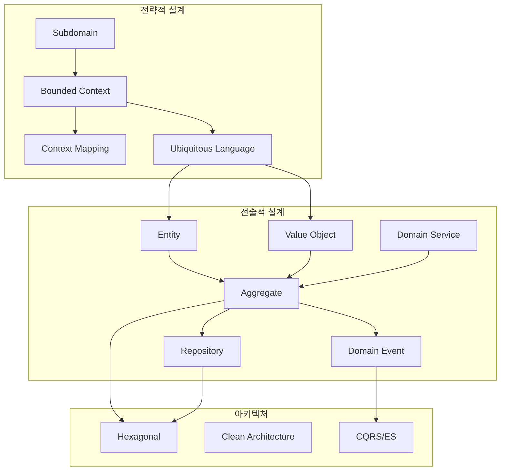

DDD의 핵심은 전략적 설계와 전술적 설계라는 두 가지 수준의 패턴으로 구성됩니다. 전략적 설계는 시스템의 큰 그림을 그리는 것으로, 비즈니스 도메인을 어떻게 나누고 각 부분이 어떻게 상호작용하는지를 정의합니다. 전술적 설계는 각 경계 내에서 도메인 모델을 구체적으로 구현하는 패턴들을 다룹니다.

#### 설계 패턴

전략적 설계 패턴부터 시작하여 점진적으로 전술적 설계 패턴으로 나아가는 것이 효과적인 학습 순서입니다. [전략적 설계](strategic-design/)에서는 Subdomain, Bounded Context, Context Mapping, Ubiquitous Language를 다루며, [전술적 설계](tactical-design/)에서는 Entity, Value Object, Repository, Domain Service, Specification 패턴을 학습합니다. [Aggregate 심화](aggregate/)에서는 Aggregate 설계 원칙과 트랜잭션 경계, 적절한 크기 결정 방법을 다루고, [도메인 이벤트](domain-events/)에서는 이벤트 기반 아키텍처와 Event Sourcing을 살펴봅니다.

#### 아키텍처

도메인 모델을 효과적으로 보호하고 외부 의존성과 분리하기 위한 아키텍처 패턴들이 있습니다. [아키텍처 패턴](architecture/)에서는 Hexagonal, Clean Architecture, Onion Architecture를 비교 분석하고, [CQRS](cqrs/)에서는 명령과 조회를 분리하여 각각에 최적화된 모델을 사용하는 방법을 다룹니다.

#### 품질

도메인 모델의 품질을 유지하기 위해서는 테스트와 지속적인 개선이 필수입니다. [테스트 전략](testing/)에서는 도메인 모델 테스트, 통합 테스트, E2E 테스트 작성 방법을 다루고, [안티패턴과 함정](anti-patterns/)에서는 DDD를 적용할 때 흔히 저지르는 실수와 그 해결책을 살펴봅니다.

#### 개념 간 관계

아래 다이어그램은 DDD의 주요 개념들이 어떻게 연결되는지를 보여줍니다. 전략적 설계에서 정의한 Subdomain이 Bounded Context를 형성하고, 각 Context 내에서 Ubiquitous Language를 사용하여 전술적 설계의 Entity와 Value Object를 정의합니다. 이들은 Aggregate로 묶이고, Repository를 통해 영속화되며, Domain Event를 통해 다른 Context와 통신합니다. 이러한 구조는 Hexagonal이나 Clean Architecture와 같은 아키텍처 패턴 위에서 구현됩니다.

